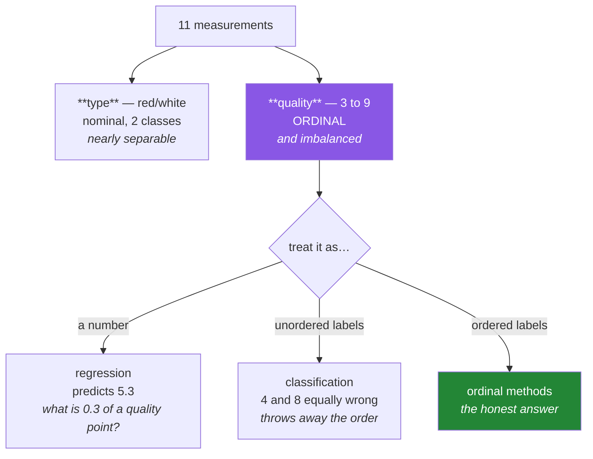

# Day 88 — Case study: wine quality and type

**Phase 11 · Module 11** · ID: **EDA-06** (case study: tabular data, two targets)

> **Yesterday:** text, and the length artifact that beat sentiment.
> **Today:** ordinary tabular data with **two targets in one table** — and the question Day 58 warned
> about eighteen days ago finally has consequences. Wine quality is a 3–9 score. Is that a number you
> can average, or a set of ordered labels? **That single decision changes the whole project**, and
> most published treatments get it wrong.
> **Tomorrow:** time series, and the forecasting trap.

```bash
./m start 88 && ./m scaffold 88
```

**Time:** 2 hours (project day). **Request budget:** 0 model calls.

---

## §1 The story

The wine dataset has eleven physicochemical measurements, a `quality` score from 3 to 9, and a `type`
(red or white). Two targets, one table, and they are not equally hard.



**The ordinal problem is the day.** Day 58 established that a mean of an ordinal variable assumes
equal spacing between levels, and nothing guarantees the gap from 4 to 5 equals the gap from 7 to 8.
Yet virtually every treatment of this dataset runs a regression and reports an RMSE.

Both alternatives lose something real:

- **As regression**, you gain the ordering and lose interpretability — a prediction of 5.3 is not a
  quality any wine can have, and the loss function says being wrong by 2 is four times worse than
  being wrong by 1, which is an assumption about the spacing you cannot justify.
- **As classification**, you keep every prediction meaningful and throw the ordering away — predicting
  4 when the truth is 8 counts exactly the same as predicting 7.

There is no free answer. What today asks is that you **make the choice deliberately and record why**,
which is what Day 58's permission table was building toward.

Three more things this dataset teaches, all of which generalise:

**Severe imbalance.** Most wines score 5 or 6; scores of 3 and 9 are rare. Day 78's problem, and it
means accuracy is meaningless before you start.

**A combined table is two datasets.** Red and white wines have genuinely different chemistry. Pooling
them and predicting quality risks Simpson's paradox (Day 85), and `type` is either a feature or a
reason to split.

**Multicollinearity you can see.** Free and total sulphur dioxide are mechanically related — one is
part of the other. Day 86's redundancy report finds it, and Day 62's warning about unstable
coefficients applies.

---

## §2 Setup — run this

```bash
mkdir -p days/day-88/lab data/raw
touch days/day-88/lab/wine.py
```

**Provenance (Principle 9).** The wine-quality data is from the UCI repository (Cortez et al., 2009).
Add its row to `data/raw/SOURCE.md` — URL, licence, date pulled, and the collection note: **quality is
the median of at least three blind sensory assessments by wine experts.** That sentence is what makes
the ordinal argument concrete rather than pedantic.

---

## §3 EDA-06 — two targets

`days/day-88/lab/wine.py`:

```python
"""EDA-06: wine quality and type — the ordinal decision, and what follows from it."""

from __future__ import annotations

import numpy as np
import pandas as pd

from setu.arrays import make_rng

FEATURES = [
    "fixed_acidity", "volatile_acidity", "citric_acid", "residual_sugar",
    "chlorides", "free_sulfur_dioxide", "total_sulfur_dioxide",
    "density", "ph", "sulphates", "alcohol",
]


def training_wine(n: int = 5_000) -> pd.DataFrame:
    """Stands in for the UCI data. Replace with the real thing; the structure matches.

    Deliberate properties: quality is ordinal and imbalanced, red and white differ
    chemically, and free/total sulfur dioxide are mechanically related.
    """
    rng = make_rng(0)
    is_white = rng.random(n) < 0.75
    latent = rng.normal(0, 1, n)

    free_so2 = np.clip(rng.normal(np.where(is_white, 35, 16), 12, n), 1, None)
    frame = pd.DataFrame({
        "type": pd.Series(np.where(is_white, "white", "red"), dtype="str"),
        "fixed_acidity": rng.normal(np.where(is_white, 6.9, 8.3), 1.0, n),
        "volatile_acidity": np.clip(rng.normal(np.where(is_white, 0.28, 0.53), 0.1, n)
                                    - latent * 0.05, 0.05, None),
        "citric_acid": np.clip(rng.normal(0.32, 0.14, n), 0, None),
        "residual_sugar": np.clip(rng.lognormal(np.where(is_white, 1.4, 0.7), 0.7, n), 0.5, None),
        "chlorides": np.clip(rng.normal(np.where(is_white, 0.046, 0.088), 0.02, n), 0.01, None),
        "free_sulfur_dioxide": free_so2,
        "total_sulfur_dioxide": free_so2 * rng.uniform(2.8, 3.6, n) + rng.normal(0, 4, n),
        "density": rng.normal(0.995, 0.003, n) - latent * 0.0005,
        "ph": rng.normal(np.where(is_white, 3.19, 3.31), 0.15, n),
        "sulphates": np.clip(rng.normal(np.where(is_white, 0.49, 0.66), 0.14, n), 0.2, None),
        "alcohol": np.clip(rng.normal(10.5, 1.1, n) + latent * 0.7, 8, 15),
    })
    score = 5.5 + latent * 1.1 + rng.normal(0, 0.55, n)
    frame["quality"] = np.clip(np.round(score), 3, 9).astype(int)
    return frame


def the_ordinal_question(frame: pd.DataFrame) -> None:
    counts = frame["quality"].value_counts().sort_index()
    print(f"\n  quality distribution:")
    for score, count in counts.items():
        bar = "█" * int(count / counts.max() * 40)
        print(f"    {score}: {count:>5} {bar}")

    print(f"\n  as a NUMBER  : mean = {frame['quality'].mean():.3f}")
    print(f"  as ORDERED   : median = {frame['quality'].median():.0f}, "
          f"mode = {frame['quality'].mode().iloc[0]}")

    print("\n  ⚠️ The mean assumes the gap from 4→5 equals the gap from 7→8.")
    print("     Quality is the MEDIAN of blind expert ratings (see SOURCE.md). Nothing")
    print("     about that process makes the intervals equal — experts cluster in the")
    print("     middle and reserve the extremes, so the ends are further apart.")
    print("\n  Day 58 said an ordinal mean is not meaningful. Here is what that costs.")


def three_framings(frame: pd.DataFrame) -> None:
    truth = frame["quality"].to_numpy()
    rng = make_rng(1)
    predicted_continuous = truth + rng.normal(0, 0.8, len(truth))

    rmse = np.sqrt(((predicted_continuous - truth) ** 2).mean())
    rounded = np.clip(np.round(predicted_continuous), 3, 9)
    exact = (rounded == truth).mean()
    within_one = (np.abs(rounded - truth) <= 1).mean()

    print(f"\n  the SAME predictions, scored three ways:")
    print(f"    regression RMSE            : {rmse:.3f}   <- 'what is 0.8 of a quality point?'")
    print(f"    classification accuracy    : {exact:.1%}   <- 4 vs 8 counts as 7 vs 8")
    print(f"    ordinal: within-one accuracy: {within_one:.1%}   <- uses the ORDER")

    print("\n  Three numbers, one model. They answer different questions, and only the")
    print("  third respects both the ordering AND the discreteness.")

    print(f"\n  and the baseline that makes them readable:")
    majority = pd.Series(truth).mode().iloc[0]
    print(f"    always predict {majority}: accuracy {(truth == majority).mean():.1%}, "
          f"within-one {(np.abs(truth - majority) <= 1).mean():.1%}")
    print("  ⚠️ Report a baseline or the numbers above mean nothing (Day 78).")


def imbalance(frame: pd.DataFrame) -> None:
    counts = frame["quality"].value_counts().sort_index()
    print(f"\n  {'score':>6} {'n':>6} {'share':>8}")
    for score, count in counts.items():
        print(f"  {score:>6} {count:>6} {count / len(frame):>7.2%}")

    rare = counts[counts / len(frame) < 0.02]
    print(f"\n  classes under 2% of the data: {list(rare.index)}")
    print(f"  majority-class accuracy: {counts.max() / len(frame):.1%}")

    print("\n  ⚠️ A model that never predicts 3 or 9 will score well and be useless for")
    print("     exactly the wines anyone cares about — the very good and the very bad.")
    print("  Day 78's problem, and it decides the metric before any model exists.")


def two_datasets_in_one_table(frame: pd.DataFrame) -> None:
    from setu.stats import effect_size

    print(f"\n  red vs white — are these the same population?")
    print(f"  {'feature':<22} {'red median':>11} {'white median':>13} {'d':>7} {'magnitude'}")
    for feature in ("volatile_acidity", "chlorides", "total_sulfur_dioxide",
                    "residual_sugar", "alcohol"):
        red = frame.loc[frame["type"] == "red", feature]
        white = frame.loc[frame["type"] == "white", feature]
        size = effect_size(list(red), list(white))
        print(f"  {feature:<22} {red.median():>11.3f} {white.median():>13.3f} "
              f"{size['value']:>7.2f}  {size['magnitude']}")

    print("\n  Several features differ by more than a full standard deviation. This is")
    print("  not one dataset with a categorical column; it is two datasets stacked.")
    print("\n  Three options, and you must pick one:")
    print("    1. model them separately  — honest, halves your data per model")
    print("    2. pool with `type` as a feature — more data, assumes shared structure")
    print("    3. pool and ignore type — Simpson's paradox waiting to happen (Day 85)")


def does_the_relationship_survive(frame: pd.DataFrame) -> None:
    from setu.eda import check_subgroup_stability

    print(f"\n  does each feature's relationship with quality survive conditioning on type?")
    print(f"  {'feature':<22} {'overall':>9} {'red':>8} {'white':>8} {'stable?'}")

    for feature in ("alcohol", "volatile_acidity", "chlorides", "residual_sugar"):
        result = check_subgroup_stability(frame, feature, "quality", by="type")
        flag = "⚠️ NO" if (result["reverses"] or result["weakens"]) else "yes"
        by_group = result["by_group"]
        print(f"  {feature:<22} {result['overall']:>9.3f} "
              f"{by_group.get('red', float('nan')):>8.3f} "
              f"{by_group.get('white', float('nan')):>8.3f}  {flag}")

    print("\n  Any row flagged NO is a feature whose apparent relationship with quality")
    print("  is partly or wholly explained by wine type. Day 85's check, on real stakes.")


def mechanical_redundancy(frame: pd.DataFrame) -> None:
    from setu.eda import redundancy_report
    from setu.stats import association

    numeric = frame[FEATURES]
    result = association(numeric["free_sulfur_dioxide"], numeric["total_sulfur_dioxide"])
    print(f"\n  free vs total sulfur dioxide: r = {result['r']:.3f}")
    print("  ^ FREE sulfur dioxide is a COMPONENT of TOTAL. They are not merely")
    print("    correlated, they are mechanically related — one is part of the other.")

    report = redundancy_report(numeric)
    print(f"\n  {report['n_features']} features -> "
          f"{report['effective_dimensions']} effective dimensions "
          f"(ratio {report['redundancy_ratio']:.2f})")
    for drop in report["suggested_drops"][:4]:
        print(f"    {drop}")

    print("\n  ⚠️ Day 62 warned that collinear features give unstable coefficients. The")
    print("     right fix here is domain knowledge, not PCA: keep total, or keep free")
    print("     and a BOUND ratio — and say which, and why.")


def impossible_values(frame: pd.DataFrame) -> None:
    print(f"\n  the domain checks a statistic cannot make (Day 85):")
    rules = {
        "ph": (frame["ph"].between(2.5, 4.5), "wine pH is roughly 2.7–4.0"),
        "alcohol": (frame["alcohol"].between(7, 16), "% ABV outside 8–15 is implausible"),
        "density": (frame["density"].between(0.98, 1.01), "wine density is near water's"),
        "free<=total": (frame["free_sulfur_dioxide"] <= frame["total_sulfur_dioxide"],
                        "free SO2 cannot exceed total SO2"),
    }
    for name, (rule, why) in rules.items():
        violations = int((~rule).sum())
        flag = "🚨" if violations else "  "
        print(f"  {flag} {name:<12} {violations:>4} violations — {why}")

    print("\n  The last one is the interesting check: it is a RELATIONSHIP between two")
    print("  columns, so no per-column audit finds it. Only domain knowledge does.")


def what_to_carry_forward(frame: pd.DataFrame) -> None:
    print("\n  decisions, with reasons:")
    print("    - treat quality as ORDINAL; primary metric = within-one accuracy")
    print("      (Day 58: the intervals are not equal; §3.2: it is the only framing")
    print("       that respects order AND discreteness)")
    print("    - report the majority-class baseline beside every metric (Day 78)")
    print("    - keep `type` as a feature AND check every result within each type")
    print("    - drop free_sulfur_dioxide, keep total — mechanically nested")
    print("\n  hypotheses (confirm on held-out data):")
    print("    - alcohol relates positively to quality in both types")
    print("    - volatile_acidity relates negatively")
    print("\n  open questions:")
    print("    - how many experts rated each wine, and were the panels the same?")
    print("    - are any wines duplicated between the red and white files?")
    print("\n  ❌ not findings. The test set has not been touched.")


if __name__ == "__main__":
    frame = training_wine()
    the_ordinal_question(frame)
    three_framings(frame)
    imbalance(frame)
    two_datasets_in_one_table(frame)
    does_the_relationship_survive(frame)
    mechanical_redundancy(frame)
    impossible_values(frame)
    what_to_carry_forward(frame)
```

**Line by line:**

- `the_ordinal_question` — **the histogram first, then the argument.** The mean assumes 4→5 equals
  7→8, and the provenance note says quality is the *median of blind expert ratings*. Experts cluster
  in the middle and reserve the extremes, so the ends are further apart than the middle. **That is why
  the intervals are unequal** — it is a fact about the measurement process, not a statistical nicety.
- `three_framings` — **the same predictions scored three ways.** RMSE asks "what is 0.8 of a quality
  point?"; accuracy treats 4-vs-8 as no worse than 7-vs-8; **within-one accuracy respects both the
  order and the discreteness.** And the baseline row is what makes any of them readable (Day 78).
- `imbalance` — classes under 2% of the data, and a majority-class accuracy that a useless model
  achieves. **A model that never predicts 3 or 9 will score well and be useless for the wines anyone
  cares about.**
- `two_datasets_in_one_table` — several features differ by more than a full standard deviation between
  red and white. **This is not one dataset with a categorical column; it is two datasets stacked**, and
  the three options each cost something.
- `does_the_relationship_survive` — Day 85's subgroup check on real stakes. Any flagged row is a
  feature whose apparent relationship with quality is partly explained by type.
- `mechanical_redundancy` — free SO₂ is a **component of** total SO₂. They are not merely correlated;
  one is part of the other. **The right fix is domain knowledge, not PCA** — and Day 86 argued exactly
  that.
- `impossible_values` — the last check is the interesting one: `free ≤ total` is a **relationship
  between two columns**, so no per-column audit can find it. Only domain knowledge does, which is Day
  84's point sharpened.
- `what_to_carry_forward` — decisions with reasons citing the day that justifies each, hypotheses, and
  open questions for whoever collected it. Nothing is a finding.

---

## §4 Build brief

Extend `src/setu/eda.py`:

```python
def ordinal_target_report(values, *, name: str = "target") -> dict:
    """TODO(me): the §3.1 decision, made explicit and hard to skip.

    {"name", "levels": [...], "counts": {...}, "n_levels", "rare_levels": [...],
     "spacing_is_assumed": bool, "framings": {...}, "recommendation", "warnings": [...]}
    - `framings` describes what each of regression / classification / ordinal
      GAINS and LOSES, in words the report can quote
    - spacing_is_assumed is True whenever a mean would be computed — say so loudly
    - rare_levels are those under 2% (Day 78)
    - the recommendation must name a METRIC, not just a framing
    - raise DataError if the values are not integer-like, or if there are more than
      20 levels (that is not ordinal, it is continuous)
    """
    raise NotImplementedError


def within_k_accuracy(truth, predicted, *, k: int = 1) -> dict:
    """TODO(me): the ordinal metric — how often are we within k levels?

    {"k", "exact", "within_k", "mean_absolute_error", "baseline_within_k",
     "lift_over_baseline"}
    - baseline is the majority class predicted for everything (Day 78)
    - lift_over_baseline is within_k minus baseline_within_k; NEGATIVE means the
      model is worse than a constant, which must be reported not hidden
    - raise DataError on a length mismatch (name both) or k < 0
    - k=0 makes this exact accuracy, which is the point: one function, both framings
    """
    raise NotImplementedError


def compare_framings(truth, predicted_continuous) -> dict:
    """TODO(me): §3.2's table, as data.

    {"rmse", "exact_accuracy", "within_one", "baseline": {...},
     "interpretation": {framing: str}}
    - each interpretation states what that number ASSUMES about the spacing
    - the rmse entry must carry the 'what is 0.3 of a level?' caveat
    - reuse within_k_accuracy rather than recomputing
    """
    raise NotImplementedError


def subgroup_datasets(frame, by: str, *, features: list[str], min_effect: float = 0.8) -> dict:
    """TODO(me): is this one dataset or several? (§3.4)

    {"groups": [...], "n_per_group": {...}, "large_differences": [(feature, d)],
     "verdict": "one dataset" | "two datasets stacked", "options": [...]}
    - compute the effect size of each feature between groups (Day 69)
    - large_differences are those exceeding min_effect
    - verdict is 'two datasets stacked' when 3 or more features exceed min_effect
    - `options` lists the three choices from §3.4, each with what it costs — a verdict
      with no options is not actionable
    - raise DataError if `by` has more than 5 groups (this check is for a few strata)
    """
    raise NotImplementedError


def cross_column_rules(frame, rules: dict) -> dict:
    """TODO(me): domain checks that span COLUMNS, which no per-column audit finds (§3.7).

    rules maps a name to a callable(frame) -> boolean Series of VALID rows.
    {"results": {name: {"violations": int, "pct": float, "example_indices": [...]}},
     "n_violations_total", "blocking": [...]}
    - example_indices gives up to 5 offending row indices so they can be inspected
    - `blocking` are rules violated by more than 0.1% of rows
    - raise DataError if a rule returns something other than a boolean Series of the
      right length, naming the rule
    - the docstring must note these cannot be inferred and must be supplied
    """
    raise NotImplementedError
```

- `ordinal_target_report` setting `spacing_is_assumed` is the day's design decision: **the assumption
  becomes a field in the output** rather than something a reader has to know to look for.
- `within_k_accuracy` with `k=0` collapsing to exact accuracy is deliberate — one function serves both
  framings, so switching between them cannot silently change the baseline too.
- `subgroup_datasets` returning **options with costs** follows Day 85's rule: a verdict nobody can act
  on is not a verdict.
- `cross_column_rules` exists because §3.7's `free ≤ total` check is invisible to every per-column tool
  in this project, and that class of rule has to be supplied by a person.

---

## §5 The eval that must be able to fail

Add to `tests/test_eda.py`:

```python
from setu.eda import (
    compare_framings,
    cross_column_rules,
    ordinal_target_report,
    subgroup_datasets,
    within_k_accuracy,
)


@pytest.fixture
def wine():
    rng = make_rng(0)
    n = 3_000
    is_white = rng.random(n) < 0.75
    latent = rng.normal(0, 1, n)
    free = np.clip(rng.normal(np.where(is_white, 35, 16), 12, n), 1, None)
    frame = pd.DataFrame({
        "type": pd.Series(np.where(is_white, "white", "red"), dtype="str"),
        "volatile_acidity": np.clip(rng.normal(np.where(is_white, 0.28, 0.53), 0.1, n), 0.05, None),
        "chlorides": np.clip(rng.normal(np.where(is_white, 0.046, 0.088), 0.02, n), 0.01, None),
        "alcohol": np.clip(rng.normal(10.5, 1.1, n) + latent * 0.7, 8, 15),
        "free_sulfur_dioxide": free,
        "total_sulfur_dioxide": free * rng.uniform(2.8, 3.6, n),
    })
    frame["quality"] = np.clip(np.round(5.5 + latent * 1.1 + rng.normal(0, 0.55, n)), 3, 9).astype(int)
    return frame


def test_the_spacing_assumption_is_surfaced(wine):
    """Day 58's warning becomes a field, not a footnote."""
    report = ordinal_target_report(wine["quality"], name="quality")
    assert report["spacing_is_assumed"] is True
    assert any("spacing" in w.lower() or "interval" in w.lower() for w in report["warnings"])


def test_all_three_framings_are_described(wine):
    framings = ordinal_target_report(wine["quality"])["framings"]
    assert set(framings) >= {"regression", "classification", "ordinal"}
    for description in framings.values():
        assert "lose" in description.lower() or "loses" in description.lower(), (
            "each framing must state what it COSTS, not only what it gains"
        )


def test_the_recommendation_names_a_metric(wine):
    recommendation = ordinal_target_report(wine["quality"])["recommendation"].lower()
    assert any(token in recommendation for token in ("within", "accuracy", "mae", "kappa"))


def test_rare_levels_are_flagged(wine):
    report = ordinal_target_report(wine["quality"])
    counts = wine["quality"].value_counts(normalize=True)
    expected = {int(level) for level, share in counts.items() if share < 0.02}
    assert set(report["rare_levels"]) == expected


def test_a_continuous_target_is_refused():
    rng = make_rng(1)
    with pytest.raises(DataError) as info:
        ordinal_target_report(pd.Series(rng.normal(size=500)))
    assert "integer" in str(info.value).lower() or "ordinal" in str(info.value).lower()


def test_too_many_levels_is_refused():
    with pytest.raises(DataError):
        ordinal_target_report(pd.Series(range(500)))


def test_within_one_is_more_forgiving_than_exact(wine):
    rng = make_rng(2)
    truth = wine["quality"].to_numpy()
    predicted = np.clip(np.round(truth + rng.normal(0, 0.9, len(truth))), 3, 9)
    result = within_k_accuracy(truth, predicted, k=1)
    assert result["within_k"] > result["exact"]


def test_k_zero_is_exact_accuracy(wine):
    truth = wine["quality"].to_numpy()
    predicted = truth.copy()
    predicted[:100] += 1
    result = within_k_accuracy(truth, predicted, k=0)
    assert result["within_k"] == pytest.approx(result["exact"])


def test_the_baseline_is_always_reported(wine):
    truth = wine["quality"].to_numpy()
    result = within_k_accuracy(truth, truth, k=1)
    assert 0.0 < result["baseline_within_k"] <= 1.0


def test_a_model_worse_than_the_baseline_is_reported_as_such(wine):
    """Negative lift must be visible, not hidden."""
    rng = make_rng(3)
    truth = wine["quality"].to_numpy()
    predicted = rng.integers(3, 10, len(truth))
    result = within_k_accuracy(truth, predicted, k=1)
    assert result["lift_over_baseline"] < 0


def test_a_constant_prediction_has_zero_lift(wine):
    truth = wine["quality"].to_numpy()
    majority = int(pd.Series(truth).mode().iloc[0])
    result = within_k_accuracy(truth, np.full(len(truth), majority), k=1)
    assert result["lift_over_baseline"] == pytest.approx(0.0, abs=1e-9)


def test_within_k_rejects_a_length_mismatch():
    with pytest.raises(DataError) as info:
        within_k_accuracy([3, 4, 5], [3, 4])
    assert "3" in str(info.value) and "2" in str(info.value)


def test_within_k_rejects_a_negative_k():
    with pytest.raises(DataError):
        within_k_accuracy([3, 4], [3, 4], k=-1)


def test_the_three_framings_disagree_on_the_same_predictions(wine):
    """One model, three numbers, three different questions."""
    rng = make_rng(4)
    truth = wine["quality"].to_numpy()
    predicted = truth + rng.normal(0, 0.8, len(truth))
    result = compare_framings(truth, predicted)
    assert result["within_one"] > result["exact_accuracy"]
    assert result["rmse"] > 0


def test_each_framing_states_its_spacing_assumption(wine):
    rng = make_rng(5)
    truth = wine["quality"].to_numpy()
    result = compare_framings(truth, truth + rng.normal(0, 0.8, len(truth)))
    rmse_note = result["interpretation"]["regression"].lower()
    assert "spacing" in rmse_note or "equal" in rmse_note or "level" in rmse_note


def test_compare_framings_reuses_within_k(monkeypatch, wine):
    import setu.eda as eda

    calls = []
    original = eda.within_k_accuracy
    monkeypatch.setattr(eda, "within_k_accuracy",
                        lambda *a, **k: calls.append(1) or original(*a, **k))
    compare_framings(wine["quality"].to_numpy(), wine["quality"].to_numpy().astype(float))
    assert calls, "compare_framings recomputed the ordinal metric"


def test_red_and_white_are_two_datasets(wine):
    result = subgroup_datasets(wine, "type",
                               features=["volatile_acidity", "chlorides",
                                         "free_sulfur_dioxide", "alcohol"])
    assert result["verdict"] == "two datasets stacked"
    assert len(result["large_differences"]) >= 3


def test_a_genuinely_single_dataset_is_not_split():
    """A check that always says 'two datasets' is useless."""
    rng = make_rng(6)
    n = 2_000
    frame = pd.DataFrame({
        "g": pd.Series(rng.choice(["a", "b"], n), dtype="str"),
        "x": rng.normal(0, 1, n),
        "y": rng.normal(0, 1, n),
        "z": rng.normal(0, 1, n),
    })
    result = subgroup_datasets(frame, "g", features=["x", "y", "z"])
    assert result["verdict"] == "one dataset"


def test_the_verdict_comes_with_options(wine):
    result = subgroup_datasets(wine, "type", features=["volatile_acidity", "chlorides"])
    assert len(result["options"]) >= 3
    assert all(len(str(option)) > 25 for option in result["options"]), (
        "each option must state what it costs"
    )


def test_too_many_groups_is_refused(wine):
    frame = wine.assign(many=[f"g{i % 9}" for i in range(len(wine))])
    with pytest.raises(DataError):
        subgroup_datasets(frame, "many", features=["alcohol"])


def test_a_cross_column_rule_catches_what_per_column_cannot(wine):
    """free SO2 cannot exceed total SO2 — invisible to any per-column audit."""
    dirty = wine.copy()
    dirty.loc[:19, "free_sulfur_dioxide"] = dirty.loc[:19, "total_sulfur_dioxide"] * 2

    for column in ("free_sulfur_dioxide", "total_sulfur_dioxide"):
        values = dirty[column]
        z = abs((values.iloc[0] - values.mean()) / values.std(ddof=1))
        assert z < 4, f"{column} should not be a univariate outlier"

    result = cross_column_rules(
        dirty,
        {"free<=total": lambda f: f["free_sulfur_dioxide"] <= f["total_sulfur_dioxide"]},
    )
    assert result["results"]["free<=total"]["violations"] == 20


def test_violations_come_with_example_rows(wine):
    dirty = wine.copy()
    dirty.loc[:9, "free_sulfur_dioxide"] = 999.0
    result = cross_column_rules(
        dirty,
        {"free<=total": lambda f: f["free_sulfur_dioxide"] <= f["total_sulfur_dioxide"]},
    )
    examples = result["results"]["free<=total"]["example_indices"]
    assert examples and len(examples) <= 5


def test_a_widely_violated_rule_is_blocking(wine):
    dirty = wine.copy()
    dirty["free_sulfur_dioxide"] = dirty["total_sulfur_dioxide"] * 2
    result = cross_column_rules(
        dirty,
        {"free<=total": lambda f: f["free_sulfur_dioxide"] <= f["total_sulfur_dioxide"]},
    )
    assert "free<=total" in result["blocking"]


def test_clean_data_violates_nothing(wine):
    result = cross_column_rules(
        wine,
        {"free<=total": lambda f: f["free_sulfur_dioxide"] <= f["total_sulfur_dioxide"]},
    )
    assert result["n_violations_total"] == 0
    assert result["blocking"] == []


def test_a_malformed_rule_is_named(wine):
    with pytest.raises(DataError) as info:
        cross_column_rules(wine, {"bad": lambda f: "not a mask"})
    assert "bad" in str(info.value)
```

**Line by line:**

- `test_the_spacing_assumption_is_surfaced` — **the day's real assessment.** Day 58 warned that an
  ordinal mean assumes equal spacing; this makes that assumption a **field in the output** rather than
  a footnote someone has to remember.
- `test_all_three_framings_are_described` — each framing must state what it **costs**, not only what it
  gains. A report that lists three options with only their advantages is not helping anyone choose.
- `test_a_model_worse_than_the_baseline_is_reported_as_such` with
  `test_a_constant_prediction_has_zero_lift` — together they pin the lift calculation at both ends.
  **Negative lift must be visible**, because "82% within one level" sounds excellent until you learn
  the constant predictor gets 79%.
- `test_a_cross_column_rule_catches_what_per_column_cannot` — the test **first asserts both columns are
  univariately unremarkable**, then catches the violation. Without that first half it would pass on an
  implementation that just found an outlier.
- `test_a_genuinely_single_dataset_is_not_split` — the negative case. A verdict function that always
  says "two datasets stacked" passes the wine test and fails this one.
- `test_the_verdict_comes_with_options` — asserts each option is **more than 25 characters**, which
  forces a stated cost rather than a bare label. Same instinct as Day 85's "drops carry reasons".
- `test_k_zero_is_exact_accuracy` — one function serves both framings, so you cannot switch between
  them and accidentally change the baseline too.
- `test_compare_framings_reuses_within_k` — the architecture test, again. Two ordinal metrics in one
  codebase will disagree.

```bash
uv run python -m pytest tests/test_eda.py -v
```

---

## §6 Request budget

| Resource | Spent today |
|---|---|
| LLM calls | **0** |
| Storage | the UCI wine data in gitignored `data/raw/`, with a `SOURCE.md` row |

---

## §7 Traps

- **Regression on an ordinal target without saying so.** The default treatment, and it is a choice.
- **Reporting RMSE on a 3–9 score.** What is 0.3 of a quality point?
- **Classification that ignores the order.** 4-vs-8 is not the same error as 7-vs-8.
- **Any metric without a baseline.** Day 78; the majority class may already win.
- **Accuracy on severely imbalanced classes.** Never predicting 3 or 9 scores well.
- **Pooling red and white without checking.** Two datasets stacked (Day 85).
- **Keeping both free and total SO₂.** One is a component of the other.
- **Reaching for PCA to fix mechanical collinearity.** Domain knowledge is better (Day 86).
- **Per-column audits only.** `free ≤ total` spans columns and no audit finds it.
- **Treating the quality score as objective.** It is a median of blind expert ratings.
- **Reporting exploration as findings.** The test set is untouched.

---

## §8 Verify before you code

Written **2026-08-21**:

- <https://archive.ics.uci.edu/dataset/186/wine+quality> — the source, the licence, and the collection
  note about blind sensory assessment.
- <https://scikit-learn.org/stable/modules/model_evaluation.html#cohen-kappa> — weighted Cohen's kappa,
  the standard ordinal agreement metric and a good companion to within-one accuracy.
- <https://pandas.pydata.org/docs/user_guide/categorical.html> — ordered categoricals as the
  representation for an ordinal target (Day 34).

---

## §9 Say it in an interview

> "Wine quality is a three-to-nine score and almost everyone runs a regression on it, which is a
> decision nobody announces. It's ordinal: the score is the median of blind expert ratings, and
> experts cluster in the middle and reserve the extremes, so the gap from four to five isn't the gap
> from seven to eight. Regression assumes it is — and it predicts 5.3, which isn't a quality any wine
> can have. Classification keeps every prediction meaningful and throws the ordering away, so
> predicting four when the truth is eight scores the same as predicting seven. I used within-one
> accuracy, always reported against the majority-class baseline, because on data that imbalanced a
> constant predictor already scores well. Two other things generalised: red and white wines differ by
> more than a standard deviation on several features, so that's two datasets stacked rather than one
> with a categorical column — and free sulphur dioxide is a *component* of total, which is mechanical
> redundancy that domain knowledge fixes better than PCA. The check I'd point at is a cross-column
> rule: free can't exceed total, and no per-column audit can ever find that."

---

## §10 Done when

Tick [`CHECKLIST.md`](CHECKLIST.md), then `./m check && ./m done 88`.
