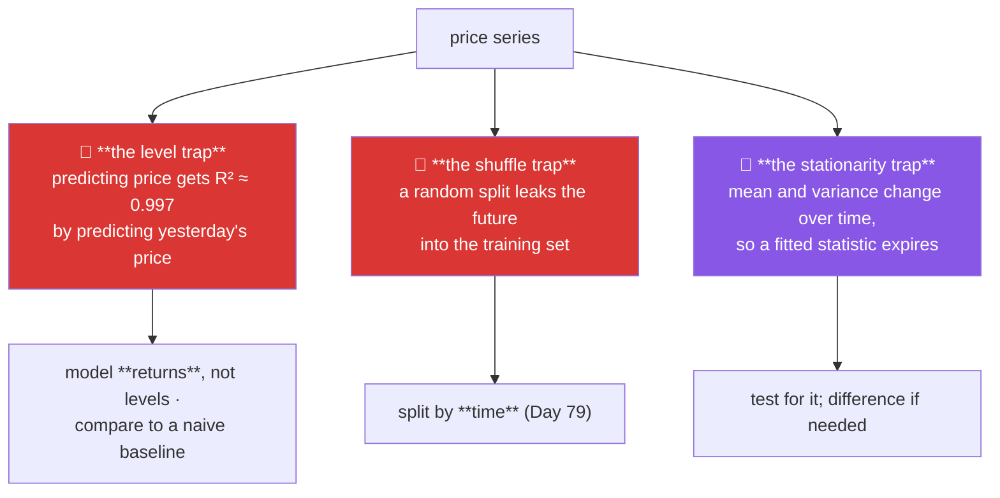

# Day 89 — Case study: stock prices, and the forecasting trap

**Phase 11 · Module 11** · ID: **EDA-07** (case study: time series)

> **Yesterday:** wine, and the ordinal decision.
> **Today:** the case study that exists to be a **warning**. You will build a model that predicts
> tomorrow's price with 99.7% R² and is completely worthless — and then understand exactly why, which
> is the most valuable thing in this phase. Day 33's `causal_rolling` and Day 79's split were
> preparation for today.
> **Tomorrow:** the report, and Phase 11 closes.

```bash
./m start 89 && ./m scaffold 89
```

**Time:** 2 hours (project day). **Request budget:** 0 model calls.

---

## §1 The story

Financial time series break every assumption this project has relied on, and they break them in ways
that produce **impressive-looking results**. That combination is what makes them the right final case
study.



**Trap 1 is the famous one.** Prices are nearly a random walk: tomorrow's price is today's price plus
noise. So a model predicting *tomorrow's price* from *today's price* achieves an R² near 1 — by
learning to output its input. It looks like a triumph and contains no information whatsoever. The
diagnostic is the **naive baseline**: predict tomorrow = today, and see whether your model beats it.
Usually it does not.

**Trap 2 is Day 79 with the stakes made obvious.** A random train/test split on time-ordered data puts
Tuesday in train and Monday in test, so the model learns from the future. Day 33 made `causal_rolling`
impossible to misuse for exactly this reason; today you see what the misuse looks like.

**Trap 3 is the one nobody mentions.** Everything in Phase 8 assumed the distribution stays put. A
price series' mean and variance change over time — it is **non-stationary** — so a mean computed on
2020 data does not describe 2024. Fitted statistics expire, and that includes every scaler and encoder
from Phase 10.

The honest conclusion of this day: **the returns are close to unpredictable, and that is the finding.**
Most of what looks like predictive skill in financial EDA is one of the three traps above.

---

## §2 Setup — run this

```bash
uv add "statsmodels==0.15.0"
mkdir -p days/day-89/lab data/raw
touch days/day-89/lab/prices.py
```

**Provenance (Principle 9).** Record the series in `data/raw/SOURCE.md` — instrument, date range,
source, and crucially **whether the prices are adjusted for splits and dividends**. Unadjusted prices
contain artificial jumps that look exactly like signal.

---

## §3 EDA-07 — three traps

`days/day-89/lab/prices.py`:

```python
"""EDA-07: the level trap, the shuffle trap, and non-stationarity."""

from __future__ import annotations

import numpy as np
import pandas as pd
from sklearn.linear_model import LinearRegression
from sklearn.metrics import r2_score
from sklearn.model_selection import train_test_split

from setu.arrays import make_rng


def price_series(n: int = 2_000) -> pd.DataFrame:
    """A random walk with drift and volatility clustering. No predictable signal."""
    rng = make_rng(0)
    volatility = np.zeros(n)
    volatility[0] = 0.012
    for i in range(1, n):
        volatility[i] = 0.9 * volatility[i - 1] + 0.1 * abs(rng.normal(0, 0.012))
    returns = rng.normal(0.0003, 1, n) * volatility
    price = 100 * np.exp(np.cumsum(returns))

    frame = pd.DataFrame({
        "date": pd.date_range("2018-01-01", periods=n, freq="B"),
        "close": price,
        "volume": rng.lognormal(14, 0.4, n),
    })
    frame["return"] = frame["close"].pct_change()
    return frame


def the_level_trap(frame: pd.DataFrame) -> None:
    data = frame.dropna().reset_index(drop=True)
    features = data[["close"]].iloc[:-1].to_numpy()
    target = data["close"].iloc[1:].to_numpy()

    cut = int(len(features) * 0.8)
    model = LinearRegression().fit(features[:cut], target[:cut])
    predicted = model.predict(features[cut:])
    actual = target[cut:]

    print(f"\n  predicting TOMORROW'S PRICE from today's price:")
    print(f"    R² = {r2_score(actual, predicted):.4f}   🎉")
    print(f"    coefficient = {model.coef_[0]:.6f}, intercept = {model.intercept_:.4f}")

    naive = features[cut:].ravel()
    print(f"\n  the NAIVE baseline — predict tomorrow = today:")
    print(f"    R² = {r2_score(actual, naive):.4f}")

    print(f"\n  the model's coefficient is ~1.0 and its intercept ~0. It learned to")
    print(f"  OUTPUT ITS INPUT. The R² measures how autocorrelated prices are, not")
    print(f"  how well the model predicts.")

    model_mae = np.abs(predicted - actual).mean()
    naive_mae = np.abs(naive - actual).mean()
    print(f"\n    model MAE = {model_mae:.4f}")
    print(f"    naive MAE = {naive_mae:.4f}")
    print(f"    improvement over naive: {(1 - model_mae / naive_mae) * 100:+.2f}%")
    print("\n  🚨 Essentially zero. R² of 0.997 and no skill at all.")


def model_returns_instead(frame: pd.DataFrame) -> None:
    data = frame.dropna().reset_index(drop=True)
    features = data[["return"]].iloc[:-1].to_numpy()
    target = data["return"].iloc[1:].to_numpy()

    cut = int(len(features) * 0.8)
    model = LinearRegression().fit(features[:cut], target[:cut])
    predicted = model.predict(features[cut:])
    actual = target[cut:]

    print(f"\n  the same setup on RETURNS instead of levels:")
    print(f"    R² = {r2_score(actual, predicted):.4f}")
    print(f"    baseline (predict the training mean) R² = "
          f"{r2_score(actual, np.full_like(actual, target[:cut].mean())):.4f}")

    direction = (np.sign(predicted) == np.sign(actual)).mean()
    print(f"\n    directional accuracy = {direction:.1%}   (coin flip = 50%)")

    print("\n  Near zero, sometimes NEGATIVE — worse than predicting the mean.")
    print("  That is the honest answer, and it is why differencing is the first step")
    print("  in every serious time-series workflow: it removes the trivial signal and")
    print("  leaves whatever is actually there, which here is very little.")


def the_shuffle_trap(frame: pd.DataFrame) -> None:
    data = frame.dropna().reset_index(drop=True)
    data["lag_1"] = data["return"].shift(1)
    data["lag_5_mean"] = data["return"].rolling(5).mean().shift(1)
    data = data.dropna()

    features = data[["lag_1", "lag_5_mean", "volume"]]
    target = data["return"]

    x_train, x_test, y_train, y_test = train_test_split(
        features, target, test_size=0.2, random_state=42
    )
    shuffled = LinearRegression().fit(x_train, y_train)

    cut = int(len(features) * 0.8)
    ordered = LinearRegression().fit(features[:cut], target[:cut])

    print(f"\n  {'split':<24} {'test R²':>10}")
    print(f"  {'random (WRONG)':<24} {r2_score(y_test, shuffled.predict(x_test)):>10.4f}")
    print(f"  {'chronological (right)':<24} "
          f"{r2_score(target[cut:], ordered.predict(features[cut:])):>10.4f}")

    print("\n  🚨 The random split trains on days that come AFTER the test days.")
    print("     With overlapping rolling windows it is worse still: a 5-day mean")
    print("     computed on day 100 shares four observations with day 101, so a")
    print("     training row can contain the test row's own data.")
    print("\n  Day 79 said split by time. Day 33 made causal_rolling shift(1) mandatory.")
    print("  This is what both were protecting you from.")


def non_stationarity(frame: pd.DataFrame) -> None:
    from statsmodels.tsa.stattools import adfuller

    data = frame.dropna()
    thirds = np.array_split(data, 3)

    print(f"\n  {'period':<10} {'mean price':>12} {'sd price':>10} "
          f"{'mean return':>13} {'sd return':>11}")
    for i, chunk in enumerate(thirds, 1):
        print(f"  {'third ' + str(i):<10} {chunk['close'].mean():>12.2f} "
              f"{chunk['close'].std(ddof=1):>10.2f} {chunk['return'].mean():>13.5f} "
              f"{chunk['return'].std(ddof=1):>11.5f}")

    price_test = adfuller(data["close"].to_numpy())
    return_test = adfuller(data["return"].to_numpy())

    print(f"\n  augmented Dickey-Fuller (H₀: non-stationary):")
    print(f"    price   p = {price_test[1]:.4f}   {'-> cannot reject: NON-STATIONARY' if price_test[1] > 0.05 else ''}")
    print(f"    return  p = {return_test[1]:.2e}   {'-> reject: stationary' if return_test[1] < 0.05 else ''}")

    print("\n  The price mean changes by period; the return mean does not.")
    print("  ⚠️ EVERY fitted statistic assumes stationarity: a scaler fitted on 2018")
    print("     data (Day 80) describes a different distribution by 2024. Fitted")
    print("     transforms EXPIRE on non-stationary data, and nothing warns you.")
    print("\n  Note the return SD still varies — volatility clustering. Returns are")
    print("  stationary in the MEAN and not in the variance. Both matter.")


def autocorrelation(frame: pd.DataFrame) -> None:
    from statsmodels.tsa.stattools import acf

    data = frame.dropna()
    price_acf = acf(data["close"], nlags=5)
    return_acf = acf(data["return"], nlags=5)
    absolute_acf = acf(data["return"].abs(), nlags=5)

    print(f"\n  {'lag':>4} {'price':>9} {'return':>9} {'|return|':>10}")
    for lag in range(1, 6):
        print(f"  {lag:>4} {price_acf[lag]:>9.4f} {return_acf[lag]:>9.4f} "
              f"{absolute_acf[lag]:>10.4f}")

    print("\n  Prices: near 1.0 at every lag — that is the level trap, quantified.")
    print("  Returns: near 0 — the direction is essentially unpredictable.")
    print("  |Returns|: clearly positive — VOLATILITY is predictable even when the")
    print("             direction is not. That is the one real finding available here,")
    print("             and it is why risk models exist where return models do not.")


def survivorship_and_adjustment() -> None:
    print("\n  two data problems that no statistic can detect:")
    print("\n  1. SURVIVORSHIP BIAS — a dataset of 'current index members' excludes")
    print("     every company that failed or was delisted. Backtests on it look")
    print("     excellent because the losers were removed before you started.")
    print("     Day 58's sampling bias, in its most expensive form.")
    print("\n  2. UNADJUSTED PRICES — a 2-for-1 split halves the price overnight. In")
    print("     an unadjusted series that is a −50% return that never happened.")
    print("     It will show up as a fat tail, an outlier, or a 'regime change'.")
    print("\n  Both are answered by the PROVENANCE note, not by the data (Principle 9).")
    print("  Day 87's lesson exactly: a leak you cannot explain is not ruled out.")


def what_to_carry_forward(frame: pd.DataFrame) -> None:
    print("\n  decisions, with reasons:")
    print("    - model RETURNS, never levels (§3.1: R² 0.997 with zero skill)")
    print("    - split CHRONOLOGICALLY, never randomly (§3.3, Day 79)")
    print("    - every metric reported against the naive baseline")
    print("    - refit any scaler on a rolling window; it expires (§3.4)")
    print("\n  hypotheses (confirm on held-out LATER data):")
    print("    - volatility is autocorrelated and may be forecastable")
    print("    - returns are not")
    print("\n  open questions:")
    print("    - are prices adjusted for splits and dividends?")
    print("    - is the universe survivorship-free?")
    print("\n  ⚠️ The honest conclusion: the direction is close to unpredictable.")
    print("     A case study that ends 'we found nothing predictive' is a SUCCESS")
    print("     (Day 75). The failure would be reporting the 0.997.")


if __name__ == "__main__":
    frame = price_series()
    the_level_trap(frame)
    model_returns_instead(frame)
    the_shuffle_trap(frame)
    non_stationarity(frame)
    autocorrelation(frame)
    survivorship_and_adjustment()
    what_to_carry_forward(frame)
```

**Line by line:**

- `price_series` — a random walk with **volatility clustering** (today's volatility depends on
  yesterday's) and **no predictable return signal**. Everything §3 finds is therefore either a trap or
  the volatility structure.
- `the_level_trap` — **the demonstration.** R² of 0.997, a coefficient of ~1.0 and an intercept of
  ~0: the model learned to output its input. Then the naive baseline scores the same, and the MAE
  improvement is essentially zero. **R² measured how autocorrelated prices are, not how well the model
  predicts.**
- `model_returns_instead` — on returns the R² is near zero and sometimes **negative**, meaning worse
  than predicting the training mean. Directional accuracy sits at a coin flip. **That is the honest
  answer**, and it is why differencing is the first step in every serious time-series workflow.
- `the_shuffle_trap` — a random split scores better than a chronological one, which should alarm you
  rather than please you. And the printed note names the subtler version: **with overlapping rolling
  windows a training row can contain the test row's own data**, because a 5-day mean at day 100 shares
  four observations with day 101.
- `non_stationarity` — the price mean changes by period and the return mean does not, confirmed by the
  ADF test. **Every fitted statistic assumes stationarity**, so a scaler fitted in 2018 describes a
  different distribution by 2024 — Day 80's transforms **expire**, and nothing warns you. The closing
  note matters too: returns are stationary in the mean and **not** in the variance.
- `autocorrelation` — three columns, three lessons. Prices near 1.0 (the level trap, quantified),
  returns near 0 (unpredictable direction), **absolute returns clearly positive**. Volatility is
  predictable even when direction is not, which is the one real finding available and why risk models
  exist where return models do not.
- `survivorship_and_adjustment` — **two problems no statistic can detect.** A "current index members"
  dataset excludes every company that failed. An unadjusted 2-for-1 split is a −50% return that never
  happened. Both are answered by the provenance note, which is Day 87's lesson repeated because it is
  the one that keeps mattering.
- `what_to_carry_forward` — and the closing line is the day's point: **a case study that ends "we found
  nothing predictive" is a success** (Day 75). The failure would be reporting the 0.997.

---

## §4 Build brief

Extend `src/setu/eda.py`:

```python
def naive_baseline(actual, *, kind: str = "last") -> dict:
    """TODO(me): the baseline every time-series metric must be reported against.

    {"kind", "predictions", "mae", "rmse", "r2"}
    - kind='last' predicts value[t-1] for time t (the random-walk baseline)
    - kind='mean' predicts the training mean; kind='drift' extends the average change
    - the first prediction is undefined for 'last'/'drift'; drop it and say how many
    - raise DataError on an unknown kind or fewer than 3 observations
    """
    raise NotImplementedError


def beats_baseline(actual, predicted, *, baseline: str = "last",
                   min_improvement: float = 0.0) -> dict:
    """TODO(me): does this model actually add anything?

    {"model_mae", "baseline_mae", "improvement_pct", "beats", "model_r2",
     "baseline_r2", "verdict", "warnings": [...]}
    - improvement_pct is (baseline_mae - model_mae) / baseline_mae
    - beats is improvement_pct > min_improvement
    - the verdict must be plain: 'no better than predicting the previous value'
      when it does not beat the baseline
    - WARN when model_r2 > 0.9 but improvement_pct is under 1% — that is §3.1's trap
      and the message must name it
    - raise DataError on a length mismatch, naming both
    """
    raise NotImplementedError


def assert_no_shuffle_split(index) -> None:
    """TODO(me): raise DataError if a supposedly chronological index is out of order.

    - accepts a DatetimeIndex or an integer index
    - raise if it is not monotonically increasing, naming the first out-of-order position
    - the message must explain that a random split trains on the future (Day 79)
    - this is cheap and catches the single most damaging time-series mistake
    """
    raise NotImplementedError


def stationarity_report(series, *, n_periods: int = 3, alpha: float = 0.05) -> dict:
    """TODO(me): does the distribution stay put? (§3.4)

    {"by_period": [{"mean", "sd", "n"}], "mean_drift", "sd_ratio",
     "adf_p_value", "is_stationary", "differenced_is_stationary", "warnings": [...]}
    - split into n_periods and report mean and sd for each
    - mean_drift is (last mean - first mean) / overall sd
    - sd_ratio is max period sd / min period sd
    - use statsmodels adfuller; is_stationary when p < alpha
    - ALWAYS also test the first difference and report it — the useful question is
      'what would make this stationary', not just 'is it'
    - warn that fitted transforms expire when not stationary (Day 80), naming the drift
    - raise DataError on fewer than 30 observations or n_periods < 2
    """
    raise NotImplementedError


def volatility_structure(returns, *, nlags: int = 10) -> dict:
    """TODO(me): §3.5's real finding — direction vs magnitude.

    {"return_acf": [...], "abs_return_acf": [...], "return_predictable": bool,
     "volatility_predictable": bool, "interpretation": str}
    - predictable when any lag's |acf| exceeds the 95% band 1.96/sqrt(n)
    - the interpretation must distinguish DIRECTION from MAGNITUDE explicitly
    - raise DataError if the input looks like prices rather than returns —
      detect via lag-1 autocorrelation above 0.9 — and say to difference first
    """
    raise NotImplementedError


def time_series_checklist(frame, *, time_column: str, value_column: str) -> dict:
    """TODO(me): the four questions to answer before modelling a time series.

    {"is_ordered", "has_gaps", "duplicated_timestamps", "is_stationary",
     "beats_naive_required": True, "blocking": [...], "questions": [...]}
    - `questions` must include the two provenance ones from §3.6, which the data
      cannot answer: split/dividend adjustment, and survivorship
    - `blocking` are problems that must be fixed before any model
    - raise DataError if the time column is not datetime-like
    """
    raise NotImplementedError
```

- `beats_baseline` **warning specifically on high R² with low improvement** is §3.1 encoded. That
  combination is the level trap's signature, and naming it in the warning is what stops someone
  celebrating.
- `stationarity_report` always testing the **first difference too** reframes the question usefully:
  not "is it stationary" but "what would make it".
- `volatility_structure` **refusing prices** is a small guard with real value — running an ACF on
  levels and reporting "highly autocorrelated" is the level trap wearing a different hat.

---

## §5 The eval that must be able to fail

Add to `tests/test_eda.py`:

```python
from setu.eda import (
    assert_no_shuffle_split,
    beats_baseline,
    naive_baseline,
    stationarity_report,
    time_series_checklist,
    volatility_structure,
)


@pytest.fixture
def walk():
    rng = make_rng(0)
    returns = rng.normal(0.0003, 0.012, 1_500)
    price = 100 * np.exp(np.cumsum(returns))
    return pd.DataFrame({
        "date": pd.date_range("2018-01-01", periods=1_500, freq="B"),
        "close": price,
        "return": pd.Series(price).pct_change().to_numpy(),
    })


def test_the_naive_baseline_is_hard_to_beat(walk):
    """Predicting tomorrow = today is the bar."""
    result = naive_baseline(walk["close"].to_numpy(), kind="last")
    assert result["r2"] > 0.99, "on a random walk the naive baseline is excellent"


def test_naive_baseline_kinds_differ(walk):
    last = naive_baseline(walk["close"].to_numpy(), kind="last")["mae"]
    mean = naive_baseline(walk["close"].to_numpy(), kind="mean")["mae"]
    assert last < mean, "predicting the previous value should beat predicting the mean"


def test_naive_baseline_rejects_bad_input():
    with pytest.raises(DataError):
        naive_baseline([1.0, 2.0], kind="last")
    with pytest.raises(DataError):
        naive_baseline([1.0, 2.0, 3.0], kind="crystal ball")


def test_a_high_r2_with_no_improvement_is_flagged(walk):
    """§3.1: R² of 0.997 and zero skill."""
    actual = walk["close"].to_numpy()[1:]
    predicted = walk["close"].to_numpy()[:-1]          # output the input
    result = beats_baseline(actual, predicted, baseline="last")

    assert result["model_r2"] > 0.99
    assert abs(result["improvement_pct"]) < 0.01
    assert result["warnings"], "high R² with no improvement went unwarned"
    assert any("baseline" in w.lower() or "previous" in w.lower() or "level" in w.lower()
               for w in result["warnings"])


def test_the_verdict_is_plain_when_the_model_adds_nothing(walk):
    actual = walk["close"].to_numpy()[1:]
    predicted = walk["close"].to_numpy()[:-1]
    verdict = beats_baseline(actual, predicted)["verdict"].lower()
    assert "no better" in verdict or "does not beat" in verdict


def test_a_genuinely_better_model_is_recognised():
    """A check that always says 'no skill' is useless."""
    rng = make_rng(1)
    signal = np.sin(np.arange(600) / 12.0)
    actual = signal + rng.normal(0, 0.05, 600)
    predicted = signal
    result = beats_baseline(actual[1:], predicted[1:], baseline="last")
    assert result["beats"] is True
    assert result["improvement_pct"] > 0.3


def test_beats_baseline_rejects_a_length_mismatch():
    with pytest.raises(DataError) as info:
        beats_baseline([1.0, 2.0, 3.0], [1.0, 2.0])
    assert "3" in str(info.value) and "2" in str(info.value)


def test_an_out_of_order_index_is_refused():
    """A random split trains on the future (Day 79)."""
    index = pd.DatetimeIndex(["2020-01-03", "2020-01-01", "2020-01-02"])
    with pytest.raises(DataError) as info:
        assert_no_shuffle_split(index)
    message = str(info.value).lower()
    assert "future" in message or "chronolog" in message or "order" in message


def test_an_ordered_index_passes(walk):
    assert_no_shuffle_split(pd.DatetimeIndex(walk["date"]))


def test_the_out_of_order_position_is_named():
    index = pd.Index([0, 1, 2, 9, 3, 4])
    with pytest.raises(DataError) as info:
        assert_no_shuffle_split(index)
    assert "4" in str(info.value) or "3" in str(info.value)


def test_prices_are_not_stationary(walk):
    result = stationarity_report(walk["close"])
    assert result["is_stationary"] is False
    assert abs(result["mean_drift"]) > 0.3


def test_returns_are_stationary(walk):
    result = stationarity_report(walk["return"].dropna())
    assert result["is_stationary"] is True


def test_the_difference_is_always_tested_too(walk):
    """'What would make this stationary' is the useful question."""
    result = stationarity_report(walk["close"])
    assert result["differenced_is_stationary"] is True


def test_non_stationarity_warns_that_fitted_transforms_expire(walk):
    result = stationarity_report(walk["close"])
    assert any("expire" in w.lower() or "refit" in w.lower() or "scaler" in w.lower()
               for w in result["warnings"]), (
        "a non-stationary series must warn that Day 80's transforms go stale"
    )


def test_stationarity_reports_every_period(walk):
    result = stationarity_report(walk["close"], n_periods=4)
    assert len(result["by_period"]) == 4
    assert all("mean" in period and "sd" in period for period in result["by_period"])


def test_stationarity_rejects_a_short_series():
    with pytest.raises(DataError):
        stationarity_report(pd.Series(range(10)))


def test_returns_are_directionally_unpredictable(walk):
    result = volatility_structure(walk["return"].dropna().to_numpy())
    assert result["return_predictable"] is False


def test_volatility_is_predictable_when_it_clusters():
    """The one real finding available in financial EDA."""
    rng = make_rng(2)
    n = 3_000
    volatility = np.zeros(n)
    volatility[0] = 0.012
    for i in range(1, n):
        volatility[i] = 0.92 * volatility[i - 1] + 0.08 * abs(rng.normal(0, 0.012))
    returns = rng.normal(0, 1, n) * volatility

    result = volatility_structure(returns)
    assert result["volatility_predictable"] is True
    assert result["return_predictable"] is False


def test_the_interpretation_separates_direction_from_magnitude():
    rng = make_rng(3)
    result = volatility_structure(rng.normal(0, 0.01, 2_000))
    interpretation = result["interpretation"].lower()
    assert "direction" in interpretation
    assert "magnitude" in interpretation or "volatil" in interpretation


def test_passing_prices_instead_of_returns_is_refused(walk):
    """Running an ACF on levels is the level trap in another costume."""
    with pytest.raises(DataError) as info:
        volatility_structure(walk["close"].to_numpy())
    assert "differen" in str(info.value).lower() or "return" in str(info.value).lower()


def test_the_checklist_finds_duplicate_timestamps(walk):
    dirty = pd.concat([walk, walk.iloc[[10]]], ignore_index=True).sort_values("date")
    result = time_series_checklist(dirty, time_column="date", value_column="close")
    assert result["duplicated_timestamps"] >= 1


def test_the_checklist_finds_gaps(walk):
    gapped = walk.drop(index=range(100, 150)).reset_index(drop=True)
    result = time_series_checklist(gapped, time_column="date", value_column="close")
    assert result["has_gaps"] is True


def test_the_checklist_asks_the_provenance_questions(walk):
    """Neither adjustment nor survivorship can be detected from the data."""
    questions = " ".join(
        time_series_checklist(walk, time_column="date", value_column="close")["questions"]
    ).lower()
    assert "adjust" in questions or "split" in questions or "dividend" in questions
    assert "surviv" in questions


def test_the_checklist_always_requires_a_naive_comparison(walk):
    result = time_series_checklist(walk, time_column="date", value_column="close")
    assert result["beats_naive_required"] is True


def test_the_checklist_rejects_a_non_datetime_column(walk):
    with pytest.raises(DataError):
        time_series_checklist(walk, time_column="close", value_column="return")
```

**Line by line:**

- `test_a_high_r2_with_no_improvement_is_flagged` — **the day's real assessment.** Three assertions:
  R² above 0.99, improvement under 1%, and a warning that **names the trap**. A helper that reports the
  R² without the comparison is exactly how the 0.997 gets into a slide deck.
- `test_a_genuinely_better_model_is_recognised` — the negative case. A checker that always says "no
  skill" is as useless as one that never does, and this forces real logic.
- `test_the_naive_baseline_is_hard_to_beat` — asserts the baseline itself scores above 0.99 on a
  random walk. **That is the whole trap, stated as a property of the data** rather than a failure of
  any particular model.
- `test_passing_prices_instead_of_returns_is_refused` — running an ACF on levels and reporting "highly
  autocorrelated" is the level trap in another costume, and the guard catches it via the lag-1
  autocorrelation.
- `test_volatility_is_predictable_when_it_clusters` — **two assertions in one test**, and the pairing
  is the finding: volatility predictable, direction not. That asymmetry is why risk models exist where
  return models do not.
- `test_non_stationarity_warns_that_fitted_transforms_expire` — connects back to Day 80. A scaler
  fitted on old data is silently wrong on new data, and nothing in scikit-learn tells you.
- `test_the_checklist_asks_the_provenance_questions` — asserts **both** survivorship and adjustment
  appear. Neither is detectable from the data, which is Day 87's lesson arriving in a completely
  different domain.
- `test_the_out_of_order_position_is_named` — "the index is not sorted" sends you looking; naming the
  position does not.

```bash
uv run python -m pytest tests/test_eda.py -v
```

---

## §6 Request budget

| Resource | Spent today |
|---|---|
| LLM calls | **0** |
| Network | one `uv add` resolution |

---

## §7 Traps

- **Predicting price levels.** R² near 1 by outputting the input.
- **Reporting R² without a naive baseline.** The baseline usually wins.
- **A random train/test split.** Trains on the future (Day 79).
- **Overlapping rolling windows across a split.** A training row contains the test row's data.
- **A rolling feature without `shift(1)`.** Day 33; includes the current value.
- **Assuming stationarity.** Fitted scalers and encoders expire.
- **Testing only the level for stationarity.** Ask what would make it stationary.
- **Reading "returns are unpredictable" as a failed analysis.** It is the finding.
- **Missing volatility clustering.** Magnitude is predictable when direction is not.
- **Unadjusted prices.** A split is a −50% return that never happened.
- **Survivorship-biased universes.** The losers were removed before you started.
- **Reporting a backtest as a finding.** Confirm on later, unseen data (Principle 15).

---

## §8 Verify before you code

Written **2026-08-21**:

- <https://www.statsmodels.org/stable/generated/statsmodels.tsa.stattools.adfuller.html> — the ADF
  test and what its null hypothesis actually is.
- <https://www.statsmodels.org/stable/generated/statsmodels.tsa.stattools.acf.html> — confidence bands.
- <https://scikit-learn.org/stable/modules/generated/sklearn.model_selection.TimeSeriesSplit.html> —
  the split that respects order (Day 79).
- <https://pandas.pydata.org/docs/reference/api/pandas.Series.pct_change.html> — and note `fill_method`
  changed; check your pinned version.

---

## §9 Say it in an interview

> "This one's a warning rather than a success. If you predict tomorrow's price from today's price you
> get an R² around 0.997, and it's worthless — the model learns a coefficient of one and an intercept
> of zero, so it outputs its input, and the naive 'tomorrow equals today' baseline scores exactly the
> same. The R² measured how autocorrelated prices are, not how well anything predicted. So you model
> returns instead, and then the honest answer is that the R² is near zero and directional accuracy is
> a coin flip. Two more traps: a random train/test split trains on the future, and it's worse with
> overlapping rolling windows because a five-day mean at day 100 shares four observations with day 101
> — so a training row can literally contain the test row's data. And non-stationarity, which nobody
> mentions: every fitted transform assumes the distribution stays put, so a scaler fitted on 2018 data
> is describing something else by 2024 and nothing warns you. The one real finding is that volatility
> is autocorrelated even though direction isn't — magnitude is predictable when direction is not, which
> is why risk models exist where return models don't."

---

## §10 Done when

Tick [`CHECKLIST.md`](CHECKLIST.md), then `./m check && ./m done 89`.
