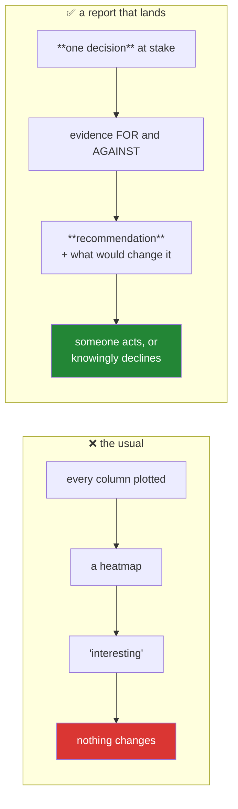

# Day 90 — An EDA report that changes a decision

**Phase 11 gate** · ID: **EDA-08** · Artifact: **a report + ADR-006**

> **Yesterday:** the forecasting trap, and a case study that correctly found nothing.
> **Today:** the deliverable this whole phase was for. Not "here is what the data looks like" — a
> document that **arrives at a recommendation someone can act on, or refuse to.** The test of an EDA
> report is whether removing it would have changed what happened next.
> **Tomorrow:** Phase 12, and the first model.

```bash
./m start 90 && ./m scaffold 90
```

**Time:** 2 hours (gate day). **Request budget:** 0 model calls.

---

## §1 The story

Most EDA reports are a wall of histograms and a correlation heatmap, and they change nothing. The
reader scrolls, says "interesting", and proceeds exactly as planned.

The difference is structural:



**Start from the decision, not the data.** Before opening anything: *what will someone do differently
depending on what I find?* If there is no such thing, you are not doing EDA, you are producing charts.

Then four obligations this phase has been accumulating, each one because omitting it is a documented
way a report misleads:

- **Everything is a hypothesis** until confirmed on data you have not looked at (Days 85, 87, 88, 89).
- **The comparison count is disclosed** — screening forty features is forty comparisons (Day 74).
- **Every number carries an effect size and an interval** (Days 68, 69).
- **What would change the recommendation** is stated, or it is advocacy rather than analysis (Day 75).

And the honest one, which Day 89 earned the right to say: **"the data does not support this project"
is a valid and valuable finding.** A report that saves three months of modelling something
unpredictable is worth more than one that green-lights it.

**ADR-006** records the decision the report drove — including if that decision was to stop.

---

## §2 Setup — run this

```bash
mkdir -p days/day-90/lab reports/figures
touch days/day-90/lab/report.py
touch reports/day90_eda_report.md
touch docs/adr/ADR-006-eda-decision.md
```

---

## §3 EDA-08 — the report

**Write `reports/day90_eda_report.md` from this skeleton.** Every section exists because of a specific
day; the parenthetical is not decoration.

```markdown
# EDA — <the decision at stake>

## The decision
One sentence: what will someone do differently depending on this?
If you cannot write it, stop. (§1)

## What I would need to see
Written BEFORE looking, so the analysis can fail. (Day 75)
"I would recommend proceeding if ___ and recommend stopping if ___."

## The data
Source, licence, date pulled, and HOW IT WAS COLLECTED. (Principle 9)
Rows, columns, the unit of one row.
Which split this report is based on. (Day 79 — the train split, always)

## What the audit found
From audit(df) (Day 84): duplicates, constants, identifiers, impossible values,
cross-column violations (Day 88). Blocking issues first.

## Univariate
Only variables that BEAR ON THE DECISION. A histogram of every column is
padding, and it is what makes reports unreadable. (Day 85)

## Bivariate
Effect sizes, ranked. Not p-values. (Days 69, 85)
Subgroup stability for anything you intend to rely on. (Day 85)

## Leakage screen
Every feature that predicts suspiciously well, and — crucially — WHETHER YOU
CAN EXPLAIN WHY. An unexplained leak is not ruled out. (Days 39, 85, 87)

## Comparisons made
The total. Uncorrected, because this is exploration. (Day 74)

## Recommendation
One of: proceed / proceed with these changes / do not proceed.
With the reason, and the effect size that drove it.

## What would change this
Specific and falsifiable. (Day 75)

## Open questions for the data owner
Things the data cannot answer. (Days 84, 87, 89)
```

**Line by line — why each section exists:**

- **The decision first.** If you cannot name what someone will do differently, there is nothing to
  report. This single constraint eliminates most useless EDA.
- **What I would need to see, written before looking** — this is Day 75's pre-registration applied to
  exploration. It is what lets the analysis come out negative.
- **Which split** — every number in the report comes from train (Day 79), or the test set is burned.
- **Only variables that bear on the decision.** A histogram of every column is padding, and padding is
  why reports go unread.
- **Effect sizes ranked, not p-values** — at a few thousand rows a p-value ranking is a ranking by
  sample size (Day 69).
- **Whether you can explain the leak** — Day 87's hardest lesson. A screen tells you *that*; only
  provenance tells you *why*, and an unexplained leak is not ruled out.
- **The comparison count** — the disclosure that separates exploration from p-hacking (Day 74).
- **What would change this** — without it you have written advocacy.

### Building it

`days/day-90/lab/report.py`:

```python
"""EDA-08: assemble the report from the phase's own functions. No new analysis here."""

from __future__ import annotations

import json
from datetime import UTC, datetime
from pathlib import Path

import pandas as pd

from setu.eda import (
    audit,
    audit_summary,
    check_subgroup_stability,
    cross_column_rules,
    exploration_report,
    screen_features,
    univariate,
)
from setu.plots import grid, save
from setu.stats import describe_interval

REPORT = Path("reports/day90_eda_report.md")


def check_the_decision_is_stated() -> str:
    if not REPORT.exists():
        raise SystemExit("Write reports/day90_eda_report.md first — the decision comes before the data.")
    text = REPORT.read_text(encoding="utf-8")
    if "## The decision" not in text:
        raise SystemExit("the report has no '## The decision' section")

    decision = text.split("## The decision", 1)[1].split("##", 1)[0].strip()
    if len(decision.split()) < 8:
        raise SystemExit("the decision section is too short to be a real decision")
    print(f"\n  decision at stake: {decision.splitlines()[0][:80]}")
    return decision


def load_training_split() -> pd.DataFrame:
    """Replace with YOUR data — from Day 83's pipeline, TRAIN split only."""
    from days.day_88.lab.wine import training_wine   # or your own case study

    return training_wine()


def step_one_audit(frame: pd.DataFrame) -> dict:
    report = audit(frame, target="quality")
    print(f"\n  audit: {len(report['findings'])} findings")
    for finding in report["findings"][:5]:
        print(f"    [{finding['severity']}] {finding['message']}")
    print(f"\n  {audit_summary(report)}")
    return report


def step_two_domain_rules(frame: pd.DataFrame) -> dict:
    rules = {
        "free<=total": lambda f: f["free_sulfur_dioxide"] <= f["total_sulfur_dioxide"],
        "ph plausible": lambda f: f["ph"].between(2.5, 4.5),
    }
    result = cross_column_rules(frame, rules)
    print(f"\n  cross-column rules: {result['n_violations_total']} violations, "
          f"{len(result['blocking'])} blocking")
    return result


def step_three_screen(frame: pd.DataFrame) -> dict:
    result = screen_features(frame.drop(columns=["type"]), "quality")
    print(f"\n  top features by EFFECT SIZE (not p-value):")
    for entry in result["ranked"][:5]:
        print(f"    {entry['feature']:<24} effect = {entry['effect_size']:>7.3f}")
    print(f"\n  {result['statement']}")
    if result["suspected_leaks"]:
        print(f"  🚨 suspected leaks: {result['suspected_leaks']}")
        print("     Can you EXPLAIN each one? An unexplained leak is not ruled out (Day 87).")
    return result


def step_four_stability(frame: pd.DataFrame, screen: dict) -> list[dict]:
    results = []
    for entry in screen["ranked"][:3]:
        feature = entry["feature"]
        stability = check_subgroup_stability(frame, feature, "quality", by="type")
        flag = "⚠️" if (stability["reverses"] or stability["weakens"]) else "  "
        print(f"  {flag} {feature:<24} overall {stability['overall']:>7.3f}  "
              f"{'UNSTABLE' if stability['reverses'] or stability['weakens'] else 'stable'}")
        results.append(stability)
    return results


def step_five_figures(frame: pd.DataFrame, screen: dict) -> list:
    """Only figures that bear on the decision. Phase 5's rules still apply."""
    from setu.plots import assert_pack_is_publishable, distribution, grouped_box

    figure, axes = grid(2, 2)
    distribution(frame["quality"], ax=axes[0], kind="hist")
    axes[0].set_title("Quality is ordinal and imbalanced")
    grouped_box(frame, x="type", y="quality", ax=axes[1])
    axes[1].set_title("Red and white differ")
    top = screen["ranked"][0]["feature"]
    distribution(frame[top], ax=axes[2], kind="hist")
    axes[2].set_title(f"{top}: the largest effect")
    grouped_box(frame.assign(band=pd.qcut(frame[top], 4, duplicates="drop")),
                x="band", y="quality", ax=axes[3])
    axes[3].set_title(f"quality by {top} quartile")

    assert_pack_is_publishable(axes)
    paths = save(figure, Path("reports/figures/day90_eda"))
    print(f"\n  figures: {[str(p) for p in paths]}")
    print("  every panel passed the Day 37 and Day 40 lints")
    return paths


def step_six_assemble(frame, audit_report, rules, screen, stability) -> dict:
    inventory = exploration_report(screen, [univariate(frame, "alcohol")])

    payload = {
        "generated_at": datetime.now(UTC).isoformat(),
        "n_rows": len(frame),
        "split": "train",
        "blocking_issues": [f["message"] for f in audit_report["findings"]
                            if f["severity"] == "blocking"],
        "cross_column_violations": rules["n_violations_total"],
        "n_comparisons": screen["n_comparisons"],
        "suspected_leaks": screen["suspected_leaks"],
        "unstable_relationships": [s for s in stability if s["reverses"] or s["weakens"]],
        "hypotheses": inventory["hypotheses"],
        "features_to_drop": inventory["features_to_drop"],
        "statement": inventory["statement"],
    }
    Path("reports").mkdir(exist_ok=True)
    Path("reports/day90_eda.json").write_text(
        json.dumps(payload, indent=2, default=str), encoding="utf-8"
    )
    print(f"\n  {payload['n_comparisons']} comparisons made — exploration, uncorrected")
    print("  written to reports/day90_eda.json")
    return payload


def main() -> None:
    check_the_decision_is_stated()
    frame = load_training_split()
    audit_report = step_one_audit(frame)
    rules = step_two_domain_rules(frame)
    screen = step_three_screen(frame)
    stability = step_four_stability(frame, screen)
    step_five_figures(frame, screen)
    step_six_assemble(frame, audit_report, rules, screen, stability)


if __name__ == "__main__":
    main()
```

**Line by line:**

- `check_the_decision_is_stated` — **the script refuses to run without a stated decision**, and checks
  it is more than a stub. §1's rule, enforced mechanically rather than by good intention.
- `load_training_split` — **train only.** Every number in the report comes from data you were allowed
  to look at, so the test set survives to confirm anything found.
- `step_one_audit` through `step_four_stability` — **no new analysis.** Every function was built in
  Days 84–88, and the report assembles them. If a step needed new code, the phase was incomplete.
- `step_three_screen` — the ranking is by **effect size**, the statement carries the **comparison
  count**, and any suspected leak triggers the Day 87 question: *can you explain it?*
- `step_five_figures` — **four panels, each tied to the decision**, and `assert_pack_is_publishable`
  runs Day 37's honest-bar and Day 40's accessibility lints over every one. Phase 5's rules did not
  expire.
- `step_six_assemble` — a machine-readable payload so ADR-006 can cite it and Phase 12 can read it
  without re-running.

---

## §4 The artifact — ADR-006

`docs/adr/ADR-006-eda-decision.md`. Sixth of thirteen.

> *What did the exploration change?*

Required content:

- **Context.** The decision at stake, and what the default would have been without this work.
- **What the data said.** The two or three findings that actually bore on the decision, each with an
  effect size and an interval. Not a summary of everything you looked at.
- **The decision.** Proceed, proceed with changes, or stop. One sentence.
- **What changed because of this.** The concrete list: features dropped and why, the target framing
  chosen (Day 88), the split strategy (Day 79), the metric and its baseline (Day 78), rows excluded
  and why.
- **What remains unconfirmed.** Everything is a hypothesis until Phase 12 tests it on held-out data.
  Name them.
- **What would change our minds.**
- **Cold read.** Tomorrow, reviewer hat on, sign it.

> **If the honest answer is "do not proceed"**, write that. Day 89's case study reached exactly that
> conclusion, and a report that prevents three months of modelling something unpredictable is the most
> valuable thing in this phase. The gate test checks that stopping is a permitted outcome.

---

## §5 The eval that must be able to fail

Add to `tests/test_eda.py`:

```python
def test_the_report_states_a_decision():
    """If nobody will do anything differently, this is not EDA."""
    from pathlib import Path

    path = Path("reports/day90_eda_report.md")
    assert path.exists(), "the report was not written"
    text = path.read_text(encoding="utf-8")

    assert "## The decision" in text
    decision = text.split("## The decision", 1)[1].split("##", 1)[0].strip()
    assert len(decision.split()) >= 8, "the decision is too short to be a real decision"


def test_the_report_has_every_required_section():
    from pathlib import Path

    text = Path("reports/day90_eda_report.md").read_text(encoding="utf-8").lower()
    for section in ("the decision", "what i would need to see", "the data",
                    "audit", "bivariate", "leakage", "comparisons made",
                    "recommendation", "what would change", "open questions"):
        assert section in text, f"missing section: {section}"


def test_the_success_criteria_were_written_before_looking():
    """Day 75's ordering, applied to exploration."""
    from pathlib import Path

    text = Path("reports/day90_eda_report.md").read_text(encoding="utf-8")
    section = text.split("What I would need to see", 1)[1].split("##", 1)[0].lower()
    assert "stop" in section or "not proceed" in section, (
        "the criteria must allow a negative outcome, or the analysis cannot fail"
    )


def test_the_report_names_the_split_it_used():
    from pathlib import Path

    text = Path("reports/day90_eda_report.md").read_text(encoding="utf-8").lower()
    assert "train" in text, "the report must say which split it is based on (Day 79)"


def test_the_report_records_provenance():
    from pathlib import Path

    text = Path("reports/day90_eda_report.md").read_text(encoding="utf-8").lower()
    assert "collect" in text or "source" in text or "licen" in text


def test_the_recommendation_is_one_of_three():
    from pathlib import Path

    text = Path("reports/day90_eda_report.md").read_text(encoding="utf-8").lower()
    section = text.split("## recommendation", 1)[1].split("##", 1)[0]
    assert any(word in section for word in ("proceed", "stop", "not proceed"))


def test_the_json_payload_exists_and_discloses_comparisons():
    import json
    from pathlib import Path

    path = Path("reports/day90_eda.json")
    assert path.exists(), "run days/day-90/lab/report.py"
    payload = json.loads(path.read_text(encoding="utf-8"))
    assert payload["n_comparisons"] >= 1
    assert str(payload["n_comparisons"]) in payload["statement"]


def test_the_payload_was_built_from_the_train_split():
    import json
    from pathlib import Path

    payload = json.loads(Path("reports/day90_eda.json").read_text(encoding="utf-8"))
    assert payload["split"] == "train", "an EDA report must not be built on test data"


def test_nothing_in_the_payload_is_called_a_finding():
    import json
    from pathlib import Path

    payload = json.loads(Path("reports/day90_eda.json").read_text(encoding="utf-8"))
    text = json.dumps(payload).lower()
    for banned in ("finding", "shows that", "proves", "we found that"):
        assert banned not in text, f"'{banned}' in an exploration payload"


def test_suspected_leaks_are_surfaced_not_buried():
    import json
    from pathlib import Path

    payload = json.loads(Path("reports/day90_eda.json").read_text(encoding="utf-8"))
    assert "suspected_leaks" in payload


def test_the_script_refuses_without_a_stated_decision(tmp_path, monkeypatch):
    """The decision comes before the data."""
    import subprocess
    import sys

    script = __import__("pathlib").Path("days/day-90/lab/report.py")
    assert script.exists()
    source = script.read_text(encoding="utf-8")
    assert "check_the_decision_is_stated" in source
    assert "SystemExit" in source, "the script must refuse, not merely warn"


def test_the_figures_exist_and_passed_the_lints():
    from pathlib import Path

    for suffix in ("svg", "png"):
        path = Path(f"reports/figures/day90_eda.{suffix}")
        assert path.exists(), f"{path} was not produced"
        assert path.stat().st_size > 5_000


def test_adr_006_records_what_changed():
    """An ADR that changed nothing is a summary, not a decision record."""
    from pathlib import Path

    path = Path("docs/adr/ADR-006-eda-decision.md")
    assert path.exists(), "ADR-006 was not written"
    text = path.read_text(encoding="utf-8").lower()

    for heading in ("context", "decision", "consequences"):
        assert heading in text

    assert "changed" in text or "instead of" in text or "we will now" in text, (
        "ADR-006 must say what is DIFFERENT because of the exploration"
    )
    assert "change our minds" in text


def test_adr_006_names_concrete_changes():
    from pathlib import Path

    text = Path("docs/adr/ADR-006-eda-decision.md").read_text(encoding="utf-8").lower()
    concrete = sum(word in text for word in ("drop", "split", "metric", "baseline",
                                             "exclude", "target", "framing"))
    assert concrete >= 3, "name the concrete changes: features, split, metric, framing"


def test_adr_006_lists_what_remains_unconfirmed():
    """Everything is a hypothesis until Phase 12 tests it."""
    from pathlib import Path

    text = Path("docs/adr/ADR-006-eda-decision.md").read_text(encoding="utf-8").lower()
    assert "unconfirmed" in text or "hypothes" in text or "held-out" in text


def test_stopping_is_a_permitted_outcome():
    """Day 89 reached exactly that conclusion, and it was a success."""
    from pathlib import Path

    text = Path("docs/adr/ADR-006-eda-decision.md").read_text(encoding="utf-8").lower()
    assert "not proceed" in text or "stop" in text or "abandon" in text, (
        "the ADR must acknowledge that stopping was an available outcome"
    )


def test_phase_11_eda_module_is_complete():
    from setu import eda

    expected = [
        "audit", "audit_summary", "eda_question", "eda_log", "record_check",
        "conclude", "missingness_tracks_target",                          # Day 84
        "univariate", "bivariate", "screen_features",
        "check_subgroup_stability", "exploration_report",                 # Day 85
        "pca_explore", "scree", "redundancy_report", "multivariate_outliers",
        "assert_pca_is_exploratory",                                      # Day 86
        "ordinal_target_report", "within_k_accuracy", "compare_framings",
        "subgroup_datasets", "cross_column_rules",                        # Day 88
        "naive_baseline", "beats_baseline", "assert_no_shuffle_split",
        "stationarity_report", "volatility_structure", "time_series_checklist",  # Day 89
    ]
    missing = [name for name in expected if not hasattr(eda, name)]
    assert not missing, f"Phase 11 is incomplete: {missing}"


def test_the_report_pipeline_runs_end_to_end():
    import subprocess
    import sys
    from pathlib import Path

    if not Path("reports/day90_eda_report.md").exists():
        pytest.skip("write the report skeleton first")

    result = subprocess.run(
        [sys.executable, "days/day-90/lab/report.py"],
        capture_output=True, text=True, timeout=300,
    )
    assert result.returncode == 0, f"report.py failed:\n{result.stderr}"
    assert "comparisons made" in result.stdout
```

**Line by line:**

- `test_the_success_criteria_were_written_before_looking` — **the day's real assessment.** It requires
  the criteria section to contain "stop" or "not proceed", because **an analysis that cannot come out
  negative is not an analysis.** Day 75's ordering, applied to exploration.
- `test_stopping_is_a_permitted_outcome` — the ADR must acknowledge stopping was available. Day 89
  reached that conclusion and it was the right one; an ADR template that only accommodates "proceed"
  quietly makes the honest outcome unwritable.
- `test_nothing_in_the_payload_is_called_a_finding` — four banned phrasings, the **fourth** time this
  project has tested English. Consistent with Days 68, 75 and 85, and for the same reason each time.
- `test_the_payload_was_built_from_the_train_split` — one assertion protecting the whole phase's
  legitimacy. If the report used test data, every hypothesis in it is unconfirmable.
- `test_adr_006_names_concrete_changes` — counts concrete change-words. **An ADR that changed nothing
  is a summary**, and this is the difference between a report that landed and one that was read
  politely.
- `test_the_script_refuses_without_a_stated_decision` — checks for `SystemExit`, not a warning. §1's
  rule has to be enforced, because "what decision is at stake?" is the question easiest to skip.
- `test_phase_11_eda_module_is_complete` — 28 functions across seven days, naming exactly what is
  missing.
- `test_the_report_pipeline_runs_end_to_end` — a subprocess with a timeout, the same technique as Days
  41 and 75. **A report that only assembles when you run the steps by hand is not reproducible.**

```bash
uv run python days/day-90/lab/report.py
uv run python -m pytest tests/test_eda.py -v
uv run python -m pytest -q
```

---

## §6 Request budget

| Resource | Spent today |
|---|---|
| LLM calls | **0** |
| Disk | ~1 MB of figures in `reports/figures/` |

---

## §7 Traps

- **Starting from the data.** Start from the decision, or you are producing charts.
- **A histogram of every column.** Padding, and it is why reports go unread.
- **No stated success criteria.** Then the analysis cannot come out negative.
- **Building the report on the test split.** Every hypothesis becomes unconfirmable.
- **Ranking by p-value.** At a few thousand rows that ranks by sample size.
- **A number without an effect size or interval.** Days 68 and 69.
- **Omitting the comparison count.** That omission is the p-hack (Day 74).
- **Reporting a leak you cannot explain as handled.** It is not ruled out (Day 87).
- **Calling anything a finding.** Confirmation needs unseen data (Principle 15).
- **A recommendation with no falsification condition.** Advocacy, not analysis.
- **An ADR that changed nothing.** That is a summary.
- **Treating "do not proceed" as a failure.** Day 89.

---

## §8 Verify before you code

Written **2026-08-21**:

- <https://scikit-learn.org/stable/common_pitfalls.html> — sklearn's own list, which overlaps this
  phase substantially.
- <https://www.cos.io/initiatives/prereg> — the pre-registration idea behind §3's criteria section.
- <https://matplotlib.org/stable/gallery/index.html> — before inventing a chart for the report.

---

## §9 Say it in an interview

> "The test of an EDA report is whether removing it would have changed what happened next. So mine
> starts from the decision rather than the data — one sentence saying what someone will do
> differently — and the assembly script literally refuses to run if that section is missing or a stub.
> The other thing I write before looking is the success criteria, phrased so a negative outcome is
> possible: 'I'd recommend stopping if…'. Without that the analysis can't fail, and there's a test
> asserting the criteria section contains a stopping condition. Everything in the report is a
> hypothesis, not a finding, because it's all built on the training split — the test set is untouched
> so Phase 12 has something to confirm on. And the report discloses its comparison count, because
> screening forty features is forty comparisons and omitting that number is the p-hack. The outcome I'd
> point at is from the time-series case study: the honest conclusion was that the data didn't support
> the project, and a report that prevents three months of modelling something unpredictable is worth
> more than one that green-lights it. The ADR template has to make that outcome writable."

---

## §10 Done when — **Phase 11 gate**

Tick [`CHECKLIST.md`](CHECKLIST.md), then:

```bash
./m check
./m done 90
./m status
```

**Gate criteria:** `reports/day90_eda_report.md` written with **the decision first** and success
criteria that permit a negative outcome · the assembly script runs end to end and refuses without a
stated decision · every number built from the **train** split · the comparison count disclosed · no
number described as a finding · suspected leaks surfaced with whether they can be explained · the
figure pack passes Day 37's and Day 40's lints · **ADR-006** written, naming concrete changes and
acknowledging that stopping was available, and cold-read ·
`test_phase_11_eda_module_is_complete` green (28 functions).

Tomorrow: Phase 12, where every hypothesis in this report finally meets data it has not seen.
