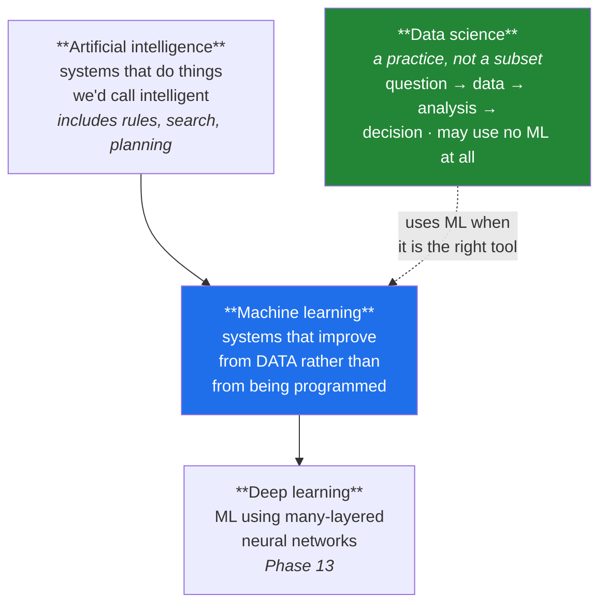

# Day 91 — AI, ML, DL, data science, and the four learning types

**Phase 12 · Module 12 · Machine learning** · IDs: **ML-01** (the terms), **ML-02** (supervised, unsupervised, semi-supervised, reinforcement)

> **Yesterday:** Phase 11 closed with a report that changed a decision.
> **Today:** the vocabulary — and it matters more than vocabulary usually does, because **the wrong
> framing makes a solvable problem unsolvable.** Ninety days of work have been building toward a
> model; today is about knowing which kind you need, and whether you need one at all.
> **Tomorrow:** linear regression from scratch.

```bash
./m start 91 && ./m scaffold 91
```

**Time:** 90 minutes. **Request budget:** 0 model calls.

---

## §1 The story

The terms nest, and the nesting is the useful part:



**AI is the widest and oldest term.** A chess engine using pure search is AI and contains no learning.
A rules engine that approves loans is AI. The word predates machine learning by decades and is now
mostly a marketing term, which is why precise writing avoids it.

**ML is the subset that learns from data.** The distinguishing property: you do not write the rules,
you write a procedure that *derives* rules from examples. That is a real technical difference and it
is where this phase lives.

**DL is ML with deep neural networks.** Phase 13. It is not "better ML" — it is a family with
particular strengths (perception, language, anything with abundant data and unstructured inputs) and
real weaknesses (data hunger, opacity, and it loses to gradient-boosted trees on ordinary tabular
data more often than people expect).

**Data science is not in this hierarchy at all.** It is a *practice*: question, data, analysis,
decision. Days 84–90 were data science and used no model. Sometimes the right output is a chart and a
recommendation, and reaching for a model when a `GROUP BY` would answer the question is a common and
expensive mistake.

### The four learning types

| Type | You have | You want | Example here |
|---|---|---|---|
| **Supervised** | inputs **and** labels | predict the label for new inputs | Day 88's wine quality |
| **Unsupervised** | inputs only | structure | Day 86's PCA; Phase 12's clustering |
| **Semi-supervised** | a few labels, many unlabelled | predict, cheaply | labelling is expensive |
| **Reinforcement** | an environment and a reward | a policy | Day 199's agent decisions |

**The label is the dividing line**, and "do we have labels?" is usually the first real question. It is
also the most common place a project goes wrong: a problem gets framed as supervised, and then someone
discovers the labels were derived from the thing being predicted (Day 87's length artifact) or do not
exist at all.

---

## §2 Setup — run this

```bash
mkdir -p days/day-91/lab
touch days/day-91/lab/framing.py
touch src/setu/framing.py
touch tests/test_framing.py
```

Today's module is small and unusual: it encodes **decisions about problems** rather than operations on
data. That is deliberate — the failure this day prevents is a framing error, and framing errors are
invisible to every test in the project until a model has been built.

---

## §3 ML-01 / ML-02 — framing

`days/day-91/lab/framing.py`:

```python
"""ML-01 / ML-02: what kind of problem is this, and does it need a model at all?"""

from __future__ import annotations

import numpy as np
import pandas as pd

from setu.arrays import make_rng


def the_terms_nest() -> None:
    rows = [
        ("chess engine (pure search)", "AI", "no", "rules written by humans"),
        ("spam filter (rules)", "AI", "no", "if contains X then spam"),
        ("spam filter (trained)", "AI + ML", "yes", "rules DERIVED from labelled mail"),
        ("image classifier (CNN)", "AI + ML + DL", "yes", "many-layered network"),
        ("a GROUP BY and a chart", "none of them", "no", "data science, no model"),
        ("an A/B test", "none of them", "no", "Phase 9, no model"),
    ]
    print(f"\n  {'system':<28} {'category':<16} {'learns?':<8} {'why'}")
    for system, category, learns, why in rows:
        print(f"  {system:<28} {category:<16} {learns:<8} {why}")

    print("\n  Note rows 5 and 6: two-thirds of the work in this plan so far was")
    print("  data science and used no model at all. That is not a gap; it is the point.")


def does_this_need_a_model() -> None:
    questions = [
        ("How many papers did each venue publish last year?",
         "no — a GROUP BY answers it exactly"),
        ("Did the redesign change signup rate?",
         "no — that is an A/B test (Phase 9)"),
        ("Which of these 10,000 papers should a reviewer read first?",
         "maybe — a ranking rule may be enough; measure it first"),
        ("Will this paper be cited more than 100 times?",
         "yes — a prediction about an unseen case"),
        ("What themes appear across these 50,000 abstracts?",
         "yes, unsupervised — there is no label to predict"),
    ]
    print(f"\n  {'question':<52} {'model?'}")
    for question, answer in questions:
        print(f"  {question:<52} {answer}")

    print("\n  ⚠️ 'Can I compute this exactly?' comes before 'what model should I use?'")
    print("     A model that approximates something you could have counted is worse than")
    print("     the count in every respect: slower, wronger, and harder to explain.")


def the_label_question() -> None:
    print("\n  the first real question in any supervised project:")
    print("\n  1. Does a label exist?")
    print("     - genuinely recorded, or derived from something else?")
    print("     - Day 87: 'positive review' was really 'scraped from site A'")
    print("\n  2. Is it available AT PREDICTION TIME?")
    print("     - the classic failure: a feature recorded after the outcome")
    print("     - 'days_until_churn' predicts churn perfectly and is unusable")
    print("\n  3. Does it mean what you think?")
    print("     - Day 88: quality is a MEDIAN OF EXPERT OPINIONS, not a property of wine")
    print("\n  4. How many do you have, and how were they chosen?")
    print("     - Day 58: a biased sample of labels is worse than fewer unbiased ones")

    print("\n  A project that fails question 2 is not a hard ML problem. It is not a")
    print("  problem at all, and the sooner that is discovered the better.")


def supervised_and_unsupervised(frame: pd.DataFrame) -> None:
    print(f"\n  the SAME data, two framings:")
    print(f"\n  supervised — predict `quality` from the measurements:")
    print(f"    inputs : {frame.shape[1] - 1} columns")
    print(f"    labels : {frame['quality'].nunique()} distinct values")
    print(f"    success: does it predict held-out wines? (a NUMBER)")

    print(f"\n  unsupervised — find structure in the measurements:")
    print(f"    inputs : {frame.shape[1] - 1} columns")
    print(f"    labels : none used")
    print(f"    success: ...is the hard part")

    from sklearn.cluster import KMeans
    from sklearn.preprocessing import StandardScaler

    features = frame.drop(columns=["quality"])
    scaled = StandardScaler().fit_transform(features)
    labels = KMeans(n_clusters=3, n_init=10, random_state=0).fit_predict(scaled)

    crosstab = pd.crosstab(labels, frame["quality"])
    print(f"\n  3 clusters vs quality:\n{crosstab}")

    print("\n  ⚠️ The clusters do NOT line up with quality — they found some other")
    print("     structure, and nothing says that structure is interesting.")
    print("  Unsupervised learning has no answer key, so 'is this good?' has no")
    print("  automatic answer. That is its central difficulty, not a detail.")


def semi_supervised_when_labels_cost_money() -> None:
    print("\n  the situation: 100,000 abstracts, and labelling one takes an expert 5 minutes.")
    print("    labelling all of them : ~1 person-year")
    print("    labelling 500         : ~2 days")
    print("\n  semi-supervised uses the 500 labels AND the structure of the other 99,500.")
    print("  It works when the unlabelled data tells you something about the geometry —")
    print("  e.g. points cluster, and a cluster probably shares a label.")
    print("\n  ⚠️ It also fails silently when that assumption is wrong, and you cannot")
    print("     tell without labels. Measure against a supervised baseline on the 500.")


def reinforcement_is_a_different_shape() -> None:
    print("\n  supervised: here is an input and the right answer. Learn the mapping.")
    print("  reinforcement: act, receive a reward, and figure out what caused it.")
    print("\n  three things that make RL harder:")
    print("    - the reward is DELAYED (which of 40 moves lost the game?)")
    print("    - your actions change what data you see next")
    print("    - you must EXPLORE to learn, which costs you while you learn")
    print("\n  Day 199's agent chooses which tool to call. That is an RL-shaped problem,")
    print("  and this plan solves it with rules and evaluation rather than learned")
    print("  policies — because with a $0 budget and no simulator, RL is not available.")
    print("  Knowing the SHAPE is what tells you that trade is being made.")


def the_framing_changes_everything() -> None:
    print("\n  one dataset — 50,000 support tickets — framed five ways:")
    framings = [
        ("supervised classification", "predict the resolving team", "needs a team label"),
        ("supervised regression", "predict resolution time", "needs recorded times"),
        ("unsupervised clustering", "find recurring issue types", "no label needed"),
        ("ranking", "which ticket to handle next", "needs a priority signal"),
        ("no model", "count tickets by team and month", "a GROUP BY"),
    ]
    for framing, goal, requirement in framings:
        print(f"    {framing:<28} {goal:<32} {requirement}")

    print("\n  Same data. Five projects, five datasets, five ways to be wrong.")
    print("  ⚠️ The framing decision is made BEFORE any modelling and is rarely revisited.")
    print("     It is also the decision most likely to be made by accident.")


def where_this_plan_sits() -> None:
    print("\n  Phase 12 (Days 91–106) : supervised — regression, then classification")
    print("  Phase 12 also           : one unsupervised day (clustering)")
    print("  Phase 13 (Days 107–130) : deep learning — still supervised")
    print("  Phases 15–17            : language models — self-supervised pretraining,")
    print("                            which is supervised learning with labels the data")
    print("                            generates itself (predict the next token)")
    print("  Phase 22+               : agents — RL-SHAPED, solved with rules and evals")
    print("\n  Note the self-supervised entry: it is how modern language models are")
    print("  trained, and it dissolves the labelling bottleneck by making the text")
    print("  its own label. Day 152 covers it properly.")


if __name__ == "__main__":
    from days.day_88.lab.wine import training_wine

    the_terms_nest()
    does_this_need_a_model()
    the_label_question()
    supervised_and_unsupervised(training_wine().drop(columns=["type"]))
    semi_supervised_when_labels_cost_money()
    reinforcement_is_a_different_shape()
    the_framing_changes_everything()
    where_this_plan_sits()
```

**Line by line:**

- `the_terms_nest` — **rows 5 and 6 are the point.** Two-thirds of this plan so far was data science
  with no model, and that is not a gap in the curriculum.
- `does_this_need_a_model` — **"can I compute this exactly?" comes before "what model?"** A model
  approximating something countable is worse in every respect: slower, wronger, harder to explain. The
  third row is the honest middle case — *maybe*, and you measure a simple rule first.
- `the_label_question` — four questions, and **question 2 is the killer.** A feature recorded *after*
  the outcome predicts perfectly and is unusable at prediction time. `days_until_churn` predicting
  churn is the canonical example, and Day 85's leak screen finds it only if you look.
- `supervised_and_unsupervised` — the same wine data, both ways. **The clusters do not line up with
  quality**, and nothing says the structure they found is interesting. Unsupervised learning has no
  answer key, so "is this good?" has no automatic answer — that is its central difficulty.
- `semi_supervised_when_labels_cost_money` — a person-year versus two days is the real motivation. And
  the warning matters: it **fails silently** when the clustering assumption is wrong, so you measure it
  against a supervised baseline on the labels you do have.
- `reinforcement_is_a_different_shape` — delayed reward, actions changing the data distribution, and
  exploration costing you while you learn. **Day 199's agent is RL-shaped and this plan solves it with
  rules and evaluation**, because with a $0 budget and no simulator RL is not available. Knowing the
  shape is what makes that a stated trade rather than an accident.
- `the_framing_changes_everything` — **one dataset, five projects.** The framing decision is made
  before any modelling, is rarely revisited, and is the decision most likely to be made by accident.
- `where_this_plan_sits` — and note the **self-supervised** entry: predicting the next token makes the
  text its own label, which is how the bottleneck in `the_label_question` gets dissolved. Day 152.

---

## §4 Build brief — `src/setu/framing.py`

Layer 1. Small, and it encodes decisions rather than computations.

```python
"""Problem framing for Setu. Decisions, not data operations. Layer 1."""

from __future__ import annotations

from typing import Literal

from setu.errors import DataError

LearningType = Literal["supervised", "unsupervised", "semi-supervised",
                       "reinforcement", "no model needed"]

TASK_TYPES = {"regression", "binary classification", "multiclass classification",
              "ordinal classification", "clustering", "ranking", "none"}


def classify_problem(*, has_labels: bool, n_labels: int = 0, n_unlabelled: int = 0,
                     labels_available_at_prediction_time: bool = True,
                     computable_exactly: bool = False,
                     has_environment_and_reward: bool = False) -> dict:
    """TODO(me): what KIND of problem is this? PURE.

    {"learning_type", "reason", "warnings": [...], "blocking": [...]}
    - computable_exactly=True -> 'no model needed', and that answer takes PRECEDENCE
      over everything else (§3.2)
    - labels_available_at_prediction_time=False -> `blocking`, not a warning: this is
      not a hard problem, it is not a problem (§3.3)
    - has_environment_and_reward -> 'reinforcement'
    - labels and many unlabelled (n_unlabelled > 5 * n_labels) -> 'semi-supervised',
      with a warning that it must be measured against a supervised baseline
    - labels only -> 'supervised'; none -> 'unsupervised' with a warning that success
      has no automatic definition
    - the reason must name the DECIDING input, not restate all of them
    """
    raise NotImplementedError


def choose_task(target_level: str, *, n_classes: int | None = None) -> dict:
    """TODO(me): given the target's level of measurement (Day 58), what task is this?

    {"task", "reason", "metric_family", "baseline"}
    - ratio/interval -> 'regression'; metric family from Day 94
    - nominal with 2 classes -> 'binary classification'
    - nominal with >2 -> 'multiclass classification'
    - ORDINAL -> 'ordinal classification', and the reason must cite Day 88: regression
      assumes equal spacing, plain classification discards the order
    - `baseline` names what a trivial model would achieve — never return a task
      without one (Day 78)
    - raise DataError on an unknown level, or nominal without n_classes
    """
    raise NotImplementedError


def assert_label_is_usable(*, exists: bool, derived_from_target: bool,
                           available_at_prediction_time: bool,
                           n_labels: int, min_labels: int = 50) -> None:
    """TODO(me): the four questions from §3.3, as a gate.

    Raise DataError naming EVERY failure, not just the first:
    - exists=False -> there is no supervised problem here
    - derived_from_target=True -> the label leaks (Day 87)
    - available_at_prediction_time=False -> unusable in production, with the
      days_until_churn example in the message
    - n_labels < min_labels -> too few to learn or to evaluate
    Each message must say WHAT TO DO, not only what is wrong.
    """
    raise NotImplementedError


def framing_options(description: str, *, has_labels: bool) -> list[dict]:
    """TODO(me): §3.7 — the same data, framed several ways.

    [{"framing", "goal", "requires", "cost"}]
    - always include a 'no model' option first, because it is the one people skip
    - each option must state what it REQUIRES that you may not have
    - raise DataError on an empty description
    - this returns OPTIONS, never a recommendation: the choice is a human one
    """
    raise NotImplementedError


def describe_framing(result: dict) -> str:
    """TODO(me): one sentence a stakeholder can act on. PURE.

    - must name the learning type, the task, and the baseline
    - must NOT contain 'AI' — the word is imprecise and this project avoids it (§1)
    - raise DataError if the result lacks a learning_type
    """
    raise NotImplementedError
```

- `classify_problem` giving `computable_exactly` **precedence over everything** is the day's design
  decision. It is the check people skip, and putting it first in the logic makes skipping it hard.
- `assert_label_is_usable` returning **blocking** rather than warnings for the prediction-time failure
  is deliberate: that is not a modelling difficulty, it is the absence of a problem.
- `framing_options` returning options and **never a recommendation** is honest. Which framing is right
  depends on what someone will do with the answer, and no function knows that.

---

## §5 The eval that must be able to fail

`tests/test_framing.py`:

```python
import pytest

from setu.errors import DataError
from setu.framing import (
    assert_label_is_usable,
    choose_task,
    classify_problem,
    describe_framing,
    framing_options,
)


def test_an_exactly_computable_question_needs_no_model():
    """'Can I count this?' comes before 'what model?'"""
    result = classify_problem(has_labels=True, n_labels=5_000, computable_exactly=True)
    assert result["learning_type"] == "no model needed"


def test_computable_exactly_beats_everything_else():
    """It takes precedence even when labels are abundant."""
    result = classify_problem(
        has_labels=True, n_labels=100_000, n_unlabelled=0, computable_exactly=True
    )
    assert result["learning_type"] == "no model needed"
    assert "count" in result["reason"].lower() or "exact" in result["reason"].lower()


def test_labels_unavailable_at_prediction_time_is_blocking():
    """This is not a hard problem — it is not a problem."""
    result = classify_problem(
        has_labels=True, n_labels=5_000, labels_available_at_prediction_time=False
    )
    assert result["blocking"], "an unusable label should block, not warn"


def test_supervised_when_labels_exist():
    result = classify_problem(has_labels=True, n_labels=5_000)
    assert result["learning_type"] == "supervised"


def test_unsupervised_when_no_labels():
    result = classify_problem(has_labels=False)
    assert result["learning_type"] == "unsupervised"
    assert result["warnings"], "unsupervised success has no automatic definition"


def test_semi_supervised_when_labels_are_scarce():
    result = classify_problem(has_labels=True, n_labels=500, n_unlabelled=99_500)
    assert result["learning_type"] == "semi-supervised"
    assert any("baseline" in w.lower() for w in result["warnings"]), (
        "semi-supervised must be measured against a supervised baseline"
    )


def test_plentiful_labels_are_not_semi_supervised():
    result = classify_problem(has_labels=True, n_labels=50_000, n_unlabelled=1_000)
    assert result["learning_type"] == "supervised"


def test_reinforcement_when_there_is_a_reward():
    result = classify_problem(has_labels=False, has_environment_and_reward=True)
    assert result["learning_type"] == "reinforcement"


def test_the_reason_names_the_deciding_input():
    result = classify_problem(has_labels=True, n_labels=500, n_unlabelled=99_500)
    assert len(result["reason"]) > 20
    assert "unlabelled" in result["reason"].lower() or "500" in result["reason"]


def test_ratio_target_is_regression():
    assert choose_task("ratio")["task"] == "regression"


def test_binary_and_multiclass_are_distinguished():
    assert choose_task("nominal", n_classes=2)["task"] == "binary classification"
    assert choose_task("nominal", n_classes=7)["task"] == "multiclass classification"


def test_an_ordinal_target_gets_its_own_task():
    """Day 88: regression assumes spacing, classification discards the order."""
    result = choose_task("ordinal", n_classes=7)
    assert result["task"] == "ordinal classification"
    reason = result["reason"].lower()
    assert "spacing" in reason or "order" in reason


def test_every_task_comes_with_a_baseline():
    """Day 78: a metric without a baseline means nothing."""
    for level, classes in (("ratio", None), ("nominal", 2), ("nominal", 5), ("ordinal", 7)):
        result = choose_task(level, n_classes=classes)
        assert result["baseline"], f"{level} returned no baseline"
        assert len(result["baseline"]) > 10


def test_nominal_without_a_class_count_raises():
    with pytest.raises(DataError):
        choose_task("nominal")


def test_an_unknown_level_raises():
    with pytest.raises(DataError) as info:
        choose_task("vibes")
    assert "ratio" in str(info.value) or "ordinal" in str(info.value)


def test_a_missing_label_is_refused():
    with pytest.raises(DataError):
        assert_label_is_usable(exists=False, derived_from_target=False,
                               available_at_prediction_time=True, n_labels=1_000)


def test_a_derived_label_is_refused():
    """Day 87: 'positive review' was really 'scraped from site A'."""
    with pytest.raises(DataError) as info:
        assert_label_is_usable(exists=True, derived_from_target=True,
                               available_at_prediction_time=True, n_labels=1_000)
    assert "leak" in str(info.value).lower() or "derived" in str(info.value).lower()


def test_an_unavailable_label_names_the_classic_example():
    with pytest.raises(DataError) as info:
        assert_label_is_usable(exists=True, derived_from_target=False,
                               available_at_prediction_time=False, n_labels=1_000)
    assert "churn" in str(info.value).lower() or "after" in str(info.value).lower()


def test_too_few_labels_is_refused():
    with pytest.raises(DataError):
        assert_label_is_usable(exists=True, derived_from_target=False,
                               available_at_prediction_time=True, n_labels=12)


def test_every_failure_is_reported_not_just_the_first():
    with pytest.raises(DataError) as info:
        assert_label_is_usable(exists=True, derived_from_target=True,
                               available_at_prediction_time=False, n_labels=5)
    message = str(info.value).lower()
    assert sum(token in message for token in ("derive", "predict", "few", "leak")) >= 2, (
        "all failures should be named in one message"
    )


def test_the_messages_say_what_to_do():
    with pytest.raises(DataError) as info:
        assert_label_is_usable(exists=True, derived_from_target=True,
                               available_at_prediction_time=True, n_labels=1_000)
    message = str(info.value)
    assert len(message) > 60, "a refusal with no remedy is not useful"


def test_a_usable_label_passes():
    assert_label_is_usable(exists=True, derived_from_target=False,
                           available_at_prediction_time=True, n_labels=5_000)


def test_the_no_model_option_comes_first():
    """It is the option people skip."""
    options = framing_options("50,000 support tickets", has_labels=True)
    assert "no model" in options[0]["framing"].lower()


def test_every_option_states_what_it_requires():
    options = framing_options("50,000 support tickets", has_labels=True)
    assert len(options) >= 3
    for option in options:
        assert option["requires"], f"{option['framing']} does not say what it needs"
        assert len(option["requires"]) > 10


def test_framing_returns_options_not_a_recommendation():
    """The choice depends on what someone will do with the answer."""
    options = framing_options("50,000 support tickets", has_labels=True)
    assert isinstance(options, list)
    assert not any("recommend" in str(option).lower() for option in options)


def test_unlabelled_data_gets_fewer_supervised_options():
    labelled = framing_options("50,000 tickets", has_labels=True)
    unlabelled = framing_options("50,000 tickets", has_labels=False)
    supervised = sum("supervised" in o["framing"].lower() for o in unlabelled)
    assert supervised < sum("supervised" in o["framing"].lower() for o in labelled)


def test_an_empty_description_raises():
    with pytest.raises(DataError):
        framing_options("  ", has_labels=True)


def test_the_description_avoids_the_word_ai():
    """It is imprecise, and this project writes precisely."""
    text = describe_framing(classify_problem(has_labels=True, n_labels=5_000) |
                            choose_task("ratio"))
    assert " ai " not in f" {text.lower()} "
    assert "artificial intelligence" not in text.lower()


def test_the_description_names_the_baseline():
    result = classify_problem(has_labels=True, n_labels=5_000) | choose_task("ratio")
    text = describe_framing(result).lower()
    assert "baseline" in text or "trivial" in text


def test_describe_rejects_a_malformed_result():
    with pytest.raises(DataError):
        describe_framing({"task": "regression"})
```

**Line by line:**

- `test_computable_exactly_beats_everything_else` — **the day's real assessment.** A hundred thousand
  labels and it still returns "no model needed", because the question was countable. Precedence in the
  logic is what stops the check being skipped, and the reason must say *why*.
- `test_labels_unavailable_at_prediction_time_is_blocking` — asserts **blocking**, not a warning. This
  is the distinction that matters: a warning gets read past, and this failure means there is no project.
- `test_every_failure_is_reported_not_just_the_first` — three problems at once, at least two named.
  Consistent with Days 19, 27, 34 and 51: discovering failures one round-trip at a time is a waste.
- `test_an_ordinal_target_gets_its_own_task` — Day 88's decision, encoded so it cannot be defaulted
  into regression by habit.
- `test_every_task_comes_with_a_baseline` — four task types, each must name what a trivial model
  achieves. Day 78's rule, made structural.
- `test_the_no_model_option_comes_first` — ordering as a design decision. The option people skip goes
  where they cannot skip it.
- `test_framing_returns_options_not_a_recommendation` — the function knows the data, not the purpose.
  A recommendation here would be a guess dressed as an answer.
- `test_the_description_avoids_the_word_ai` — the **fifth** time this project has tested English. "AI"
  is imprecise and mostly marketing, and precise writing avoids it.

```bash
uv run python -m pytest tests/test_framing.py -v
```

---

## §6 Request budget

| Resource | Spent today |
|---|---|
| LLM calls | **0** |

---

## §7 Traps

- **Reaching for a model when a `GROUP BY` answers it.** Slower, wronger, harder to explain.
- **Using "AI" in technical writing.** It is imprecise and includes systems that do not learn.
- **Assuming deep learning is better ML.** It loses to boosted trees on ordinary tabular data.
- **Treating data science as a subset of ML.** It is a practice, and often uses no model.
- **A label derived from the target.** Day 87.
- **A label unavailable at prediction time.** Not a hard problem — not a problem.
- **A label that means something other than you think.** Day 88's expert medians.
- **Framing an ordinal target as regression by default.** Day 88.
- **Unsupervised learning with no success criterion.** There is no answer key.
- **Semi-supervised without a supervised baseline.** It fails silently.
- **Choosing a framing by accident.** It is rarely revisited and shapes everything.

---

## §8 Verify before you code

Written **2026-08-21**:

- <https://scikit-learn.org/stable/machine_learning_map.html> — sklearn's own estimator chooser; note
  how much of it is decided by the label question.
- <https://scikit-learn.org/stable/supervised_learning.html> and
  <https://scikit-learn.org/stable/unsupervised_learning.html> — the two catalogues.
- <https://scikit-learn.org/stable/modules/semi_supervised.html> — including its assumptions.

---

## §9 Say it in an interview

> "The terms nest — AI is the widest and includes systems that don't learn at all, ML is the subset
> that derives rules from data, deep learning is ML with many-layered networks — but data science
> isn't in that hierarchy, it's a practice, and a lot of it uses no model. The question I'd put first
> is whether the thing is exactly computable: a model approximating something you could have counted
> is worse in every way. After that, the label question decides everything, and the one that kills
> projects is availability at prediction time — a feature recorded *after* the outcome predicts
> perfectly and is unusable, which is why my checker treats it as blocking rather than a warning. It's
> not a hard problem, it's the absence of one. And the framing choice — the same fifty thousand
> support tickets are five different projects depending on whether you're predicting the resolving
> team, the resolution time, clustering issue types, ranking them, or just counting them — gets made
> before any modelling and is almost never revisited."

---

## §10 Done when

Tick [`CHECKLIST.md`](CHECKLIST.md), then `./m check && ./m done 91`.
