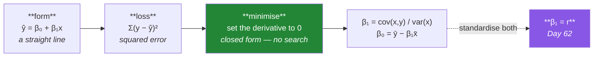

# Day 92 — Simple linear regression, from scratch

**Phase 12 · Module 12** · ID: **ML-03** (simple linear regression)

> **Yesterday:** framing, and the questions that come before a model.
> **Today:** the first model in this plan, and you derive it. Two parameters, a closed-form solution
> you can compute by hand, and a coefficient that turns out to be **Day 62's correlation wearing
> different units.** Every model after this is a variation on today.
> **Tomorrow:** many predictors, and what breaks.

```bash
./m start 92 && ./m scaffold 92
```

**Time:** 110 minutes. **Request budget:** 0 model calls.

---

## §1 The story

A model is three things: a **form**, a **loss**, and a way to **minimise** it. Linear regression is the
simplest possible choice of all three, which is why it is the right first one.



**Why squared error rather than absolute error?** Day 60 answered part of it — squaring is
differentiable everywhere, so you can set a derivative to zero and solve. Absolute error is not
differentiable at zero, which is why it has no closed form and needs iteration. That is a real
consequence of a choice that looks arbitrary.

**The closed form is unusual and worth appreciating.** Almost every other model in this plan requires
search (Day 95's gradient descent). Linear regression does not: two lines of calculus give you the
exact optimum, once, with no learning rate and no convergence to worry about.

**And the coefficient is the correlation.** Standardise both variables and `β₁` equals Pearson's `r`
exactly. Day 62's number and today's model are the same object seen from two angles — which means
every warning from that day (Anscombe, leverage, "correlation is not causation") applies to a fitted
regression line without modification.

Two things this day sets up that matter for the next fourteen:

**A prediction is not a fact.** `ŷ = 47.3` is a point estimate with uncertainty around it, and Day 94
turns that into an interval. Reporting a prediction without one is the same error as reporting a mean
without a spread (Day 60).

**Residuals are where the truth is.** The fitted line tells you what the model believes. The residuals
tell you where it is wrong, and *patterns* in them tell you what it is missing. Day 93 makes this the
central diagnostic.

---

## §2 Setup — run this

```bash
mkdir -p days/day-92/lab
touch days/day-92/lab/regression.py
touch src/setu/models.py
touch tests/test_models.py
```

`src/setu/models.py` is new and will grow through the whole of Phase 12.

---

## §3 ML-03 — deriving it

`days/day-92/lab/regression.py`:

```python
"""ML-03: linear regression derived, then checked against sklearn."""

from __future__ import annotations

import numpy as np
import pandas as pd
from sklearn.linear_model import LinearRegression

from setu.arrays import make_rng


def data(n: int = 200) -> tuple[np.ndarray, np.ndarray]:
    rng = make_rng(0)
    pages = rng.normal(9, 3, n).clip(2, None)
    citations = 40 + pages * 12 + rng.normal(0, 25, n)
    return pages, citations


def the_three_ingredients() -> None:
    print("\n  every model is three choices:")
    print("    FORM     — what shape can the answer take?      ŷ = β₀ + β₁x")
    print("    LOSS     — what counts as wrong?                Σ(y − ŷ)²")
    print("    MINIMISE — how do you find the best parameters? closed form, here")
    print("\n  Change the form and you get a different model family (Days 103–105).")
    print("  Change the loss and you get a different answer from the SAME form.")
    print("  Change the minimiser and you get the same answer, slower or faster.")


def why_squared_error() -> None:
    x, y = data()
    print(f"\n  candidate slopes, scored two ways (intercept fixed at the optimum):")
    print(f"  {'slope':>7} {'Σ|error|':>12} {'Σ error²':>14}")
    for slope in (10.0, 11.0, 12.0, 13.0, 14.0):
        intercept = y.mean() - slope * x.mean()
        residual = y - (intercept + slope * x)
        print(f"  {slope:>7.1f} {np.abs(residual).sum():>12.1f} {(residual ** 2).sum():>14.1f}")

    print("\n  Both are minimised near the truth. The difference is DIFFERENTIABILITY:")
    print("    d/dβ of Σ(y − β₀ − β₁x)²  exists everywhere -> set it to 0 and SOLVE")
    print("    d/dβ of Σ|y − β₀ − β₁x|   has a corner at 0 -> no closed form")
    print("\n  Day 60 made the same point about variance. The cost is the same too:")
    print("  squared error is far more sensitive to outliers (§3.6).")


def derive_it(x: np.ndarray, y: np.ndarray) -> tuple[float, float]:
    x_bar, y_bar = x.mean(), y.mean()
    covariance = ((x - x_bar) * (y - y_bar)).sum()
    variance = ((x - x_bar) ** 2).sum()

    slope = covariance / variance
    intercept = y_bar - slope * x_bar

    print(f"\n  Σ(x − x̄)(y − ȳ) = {covariance:>12.2f}   <- the covariance numerator (Day 62)")
    print(f"  Σ(x − x̄)²       = {variance:>12.2f}   <- the variance numerator (Day 60)")
    print(f"\n  β₁ = cov / var = {slope:.6f}")
    print(f"  β₀ = ȳ − β₁x̄   = {intercept:.6f}")

    library = LinearRegression().fit(x.reshape(-1, 1), y)
    print(f"\n  sklearn: β₁ = {library.coef_[0]:.6f}, β₀ = {library.intercept_:.6f}")
    print("  Identical. There is nothing inside LinearRegression but these two lines.")
    return intercept, slope


def the_line_passes_through_the_means(x, y, intercept, slope) -> None:
    predicted_at_mean = intercept + slope * x.mean()
    print(f"\n  ŷ at x̄ = {predicted_at_mean:.4f}")
    print(f"  ȳ      = {y.mean():.4f}")
    print("\n  The fitted line ALWAYS passes through (x̄, ȳ). That falls out of")
    print("  β₀ = ȳ − β₁x̄ and it is a useful sanity check on any implementation.")


def the_slope_is_the_correlation(x, y, slope) -> None:
    r = np.corrcoef(x, y)[0, 1]
    z_x = (x - x.mean()) / x.std(ddof=1)
    z_y = (y - y.mean()) / y.std(ddof=1)
    standardised_slope = ((z_x - z_x.mean()) * (z_y - z_y.mean())).sum() / ((z_x - z_x.mean()) ** 2).sum()

    print(f"\n  raw slope           = {slope:.6f}   (citations per page)")
    print(f"  correlation r       = {r:.6f}")
    print(f"  slope on z-scores   = {standardised_slope:.6f}   <- EQUALS r")
    print(f"\n  β₁ = r × (s_y / s_x) = {r * y.std(ddof=1) / x.std(ddof=1):.6f}")

    print("\n  The coefficient and the correlation are the same object in different")
    print("  units. So EVERY Day 62 warning applies here unchanged: Anscombe's quartet")
    print("  produces four identical regression lines, and one leverage point can")
    print("  determine the slope entirely.")


def residuals_are_the_interesting_part(x, y, intercept, slope) -> None:
    residual = y - (intercept + slope * x)

    print(f"\n  Σ residuals      = {residual.sum():.10f}   <- ALWAYS zero, by construction")
    print(f"  Σ x·residual     = {(x * residual).sum():.8f}   <- also zero")
    print(f"  mean residual    = {residual.mean():.10f}")
    print(f"  residual sd      = {residual.std(ddof=2):.4f}   <- ddof=2: TWO parameters fitted")

    print("\n  Both sums are zero because that is what setting the derivatives to zero")
    print("  MEANS. They are not evidence the model is good — they hold for any fit,")
    print("  including a terrible one. Day 93's diagnostics look for PATTERNS instead.")

    print(f"\n  ddof=2 because you spent two degrees of freedom (Day 60) estimating")
    print(f"  β₀ and β₁. With n={len(x)} the correction is small; at n=10 it is not.")


def a_prediction_is_not_a_fact(x, y, intercept, slope) -> None:
    residual = y - (intercept + slope * x)
    sigma = residual.std(ddof=2)
    n = len(x)

    for pages in (5.0, 9.0, 20.0):
        predicted = intercept + slope * pages
        leverage = 1 / n + (pages - x.mean()) ** 2 / ((x - x.mean()) ** 2).sum()
        interval = 1.96 * sigma * np.sqrt(1 + leverage)
        print(f"\n  x = {pages:>5.1f} pages -> ŷ = {predicted:>8.2f}")
        print(f"     95% prediction interval ≈ [{predicted - interval:>8.2f}, "
              f"{predicted + interval:>8.2f}]  (±{interval:.1f})")

    print(f"\n  x̄ = {x.mean():.1f}, and the interval is NARROWEST there and widens as you")
    print("  move away. At x=20, far outside most of the data, it is wide — and the")
    print("  model has no idea whether the relationship is even still linear out there.")
    print("\n  ⚠️ Reporting ŷ without an interval is Day 60's error: a centre with no spread.")


def extrapolation_is_a_promise_you_cannot_keep(x, y, intercept, slope) -> None:
    print(f"\n  the data covers x from {x.min():.1f} to {x.max():.1f}")
    for pages in (1.0, 50.0, 200.0):
        print(f"    ŷ({pages:>5.0f} pages) = {intercept + slope * pages:>10.1f} citations")

    print(f"\n  ŷ(1 page) = {intercept + slope * 1.0:.1f} — the model is happy to answer.")
    print("  It has never seen a 1-page paper and cannot know the line continues there.")
    print("\n  ⚠️ A linear model extrapolates silently and confidently. Nothing in the")
    print("     output distinguishes a prediction inside the data from one far outside.")
    print("     Day 94's helper records the training range for exactly this reason.")


def outliers_move_the_line(x, y) -> None:
    intercept, slope = _fit(x, y)

    x_dirty = np.append(x, 40.0)
    y_dirty = np.append(y, 50.0)                 # far right, far low
    dirty_intercept, dirty_slope = _fit(x_dirty, y_dirty)

    print(f"\n  {'':<16} {'β₀':>10} {'β₁':>10}")
    print(f"  {'clean':<16} {intercept:>10.3f} {slope:>10.3f}")
    print(f"  {'+1 point':<16} {dirty_intercept:>10.3f} {dirty_slope:>10.3f}")
    print(f"  change: {abs(dirty_slope - slope) / abs(slope) * 100:.1f}% in the slope")

    leverage = (40.0 - x.mean()) ** 2 / ((x - x.mean()) ** 2).sum()
    print(f"\n  that point's leverage ≈ {leverage:.4f}, vs a typical {1 / len(x):.4f}")
    print("\n  ONE observation out of 201 moved the slope substantially — because it is")
    print("  far from x̄ AND far from the line. High leverage plus a large residual is")
    print("  the dangerous combination. Day 62's leverage_check finds it.")


def _fit(x, y):
    slope = ((x - x.mean()) * (y - y.mean())).sum() / ((x - x.mean()) ** 2).sum()
    return y.mean() - slope * x.mean(), slope


def what_the_coefficient_means(intercept, slope) -> None:
    print(f"\n  β₁ = {slope:.3f}: 'each additional page is ASSOCIATED WITH {slope:.1f} more")
    print("  citations, on average, among papers like these.'")
    print("\n  what it does NOT say:")
    print("    ✗ adding a page CAUSES more citations (Day 62's confounder)")
    print("    ✗ any individual paper will gain that many")
    print("    ✗ the relationship holds outside the observed range (§3.7)")
    print(f"\n  β₀ = {intercept:.1f}: the prediction at x = 0 — a zero-page paper.")
    print("  Often meaningless. Centre x (subtract x̄) and the intercept becomes the")
    print("  prediction at the AVERAGE, which usually is meaningful.")


if __name__ == "__main__":
    x, y = data()
    the_three_ingredients()
    why_squared_error()
    intercept, slope = derive_it(x, y)
    the_line_passes_through_the_means(x, y, intercept, slope)
    the_slope_is_the_correlation(x, y, slope)
    residuals_are_the_interesting_part(x, y, intercept, slope)
    a_prediction_is_not_a_fact(x, y, intercept, slope)
    extrapolation_is_a_promise_you_cannot_keep(x, y, intercept, slope)
    outliers_move_the_line(x, y)
    what_the_coefficient_means(intercept, slope)
```

**Line by line:**

- `the_three_ingredients` — **form, loss, minimiser.** Worth internalising now, because every model in
  Phase 12 is a different combination of the three, and knowing which one changed makes each new model
  a small step rather than a new topic.
- `why_squared_error` — both losses are minimised near the truth; the difference is
  **differentiability**. Squared error lets you set a derivative to zero and solve; absolute error has
  a corner and needs iteration. Same trade as Day 60, including the same cost: sensitivity to outliers.
- `derive_it` — `β₁ = cov/var`, `β₀ = ȳ − β₁x̄`, and **sklearn agrees to six decimals.** There is
  nothing inside `LinearRegression` but these two lines, which is worth seeing once.
- `the_line_passes_through_the_means` — **always true**, and it falls straight out of the intercept
  formula. A useful sanity check on any implementation.
- `the_slope_is_the_correlation` — **standardise both variables and `β₁` equals `r` exactly.** So
  every Day 62 warning transfers unchanged: Anscombe's quartet produces four identical regression
  lines, and one leverage point can determine the slope.
- `residuals_are_the_interesting_part` — the residuals sum to zero **by construction**, and so does
  `Σ x·residual`. Those are what "set the derivatives to zero" *means*, so they hold for a terrible fit
  too. **They are not evidence of anything.** Note `ddof=2`: two parameters were fitted (Day 60).
- `a_prediction_is_not_a_fact` — the interval is **narrowest at `x̄`** and widens as you move away.
  Reporting `ŷ` without one is Day 60's error, restated: a centre with no spread.
- `extrapolation_is_a_promise_you_cannot_keep` — **the model answers happily for a 1-page paper it has
  never seen.** Nothing in the output distinguishes interpolation from extrapolation, which is why
  §4's helper records the training range.
- `outliers_move_the_line` — one point in 201 moves the slope substantially. **High leverage plus a
  large residual is the dangerous combination**, and Day 62's `leverage_check` finds exactly it.
- `what_the_coefficient_means` — "associated with, on average, among papers like these". And the
  intercept note is practically useful: **centre `x` and `β₀` becomes the prediction at the average**,
  which usually means something, unlike the prediction at zero.

---

## §4 Build brief — `src/setu/models.py`

Layer 3. The module that grows through all of Phase 12.

```python
"""Models for Setu. Layer 3: imports arrays, stats, features.

Every fit records what it was fitted on, because a model that cannot say where
it is extrapolating is a model you cannot trust (Day 92 §3.7).
"""

from __future__ import annotations

from dataclasses import dataclass, field

import numpy as np

from setu.errors import DataError


@dataclass(frozen=True)
class LinearFit:
    """A fitted simple linear regression, and what it was fitted on."""
    intercept: float
    slope: float
    n: int
    x_min: float
    x_max: float
    x_mean: float
    residual_sd: float
    r_squared: float


def fit_simple_linear(x, y) -> LinearFit:
    """TODO(me): the closed form from §3.3. No sklearn, no iteration.

    - beta1 = sum((x - xbar) * (y - ybar)) / sum((x - xbar) ** 2)
    - beta0 = ybar - beta1 * xbar
    - residual_sd uses ddof=2 (two parameters fitted, Day 60)
    - raise DataError if x has zero variance, saying a vertical line has no slope
    - raise DataError on fewer than 3 points (ddof=2 needs one left over)
    - raise DataError on a length mismatch, naming both
    - drop pairs where either value is missing, and raise if fewer than 3 remain
    - the fit MUST record x_min/x_max — that is what makes §3.7 detectable
    """
    raise NotImplementedError


def predict(fit: LinearFit, x, *, warn_outside_range: bool = True) -> dict:
    """TODO(me): predict, and say when you are extrapolating.

    {"predictions": ndarray, "n_extrapolated": int, "warnings": [...]}
    - a prediction outside [x_min, x_max] is EXTRAPOLATION; count it
    - the warning must name how many and how far beyond the range they are
    - warn_outside_range=False suppresses the warning but must still COUNT them —
      a caller may accept extrapolation, but the count is never hidden
    - raise DataError on a non-numeric input
    """
    raise NotImplementedError


def prediction_interval(fit: LinearFit, x, *, confidence: float = 0.95,
                        x_train_ss: float | None = None) -> dict:
    """TODO(me): a prediction is not a fact (§3.6).

    {"predictions", "low", "high", "interval_width", "widest_at", "confidence"}
    - width = t * residual_sd * sqrt(1 + 1/n + (x - xbar)^2 / Sxx)
    - use the t distribution with n - 2 degrees of freedom, NOT the normal (Day 68)
    - x_train_ss is Sxx; recompute or accept it, but the interval MUST widen away
      from x_mean — a constant-width interval is wrong and this is where it shows
    - raise DataError if confidence is outside (0, 1)
    """
    raise NotImplementedError


def residual_summary(fit: LinearFit, x, y) -> dict:
    """TODO(me): the diagnostics, with the identities separated from the evidence.

    {"residuals", "sum", "sum_x_residual", "mean", "sd", "identities_hold": bool,
     "largest_index", "largest_value", "note"}
    - `identities_hold` checks Sum(residual) and Sum(x*residual) are ~0
    - `note` must say these identities hold for ANY least-squares fit including a
      bad one, so they are a correctness check on the CODE, not on the MODEL (§3.5)
    - raise DataError if the identities fail — that means the fit is wrong
    """
    raise NotImplementedError


def leverage(fit: LinearFit, x, *, x_train_ss: float | None = None) -> dict:
    """TODO(me): which observations can move the line? (§3.8)

    {"leverage": ndarray, "average": float, "high_indices": [...], "rule_of_thumb"}
    - h_i = 1/n + (x_i - xbar)^2 / Sxx
    - average leverage is exactly 2/n for a two-parameter fit; assert it as a check
    - high when h_i > 2 * (2/n), the usual rule of thumb — say it IS a rule of thumb
    - high leverage alone is not a problem: it must be combined with a large residual
      (§3.8), and the docstring must say so
    """
    raise NotImplementedError


def describe_coefficient(fit: LinearFit, *, x_name: str, y_name: str) -> str:
    """TODO(me): one honest sentence. PURE.

    - must contain 'associated with' and must NOT contain 'causes', 'leads to',
      'because of', or 'effect of' (Day 62)
    - must state the range over which it applies
    - raise DataError on an empty name
    """
    raise NotImplementedError
```

- `LinearFit` recording **`x_min` and `x_max`** is the day's design decision. A model that cannot say
  where it is extrapolating will extrapolate silently, and §3.7 showed how confidently.
- `predict` **counting extrapolations even when the warning is suppressed** is the distinction that
  matters: a caller may accept extrapolation, but the count is never hidden from them.
- `residual_summary` separating **identities** from **evidence** is §3.5 encoded — the zero sums check
  your arithmetic, not your model.

---

## §5 The eval that must be able to fail

`tests/test_models.py`:

```python
import numpy as np
import pytest

from setu.arrays import make_rng
from setu.errors import DataError
from setu.models import (
    describe_coefficient,
    fit_simple_linear,
    leverage,
    predict,
    prediction_interval,
    residual_summary,
)


@pytest.fixture
def clean():
    rng = make_rng(0)
    x = rng.normal(9, 3, 200).clip(2, None)
    y = 40 + x * 12 + rng.normal(0, 25, 200)
    return x, y


def test_the_closed_form_matches_sklearn(clean):
    from sklearn.linear_model import LinearRegression

    x, y = clean
    fit = fit_simple_linear(x, y)
    library = LinearRegression().fit(x.reshape(-1, 1), y)
    assert fit.slope == pytest.approx(library.coef_[0], rel=1e-10)
    assert fit.intercept == pytest.approx(library.intercept_, rel=1e-10)


def test_it_recovers_the_generating_parameters(clean):
    x, y = clean
    fit = fit_simple_linear(x, y)
    assert fit.slope == pytest.approx(12.0, abs=1.0)
    assert fit.intercept == pytest.approx(40.0, abs=10.0)


def test_the_line_passes_through_the_means(clean):
    """Falls out of beta0 = ybar - beta1 * xbar."""
    x, y = clean
    fit = fit_simple_linear(x, y)
    assert fit.intercept + fit.slope * x.mean() == pytest.approx(y.mean(), rel=1e-10)


def test_the_standardised_slope_is_the_correlation(clean):
    """Day 62 and today are the same object."""
    x, y = clean
    z_x = (x - x.mean()) / x.std(ddof=1)
    z_y = (y - y.mean()) / y.std(ddof=1)
    assert fit_simple_linear(z_x, z_y).slope == pytest.approx(
        np.corrcoef(x, y)[0, 1], rel=1e-10
    )


def test_a_vertical_line_is_refused():
    with pytest.raises(DataError) as info:
        fit_simple_linear(np.full(50, 5.0), np.arange(50.0))
    assert "variance" in str(info.value).lower() or "vertical" in str(info.value).lower()


def test_too_few_points_is_refused():
    with pytest.raises(DataError):
        fit_simple_linear([1.0, 2.0], [3.0, 4.0])


def test_a_length_mismatch_names_both():
    with pytest.raises(DataError) as info:
        fit_simple_linear([1.0, 2.0, 3.0], [1.0, 2.0])
    assert "3" in str(info.value) and "2" in str(info.value)


def test_missing_pairs_are_dropped(clean):
    x, y = clean
    dirty_x = x.copy()
    dirty_x[:20] = np.nan
    assert fit_simple_linear(dirty_x, y).n == len(x) - 20


def test_the_fit_records_its_training_range(clean):
    """A model that cannot say where it extrapolates will do so silently."""
    x, y = clean
    fit = fit_simple_linear(x, y)
    assert fit.x_min == pytest.approx(x.min())
    assert fit.x_max == pytest.approx(x.max())


def test_extrapolation_is_counted(clean):
    x, y = clean
    fit = fit_simple_linear(x, y)
    result = predict(fit, np.array([x.mean(), fit.x_max + 50]))
    assert result["n_extrapolated"] == 1
    assert result["warnings"]


def test_extrapolation_is_counted_even_when_the_warning_is_off(clean):
    """A caller may accept extrapolation; the count is never hidden."""
    x, y = clean
    fit = fit_simple_linear(x, y)
    result = predict(fit, np.array([fit.x_max + 50]), warn_outside_range=False)
    assert result["n_extrapolated"] == 1
    assert not result["warnings"]


def test_the_warning_says_how_far_beyond(clean):
    x, y = clean
    fit = fit_simple_linear(x, y)
    warning = " ".join(predict(fit, np.array([fit.x_max + 100]))["warnings"])
    assert any(character.isdigit() for character in warning)


def test_predictions_inside_the_range_do_not_warn(clean):
    x, y = clean
    fit = fit_simple_linear(x, y)
    assert predict(fit, np.array([x.mean()]))["warnings"] == []


def test_the_interval_is_narrowest_at_the_mean(clean):
    """A constant-width interval is wrong, and this is where it shows."""
    x, y = clean
    fit = fit_simple_linear(x, y)
    at_mean = prediction_interval(fit, np.array([fit.x_mean]))["interval_width"][0]
    far = prediction_interval(fit, np.array([fit.x_mean + 3 * x.std(ddof=1)]))["interval_width"][0]
    assert far > at_mean * 1.02


def test_the_interval_uses_t_not_z(clean):
    """At small n the difference is large (Day 68)."""
    rng = make_rng(1)
    x = rng.normal(9, 3, 6)
    y = 40 + x * 12 + rng.normal(0, 25, 6)
    fit = fit_simple_linear(x, y)
    width = prediction_interval(fit, np.array([fit.x_mean]))["interval_width"][0]
    normal_width = 2 * 1.96 * fit.residual_sd * np.sqrt(1 + 1 / fit.n)
    assert width > normal_width * 1.1, "a normal multiplier at n=6 is too narrow"


def test_higher_confidence_is_wider(clean):
    x, y = clean
    fit = fit_simple_linear(x, y)
    point = np.array([fit.x_mean])
    narrow = prediction_interval(fit, point, confidence=0.80)["interval_width"][0]
    wide = prediction_interval(fit, point, confidence=0.99)["interval_width"][0]
    assert wide > narrow


def test_the_interval_brackets_the_prediction(clean):
    x, y = clean
    fit = fit_simple_linear(x, y)
    result = prediction_interval(fit, np.array([10.0]))
    assert result["low"][0] < result["predictions"][0] < result["high"][0]


def test_a_bad_confidence_is_refused(clean):
    x, y = clean
    fit = fit_simple_linear(x, y)
    for confidence in (0.0, 1.0, 1.5):
        with pytest.raises(DataError):
            prediction_interval(fit, np.array([10.0]), confidence=confidence)


def test_the_residual_identities_hold(clean):
    x, y = clean
    result = residual_summary(fit_simple_linear(x, y), x, y)
    assert result["sum"] == pytest.approx(0.0, abs=1e-8)
    assert result["sum_x_residual"] == pytest.approx(0.0, abs=1e-6)
    assert result["identities_hold"] is True


def test_the_identities_hold_for_a_bad_fit_too():
    """They check the CODE, not the MODEL."""
    rng = make_rng(2)
    x = rng.normal(0, 1, 200)
    y = x**2 + rng.normal(0, 0.1, 200)          # a line is the wrong form here
    result = residual_summary(fit_simple_linear(x, y), x, y)
    assert result["identities_hold"] is True
    assert "any" in result["note"].lower() or "bad" in result["note"].lower()


def test_the_note_says_the_identities_are_not_evidence():
    rng = make_rng(3)
    x = rng.normal(0, 1, 100)
    y = 2 * x + rng.normal(0, 1, 100)
    note = residual_summary(fit_simple_linear(x, y), x, y)["note"].lower()
    assert "not" in note and ("evidence" in note or "good" in note or "quality" in note)


def test_average_leverage_is_two_over_n(clean):
    """Exactly 2/n for a two-parameter fit — a real identity."""
    x, y = clean
    result = leverage(fit_simple_linear(x, y), x)
    assert result["average"] == pytest.approx(2 / len(x), rel=1e-9)


def test_a_far_point_has_high_leverage(clean):
    x, y = clean
    dirty_x = np.append(x, 60.0)
    dirty_y = np.append(y, 700.0)
    result = leverage(fit_simple_linear(dirty_x, dirty_y), dirty_x)
    assert len(dirty_x) - 1 in result["high_indices"]


def test_leverage_does_not_flag_ordinary_points(clean):
    x, y = clean
    result = leverage(fit_simple_linear(x, y), x)
    assert len(result["high_indices"]) < len(x) * 0.1


def test_high_leverage_alone_is_not_called_a_problem(clean):
    """It must be combined with a large residual (§3.8)."""
    x, y = clean
    result = leverage(fit_simple_linear(x, y), x)
    assert "residual" in result["rule_of_thumb"].lower()


def test_one_point_can_move_the_slope(clean):
    x, y = clean
    clean_slope = fit_simple_linear(x, y).slope
    dirty_slope = fit_simple_linear(np.append(x, 40.0), np.append(y, 50.0)).slope
    assert abs(dirty_slope - clean_slope) / abs(clean_slope) > 0.05


def test_the_description_avoids_causal_language():
    """Day 62: the coefficient is a correlation in different units."""
    rng = make_rng(4)
    x = rng.normal(9, 3, 100)
    fit = fit_simple_linear(x, 40 + x * 12 + rng.normal(0, 25, 100))
    text = describe_coefficient(fit, x_name="pages", y_name="citations").lower()

    assert "associated with" in text
    for banned in ("causes", "leads to", "because of", "effect of"):
        assert banned not in text, f"'{banned}' implies causation"


def test_the_description_states_the_range():
    rng = make_rng(5)
    x = rng.normal(9, 3, 100)
    fit = fit_simple_linear(x, 40 + x * 12 + rng.normal(0, 25, 100))
    text = describe_coefficient(fit, x_name="pages", y_name="citations")
    assert any(character.isdigit() for character in text)


def test_describe_rejects_an_empty_name():
    rng = make_rng(6)
    x = rng.normal(9, 3, 50)
    fit = fit_simple_linear(x, x * 2)
    with pytest.raises(DataError):
        describe_coefficient(fit, x_name="", y_name="y")
```

**Line by line:**

- `test_the_identities_hold_for_a_bad_fit_too` — **the day's real assessment.** The data is a parabola,
  so a line is the wrong *form* entirely — and the residual identities still hold perfectly. **They
  check your arithmetic, not your model**, and mistaking them for evidence is a genuine beginner error
  that this test makes impossible to sustain.
- `test_the_standardised_slope_is_the_correlation` — Day 62 and today are the same object, verified to
  ten decimal places rather than asserted.
- `test_extrapolation_is_counted_even_when_the_warning_is_off` — the count is never hidden. A caller
  may knowingly accept extrapolation; they may not be denied the number.
- `test_the_interval_is_narrowest_at_the_mean` — **a constant-width interval is wrong**, and this is
  the only place it shows. An implementation that omits the `(x − x̄)²/Sxx` term passes every other
  interval test.
- `test_the_interval_uses_t_not_z` — at n = 6 a normal multiplier is visibly too narrow. Day 68's
  lesson, in a new place.
- `test_average_leverage_is_two_over_n` — a real identity for a two-parameter fit, exact to nine
  decimals. It is a free correctness check that most implementations never make.
- `test_high_leverage_alone_is_not_called_a_problem` — asserts the rule-of-thumb text mentions
  residuals. High leverage is not a defect; **high leverage plus a large residual** is.
- `test_the_description_avoids_causal_language` — the **sixth** time this project has tested English,
  and here it enforces Day 62's central warning at the point where someone writes a sentence about a
  coefficient.

```bash
uv run python -m pytest tests/test_models.py -v
```

---

## §6 Request budget

| Resource | Spent today |
|---|---|
| LLM calls | **0** |

---

## §7 Traps

- **Thinking the residual identities show a good fit.** They hold for any least-squares fit.
- **`ddof=1` for the residual sd.** Two parameters were fitted; use `ddof=2`.
- **Reporting `ŷ` with no interval.** Day 60's error in a new costume.
- **A constant-width prediction interval.** It must widen away from `x̄`.
- **A normal multiplier at small n.** Use `t` with `n − 2` (Day 68).
- **Extrapolating silently.** The model answers confidently outside its range.
- **Interpreting `β₀` when `x = 0` is impossible.** Centre `x` first.
- **Causal language about a coefficient.** It is a correlation in different units.
- **Ignoring a high-leverage point.** One observation can set the slope.
- **Treating high leverage as a defect.** It needs a large residual too.
- **Forgetting Anscombe.** Four identical regression lines, four different datasets.

---

## §8 Verify before you code

Written **2026-08-21**:

- <https://scikit-learn.org/stable/modules/generated/sklearn.linear_model.LinearRegression.html> —
  and note it has no p-values or intervals; statsmodels does.
- <https://www.statsmodels.org/stable/generated/statsmodels.regression.linear_model.OLS.html> — the
  full inferential summary, used properly on Day 93.
- <https://docs.scipy.org/doc/scipy/reference/generated/scipy.stats.t.html> — the multiplier for §4's
  interval.
- <https://numpy.org/doc/stable/reference/generated/numpy.polyfit.html> — the one-liner, worth knowing
  and worth not using until you have derived it.

---

## §9 Say it in an interview

> "Every model is three choices — a form, a loss, and a way to minimise it — and linear regression is
> the simplest of each, which is why it has a closed form. Two lines of calculus give you the exact
> optimum with no search, and the reason is that squared error is differentiable everywhere while
> absolute error has a corner at zero. The connection I'd point at is that the standardised
> coefficient *is* Pearson's r — the same object in different units — so every warning about
> correlation transfers unchanged: Anscombe's quartet gives four identical regression lines. The thing
> I'd warn a beginner about is the residual identities. The residuals always sum to zero and are
> always uncorrelated with x, and people read that as evidence the model fits. It isn't — those are
> what 'set the derivative to zero' means, so they hold for a straight line fitted to a parabola. I
> have a test that does exactly that: wrong form, perfect identities. They check your arithmetic, not
> your model."

---

## §10 Done when

Tick [`CHECKLIST.md`](CHECKLIST.md), then `./m check && ./m done 92`.
