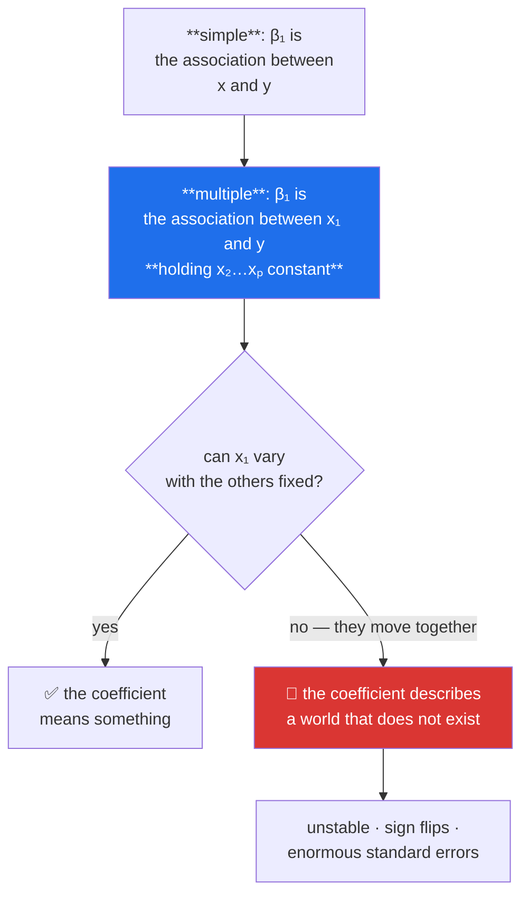

# Day 93 — Multiple regression: assumptions and multicollinearity

**Phase 12 · Module 12** · ID: **ML-04** (multiple linear regression, assumptions, multicollinearity)

> **Yesterday:** two parameters and a closed form.
> **Today:** many predictors — and the sentence that changes everything. A coefficient in multiple
> regression means **"holding the others constant"**, which is a claim about a world that may not
> exist. Day 62's collinearity warning and Day 88's nested sulphur dioxide both come due today.
> **Tomorrow:** how to score any of this.

```bash
./m start 93 && ./m scaffold 93
```

**Time:** 110 minutes. **Request budget:** 0 model calls.

---

## §1 The story

The form generalises without effort: `ŷ = β₀ + β₁x₁ + … + βₚxₚ`, and the closed form generalises too —
`β = (XᵀX)⁻¹Xᵀy`, which is Day 24's linear algebra doing exactly what it was for.

What does **not** generalise is the interpretation.



**"Holding the others constant" is the whole difference.** If `pages` and `references` move together in
every real paper, then "the effect of one more page with references held fixed" is a description of
something that never happens. The arithmetic still produces a number; the number describes a
counterfactual world.

When predictors are highly correlated — **multicollinearity** — three things happen, and the third is
the one that surprises people:

1. Coefficients become **unstable**: tiny data changes swing them wildly.
2. Standard errors **inflate**, so nothing looks significant.
3. **Predictions stay fine.** Collinearity damages *interpretation*, not *accuracy*. If you only need
   forecasts, it may not matter at all.

Then the assumptions. Textbooks list four or five; **they are not equally important**, and Day 71
established the habit of measuring severity rather than reciting a list:

| Assumption | If violated | How bad |
|---|---|---|
| **Linearity** | the form is wrong | **severe** — everything downstream is wrong |
| **Independence** | standard errors are wrong | **severe**, and uncheckable from data (Day 71) |
| **Homoscedasticity** | intervals are wrong | moderate — coefficients stay unbiased |
| **Normal residuals** | small-sample inference is off | **mild** — the CLT covers you (Day 67) |
| **No multicollinearity** | interpretation is unstable | depends entirely on your goal |

Notice the last row of Day 71's lesson repeating: **the assumption people check obsessively (normal
residuals) matters least.**

---

## §2 Setup — run this

```bash
mkdir -p days/day-93/lab
touch days/day-93/lab/multiple.py
```

`src/setu/models.py` grows today. No new packages — `statsmodels` came in on Day 89.

---

## §3 ML-04 — many predictors

`days/day-93/lab/multiple.py`:

```python
"""ML-04: the normal equations, the interpretation, and what collinearity breaks."""

from __future__ import annotations

import numpy as np
import pandas as pd
import statsmodels.api as sm
from sklearn.linear_model import LinearRegression

from setu.arrays import make_rng


def papers(n: int = 400) -> pd.DataFrame:
    rng = make_rng(0)
    size = rng.normal(0, 1, n)
    pages = 9 + size * 3 + rng.normal(0, 0.5, n)
    references = 30 + size * 9 + rng.normal(0, 2, n)          # correlated with pages
    figures = 5 + rng.normal(0, 2, n)                          # independent
    citations = 40 + pages * 8 + figures * 6 + rng.normal(0, 25, n)
    return pd.DataFrame({"pages": pages, "references": references,
                         "figures": figures, "citations": citations})


def the_normal_equations(frame: pd.DataFrame) -> None:
    features = frame[["pages", "figures"]].to_numpy()
    target = frame["citations"].to_numpy()
    design = np.column_stack([np.ones(len(features)), features])

    beta = np.linalg.solve(design.T @ design, design.T @ target)

    print(f"\n  β = (XᵀX)⁻¹Xᵀy, solved directly:")
    for name, value in zip(["intercept", "pages", "figures"], beta, strict=True):
        print(f"    {name:<12} {value:>10.4f}")

    library = LinearRegression().fit(features, target)
    print(f"\n  sklearn: intercept={library.intercept_:.4f}, coefs={library.coef_.round(4)}")

    print("\n  Note `np.linalg.solve`, NOT `np.linalg.inv(...) @ ...` — Day 24's rule.")
    print("  Solving is faster and far more numerically stable than inverting.")
    print("  The two-parameter case from Day 92 is this with p=1.")


def holding_the_others_constant(frame: pd.DataFrame) -> None:
    simple = LinearRegression().fit(frame[["pages"]], frame["citations"])
    multiple = LinearRegression().fit(frame[["pages", "references"]], frame["citations"])

    print(f"\n  β(pages) alone           = {simple.coef_[0]:>8.4f}")
    print(f"  β(pages) with references = {multiple.coef_[0]:>8.4f}")
    print(f"  β(references)            = {multiple.coef_[1]:>8.4f}")

    print("\n  The pages coefficient CHANGED when references entered. That is not a bug:")
    print("  the two coefficients answer different questions.")
    print("\n    simple  : 'papers with more pages have more citations'")
    print("    multiple: 'among papers with the SAME number of references,")
    print("               those with more pages have more citations'")

    r = frame["pages"].corr(frame["references"])
    print(f"\n  but r(pages, references) = {r:.3f} — so how many real papers have the")
    print("  same references and different pages? The second sentence describes a")
    print("  comparison the data barely contains.")


def the_frisch_waugh_view(frame: pd.DataFrame) -> None:
    """A multiple coefficient IS a simple regression on residuals."""
    pages_on_refs = LinearRegression().fit(frame[["references"]], frame["pages"])
    pages_residual = frame["pages"] - pages_on_refs.predict(frame[["references"]])

    citations_on_refs = LinearRegression().fit(frame[["references"]], frame["citations"])
    citations_residual = frame["citations"] - citations_on_refs.predict(frame[["references"]])

    partial = LinearRegression().fit(
        pages_residual.to_numpy().reshape(-1, 1), citations_residual
    )
    multiple = LinearRegression().fit(frame[["pages", "references"]], frame["citations"])

    print(f"\n  regress pages on references, keep the residual")
    print(f"  regress citations on references, keep the residual")
    print(f"  regress residual on residual -> slope = {partial.coef_[0]:.6f}")
    print(f"  β(pages) from the full model  = {multiple.coef_[0]:.6f}")
    print("\n  IDENTICAL. A multiple coefficient is the relationship between the parts")
    print("  of x₁ and y that the OTHER predictors cannot explain.")
    print(f"\n  and the variation left in pages after removing references: "
          f"{pages_residual.std(ddof=1) / frame['pages'].std(ddof=1):.1%} of the original.")
    print("  ⚠️ That percentage IS the coefficient's information budget. When it is")
    print("     small, the coefficient is estimated from very little.")


def collinearity_breaks_stability() -> None:
    rng = make_rng(1)
    n = 300

    print(f"\n  {'r(x₁,x₂)':>9} {'β₁ range over 40 resamples':>30} {'mean SE':>10} {'VIF':>8}")
    for correlation in (0.0, 0.5, 0.9, 0.99):
        slopes, errors = [], []
        for _ in range(40):
            x1 = rng.normal(0, 1, n)
            x2 = correlation * x1 + np.sqrt(1 - correlation**2) * rng.normal(0, 1, n)
            y = 3 * x1 + 2 * x2 + rng.normal(0, 1, n)
            design = sm.add_constant(np.column_stack([x1, x2]))
            fitted = sm.OLS(y, design).fit()
            slopes.append(fitted.params[1])
            errors.append(fitted.bse[1])
        vif = 1 / (1 - correlation**2)
        print(f"  {correlation:>9.2f} {min(slopes):>13.3f} to {max(slopes):<13.3f} "
              f"{np.mean(errors):>10.4f} {vif:>8.2f}")

    print("\n  The TRUE β₁ is 3.0 in every row. At r=0.99 the estimate swings across a")
    print("  wide range and the standard error is many times larger.")
    print("  VIF = 1/(1−R²) where R² is from regressing that predictor on the others.")
    print("  Rules of thumb: VIF > 5 is worth noticing, > 10 is serious — both are HABITS.")


def collinearity_does_not_break_prediction() -> None:
    rng = make_rng(2)
    n = 600
    x1 = rng.normal(0, 1, n)
    x2 = 0.99 * x1 + np.sqrt(1 - 0.99**2) * rng.normal(0, 1, n)
    y = 3 * x1 + 2 * x2 + rng.normal(0, 1, n)

    cut = int(n * 0.7)
    both = LinearRegression().fit(np.column_stack([x1, x2])[:cut], y[:cut])
    one = LinearRegression().fit(x1[:cut].reshape(-1, 1), y[:cut])

    from sklearn.metrics import r2_score

    print(f"\n  test R² with both collinear predictors : "
          f"{r2_score(y[cut:], both.predict(np.column_stack([x1, x2])[cut:])):.4f}")
    print(f"  test R² with only x₁                   : "
          f"{r2_score(y[cut:], one.predict(x1[cut:].reshape(-1, 1))):.4f}")
    print(f"\n  coefficients with both: {both.coef_.round(3)}   (true: 3.0, 2.0)")

    print("\n  ⚠️ The coefficients are wrong and the PREDICTIONS are fine.")
    print("     Collinearity damages interpretation, not accuracy. If you only need")
    print("     forecasts, it may not matter — so the fix depends on your GOAL.")


def perfect_collinearity_is_different(frame: pd.DataFrame) -> None:
    data = frame.copy()
    data["pages_in_mm"] = data["pages"] * 25.4          # exactly redundant

    design = np.column_stack([np.ones(len(data)), data["pages"], data["pages_in_mm"]])
    print(f"\n  rank of X = {np.linalg.matrix_rank(design)} for {design.shape[1]} columns")
    print(f"  condition number = {np.linalg.cond(design):.3e}")

    try:
        np.linalg.solve(design.T @ design, design.T @ data["citations"])
    except np.linalg.LinAlgError as exc:
        print(f"  solve() raises: {exc}")

    library = LinearRegression().fit(data[["pages", "pages_in_mm"]], data["citations"])
    print(f"  sklearn returns: {library.coef_.round(6)}   <- it uses a PSEUDO-INVERSE")

    print("\n  ⚠️ sklearn does NOT raise. It silently returns one of infinitely many")
    print("     solutions, because XᵀX is singular (Day 24). The coefficients are")
    print("     arbitrary and the predictions are fine — the worst possible combination")
    print("     for anyone reading the coefficients.")
    print("  Day 88's free/total sulfur dioxide is this, one step less extreme.")


def the_assumptions_ranked(frame: pd.DataFrame) -> None:
    from scipy import stats as sp

    design = sm.add_constant(frame[["pages", "figures"]])
    fitted = sm.OLS(frame["citations"], design).fit()
    residual = fitted.resid

    print(f"\n  1. LINEARITY (severe if violated)")
    curved = np.corrcoef(fitted.fittedvalues, residual**2)[0, 1]
    print(f"     corr(fitted, residual²) = {curved:>7.4f}  "
          f"{'⚠️ pattern' if abs(curved) > 0.2 else 'no obvious pattern'}")

    print(f"\n  2. INDEPENDENCE (severe, and NOT checkable from the data)")
    print(f"     Durbin-Watson = {sm.stats.durbin_watson(residual):.4f}  (≈2 means no")
    print(f"     serial correlation — but that only checks ORDERING, not clustering)")
    print(f"     ⚠️ Day 71: correlated observations shrink your effective n and no")
    print(f"        statistic can detect clustering you have not told it about.")

    print(f"\n  3. HOMOSCEDASTICITY (moderate)")
    half = len(residual) // 2
    order = np.argsort(fitted.fittedvalues)
    ratio = residual.iloc[order[half:]].std() / residual.iloc[order[:half]].std()
    print(f"     sd(residual) high-fitted / low-fitted = {ratio:.3f}  "
          f"{'⚠️ heteroscedastic' if ratio > 1.5 or ratio < 0.67 else 'roughly constant'}")
    print(f"     Coefficients stay UNBIASED; the standard errors are wrong.")
    print(f"     Fix: robust (HC) standard errors, not a different model.")

    print(f"\n  4. NORMAL RESIDUALS (mild — the CLT covers you at reasonable n)")
    print(f"     skew = {sp.skew(residual):>7.4f}, excess kurtosis = {sp.kurtosis(residual):>7.4f}")
    print(f"     ⚠️ This is the one people check obsessively and it matters LEAST.")
    print(f"        Day 71 measured the same ordering for the t-test.")


def what_to_do_about_collinearity() -> None:
    print("\n  the fix depends on WHY you built the model:")
    print("\n  goal = PREDICTION:")
    print("    - often do nothing; §3.5 showed predictions are unaffected")
    print("    - or regularise (Day 98) — Ridge handles collinearity directly")
    print("\n  goal = INTERPRETATION:")
    print("    - DROP one of each pair, using domain knowledge (Day 88's SO₂)")
    print("    - or COMBINE them into one meaningful feature (a ratio, a total)")
    print("    - PCA is available and costs interpretability, which was the goal (Day 86)")
    print("\n  ⚠️ 'Just use PCA' is the wrong answer when interpretation is the reason")
    print("     you noticed the problem. You would be trading the thing you wanted.")


if __name__ == "__main__":
    frame = papers()
    the_normal_equations(frame)
    holding_the_others_constant(frame)
    the_frisch_waugh_view(frame)
    collinearity_breaks_stability()
    collinearity_does_not_break_prediction()
    perfect_collinearity_is_different(frame)
    the_assumptions_ranked(frame)
    what_to_do_about_collinearity()
```

**Line by line:**

- `the_normal_equations` — **`np.linalg.solve`, never `inv(...) @ ...`.** Day 24's rule: solving is
  faster and far more numerically stable than forming an explicit inverse. Day 92's two-parameter case
  is this with `p = 1`.
- `holding_the_others_constant` — **the pages coefficient changes when references enter**, and that is
  not a bug. The two coefficients answer different questions, and the printed pair of sentences is the
  distinction. Then the correlation makes it concrete: **how many real papers have the same references
  and different pages?**
- `the_frisch_waugh_view` — **the identity that makes the interpretation precise.** A multiple
  coefficient equals a simple regression of *residualised y* on *residualised x₁*. So it measures the
  relationship between the parts of `x₁` and `y` that the other predictors cannot explain — and the
  printed percentage is **the coefficient's information budget.** When little variation survives,
  little is left to estimate from.
- `collinearity_breaks_stability` — **run it and read the range column.** The true `β₁` is 3.0 in every
  row; at `r = 0.99` the estimate swings widely and the standard error is many times larger. `VIF =
  1/(1 − R²)`, and the thresholds are habits, not laws.
- `collinearity_does_not_break_prediction` — **the surprising one.** The coefficients are wrong and the
  test R² is fine. **Collinearity damages interpretation, not accuracy**, which means the fix depends
  entirely on your goal.
- `perfect_collinearity_is_different` — `np.linalg.solve` raises; **sklearn does not.** It uses a
  pseudo-inverse and silently returns one of infinitely many solutions. Arbitrary coefficients with
  fine predictions is the worst possible combination for anyone reading the coefficients. Day 88's
  free/total sulphur dioxide is this, one step less extreme.
- `the_assumptions_ranked` — **ordered by severity, not tradition.** Linearity and independence are
  severe; heteroscedasticity affects the intervals but leaves coefficients unbiased; normal residuals
  matter least because of the CLT. Note the Durbin–Watson caveat: it checks *ordering*, and cannot see
  clustering you have not declared.
- `what_to_do_about_collinearity` — and the closing warning is the practical one: **"just use PCA" is
  the wrong answer when interpretation is why you noticed the problem.** You would be trading away the
  thing you wanted.

---

## §4 Build brief

Extend `src/setu/models.py`:

```python
@dataclass(frozen=True)
class MultipleFit:
    """A fitted multiple regression, and what it was fitted on."""
    coefficients: dict[str, float]
    intercept: float
    n: int
    n_features: int
    residual_sd: float
    r_squared: float
    adjusted_r_squared: float
    feature_ranges: dict[str, tuple[float, float]]
    condition_number: float


def fit_multiple(frame, target: str, features: list[str]) -> MultipleFit:
    """TODO(me): the normal equations, solved not inverted.

    - build the design matrix with an intercept column
    - use np.linalg.solve or lstsq — NEVER np.linalg.inv (Day 24)
    - residual_sd uses ddof = n - p - 1 (one per parameter INCLUDING the intercept)
    - record feature_ranges for every predictor: extrapolation is per-feature now
    - record the design matrix's condition number
    - raise DataError if n <= n_features + 1 (no degrees of freedom left), naming both
    - raise DataError on PERFECT collinearity — sklearn silently returns an arbitrary
      answer (§3.6) and that is worse than failing; detect via matrix rank
    - drop rows with any missing value and report how many
    """
    raise NotImplementedError


def vif(frame, features: list[str]) -> dict:
    """TODO(me): variance inflation factor per predictor.

    {"vif": {feature: float}, "worst": (feature, value), "concerning": [...],
     "rule_of_thumb": str}
    - VIF_j = 1 / (1 - R²_j), where R²_j regresses feature j on all the others
    - concerning at > 5; serious at > 10 — the rule_of_thumb string must say these
      are CONVENTIONS
    - a VIF of exactly inf means perfect collinearity; report it rather than crashing
    - raise DataError with fewer than 2 features (VIF is undefined for one)
    """
    raise NotImplementedError


def partial_coefficient(frame, target: str, feature: str, controls: list[str]) -> dict:
    """TODO(me): §3.3's Frisch-Waugh identity, as a function.

    {"coefficient", "matches_full_model": bool, "residual_variation_pct",
     "interpretation"}
    - residualise BOTH the feature and the target on the controls, then regress
    - assert it equals the full model's coefficient (that identity is the point)
    - residual_variation_pct is sd(residualised feature) / sd(feature) — the
      coefficient's INFORMATION BUDGET (§3.3)
    - the interpretation must contain 'holding ... constant' AND warn when
      residual_variation_pct is below 20%
    """
    raise NotImplementedError


def assumption_check(frame, target: str, features: list[str]) -> dict:
    """TODO(me): the four assumptions, ORDERED BY SEVERITY (§3.7).

    {"checks": [{"name", "severity", "statistic", "violated", "consequence", "fix"}],
     "blocking": [...], "verdict", "note"}
    - order: linearity (severe), independence (severe), homoscedasticity (moderate),
      normality (mild) — this ordering is the lesson, not the checks
    - independence must be reported as NOT FULLY CHECKABLE, citing Day 71
    - each check's `consequence` says what goes wrong, and `fix` says what to do —
      heteroscedasticity's fix is robust standard errors, NOT a different model
    - `note` must say normality matters least, because that is the counter-intuitive part
    """
    raise NotImplementedError


def collinearity_advice(vif_result: dict, *, goal: str) -> dict:
    """TODO(me): the fix depends on the goal (§3.8). PURE.

    {"goal", "action", "reason", "alternatives": [...]}
    - goal in {'prediction', 'interpretation'}; else DataError
    - goal='prediction' with high VIF -> 'no action needed, or regularise (Day 98)',
      because §3.5 showed predictions are unaffected
    - goal='interpretation' -> drop or combine, using DOMAIN knowledge
    - PCA must NOT be the recommended action for goal='interpretation'; it may appear
      in alternatives with the cost stated (Day 86)
    - no concerning VIF -> 'no action', whatever the goal
    """
    raise NotImplementedError
```

- `fit_multiple` **raising on perfect collinearity** is the day's design decision. sklearn's silent
  pseudo-inverse gives arbitrary coefficients with good predictions, which is precisely the failure
  mode a reader cannot detect.
- `partial_coefficient` returning **`residual_variation_pct`** turns §3.3's insight into a number: it
  is how much information the coefficient was actually estimated from.
- `collinearity_advice` **refusing to recommend PCA for interpretation** encodes §3.8 — that
  recommendation trades away the goal that raised the question.

---

## §5 The eval that must be able to fail

Add to `tests/test_models.py`:

```python
import pandas as pd

from setu.models import (
    assumption_check,
    collinearity_advice,
    fit_multiple,
    partial_coefficient,
    vif,
)


@pytest.fixture
def papers():
    rng = make_rng(0)
    n = 400
    size = rng.normal(0, 1, n)
    pages = 9 + size * 3 + rng.normal(0, 0.5, n)
    references = 30 + size * 9 + rng.normal(0, 2, n)
    figures = 5 + rng.normal(0, 2, n)
    return pd.DataFrame({
        "pages": pages, "references": references, "figures": figures,
        "citations": 40 + pages * 8 + figures * 6 + rng.normal(0, 25, n),
    })


def test_the_normal_equations_match_sklearn(papers):
    from sklearn.linear_model import LinearRegression

    fit = fit_multiple(papers, "citations", ["pages", "figures"])
    library = LinearRegression().fit(papers[["pages", "figures"]], papers["citations"])
    assert fit.coefficients["pages"] == pytest.approx(library.coef_[0], rel=1e-8)
    assert fit.intercept == pytest.approx(library.intercept_, rel=1e-8)


def test_it_recovers_the_generating_coefficients(papers):
    fit = fit_multiple(papers, "citations", ["pages", "figures"])
    assert fit.coefficients["pages"] == pytest.approx(8.0, abs=1.5)
    assert fit.coefficients["figures"] == pytest.approx(6.0, abs=2.0)


def test_the_implementation_does_not_invert(papers):
    """Day 24: solve, never inv."""
    import inspect

    source = inspect.getsource(fit_multiple)
    assert "np.linalg.inv" not in source, "use solve or lstsq, not an explicit inverse"


def test_residual_sd_accounts_for_every_parameter(papers):
    fit = fit_multiple(papers, "citations", ["pages", "figures"])
    residual = papers["citations"] - (
        fit.intercept + papers["pages"] * fit.coefficients["pages"]
        + papers["figures"] * fit.coefficients["figures"]
    )
    assert fit.residual_sd == pytest.approx(residual.std(ddof=3), rel=1e-6)


def test_adjusted_r_squared_is_below_r_squared(papers):
    fit = fit_multiple(papers, "citations", ["pages", "references", "figures"])
    assert fit.adjusted_r_squared < fit.r_squared


def test_ranges_are_recorded_per_feature(papers):
    """Extrapolation is per-feature now."""
    fit = fit_multiple(papers, "citations", ["pages", "figures"])
    assert set(fit.feature_ranges) == {"pages", "figures"}
    assert fit.feature_ranges["pages"][0] == pytest.approx(papers["pages"].min())


def test_perfect_collinearity_is_refused(papers):
    """sklearn silently returns an arbitrary answer; that is worse than failing."""
    data = papers.assign(pages_mm=papers["pages"] * 25.4)
    with pytest.raises(DataError) as info:
        fit_multiple(data, "citations", ["pages", "pages_mm"])
    message = str(info.value).lower()
    assert "collinear" in message or "rank" in message or "singular" in message


def test_sklearn_would_have_accepted_it(papers):
    """The contrast that justifies the refusal."""
    from sklearn.linear_model import LinearRegression

    data = papers.assign(pages_mm=papers["pages"] * 25.4)
    library = LinearRegression().fit(data[["pages", "pages_mm"]], data["citations"])
    assert library.coef_ is not None, "sklearn does not raise — that is the problem"


def test_too_few_rows_is_refused(papers):
    with pytest.raises(DataError) as info:
        fit_multiple(papers.head(3), "citations", ["pages", "references", "figures"])
    assert "3" in str(info.value)


def test_missing_rows_are_dropped(papers):
    dirty = papers.copy()
    dirty.loc[:29, "pages"] = np.nan
    assert fit_multiple(dirty, "citations", ["pages", "figures"]).n == len(papers) - 30


def test_vif_is_near_one_for_independent_predictors():
    rng = make_rng(1)
    frame = pd.DataFrame(rng.normal(0, 1, (500, 3)), columns=["a", "b", "c"])
    result = vif(frame, ["a", "b", "c"])
    assert all(value < 1.2 for value in result["vif"].values())
    assert result["concerning"] == []


def test_vif_rises_with_correlation():
    rng = make_rng(2)
    n = 500
    x1 = rng.normal(0, 1, n)
    frame = pd.DataFrame({
        "x1": x1,
        "x2": 0.95 * x1 + np.sqrt(1 - 0.95**2) * rng.normal(0, 1, n),
    })
    result = vif(frame, ["x1", "x2"])
    assert result["vif"]["x1"] > 5
    assert "x1" in result["concerning"] or "x2" in result["concerning"]


def test_vif_matches_the_analytic_value():
    """VIF = 1/(1 - r²) for two predictors."""
    rng = make_rng(3)
    n = 4_000
    x1 = rng.normal(0, 1, n)
    x2 = 0.8 * x1 + np.sqrt(1 - 0.8**2) * rng.normal(0, 1, n)
    frame = pd.DataFrame({"x1": x1, "x2": x2})
    r = frame["x1"].corr(frame["x2"])
    assert vif(frame, ["x1", "x2"])["vif"]["x1"] == pytest.approx(1 / (1 - r**2), rel=0.05)


def test_perfect_collinearity_reports_infinity_rather_than_crashing(papers):
    data = papers.assign(pages_mm=papers["pages"] * 25.4)
    result = vif(data, ["pages", "pages_mm"])
    assert np.isinf(result["vif"]["pages"]) or result["vif"]["pages"] > 1e6


def test_the_thresholds_are_labelled_as_conventions():
    rng = make_rng(4)
    frame = pd.DataFrame(rng.normal(0, 1, (200, 2)), columns=["a", "b"])
    rule = vif(frame, ["a", "b"])["rule_of_thumb"].lower()
    assert "convention" in rule or "rule of thumb" in rule or "habit" in rule


def test_vif_needs_two_features(papers):
    with pytest.raises(DataError):
        vif(papers, ["pages"])


def test_the_partial_coefficient_equals_the_full_model(papers):
    """Frisch-Waugh: the identity that defines the interpretation."""
    result = partial_coefficient(papers, "citations", "pages", controls=["references"])
    full = fit_multiple(papers, "citations", ["pages", "references"])
    assert result["coefficient"] == pytest.approx(full.coefficients["pages"], rel=1e-6)
    assert result["matches_full_model"] is True


def test_the_information_budget_is_reported(papers):
    """How much variation in x1 survives the controls?"""
    result = partial_coefficient(papers, "citations", "pages", controls=["references"])
    assert 0 < result["residual_variation_pct"] < 100


def test_a_heavily_controlled_coefficient_is_warned_about(papers):
    """When little variation survives, the coefficient rests on little."""
    data = papers.assign(pages_copy=papers["pages"] + make_rng(5).normal(0, 0.05, len(papers)))
    result = partial_coefficient(data, "citations", "pages", controls=["pages_copy"])
    assert result["residual_variation_pct"] < 20
    assert "warn" in result["interpretation"].lower() or "little" in result["interpretation"].lower()


def test_the_interpretation_says_holding_constant(papers):
    result = partial_coefficient(papers, "citations", "pages", controls=["references"])
    assert "holding" in result["interpretation"].lower()


def test_the_assumptions_are_ordered_by_severity(papers):
    """The ordering IS the lesson (Day 71's habit)."""
    result = assumption_check(papers, "citations", ["pages", "figures"])
    names = [check["name"].lower() for check in result["checks"]]
    assert names[0].startswith("linear")
    assert "normal" in names[-1]


def test_independence_is_declared_uncheckable(papers):
    result = assumption_check(papers, "citations", ["pages", "figures"])
    independence = next(c for c in result["checks"] if "independ" in c["name"].lower())
    assert "not" in independence["consequence"].lower() or "cannot" in independence["consequence"].lower()


def test_the_note_says_normality_matters_least(papers):
    """The counter-intuitive part, stated explicitly."""
    note = assumption_check(papers, "citations", ["pages", "figures"])["note"].lower()
    assert "normal" in note and ("least" in note or "mild" in note)


def test_heteroscedasticity_recommends_robust_errors(papers):
    dirty = papers.copy()
    dirty["citations"] = dirty["citations"] + dirty["pages"] * make_rng(6).normal(0, 8, len(papers))
    result = assumption_check(dirty, "citations", ["pages", "figures"])
    check = next(c for c in result["checks"] if "scedas" in c["name"].lower())
    assert "robust" in check["fix"].lower() or "hc" in check["fix"].lower()


def test_a_curved_relationship_is_flagged_as_a_linearity_violation():
    rng = make_rng(7)
    n = 500
    x = rng.uniform(-3, 3, n)
    frame = pd.DataFrame({"x": x, "z": rng.normal(0, 1, n), "y": x**2 + rng.normal(0, 0.5, n)})
    result = assumption_check(frame, "y", ["x", "z"])
    linearity = result["checks"][0]
    assert linearity["violated"] is True
    assert linearity["severity"] == "severe"


def test_prediction_goal_does_not_demand_action():
    """Collinearity damages interpretation, not accuracy."""
    result = collinearity_advice({"concerning": ["x1", "x2"], "worst": ("x1", 22.0)},
                                 goal="prediction")
    assert "no action" in result["action"].lower() or "regular" in result["action"].lower()


def test_interpretation_goal_does_not_recommend_pca():
    """That would trade away the thing you wanted (Day 86)."""
    result = collinearity_advice({"concerning": ["x1", "x2"], "worst": ("x1", 22.0)},
                                 goal="interpretation")
    assert "pca" not in result["action"].lower()
    assert "drop" in result["action"].lower() or "combine" in result["action"].lower()


def test_pca_may_appear_as_an_alternative_with_its_cost():
    result = collinearity_advice({"concerning": ["x1"], "worst": ("x1", 22.0)},
                                 goal="interpretation")
    pca_entries = [a for a in result["alternatives"] if "pca" in str(a).lower()]
    if pca_entries:
        assert "interpret" in str(pca_entries[0]).lower()


def test_no_concerning_vif_means_no_action():
    for goal in ("prediction", "interpretation"):
        result = collinearity_advice({"concerning": [], "worst": ("x1", 1.2)}, goal=goal)
        assert "no action" in result["action"].lower()


def test_an_unknown_goal_is_refused():
    with pytest.raises(DataError):
        collinearity_advice({"concerning": [], "worst": ("x", 1.0)}, goal="vibes")
```

**Line by line:**

- `test_perfect_collinearity_is_refused` paired with `test_sklearn_would_have_accepted_it` — **the
  day's real assessment.** The second test exists to prove the first one is doing something: sklearn
  happily returns arbitrary coefficients, so refusing is a deliberate improvement rather than an
  arbitrary restriction.
- `test_the_partial_coefficient_equals_the_full_model` — Frisch–Waugh verified to six decimals. **The
  identity is what makes "holding the others constant" precise** rather than a phrase people repeat.
- `test_a_heavily_controlled_coefficient_is_warned_about` — a near-duplicate control leaves under 20%
  of the variation, and the interpretation must say so. That percentage is the coefficient's
  information budget.
- `test_the_assumptions_are_ordered_by_severity` — asserts linearity **first** and normality **last**.
  The ordering is the lesson; a checker that lists them in textbook order teaches the wrong priority.
- `test_the_note_says_normality_matters_least` — the counter-intuitive part, stated explicitly rather
  than left for the reader to infer.
- `test_interpretation_goal_does_not_recommend_pca` — encodes §3.8. Recommending PCA when
  interpretability is the goal trades away exactly what you were protecting.
- `test_the_implementation_does_not_invert` — a source check for `np.linalg.inv`. Day 24's rule, and
  it is easy to violate because the textbook formula is written with an inverse.
- `test_vif_matches_the_analytic_value` — `1/(1 − r²)` for two predictors, checked at n = 4,000. It
  validates the implementation against theory rather than against itself.

```bash
uv run python -m pytest tests/test_models.py -v
```

---

## §6 Request budget

| Resource | Spent today |
|---|---|
| LLM calls | **0** |

---

## §7 Traps

- **Reading a multiple coefficient as a simple association.** It is "holding the others constant".
- **Interpreting a coefficient when the controls barely vary independently.** Little information.
- **`np.linalg.inv`.** Solve instead (Day 24).
- **Trusting sklearn on perfectly collinear inputs.** It returns arbitrary coefficients silently.
- **Assuming collinearity ruins predictions.** It ruins interpretation.
- **Fixing collinearity when you only need forecasts.** Often unnecessary.
- **Recommending PCA for an interpretation problem.** Trades away the goal.
- **`ddof=1` for a multiple residual sd.** It is `n − p − 1`.
- **Checking normality first.** It matters least.
- **Treating Durbin–Watson as an independence check.** It only sees ordering.
- **Fixing heteroscedasticity with a different model.** Use robust standard errors.
- **Comparing R² across models with different feature counts.** Use adjusted R² (Day 94).

---

## §8 Verify before you code

Written **2026-08-21**:

- <https://www.statsmodels.org/stable/generated/statsmodels.regression.linear_model.OLS.html> — the
  full summary, standard errors, and `cov_type='HC3'` for robust errors.
- <https://www.statsmodels.org/stable/generated/statsmodels.stats.outliers_influence.variance_inflation_factor.html> —
  worth comparing against your VIF.
- <https://numpy.org/doc/stable/reference/generated/numpy.linalg.lstsq.html> — the numerically safe
  route, and what it does when the matrix is rank-deficient.
- <https://scikit-learn.org/stable/modules/generated/sklearn.linear_model.LinearRegression.html> — and
  note what it does *not* warn you about.

---

## §9 Say it in an interview

> "The form generalises trivially but the interpretation doesn't. A coefficient in multiple regression
> means 'holding the other predictors constant', and Frisch-Waugh makes that precise: it's exactly the
> simple regression of residualised y on residualised x, so it measures the relationship between the
> parts of x and y that the other predictors can't explain. Which means when your predictors are
> correlated, the coefficient is estimated from whatever variation survives — and if that's ten per
> cent of the original, the coefficient rests on very little. That's what collinearity actually does:
> coefficients swing wildly across resamples and standard errors inflate, but — and this surprises
> people — the *predictions* are fine. So the fix depends on your goal, and 'just use PCA' is the wrong
> answer when interpretability is the reason you noticed. The implementation detail I'd mention is that
> sklearn doesn't raise on perfectly collinear inputs; it uses a pseudo-inverse and silently returns
> one of infinitely many solutions. Arbitrary coefficients with good predictions is the worst outcome
> for anyone reading the coefficients, so mine refuses."

---

## §10 Done when

Tick [`CHECKLIST.md`](CHECKLIST.md), then `./m check && ./m done 93`.
