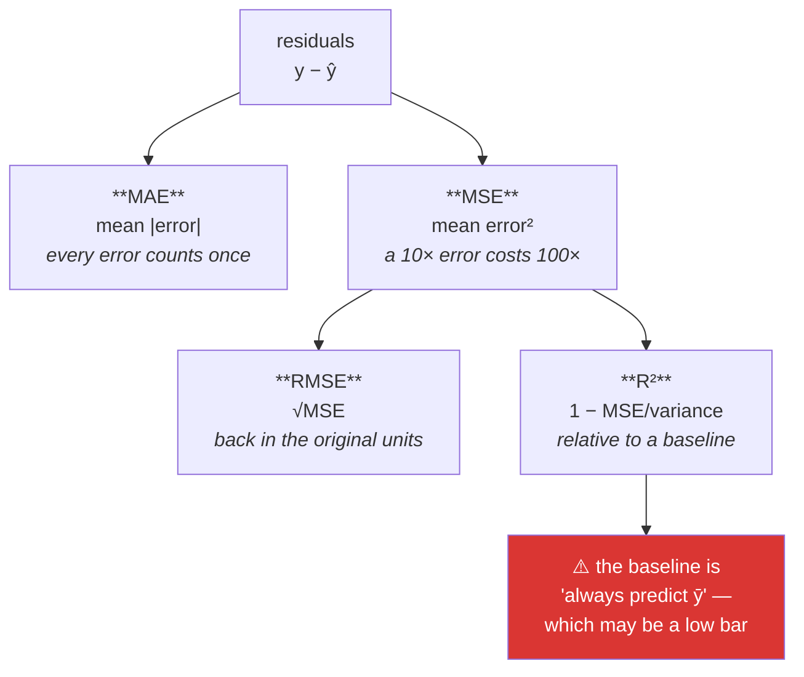

# Day 94 — Regression metrics

**Phase 12 · Module 12** · ID: **ML-05** (MSE, MAE, RMSE, R², adjusted R²)

> **Yesterday:** many predictors, and what "holding the others constant" costs.
> **Today:** how to say whether any of it worked. Four metrics that disagree with each other on
> purpose — and **R², which is the most-quoted number in regression and the most misread.** Day 89
> already showed an R² of 0.997 with zero skill; today you learn to make that impossible to report by
> accident.
> **Tomorrow:** gradient descent from scratch.

```bash
./m start 94 && ./m scaffold 94
```

**Time:** 110 minutes. **Request budget:** 0 model calls.

---

## §1 The story

Four metrics, and the differences between them are **choices about which errors you care about**, not
technical trivia.



**MAE versus RMSE is the real decision.** Squaring means a single error of 10 costs the same as a
hundred errors of 1. If one catastrophic miss is genuinely a hundred times worse than a small one,
RMSE is right. If it is merely ten times worse, RMSE is overweighting it, and MAE is closer to what
you actually care about. **Ask what the errors cost**, not which metric is standard.

**R² is a comparison, and that is what people forget.** `R² = 1 − MSE/var(y)` measures your error
against the error of predicting the mean for everything. Two consequences:

- It is **not** "the proportion of variance explained by the relationship" in any causal sense.
- Its baseline can be trivially easy or nearly impossible depending on the data. Day 89's price series
  had an R² of 0.997 because the naive baseline was *already* excellent — the model added nothing.

And the trap that Day 93 set up: **R² never decreases when you add a feature**, even a column of pure
noise. Adjusted R² penalises the parameter count, which is why it is the one you compare across models
with different feature counts.

**Every metric needs a baseline.** Day 78 said it for classification, Day 88 for ordinal targets, Day
89 for time series. Today it becomes a rule with teeth: a metric reported alone is not interpretable,
and this project's helpers will refuse to produce one.

---

## §2 Setup — run this

```bash
mkdir -p days/day-94/lab
touch days/day-94/lab/metrics.py
```

`src/setu/models.py` grows today. No new packages.

---

## §3 ML-05 — scoring

`days/day-94/lab/metrics.py`:

```python
"""ML-05: four metrics, what they weight, and the baseline that makes them readable."""

from __future__ import annotations

import numpy as np
import pandas as pd
from sklearn.linear_model import LinearRegression
from sklearn.metrics import mean_absolute_error, mean_squared_error, r2_score

from setu.arrays import make_rng


def from_scratch() -> None:
    truth = np.array([10.0, 20.0, 30.0, 40.0, 50.0])
    predicted = np.array([12.0, 18.0, 33.0, 39.0, 60.0])
    residual = truth - predicted

    mae = np.abs(residual).mean()
    mse = (residual**2).mean()
    rmse = np.sqrt(mse)
    r2 = 1 - mse / truth.var(ddof=0)

    print(f"\n  residuals: {residual.tolist()}")
    print(f"  MAE  = {mae:>8.4f}   mean absolute error")
    print(f"  MSE  = {mse:>8.4f}   mean squared error — units are SQUARED")
    print(f"  RMSE = {rmse:>8.4f}   back in the original units")
    print(f"  R²   = {r2:>8.4f}   1 − MSE / var(y)")

    print(f"\n  sklearn: {mean_absolute_error(truth, predicted):.4f}, "
          f"{mean_squared_error(truth, predicted):.4f}, {r2_score(truth, predicted):.4f}")

    print("\n  ⚠️ R² uses ddof=0 for var(y) — it compares against the SAMPLE mean of")
    print("     the data you are scoring. Using ddof=1 gives a slightly different number,")
    print("     which is why two implementations can disagree at the third decimal.")


def what_squaring_does() -> None:
    baseline = np.zeros(100)

    scattered = np.full(100, 1.0)                      # 100 errors of 1
    concentrated = np.zeros(100)
    concentrated[0] = 10.0                             # one error of 10

    print(f"\n  {'errors':<26} {'MAE':>8} {'RMSE':>8}")
    for label, predicted in (("100 errors of 1", scattered), ("1 error of 10", concentrated)):
        print(f"  {label:<26} {mean_absolute_error(baseline, predicted):>8.4f} "
              f"{np.sqrt(mean_squared_error(baseline, predicted)):>8.4f}")

    print("\n  MAE says the scattered case is 10× worse. RMSE says they are comparable.")
    print("  Neither is right in general — it depends on what the errors COST.")
    print("\n    delivery ETA off by 10 minutes once, or 1 minute a hundred times?")
    print("    a dosage wrong by 10 units once, or 1 unit a hundred times?")
    print("  The first pair favours MAE. The second favours RMSE. Ask the question.")


def outliers_choose_the_metric() -> None:
    rng = make_rng(0)
    truth = rng.normal(100, 15, 500)
    predicted = truth + rng.normal(0, 5, 500)

    dirty_truth = np.append(truth, 500.0)
    dirty_predicted = np.append(predicted, 100.0)      # one huge miss

    print(f"\n  {'':<14} {'MAE':>9} {'RMSE':>9} {'R²':>9}")
    for label, t, p in (("clean", truth, predicted),
                        ("+1 outlier", dirty_truth, dirty_predicted)):
        print(f"  {label:<14} {mean_absolute_error(t, p):>9.4f} "
              f"{np.sqrt(mean_squared_error(t, p)):>9.4f} {r2_score(t, p):>9.4f}")

    print("\n  One observation in 501 moves RMSE far more than MAE — the same robustness")
    print("  story as Day 59's mean vs median and Day 60's sd vs IQR.")
    print("\n  ⚠️ Note R² went UP. The outlier inflated var(y) faster than it inflated")
    print("     the error, so the model looks better. R² rewards a wider target range.")


def r2_is_a_comparison() -> None:
    rng = make_rng(1)
    n = 400

    easy_x = rng.normal(0, 1, n)
    easy_y = 10 * easy_x + rng.normal(0, 1, n)         # high signal-to-noise
    hard_y = 0.3 * easy_x + rng.normal(0, 1, n)        # low signal-to-noise

    print(f"\n  {'data':<24} {'RMSE':>9} {'R²':>9} {'sd(y)':>9}")
    for label, y in (("strong relationship", easy_y), ("weak relationship", hard_y)):
        fitted = LinearRegression().fit(easy_x.reshape(-1, 1), y)
        predicted = fitted.predict(easy_x.reshape(-1, 1))
        print(f"  {label:<24} {np.sqrt(mean_squared_error(y, predicted)):>9.4f} "
              f"{r2_score(y, predicted):>9.4f} {y.std(ddof=0):>9.4f}")

    print("\n  Both models have RMSE ≈ 1 — the same absolute accuracy. The R² differs")
    print("  enormously because the DENOMINATOR differs: var(y) is large in one case.")
    print("\n  ⚠️ R² is not a property of the model. It is a property of the model AND")
    print("     the spread of the target. You cannot compare R² across datasets.")


def r2_never_decreases() -> None:
    rng = make_rng(2)
    n = 200
    x = rng.normal(0, 1, n)
    y = 3 * x + rng.normal(0, 1, n)

    print(f"\n  adding columns of PURE NOISE to a model:")
    print(f"  {'features':>9} {'R²':>9} {'adjusted R²':>13}")
    features = x.reshape(-1, 1)
    for extra in range(0, 9):
        if extra:
            features = np.column_stack([features, rng.normal(0, 1, n)])
        fitted = LinearRegression().fit(features, y)
        r2 = r2_score(y, fitted.predict(features))
        p = features.shape[1]
        adjusted = 1 - (1 - r2) * (n - 1) / (n - p - 1)
        print(f"  {p:>9} {r2:>9.5f} {adjusted:>13.5f}")

    print("\n  R² rises MONOTONICALLY. It cannot do anything else: a new column can")
    print("  always be given a coefficient of zero, so the fit never gets worse.")
    print("\n  Adjusted R² eventually falls, because it charges you for each parameter.")
    print("  ⚠️ Comparing plain R² across models with different feature counts always")
    print("     favours the bigger model. Use adjusted R², or a held-out split (Day 79).")


def the_baseline_makes_it_readable() -> None:
    rng = make_rng(3)
    n = 300

    print(f"\n  the SAME model quality, on three different targets:")
    print(f"  {'target':<22} {'RMSE':>9} {'baseline RMSE':>15} {'R²':>8} {'improvement':>13}")

    for label, y in (
        ("wide spread", rng.normal(100, 50, n)),
        ("narrow spread", rng.normal(100, 5, n)),
        ("near-constant", rng.normal(100, 0.5, n)),
    ):
        predicted = y + rng.normal(0, 2, n)            # the same absolute error
        baseline = np.full(n, y.mean())
        rmse = np.sqrt(mean_squared_error(y, predicted))
        baseline_rmse = np.sqrt(mean_squared_error(y, baseline))
        print(f"  {label:<22} {rmse:>9.4f} {baseline_rmse:>15.4f} "
              f"{r2_score(y, predicted):>8.4f} "
              f"{(1 - rmse / baseline_rmse) * 100:>12.1f}%")

    print("\n  Identical absolute error. R² ranges from excellent to NEGATIVE.")
    print("  A negative R² means you are worse than predicting the mean — which is")
    print("  possible, common on held-out data, and a genuinely useful signal.")
    print("\n  Day 89's naive baseline is the same idea for time series: 'predict the")
    print("  previous value' rather than 'predict the mean'. Choose the baseline that")
    print("  matches how hard the problem actually is.")


def mape_and_its_trap() -> None:
    truth = np.array([100.0, 50.0, 10.0, 1.0, 0.1])
    predicted = truth + 1.0

    percentage = np.abs((truth - predicted) / truth) * 100
    print(f"\n  every prediction is off by exactly 1.0:")
    print(f"  {'truth':>8} {'error':>8} {'% error':>10}")
    for t, e in zip(truth, percentage, strict=True):
        print(f"  {t:>8.1f} {1.0:>8.1f} {e:>9.1f}%")
    print(f"\n  MAPE = {percentage.mean():.1f}%   <- dominated by the smallest value")

    print("\n  ⚠️ MAPE is scale-free and readable, and it has two real problems:")
    print("     - it EXPLODES near zero, and is undefined at zero")
    print("     - it penalises over-prediction more than under-prediction")
    print("  Use it when the target is strictly positive and comfortably away from zero.")


def which_metric_when() -> None:
    rows = [
        ("errors cost proportionally", "MAE", "every error counts once"),
        ("large errors are disproportionately bad", "RMSE", "squaring is the point"),
        ("outliers present and not meaningful", "MAE", "RMSE chases them"),
        ("comparing models on ONE dataset", "RMSE or MAE", "absolute, comparable"),
        ("comparing feature counts", "adjusted R²", "R² always favours more"),
        ("explaining to a stakeholder", "RMSE + baseline", "units they recognise"),
        ("target spans orders of magnitude", "RMSLE or log target", "Day 61"),
        ("time series", "vs the naive baseline", "Day 89"),
    ]
    print(f"\n  {'situation':<42} {'metric':<18} {'why'}")
    for situation, metric, why in rows:
        print(f"  {situation:<42} {metric:<18} {why}")

    print("\n  ⚠️ Every row assumes a baseline is reported alongside. A metric on its own")
    print("     is not interpretable — Day 78, Day 88, Day 89, and now here.")


if __name__ == "__main__":
    from_scratch()
    what_squaring_does()
    outliers_choose_the_metric()
    r2_is_a_comparison()
    r2_never_decreases()
    the_baseline_makes_it_readable()
    mape_and_its_trap()
    which_metric_when()
```

**Line by line:**

- `from_scratch` — Principle 2, and the `ddof` note is a real source of confusion: **R² compares
  against the sample mean of the data being scored**, using `ddof=0`, which is why two implementations
  can differ in the third decimal.
- `what_squaring_does` — **100 errors of 1 versus 1 error of 10.** MAE says the scattered case is ten
  times worse; RMSE says they are comparable. The two examples in the printout are the useful test:
  *is one big miss genuinely a hundred times worse than a small one?* Ask what the errors cost.
- `outliers_choose_the_metric` — one observation in 501, and RMSE moves far more than MAE. Same
  robustness story as Day 59 and Day 60. **And note R² went up**: the outlier inflated `var(y)` faster
  than the error, so the model looks better. R² rewards a wider target range.
- `r2_is_a_comparison` — **two models with identical RMSE and wildly different R²**, because the
  denominators differ. **R² is not a property of the model**; it is a property of the model *and* the
  spread of the target, which is why comparing it across datasets is meaningless.
- `r2_never_decreases` — **run it and watch the column rise monotonically** as pure noise is added.
  It cannot do otherwise: a new column can always take a coefficient of zero, so the fit never worsens.
  Adjusted R² eventually falls because it charges for parameters.
- `the_baseline_makes_it_readable` — **identical absolute error, R² from excellent to negative.** A
  negative R² means worse than predicting the mean, which is common on held-out data and is a genuinely
  useful signal rather than an error. And Day 89's naive baseline is the same idea with a better
  baseline for time series.
- `mape_and_its_trap` — every prediction off by exactly 1.0, and MAPE is dominated by the smallest
  value. It **explodes near zero** and **penalises over-prediction more than under-prediction**, both
  of which are asymmetries people do not intend.
- `which_metric_when` — eight situations, and the closing warning is the day's rule: **every row
  assumes a baseline is reported alongside.**

---

## §4 Build brief

Extend `src/setu/models.py`:

```python
def regression_metrics(truth, predicted, *, baseline: str = "mean",
                       n_features: int | None = None) -> dict:
    """TODO(me): every metric, and NEVER one without a baseline.

    {"mae", "mse", "rmse", "r2", "adjusted_r2" | None, "n",
     "baseline": {"kind", "rmse", "mae"}, "improvement_pct", "beats_baseline",
     "warnings": [...]}
    - baseline 'mean' predicts ybar; 'median' predicts the median; 'previous' predicts
      y[t-1] (Day 89's time-series baseline)
    - improvement_pct is (baseline_rmse - rmse) / baseline_rmse
    - adjusted_r2 requires n_features; return None when it is not supplied rather
      than guessing, and warn that R2 alone cannot compare feature counts
    - WARN when r2 > 0.9 but improvement_pct < 0.05 — Day 89's level trap
    - WARN when r2 is negative, saying it means worse than the baseline (not an error)
    - raise DataError on a length mismatch (name both) or fewer than 2 points
    - the returned dict must ALWAYS contain a baseline; there is no way to ask for
      a bare metric, and that is deliberate
    """
    raise NotImplementedError


def adjusted_r_squared(r2: float, *, n: int, n_features: int) -> float:
    """TODO(me): 1 - (1 - r2) * (n - 1) / (n - p - 1). PURE.

    - raise DataError if n <= n_features + 1 (the denominator vanishes), naming both
    - the result CAN be negative and can be below r2 by a lot; do not clip it
    - the docstring must say this is the one to use when comparing models with
      different feature counts, and why R2 cannot be (Day 94 s3.5)
    """
    raise NotImplementedError


def choose_metric(*, error_cost: str, has_outliers: bool = False,
                  comparing_feature_counts: bool = False,
                  target_spans_magnitudes: bool = False,
                  is_time_series: bool = False) -> dict:
    """TODO(me): the s3.8 table as a function. PURE.

    {"metric", "reason", "baseline", "alternatives": [...]}
    - error_cost in {'proportional', 'disproportionate'}; else DataError
    - 'proportional' -> MAE; 'disproportionate' -> RMSE
    - has_outliers overrides toward MAE, and the reason must say RMSE chases them
    - comparing_feature_counts -> adjusted R2 as an ADDITIONAL metric, never instead
    - is_time_series -> the baseline becomes 'previous', citing Day 89
    - `baseline` is never None — every recommendation carries one
    """
    raise NotImplementedError


def metric_sensitivity(truth, predicted, *, contamination: float = 0.01) -> dict:
    """TODO(me): how much would a few bad points move each metric? (s3.3)

    {"clean": {...}, "contaminated": {...}, "inflation": {"mae", "rmse", "r2"}}
    - contaminate by multiplying the largest `contamination` fraction of errors by 20
    - inflation is the ratio after/before for mae and rmse
    - r2 may IMPROVE under contamination (s3.3); report the signed change, and note it
    - this is what a report shows to justify choosing MAE over RMSE
    """
    raise NotImplementedError


def describe_metrics(result: dict, *, unit: str = "") -> str:
    """TODO(me): one sentence a stakeholder can act on. PURE.

    - must state the RMSE (or MAE) in the target's UNITS and the improvement over
      the baseline
    - must NOT quote R2 without also quoting the baseline comparison
    - must NOT contain 'variance explained' — the phrase invites a causal reading
    - raise DataError if the result has no baseline
    """
    raise NotImplementedError
```

- `regression_metrics` **always returning a baseline, with no way to opt out**, is the day's design
  decision. Days 78, 88 and 89 all said "report a baseline"; making it structurally impossible to omit
  is what turns advice into a guarantee.
- The `r2 > 0.9 with improvement < 5%` warning is **Day 89's level trap**, caught in the general
  metrics helper rather than only in the time-series one.
- `adjusted_r_squared` **not clipping** at zero matters: a negative adjusted R² is informative, and
  hiding it removes the signal that your features are worse than useless.

---

## §5 The eval that must be able to fail

Add to `tests/test_models.py`:

```python
from setu.models import (
    adjusted_r_squared,
    choose_metric,
    describe_metrics,
    metric_sensitivity,
    regression_metrics,
)


def test_the_metrics_match_sklearn():
    from sklearn.metrics import mean_absolute_error, mean_squared_error, r2_score

    truth = np.array([10.0, 20.0, 30.0, 40.0, 50.0])
    predicted = np.array([12.0, 18.0, 33.0, 39.0, 60.0])
    result = regression_metrics(truth, predicted)

    assert result["mae"] == pytest.approx(mean_absolute_error(truth, predicted))
    assert result["mse"] == pytest.approx(mean_squared_error(truth, predicted))
    assert result["r2"] == pytest.approx(r2_score(truth, predicted))


def test_rmse_is_the_root_of_mse():
    result = regression_metrics([1.0, 2.0, 3.0], [1.5, 2.5, 2.0])
    assert result["rmse"] == pytest.approx(np.sqrt(result["mse"]))


def test_a_baseline_is_always_present():
    """There is no way to ask for a bare metric."""
    result = regression_metrics([1.0, 2.0, 3.0, 4.0], [1.1, 2.1, 2.9, 4.2])
    assert result["baseline"]["rmse"] > 0
    assert "improvement_pct" in result


def test_rmse_punishes_one_big_error_more_than_mae():
    baseline = np.zeros(100)
    scattered = np.full(100, 1.0)
    concentrated = np.zeros(100)
    concentrated[0] = 10.0

    a = regression_metrics(baseline, scattered)
    b = regression_metrics(baseline, concentrated)

    assert a["mae"] > b["mae"] * 5, "MAE should call the scattered case much worse"
    assert b["rmse"] == pytest.approx(a["rmse"], rel=0.05), "RMSE calls them comparable"


def test_rmse_is_more_sensitive_to_an_outlier_than_mae():
    rng = make_rng(0)
    truth = rng.normal(100, 15, 500)
    predicted = truth + rng.normal(0, 5, 500)
    result = metric_sensitivity(truth, predicted)
    assert result["inflation"]["rmse"] > result["inflation"]["mae"]


def test_r2_can_improve_under_contamination():
    """The outlier inflates var(y) faster than it inflates the error."""
    rng = make_rng(1)
    truth = rng.normal(100, 15, 400)
    predicted = truth + rng.normal(0, 5, 400)

    dirty_truth = np.append(truth, 600.0)
    dirty_predicted = np.append(predicted, 100.0)

    clean = regression_metrics(truth, predicted)["r2"]
    dirty = regression_metrics(dirty_truth, dirty_predicted)["r2"]
    assert dirty > clean, "R² rewards a wider target range"


def test_identical_rmse_can_give_very_different_r2():
    """R² is a property of the model AND the target's spread."""
    rng = make_rng(2)
    n = 500
    wide = rng.normal(100, 50, n)
    narrow = rng.normal(100, 5, n)
    noise = rng.normal(0, 2, n)

    wide_result = regression_metrics(wide, wide + noise)
    narrow_result = regression_metrics(narrow, narrow + noise)

    assert wide_result["rmse"] == pytest.approx(narrow_result["rmse"], rel=0.1)
    assert wide_result["r2"] > narrow_result["r2"] + 0.3


def test_a_negative_r2_is_reported_not_clipped():
    """Worse than the baseline is a real and useful signal."""
    truth = np.array([1.0, 2.0, 3.0, 4.0, 5.0])
    predicted = np.array([50.0, 50.0, 50.0, 50.0, 50.0])
    result = regression_metrics(truth, predicted)
    assert result["r2"] < 0
    assert result["beats_baseline"] is False
    assert any("baseline" in w.lower() or "worse" in w.lower() for w in result["warnings"])


def test_a_high_r2_with_no_improvement_is_flagged():
    """Day 89's level trap, caught in the general helper."""
    rng = make_rng(3)
    walk = np.cumsum(rng.normal(0, 1, 500)) + 100
    truth = walk[1:]
    predicted = walk[:-1]                    # predict tomorrow = today
    result = regression_metrics(truth, predicted, baseline="previous")
    assert result["r2"] > 0.9
    assert abs(result["improvement_pct"]) < 0.05
    assert result["warnings"]


def test_the_previous_value_baseline_is_available():
    rng = make_rng(4)
    walk = np.cumsum(rng.normal(0, 1, 300)) + 100
    result = regression_metrics(walk[1:], walk[1:] + 0.1, baseline="previous")
    assert result["baseline"]["kind"] == "previous"


def test_a_length_mismatch_names_both():
    with pytest.raises(DataError) as info:
        regression_metrics([1.0, 2.0, 3.0], [1.0, 2.0])
    assert "3" in str(info.value) and "2" in str(info.value)


def test_adjusted_r2_requires_n_features():
    result = regression_metrics([1.0, 2.0, 3.0, 4.0], [1.1, 2.0, 3.2, 3.9])
    assert result["adjusted_r2"] is None
    assert any("feature" in w.lower() for w in result["warnings"])


def test_r2_never_decreases_when_noise_is_added():
    """It cannot: a new column can take a coefficient of zero."""
    from sklearn.linear_model import LinearRegression

    rng = make_rng(5)
    n = 200
    x = rng.normal(0, 1, n)
    y = 3 * x + rng.normal(0, 1, n)

    scores = []
    features = x.reshape(-1, 1)
    for extra in range(6):
        if extra:
            features = np.column_stack([features, rng.normal(0, 1, n)])
        fitted = LinearRegression().fit(features, y)
        scores.append(regression_metrics(y, fitted.predict(features))["r2"])

    assert scores == sorted(scores), "R² must be non-decreasing as features are added"


def test_adjusted_r2_eventually_falls():
    from sklearn.linear_model import LinearRegression

    rng = make_rng(6)
    n = 100
    x = rng.normal(0, 1, n)
    y = 3 * x + rng.normal(0, 1, n)

    adjusted = []
    features = x.reshape(-1, 1)
    for extra in range(15):
        if extra:
            features = np.column_stack([features, rng.normal(0, 1, n)])
        fitted = LinearRegression().fit(features, y)
        r2 = regression_metrics(y, fitted.predict(features))["r2"]
        adjusted.append(adjusted_r_squared(r2, n=n, n_features=features.shape[1]))

    assert adjusted[-1] < adjusted[0], "adjusted R² should charge for useless parameters"


def test_adjusted_r2_matches_the_formula():
    assert adjusted_r_squared(0.8, n=100, n_features=5) == pytest.approx(
        1 - (1 - 0.8) * 99 / 94
    )


def test_adjusted_r2_is_not_clipped():
    """A negative adjusted R² tells you the features are worse than useless."""
    assert adjusted_r_squared(0.01, n=20, n_features=15) < 0


def test_adjusted_r2_refuses_when_the_denominator_vanishes():
    with pytest.raises(DataError) as info:
        adjusted_r_squared(0.5, n=10, n_features=9)
    assert "10" in str(info.value) and "9" in str(info.value)


def test_proportional_cost_gives_mae():
    result = choose_metric(error_cost="proportional")
    assert result["metric"].lower() == "mae"


def test_disproportionate_cost_gives_rmse():
    result = choose_metric(error_cost="disproportionate")
    assert result["metric"].lower() == "rmse"


def test_outliers_push_toward_mae():
    result = choose_metric(error_cost="disproportionate", has_outliers=True)
    assert result["metric"].lower() == "mae"
    assert "chase" in result["reason"].lower() or "outlier" in result["reason"].lower()


def test_a_baseline_always_accompanies_the_recommendation():
    for cost in ("proportional", "disproportionate"):
        assert choose_metric(error_cost=cost)["baseline"]


def test_a_time_series_gets_the_naive_baseline():
    """Day 89: predicting the mean is the wrong bar here."""
    result = choose_metric(error_cost="proportional", is_time_series=True)
    assert "previous" in result["baseline"].lower() or "naive" in result["baseline"].lower()


def test_adjusted_r2_is_additional_never_a_replacement():
    result = choose_metric(error_cost="proportional", comparing_feature_counts=True)
    assert result["metric"].lower() in {"mae", "rmse"}
    assert any("adjusted" in str(a).lower() for a in result["alternatives"])


def test_an_unknown_error_cost_is_refused():
    with pytest.raises(DataError):
        choose_metric(error_cost="whatever")


def test_the_description_reports_units_and_improvement():
    rng = make_rng(7)
    truth = rng.normal(100, 15, 200)
    result = regression_metrics(truth, truth + rng.normal(0, 3, 200))
    text = describe_metrics(result, unit="citations")
    assert "citations" in text
    assert "%" in text or "baseline" in text.lower()


def test_the_description_avoids_variance_explained():
    """The phrase invites a causal reading."""
    rng = make_rng(8)
    truth = rng.normal(100, 15, 200)
    result = regression_metrics(truth, truth + rng.normal(0, 3, 200))
    assert "variance explained" not in describe_metrics(result).lower()


def test_the_description_never_quotes_r2_alone():
    rng = make_rng(9)
    truth = rng.normal(100, 15, 200)
    result = regression_metrics(truth, truth + rng.normal(0, 3, 200))
    text = describe_metrics(result).lower()
    if "r²" in text or "r2" in text:
        assert "baseline" in text or "%" in text


def test_describe_rejects_a_result_without_a_baseline():
    with pytest.raises(DataError):
        describe_metrics({"rmse": 3.0, "r2": 0.9})
```

**Line by line:**

- `test_a_baseline_is_always_present` — **the day's real assessment**, and it is a structural claim.
  Three earlier days said "report a baseline"; this makes producing a bare metric impossible.
- `test_rmse_punishes_one_big_error_more_than_mae` — **two assertions in opposite directions.** MAE
  calls the scattered case much worse; RMSE calls them comparable. That contrast *is* the choice
  between them, and testing only one direction would miss it.
- `test_r2_can_improve_under_contamination` — the counter-intuitive result from §3.3. An outlier makes
  the model look **better**, because it inflates `var(y)` faster than the error. Worth knowing before
  someone celebrates an R² that rose after a data-quality incident.
- `test_identical_rmse_can_give_very_different_r2` — two assertions: the RMSEs match, the R²s differ by
  a lot. **R² is not a property of the model**, and this is the cleanest demonstration.
- `test_r2_never_decreases_when_noise_is_added` — asserts the list is **sorted**, which is a structural
  property rather than six magic numbers. It cannot decrease, and knowing *why* (a coefficient of zero
  is always available) is what makes adjusted R² make sense.
- `test_a_negative_r2_is_reported_not_clipped` — negative R² is common on held-out data and is a useful
  signal. Clipping it at zero destroys information.
- `test_a_high_r2_with_no_improvement_is_flagged` — Day 89's level trap, now caught by the **general**
  metrics helper rather than only the time-series one.
- `test_the_description_avoids_variance_explained` — the **seventh** English test in this project. The
  phrase invites a causal reading of a purely descriptive quantity.

```bash
uv run python -m pytest tests/test_models.py -v
```

---

## §6 Request budget

| Resource | Spent today |
|---|---|
| LLM calls | **0** |

---

## §7 Traps

- **Reporting a metric with no baseline.** Days 78, 88, 89, and now here.
- **Choosing RMSE because it is standard.** Ask what the errors cost.
- **RMSE with meaningless outliers present.** It chases them.
- **Comparing R² across datasets.** The denominator differs.
- **Comparing R² across feature counts.** It never decreases. Use adjusted R².
- **Clipping a negative R² to zero.** It means worse than the baseline, which is information.
- **Celebrating an R² that rose after a data incident.** An outlier can inflate it.
- **Quoting R² as "variance explained".** Invites a causal reading.
- **MAPE near zero.** It explodes, and is undefined at zero.
- **MAPE without noting its asymmetry.** It punishes over-prediction more.
- **MSE in a report.** Squared units mean nothing to a reader; use RMSE.
- **The mean baseline for a time series.** Use the previous value (Day 89).

---

## §8 Verify before you code

Written **2026-08-21**:

- <https://scikit-learn.org/stable/modules/model_evaluation.html#regression-metrics> — the full list,
  including `root_mean_squared_error` which was added as a direct function.
- <https://scikit-learn.org/stable/modules/generated/sklearn.metrics.r2_score.html> — note the
  `multioutput` behaviour and that it can return negative values.
- <https://scikit-learn.org/stable/modules/generated/sklearn.dummy.DummyRegressor.html> — sklearn's
  own baseline estimator, worth using rather than hand-rolling in a pipeline.

---

## §9 Say it in an interview

> "The choice between MAE and RMSE is a statement about what errors cost, not a technical preference —
> squaring means one error of ten counts the same as a hundred errors of one, so if a catastrophic
> miss really is a hundred times worse, RMSE is right, and if it's merely ten times worse you're
> overweighting it. The number I'd be most careful with is R², because it's a comparison against
> predicting the mean, which makes it a property of the model *and* the spread of the target — two
> models with identical RMSE can have wildly different R². It also never decreases when you add a
> feature, even pure noise, because a coefficient of zero is always available, which is why comparing
> it across feature counts always favours the bigger model. And it can *rise* when your data gets
> worse, because an outlier inflates the variance faster than the error. So my metrics function has no
> way to return a bare number — the baseline and the improvement over it are always in the result,
> because three earlier days in this project said 'report a baseline' and making it structural is the
> only version that survives a deadline."

---

## §10 Done when

Tick [`CHECKLIST.md`](CHECKLIST.md), then `./m check && ./m done 94`.
