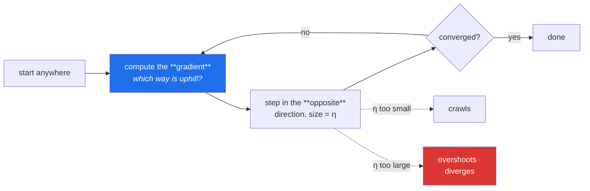

# Day 95 — Gradient descent, from scratch

**Phase 12 · Module 12** · ID: **ML-06** (gradient descent: batch, stochastic, mini-batch)

> **Yesterday:** regression metrics, and the baseline that makes them readable.
> **Today:** the algorithm that trains almost everything from here to Day 240. Day 92's normal
> equations gave you the exact answer in one step — so today opens with the question that matters:
> **why would anyone iterate toward an answer they could compute directly?**
> **Tomorrow:** bias–variance and learning curves.

```bash
./m start 95 && ./m scaffold 95
```

**Time:** 110 minutes. **Request budget:** 0 model calls.

---

## §1 The story

Day 92 solved linear regression exactly: `β = (XᵀX)⁻¹Xᵀy`, one formula, done. Gradient descent gets a
worse answer, slowly, by guessing and improving.

So why does every neural network on earth use it?

**Because the closed form does not exist for most models.** Logistic regression (Day 99) has no
algebraic solution. Neural networks (Phase 14) certainly do not. Gradient descent needs only that you
can compute the loss and its slope — and that is available for almost any model you can write down.

**And because `(XᵀX)⁻¹` is expensive.** Inverting a `p × p` matrix costs roughly `O(p³)`. At 100,000
features that is not a slow computation, it is an impossible one. Gradient descent costs `O(np)` per
step.

The mechanism is one idea:



The gradient points uphill; you step downhill. **The learning rate `η` is the whole difficulty** —
too small and you never arrive, too large and you overshoot and diverge, and §3 shows both failures on
screen.

Three variants, differing only in **how much data each step looks at**:

| | data per step | cost | path |
|---|---|---|---|
| **batch** | all of it | slow per step | smooth, direct |
| **stochastic (SGD)** | one row | very fast | noisy, wanders |
| **mini-batch** | 32–256 rows | fast | slightly noisy — **what everyone uses** |

And the point that makes today matter more than it looks: **gradient descent requires scaled
features.** Day 80's scaler was not a preprocessing nicety. With features on wildly different scales
the loss surface becomes a long narrow valley, and a learning rate that works for one feature diverges
on another. You will see it happen.

---

## §2 Setup — run this

```bash
mkdir -p days/day-95/lab
touch days/day-95/lab/descent.py
```

`src/setu/models.py` grows today. No new packages.

---

## §3 ML-06 — descending

`days/day-95/lab/descent.py`:

```python
"""ML-06: gradient descent from scratch — and why it exists at all."""

from __future__ import annotations

import time

import numpy as np

from setu.arrays import make_rng


def data(n: int = 2_000, p: int = 3, seed: int = 0):
    rng = make_rng(seed)
    x = rng.normal(0, 1, (n, p))
    true_beta = np.array([2.5, -1.2, 0.8][:p])
    y = 4.0 + x @ true_beta + rng.normal(0, 1.0, n)
    return x, y, true_beta


def why_not_just_solve_it() -> None:
    print("\n  Day 92 solved this exactly. Two reasons to iterate instead:")

    print(f"\n  1. COST — inverting XᵀX is O(p³):")
    print(f"     {'features':>10} {'closed form':>14} {'one GD step':>14}")
    for p in (50, 200, 800):
        x, y, _ = data(n=4_000, p=p)
        start = time.perf_counter()
        np.linalg.solve(x.T @ x, x.T @ y)
        exact = time.perf_counter() - start

        start = time.perf_counter()
        beta = np.zeros(p)
        (2 / len(x)) * x.T @ (x @ beta - y)
        step = time.perf_counter() - start
        print(f"     {p:>10} {exact * 1000:>13.2f}ms {step * 1000:>13.2f}ms")

    print("\n  2. EXISTENCE — logistic regression (Day 99) has NO closed form. Neither")
    print("     does any neural network. Gradient descent needs only a loss and its")
    print("     slope, which almost every model can supply.")
    print("\n  Linear regression is the one case where you can check GD against the truth.")
    print("  That is exactly why it is the right place to learn it.")


def the_gradient_by_hand() -> None:
    x, y, _ = data(n=500, p=1)
    beta = np.array([0.5])
    intercept = 1.0

    residual = (intercept + x @ beta) - y
    grad_beta = (2 / len(x)) * (x.T @ residual)
    grad_intercept = (2 / len(x)) * residual.sum()

    epsilon = 1e-6
    def loss(b, c):
        return ((c + x @ b - y) ** 2).mean()

    numeric_beta = (loss(beta + epsilon, intercept) - loss(beta - epsilon, intercept)) / (2 * epsilon)
    numeric_intercept = (loss(beta, intercept + epsilon) - loss(beta, intercept - epsilon)) / (2 * epsilon)

    print(f"\n  analytic  ∂L/∂β = {grad_beta[0]:>10.6f}   ∂L/∂b = {grad_intercept:>10.6f}")
    print(f"  numerical ∂L/∂β = {numeric_beta:>10.6f}   ∂L/∂b = {numeric_intercept:>10.6f}")
    print("\n  ✅ They agree. That comparison is a GRADIENT CHECK, and it is the only")
    print("     reliable way to know your derivative is right. Phase 14 depends on it —")
    print("     a wrong gradient trains happily and converges to the wrong place.")


def batch_descent() -> None:
    x, y, true_beta = data()
    n, p = x.shape
    beta, intercept = np.zeros(p), 0.0
    eta = 0.1

    print(f"\n  {'step':>6} {'loss':>12} {'β₀':>8} {'β₁':>8} {'β₂':>8} {'b':>8}")
    for step in range(301):
        predicted = intercept + x @ beta
        residual = predicted - y
        if step in (0, 1, 5, 20, 100, 300):
            print(f"  {step:>6} {(residual ** 2).mean():>12.6f} "
                  f"{beta[0]:>8.4f} {beta[1]:>8.4f} {beta[2]:>8.4f} {intercept:>8.4f}")
        beta -= eta * (2 / n) * (x.T @ residual)
        intercept -= eta * (2 / n) * residual.sum()

    exact = np.linalg.solve(
        np.c_[np.ones(n), x].T @ np.c_[np.ones(n), x], np.c_[np.ones(n), x].T @ y
    )
    print(f"\n  true       : {true_beta.round(4).tolist()}  intercept 4.0")
    print(f"  closed form: {exact[1:].round(4).tolist()}  intercept {exact[0]:.4f}")
    print(f"  gradient   : {beta.round(4).tolist()}  intercept {intercept:.4f}")
    print("\n  GD arrived at the closed-form answer. On this problem it is a slower")
    print("  route to a solved destination — which is what makes it checkable.")


def the_learning_rate_is_everything() -> None:
    x, y, _ = data(n=1_000, p=2)
    n = len(x)

    print(f"\n  {'η':>8} {'loss @10':>12} {'loss @100':>12} {'verdict'}")
    for eta in (0.0001, 0.01, 0.1, 0.5, 1.05, 2.0):
        beta, intercept = np.zeros(2), 0.0
        losses = []
        for step in range(101):
            residual = (intercept + x @ beta) - y
            losses.append((residual ** 2).mean())
            if not np.isfinite(losses[-1]) or losses[-1] > 1e12:
                break
            beta -= eta * (2 / n) * (x.T @ residual)
            intercept -= eta * (2 / n) * residual.sum()

        at_10 = losses[10] if len(losses) > 10 else float("inf")
        at_100 = losses[100] if len(losses) > 100 else float("inf")
        if not np.isfinite(at_100):
            verdict = "🚨 DIVERGED"
        elif at_100 > 2.0:
            verdict = "still crawling"
        else:
            verdict = "converged"
        print(f"  {eta:>8} {at_10:>12.4f} {at_100:>12.4f}  {verdict}")

    print("\n  Too small: correct direction, never arrives. Too large: overshoots the")
    print("  minimum, lands further up the other side, and the loss EXPLODES.")
    print("\n  ⚠️ Diverging losses print as inf or nan. If you ever see nan in a training")
    print("     log, lower the learning rate before changing anything else.")


def scaling_is_not_optional() -> None:
    rng = make_rng(1)
    n = 2_000
    x_raw = np.c_[rng.normal(0, 1, n), rng.normal(0, 1_000, n)]   # wildly different scales
    y = 3.0 + x_raw @ np.array([2.0, 0.001]) + rng.normal(0, 0.5, n)

    x_scaled = (x_raw - x_raw.mean(axis=0)) / x_raw.std(axis=0, ddof=1)
    y_scaled = y

    print(f"\n  feature standard deviations: {x_raw.std(axis=0, ddof=1).round(2).tolist()}")

    for label, features in (("raw", x_raw), ("standardised", x_scaled)):
        print(f"\n  {label}:")
        for eta in (1e-8, 1e-4, 0.1):
            beta, intercept = np.zeros(2), 0.0
            for _ in range(200):
                residual = (intercept + features @ beta) - y_scaled
                if not np.isfinite(residual).all() or np.abs(residual).max() > 1e10:
                    break
                beta -= eta * (2 / n) * (features.T @ residual)
                intercept -= eta * (2 / n) * residual.sum()
            final = ((intercept + features @ beta - y_scaled) ** 2).mean()
            status = "diverged" if not np.isfinite(final) else f"{final:.4f}"
            print(f"    η={eta:<8} final loss {status}")

    print("\n  🚨 On raw features NO single learning rate works: one that suits the")
    print("     scale-1000 feature is far too large for the scale-1 one.")
    print("  Geometrically the loss surface is a long narrow valley, and the step")
    print("  bounces off the walls instead of running down the floor.")
    print("\n  Day 80's scaler was not tidiness. It is what makes this algorithm work.")


def batch_vs_stochastic_vs_mini() -> None:
    x, y, _ = data(n=20_000, p=5)
    n, p = x.shape
    rng = make_rng(2)

    def run(batch_size: int, epochs: int, eta: float):
        beta, intercept = np.zeros(p), 0.0
        history = []
        start = time.perf_counter()
        for _ in range(epochs):
            order = rng.permutation(n)
            for begin in range(0, n, batch_size):
                index = order[begin:begin + batch_size]
                xb, yb = x[index], y[index]
                residual = (intercept + xb @ beta) - yb
                beta -= eta * (2 / len(xb)) * (xb.T @ residual)
                intercept -= eta * (2 / len(xb)) * residual.sum()
            history.append(((intercept + x @ beta - y) ** 2).mean())
        return beta, history, time.perf_counter() - start

    print(f"\n  {'variant':<14} {'batch':>8} {'updates':>9} {'time':>8} {'final loss':>12}")
    for label, size, epochs, eta in (("batch", n, 60, 0.5),
                                     ("mini-batch", 64, 6, 0.1),
                                     ("stochastic", 1, 2, 0.01)):
        _, history, elapsed = run(size, epochs, eta)
        updates = epochs * int(np.ceil(n / size))
        print(f"  {label:<14} {size:>8} {updates:>9,} {elapsed:>7.2f}s {history[-1]:>12.6f}")

    print("\n  Batch: one update per pass over 20,000 rows. Accurate, and wasteful —")
    print("    it reads everything to take a single step.")
    print("  Stochastic: 20,000 updates per pass. Fast progress, noisy path, and it")
    print("    never quite settles — it orbits the minimum.")
    print("  Mini-batch: the compromise, and it also uses vectorised hardware well.")
    print("    32–256 is the usual range, and it is what Phase 14 uses throughout.")


def the_noise_is_useful() -> None:
    rng = make_rng(3)
    grid = np.linspace(-3, 3, 400)
    surface = grid**4 - 4 * grid**2 + 0.4 * grid       # two minima, one deeper
    slope = lambda w: 4 * w**3 - 8 * w + 0.4           # noqa: E731

    for label, noise in (("no noise (batch-like)", 0.0), ("noisy (SGD-like)", 0.9)):
        landed = []
        for start in (-2.5, -0.5, 0.5, 2.5):
            w = start
            for _ in range(600):
                w -= 0.01 * (slope(w) + rng.normal(0, noise))
            landed.append(round(w, 1))
        print(f"\n  {label:<24} final positions from 4 starts: {landed}")

    best = grid[surface.argmin()]
    print(f"\n  the deeper minimum is near w = {best:.1f}")
    print("\n  Without noise, a start on the wrong side stays in the shallower minimum.")
    print("  Noise lets SGD escape it. On non-convex surfaces (every neural network)")
    print("  that is a FEATURE, not a defect — Day 129 relies on it.")
    print("\n  ⚠️ Linear regression's loss is CONVEX: one minimum, no escaping needed.")
    print("     That is why today's results are checkable and Phase 14's are not.")


def when_to_stop() -> None:
    x, y, _ = data(n=1_000, p=2)
    n = len(x)
    beta, intercept = np.zeros(2), 0.0
    previous = float("inf")

    for step in range(1, 5_001):
        residual = (intercept + x @ beta) - y
        loss = (residual ** 2).mean()
        if abs(previous - loss) < 1e-9:
            print(f"\n  converged at step {step}: change below 1e-9")
            break
        previous = loss
        beta -= 0.1 * (2 / n) * (x.T @ residual)
        intercept -= 0.1 * (2 / n) * residual.sum()
    else:
        print(f"\n  hit the iteration cap without converging")

    print("\n  three stopping rules, and you need all three:")
    print("    1. loss change below a tolerance  — converged")
    print("    2. a maximum iteration count      — so a bad η cannot loop forever")
    print("    3. loss is not finite             — diverged; stop and report it")
    print("\n  ⚠️ A run that hits the cap has NOT converged. Reporting its parameters")
    print("     as a fitted model is the mistake this rule exists to prevent.")


if __name__ == "__main__":
    why_not_just_solve_it()
    the_gradient_by_hand()
    batch_descent()
    the_learning_rate_is_everything()
    scaling_is_not_optional()
    batch_vs_stochastic_vs_mini()
    the_noise_is_useful()
    when_to_stop()
```

**Line by line:**

- `why_not_just_solve_it` — **the question first.** Two answers: the closed form costs `O(p³)` and
  becomes impossible at scale, and for most models **it does not exist at all**. Linear regression is
  the one case where you can check gradient descent against the truth, which is exactly why it is the
  right place to learn it.
- `the_gradient_by_hand` — the analytic derivative compared against a **numerical** one computed by
  perturbing the parameter. That comparison is a **gradient check**, and it is the only reliable way
  to know your derivative is right. Phase 14 depends on it: **a wrong gradient trains happily and
  converges to the wrong place.**
- `batch_descent` — watch the loss fall and the coefficients walk toward the closed-form answer. Print
  all three: true, exact, and iterated. **They agree**, which is the confidence you cannot get on any
  later model.
- `the_learning_rate_is_everything` — **run this and read the verdict column.** `0.0001` crawls,
  `0.1` converges, `2.0` explodes. And the practical note is the one to remember: **if you see `nan`
  in a training log, lower the learning rate before changing anything else.**
- `scaling_is_not_optional` — **the day's most consequential demonstration.** Two features, standard
  deviations of 1 and 1000, and **no single learning rate works on the raw data**. Geometrically the
  loss surface is a long narrow valley and the step bounces off the walls. Day 80's scaler is what
  makes this algorithm work at all.
- `batch_vs_stochastic_vs_mini` — the same problem, three batch sizes. Batch reads 20,000 rows to take
  **one** step. SGD takes 20,000 steps per pass and orbits the minimum without settling. **Mini-batch
  is the compromise**, and it also uses vectorised hardware well, which is why 32–256 is the universal
  default.
- `the_noise_is_useful` — a two-minimum surface, four starting points. **Without noise a bad start
  stays stuck in the shallower minimum; noise escapes it.** On non-convex surfaces that is a *feature*.
  And the caveat matters: linear regression's loss is **convex**, one minimum, nothing to escape —
  which is why today's results are checkable and Phase 14's are not.
- `when_to_stop` — three rules, and you need all three. **A run that hits the iteration cap has not
  converged**, and reporting its parameters as a fitted model is the mistake the rule prevents.

---

## §4 Build brief

Extend `src/setu/models.py`:

```python
from dataclasses import dataclass


@dataclass(frozen=True)
class DescentResult:
    """A fitted model AND the evidence it actually fitted."""
    coefficients: np.ndarray
    intercept: float
    loss_history: list[float]
    n_steps: int
    converged: bool
    stop_reason: str          # 'tolerance' | 'max_iterations' | 'diverged'
    learning_rate: float
    batch_size: int


def gradient_descent(x, y, *, learning_rate: float = 0.1, batch_size: int | None = None,
                     epochs: int = 100, tolerance: float = 1e-9, seed: int = 42,
                     require_scaled: bool = True) -> DescentResult:
    """TODO(me): batch, mini-batch and SGD in one function.

    - batch_size=None means full batch; 1 means SGD; anything else is mini-batch
    - shuffle each epoch using make_rng(seed) — an unshuffled SGD sees systematic
      order and can cycle rather than converge
    - stop on: |loss change| < tolerance ('tolerance'), epoch cap ('max_iterations'),
      or a non-finite loss ('diverged')
    - converged is True ONLY for stop_reason='tolerance'
    - require_scaled=True raises DataError when any feature's sd differs from the
      smallest by more than 10x, naming the columns and the ratio (§3.5) — this is
      the single most common cause of a run that will not converge
    - raise DataError on a non-finite input, a length mismatch (name both), or
      learning_rate <= 0
    - loss_history has one entry per EPOCH, not per update — otherwise SGD's history
      is 20,000 entries and unplottable
    """
    raise NotImplementedError


def gradient_check(loss_fn, gradient_fn, parameters, *, epsilon: float = 1e-6,
                   tolerance: float = 1e-5) -> dict:
    """TODO(me): §3.2's comparison, as a reusable function.

    {"analytic": ndarray, "numerical": ndarray, "max_absolute_difference": float,
     "passes": bool, "worst_index": int}
    - numerical gradient by central difference: (L(p+ε) − L(p−ε)) / 2ε
    - central difference, NOT forward — it is O(ε²) accurate instead of O(ε)
    - passes when max_absolute_difference < tolerance
    - Phase 14 calls this before trusting any hand-derived gradient
    - raise DataError if epsilon <= 0 or the two gradients differ in shape
    """
    raise NotImplementedError


def diagnose_descent(result: DescentResult) -> dict:
    """TODO(me): read a run and say what went wrong. PURE.

    {"status", "diagnosis", "suggestion", "loss_reduction", "final_loss"}
    - diverged -> 'learning rate too high', suggest dividing it by 10
    - hit the cap with a still-falling loss -> 'too few epochs or rate too low'
    - hit the cap with a flat loss -> 'stuck; check scaling or the gradient'
    - converged but final loss above the baseline -> 'converged to a poor solution'
    - the suggestion must be ACTIONABLE — a name for the problem is not enough
    """
    raise NotImplementedError


def learning_rate_search(x, y, *, candidates=(1e-4, 1e-3, 1e-2, 0.1, 0.5),
                         epochs: int = 30, seed: int = 42) -> dict:
    """TODO(me): try several rates and report what each did.

    {"results": {rate: {"final_loss", "converged", "stop_reason"}},
     "recommended": float, "diverged": [...], "statement": str}
    - recommended is the largest rate that did NOT diverge and reached the lowest loss
    - a diverged run must appear in `diverged` with its rate, not be silently dropped
    - raise DataError if every candidate diverged, suggesting the features be scaled
      (§3.5: that is almost always the real cause)
    """
    raise NotImplementedError


def assert_converged(result: DescentResult) -> None:
    """TODO(me): raise DataError unless stop_reason == 'tolerance'.

    - the message must state the actual stop_reason and the final loss
    - hitting the iteration cap is NOT convergence, and reporting those parameters
      as a fitted model is the mistake this prevents (§3.8)
    - a diverged run must say to lower the learning rate
    """
    raise NotImplementedError
```

- `require_scaled=True` **by default** is the day's design decision. §3.5 showed no learning rate works
  on unscaled features, and it is the most common cause of a run that will not converge — so the
  library refuses rather than letting you debug it for an hour.
- `converged` being true **only** for `stop_reason='tolerance'` matters: hitting the cap is a different
  outcome, and conflating them lets an unfitted model be reported as fitted.
- `gradient_check` using a **central** difference is not a detail — forward difference is `O(ε)`
  accurate and central is `O(ε²)`, which is the difference between catching a subtle gradient bug and
  missing it.

---

## §5 The eval that must be able to fail

Add to `tests/test_models.py`:

```python
from setu.models import (
    DescentResult,
    assert_converged,
    diagnose_descent,
    gradient_check,
    gradient_descent,
    learning_rate_search,
)


@pytest.fixture
def scaled():
    rng = make_rng(0)
    x = rng.normal(0, 1, (1_500, 3))
    beta = np.array([2.5, -1.2, 0.8])
    return x, 4.0 + x @ beta + rng.normal(0, 0.5, 1_500), beta


def test_it_reaches_the_closed_form_answer(scaled):
    """Linear regression is the one case where the truth is knowable."""
    x, y, _ = scaled
    design = np.c_[np.ones(len(x)), x]
    exact = np.linalg.solve(design.T @ design, design.T @ y)

    result = gradient_descent(x, y, learning_rate=0.1, epochs=2_000)
    assert np.allclose(result.coefficients, exact[1:], atol=1e-3)
    assert result.intercept == pytest.approx(exact[0], abs=1e-3)


def test_it_recovers_the_generating_coefficients(scaled):
    x, y, beta = scaled
    result = gradient_descent(x, y, learning_rate=0.1, epochs=2_000)
    assert np.allclose(result.coefficients, beta, atol=0.1)


def test_the_loss_decreases_monotonically_in_batch_mode(scaled):
    """Full-batch GD on a convex loss can only go downhill."""
    x, y, _ = scaled
    history = gradient_descent(x, y, learning_rate=0.05, epochs=100).loss_history
    assert all(later <= earlier + 1e-12
               for earlier, later in zip(history, history[1:], strict=True))


def test_the_history_has_one_entry_per_epoch(scaled):
    """Otherwise SGD's history is unplottable."""
    x, y, _ = scaled
    result = gradient_descent(x, y, batch_size=1, epochs=5, learning_rate=0.001)
    assert len(result.loss_history) == 5


def test_all_three_variants_reach_a_similar_answer(scaled):
    x, y, beta = scaled
    batch = gradient_descent(x, y, learning_rate=0.1, epochs=800)
    mini = gradient_descent(x, y, batch_size=64, learning_rate=0.05, epochs=200)
    stochastic = gradient_descent(x, y, batch_size=1, learning_rate=0.005, epochs=50)

    for result in (batch, mini, stochastic):
        assert np.allclose(result.coefficients, beta, atol=0.25)


def test_stochastic_takes_far_more_updates_per_epoch(scaled):
    x, y, _ = scaled
    batch = gradient_descent(x, y, epochs=10, learning_rate=0.1)
    stochastic = gradient_descent(x, y, batch_size=1, epochs=10, learning_rate=0.001)
    assert stochastic.n_steps > batch.n_steps * 100


def test_a_high_learning_rate_diverges_and_says_so(scaled):
    x, y, _ = scaled
    result = gradient_descent(x, y, learning_rate=50.0, epochs=100)
    assert result.stop_reason == "diverged"
    assert result.converged is False


def test_a_tiny_learning_rate_hits_the_cap(scaled):
    x, y, _ = scaled
    result = gradient_descent(x, y, learning_rate=1e-8, epochs=20)
    assert result.stop_reason == "max_iterations"
    assert result.converged is False, "hitting the cap is NOT convergence"


def test_converged_is_true_only_for_tolerance(scaled):
    x, y, _ = scaled
    result = gradient_descent(x, y, learning_rate=0.2, epochs=5_000, tolerance=1e-10)
    assert result.stop_reason == "tolerance"
    assert result.converged is True


def test_unscaled_features_are_refused():
    """§3.5: no single learning rate works, and this is why runs fail to converge."""
    rng = make_rng(1)
    n = 800
    x = np.c_[rng.normal(0, 1, n), rng.normal(0, 1_000, n)]
    y = 3.0 + x @ np.array([2.0, 0.001]) + rng.normal(0, 0.5, n)

    with pytest.raises(DataError) as info:
        gradient_descent(x, y)
    message = str(info.value).lower()
    assert "scal" in message
    assert any(token in message for token in ("1000", "ratio", "sd")), (
        "the message must name the offending scale ratio"
    )


def test_the_scaling_check_can_be_overridden(scaled):
    """A guard with no legitimate escape gets bypassed rather than used."""
    rng = make_rng(2)
    n = 500
    x = np.c_[rng.normal(0, 1, n), rng.normal(0, 50, n)]
    y = x @ np.array([1.0, 0.01]) + rng.normal(0, 0.1, n)
    result = gradient_descent(x, y, learning_rate=1e-5, epochs=10, require_scaled=False)
    assert isinstance(result, DescentResult)


def test_scaled_features_pass_the_check(scaled):
    x, y, _ = scaled
    gradient_descent(x, y, epochs=10)


def test_a_non_finite_input_raises(scaled):
    x, y, _ = scaled
    dirty = x.copy()
    dirty[0, 0] = np.nan
    with pytest.raises(DataError):
        gradient_descent(dirty, y)


def test_a_length_mismatch_names_both(scaled):
    x, y, _ = scaled
    with pytest.raises(DataError) as info:
        gradient_descent(x, y[:-10])
    assert str(len(x)) in str(info.value) and str(len(y) - 10) in str(info.value)


def test_a_non_positive_learning_rate_raises(scaled):
    x, y, _ = scaled
    with pytest.raises(DataError):
        gradient_descent(x, y, learning_rate=0.0)


def test_descent_is_reproducible(scaled):
    x, y, _ = scaled
    a = gradient_descent(x, y, batch_size=32, epochs=20, seed=7)
    b = gradient_descent(x, y, batch_size=32, epochs=20, seed=7)
    assert np.array_equal(a.coefficients, b.coefficients)


def test_the_gradient_check_passes_on_a_correct_derivative():
    """The only reliable way to know a derivative is right."""
    rng = make_rng(3)
    x = rng.normal(0, 1, (200, 2))
    y = x @ np.array([1.5, -0.5]) + rng.normal(0, 0.1, 200)

    def loss(beta):
        return ((x @ beta - y) ** 2).mean()

    def gradient(beta):
        return (2 / len(x)) * x.T @ (x @ beta - y)

    result = gradient_check(loss, gradient, np.array([0.3, 0.7]))
    assert result["passes"] is True
    assert result["max_absolute_difference"] < 1e-6


def test_the_gradient_check_catches_a_wrong_derivative():
    """A wrong gradient trains happily and converges to the wrong place."""
    rng = make_rng(4)
    x = rng.normal(0, 1, (200, 2))
    y = x @ np.array([1.5, -0.5]) + rng.normal(0, 0.1, 200)

    def loss(beta):
        return ((x @ beta - y) ** 2).mean()

    def wrong_gradient(beta):
        return (1 / len(x)) * x.T @ (x @ beta - y)     # missing the factor of 2

    result = gradient_check(loss, wrong_gradient, np.array([0.3, 0.7]))
    assert result["passes"] is False
    assert result["worst_index"] in (0, 1)


def test_the_gradient_check_uses_a_central_difference():
    """Central is O(eps^2) accurate; forward is O(eps) and misses subtle bugs."""
    def loss(p):
        return float((p ** 3).sum())

    def gradient(p):
        return 3 * p ** 2

    result = gradient_check(loss, gradient, np.array([2.0]), epsilon=1e-4)
    assert result["max_absolute_difference"] < 1e-6, (
        "a forward difference would be off by about 1e-3 here"
    )


def test_gradient_check_rejects_a_bad_epsilon():
    with pytest.raises(DataError):
        gradient_check(lambda p: 0.0, lambda p: p, np.array([1.0]), epsilon=0.0)


def test_a_diverged_run_is_diagnosed_with_an_action(scaled):
    x, y, _ = scaled
    result = gradient_descent(x, y, learning_rate=50.0, epochs=50)
    diagnosis = diagnose_descent(result)
    assert diagnosis["status"] == "diverged"
    assert "learning rate" in diagnosis["diagnosis"].lower()
    assert any(token in diagnosis["suggestion"].lower() for token in ("lower", "reduce", "divide"))


def test_a_capped_run_with_a_falling_loss_suggests_more_epochs(scaled):
    x, y, _ = scaled
    result = gradient_descent(x, y, learning_rate=1e-5, epochs=15)
    diagnosis = diagnose_descent(result)
    assert "epoch" in diagnosis["suggestion"].lower() or "rate" in diagnosis["suggestion"].lower()


def test_a_converged_run_is_reported_as_healthy(scaled):
    x, y, _ = scaled
    result = gradient_descent(x, y, learning_rate=0.2, epochs=5_000, tolerance=1e-10)
    assert diagnose_descent(result)["status"] == "converged"


def test_every_diagnosis_is_actionable(scaled):
    """Naming a problem is not the same as saying what to do."""
    x, y, _ = scaled
    for rate, epochs in ((50.0, 30), (1e-8, 10), (0.2, 5_000)):
        diagnosis = diagnose_descent(gradient_descent(x, y, learning_rate=rate, epochs=epochs))
        assert len(diagnosis["suggestion"]) > 20


def test_the_search_recommends_a_working_rate(scaled):
    x, y, _ = scaled
    result = learning_rate_search(x, y)
    assert result["recommended"] in result["results"]
    assert result["results"][result["recommended"]]["stop_reason"] != "diverged"


def test_diverged_rates_are_reported_not_hidden(scaled):
    x, y, _ = scaled
    result = learning_rate_search(x, y, candidates=(0.1, 100.0))
    assert 100.0 in result["diverged"]


def test_a_search_where_everything_diverges_suggests_scaling():
    rng = make_rng(5)
    n = 500
    x = np.c_[rng.normal(0, 1, n), rng.normal(0, 5_000, n)]
    y = x @ np.array([1.0, 0.0001]) + rng.normal(0, 0.1, n)
    with pytest.raises(DataError) as info:
        learning_rate_search(x, y, candidates=(0.1, 0.5, 1.0))
    assert "scal" in str(info.value).lower()


def test_assert_converged_accepts_a_converged_run(scaled):
    x, y, _ = scaled
    assert_converged(gradient_descent(x, y, learning_rate=0.2, epochs=5_000, tolerance=1e-10))


def test_assert_converged_refuses_a_capped_run(scaled):
    """Reporting an unconverged model's parameters as fitted is the mistake."""
    x, y, _ = scaled
    result = gradient_descent(x, y, learning_rate=1e-8, epochs=10)
    with pytest.raises(DataError) as info:
        assert_converged(result)
    assert "max_iterations" in str(info.value)


def test_assert_converged_tells_a_diverged_run_to_lower_the_rate(scaled):
    x, y, _ = scaled
    with pytest.raises(DataError) as info:
        assert_converged(gradient_descent(x, y, learning_rate=50.0, epochs=30))
    assert "lower" in str(info.value).lower() or "reduce" in str(info.value).lower()
```

**Line by line:**

- `test_unscaled_features_are_refused` — **the day's real assessment.** §3.5 showed no learning rate
  works on features with a 1000× scale ratio, and the test requires the message to **name the ratio**.
  A generic "consider scaling" gets ignored; naming the offending columns does not.
- `test_the_scaling_check_can_be_overridden` — the escape hatch, tested. **A guard with no legitimate
  way past it gets bypassed rather than used**, and there are cases (a deliberately unscaled
  experiment) where you mean it.
- `test_the_gradient_check_catches_a_wrong_derivative` — a gradient missing its factor of 2. **That
  bug trains happily** and converges to a scaled-wrong answer, which is exactly the failure a gradient
  check exists to catch, and it is why Phase 14 needs this function.
- `test_the_gradient_check_uses_a_central_difference` — on a cubic at `ε = 1e-4`, forward difference is
  off by about `1e-3` and central by about `1e-8`. **The test would pass with a forward difference at
  a looser tolerance**, so the tight bound is what forces the correct implementation.
- `test_converged_is_true_only_for_tolerance` with `test_a_tiny_learning_rate_hits_the_cap` — together
  they pin the distinction. Hitting the cap is **not** convergence, and the failure message on the
  second names it.
- `test_the_loss_decreases_monotonically_in_batch_mode` — on a **convex** loss with full batch, the
  loss can only go downhill. A violation means the gradient sign or the update is wrong, and this
  catches it in one assertion.
- `test_every_diagnosis_is_actionable` — asserts each suggestion is over 20 characters, across three
  different failure modes. **Naming a problem is not the same as saying what to do**, and Day 85
  established the same rule for dropped features.
- `test_the_history_has_one_entry_per_epoch` — SGD at one row per update on 1,500 rows would produce a
  75,000-entry history. Per-epoch is what makes it plottable on Day 96.

```bash
uv run python -m pytest tests/test_models.py -v
```

---

## §6 Request budget

| Resource | Spent today |
|---|---|
| LLM calls | **0** |

---

## §7 Traps

- **Unscaled features.** No learning rate works. The single most common cause of failure.
- **A learning rate that diverges.** `nan` in the log means lower it first.
- **A learning rate that crawls.** Correct direction, never arrives.
- **Reporting a capped run as fitted.** It did not converge.
- **Trusting a hand-derived gradient.** Check it numerically.
- **A forward difference in the gradient check.** `O(ε)`; use central.
- **Unshuffled SGD.** Sees systematic order and can cycle.
- **A loss history per update.** Unplottable for SGD.
- **Expecting SGD to settle exactly.** It orbits the minimum.
- **Assuming noise is always bad.** It escapes shallow minima on non-convex surfaces.
- **Applying today's convexity intuition to Phase 14.** Neural losses are not convex.

---

## §8 Verify before you code

Written **2026-08-21**:

- <https://numpy.org/doc/stable/reference/generated/numpy.linalg.solve.html> — the closed form
  (prefer it to `inv`, per Day 93).
- <https://scikit-learn.org/stable/modules/sgd.html> — sklearn's `SGDRegressor`, including its own
  warning that features must be scaled.
- <https://numpy.org/doc/stable/reference/random/generated/numpy.random.Generator.permutation.html> —
  the per-epoch shuffle.

---

## §9 Say it in an interview

> "I'd start with why it exists, since linear regression has a closed form: inverting XᵀX is cubic in
> the number of features so it stops being feasible, and more importantly the closed form doesn't
> exist for logistic regression or anything neural — gradient descent needs only a loss and its slope.
> Linear regression is where you *learn* it precisely because you can check the answer against the
> exact solution. Two things I'd emphasise. First, scaling isn't preprocessing hygiene, it's what
> makes the algorithm work: with features at scale one and scale one thousand, no single learning rate
> converges, because the loss surface is a long narrow valley and your step bounces off the walls. My
> implementation refuses unscaled input by default and names the offending ratio. Second, the gradient
> check — compare your analytic derivative to a central finite difference — because a gradient that's
> wrong by a constant factor trains happily and converges to the wrong place, and there's no other way
> to catch that."

---

## §10 Done when

Tick [`CHECKLIST.md`](CHECKLIST.md), then `./m check && ./m done 95`.
