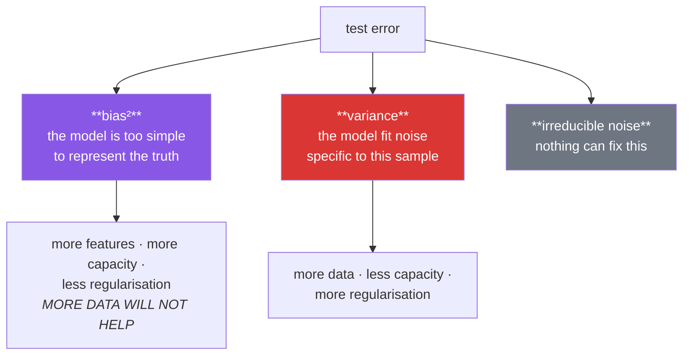

# Day 96 — Bias–variance, over/underfitting, and learning curves

**Phase 12 · Module 12** · ID: **ML-07** (bias–variance trade-off, overfitting, underfitting, learning curves)

> **Yesterday:** gradient descent, and why scaling makes it work.
> **Today:** the single most useful diagnostic in machine learning. A model is underperforming —
> **is more data the answer, or a better model?** Those need opposite responses, and the learning
> curve tells them apart in one plot. You will **decompose** the error rather than take the
> decomposition on faith.
> **Tomorrow:** cross-validation.

```bash
./m start 96 && ./m scaffold 96
```

**Time:** 110 minutes. **Request budget:** 0 model calls.

---

## §1 The story

Your model scores badly on held-out data. There are exactly two reasons, and they call for opposite
fixes:



**Bias** is error from wrongness in the model's form: fit a straight line to a curve and no amount of
data rescues you. **Variance** is error from sensitivity to the particular sample: fit a degree-15
polynomial to twenty points and it chases the noise. **Irreducible noise** is the part of `y` that no
function of `x` can explain, and it is the floor on everyone's performance.

These are not metaphors. `E[(y − ŷ)²] = bias² + variance + noise` is an identity, and §3 **measures
all three separately** by training the same model on hundreds of resampled datasets. That is the only
way to make the concept concrete rather than a diagram you nod at.

**The learning curve is the diagnostic.** Plot training and validation error against the number of
training examples, and the *shape* tells you which problem you have:

| shape | diagnosis | do this |
|---|---|---|
| both errors high, converged together | **underfitting** (bias) | more capacity — *more data will not help* |
| large gap, validation still falling | **overfitting** (variance) | more data, or less capacity |
| both low, converged | you are near the noise floor | stop; improve the data, not the model |

The most valuable thing this plot does is tell you **when to stop collecting data**. A flat validation
curve means the next ten thousand rows change nothing, and that is a decision worth making before
someone spends three months on it.

---

## §2 Setup — run this

```bash
mkdir -p days/day-96/lab
touch days/day-96/lab/tradeoff.py
```

`src/setu/models.py` grows today. No new packages.

---

## §3 ML-07 — decomposing the error

`days/day-96/lab/tradeoff.py`:

```python
"""ML-07: bias, variance and noise — measured, then diagnosed with learning curves."""

from __future__ import annotations

import numpy as np
from sklearn.linear_model import LinearRegression, Ridge
from sklearn.pipeline import make_pipeline
from sklearn.preprocessing import PolynomialFeatures

from setu.arrays import make_rng

TRUE_NOISE = 0.6


def truth(x):
    """The function no model gets to see."""
    return np.sin(1.6 * x) + 0.35 * x


def sample(n, *, seed):
    rng = make_rng(seed)
    x = rng.uniform(-3, 3, n)
    return x.reshape(-1, 1), truth(x) + rng.normal(0, TRUE_NOISE, n)


def see_it_first() -> None:
    x_test = np.linspace(-3, 3, 200).reshape(-1, 1)
    print(f"\n  fitting three polynomial degrees to 25 points:")
    print(f"  {'degree':>7} {'train MSE':>11} {'test MSE':>10} {'verdict'}")

    x, y = sample(25, seed=0)
    y_test = truth(x_test.ravel())

    for degree in (1, 4, 15):
        model = make_pipeline(PolynomialFeatures(degree), LinearRegression()).fit(x, y)
        train = ((model.predict(x) - y) ** 2).mean()
        test = ((model.predict(x_test) - y_test) ** 2).mean()
        verdict = ("underfit — too simple" if degree == 1 else
                   "about right" if degree == 4 else
                   "overfit — chasing noise")
        print(f"  {degree:>7} {train:>11.4f} {test:>10.4f}  {verdict}")

    print("\n  Degree 15 has the LOWEST training error and the WORST test error.")
    print("  Training error is not a measure of quality; it is a measure of memorisation.")


def decompose_the_error() -> None:
    """The identity, measured. This is the function that makes it concrete."""
    x_test = np.linspace(-2.8, 2.8, 60).reshape(-1, 1)
    truth_test = truth(x_test.ravel())
    n_datasets, n_train = 300, 40

    print(f"\n  training {n_datasets} models on {n_datasets} independent datasets of "
          f"{n_train} points each:")
    print(f"\n  {'degree':>7} {'bias²':>9} {'variance':>10} {'noise':>8} "
          f"{'sum':>9} {'measured MSE':>13}")

    for degree in (1, 2, 4, 9, 15):
        predictions = np.empty((n_datasets, len(x_test)))
        for i in range(n_datasets):
            x, y = sample(n_train, seed=1_000 + i)
            model = make_pipeline(PolynomialFeatures(degree), LinearRegression()).fit(x, y)
            predictions[i] = model.predict(x_test)

        average = predictions.mean(axis=0)
        bias_squared = ((average - truth_test) ** 2).mean()
        variance = predictions.var(axis=0).mean()
        noise = TRUE_NOISE ** 2

        rng = make_rng(9_999)
        observed = truth_test + rng.normal(0, TRUE_NOISE, len(truth_test))
        measured = ((predictions - observed) ** 2).mean()

        print(f"  {degree:>7} {bias_squared:>9.4f} {variance:>10.4f} {noise:>8.4f} "
              f"{bias_squared + variance + noise:>9.4f} {measured:>13.4f}")

    print("\n  Read the two middle columns moving in OPPOSITE directions. That is the")
    print("  trade-off, and it is an identity, not a metaphor:")
    print("    E[(y − ŷ)²] = bias² + variance + noise")
    print("\n  bias²    : how far the AVERAGE model is from the truth")
    print("  variance : how much the models disagree with EACH OTHER")
    print("  noise    : the floor. No model beats it, ever.")


def the_noise_floor() -> None:
    x_test = np.linspace(-2.8, 2.8, 400).reshape(-1, 1)
    truth_test = truth(x_test.ravel())
    rng = make_rng(5)
    observed = truth_test + rng.normal(0, TRUE_NOISE, len(truth_test))

    perfect = ((truth_test - observed) ** 2).mean()
    print(f"\n  a model that knows the TRUE function exactly:")
    print(f"    MSE = {perfect:.4f}   (σ² = {TRUE_NOISE ** 2:.4f})")

    print("\n  That is the floor. A test MSE near it means you are done modelling —")
    print("  further gains must come from BETTER DATA, not a better model.")
    print("\n  ⚠️ You cannot usually measure this floor. But you can estimate it: two")
    print("     independent measurements of the same thing disagree by roughly √2·σ,")
    print("     and human-label agreement is the usual proxy on a labelling task.")


def learning_curves() -> None:
    x_val, y_val = sample(2_000, seed=77)
    sizes = [15, 25, 40, 70, 120, 250, 600, 1_500]

    print(f"\n  {'model':<22} {'n':>6} {'train MSE':>11} {'val MSE':>10} {'gap':>8}")
    for label, degree, alpha in (("degree 1 (too simple)", 1, 0.0),
                                 ("degree 4 (right)", 4, 0.0),
                                 ("degree 15 (too complex)", 15, 0.0)):
        for n in sizes:
            x, y = sample(n, seed=200 + n)
            estimator = (LinearRegression() if alpha == 0 else Ridge(alpha=alpha))
            model = make_pipeline(PolynomialFeatures(degree), estimator).fit(x, y)
            train = ((model.predict(x) - y) ** 2).mean()
            val = ((model.predict(x_val) - y_val) ** 2).mean()
            print(f"  {label if n == sizes[0] else '':<22} {n:>6} {train:>11.4f} "
                  f"{val:>10.4f} {val - train:>8.4f}")
        print()

    print("  Read the SHAPES, not the numbers:")
    print("    degree 1  — both errors high, converged, flat. MORE DATA CHANGES NOTHING.")
    print("    degree 4  — both fall and meet near the noise floor. Healthy.")
    print("    degree 15 — huge gap at small n that closes as n grows. More data HELPS.")


def more_data_or_a_better_model() -> None:
    print("\n  the question this diagnostic answers:")
    print(f"\n  {'symptom':<44} {'diagnosis':<14} {'action'}")
    rows = [
        ("train high, val high, both flat", "underfitting", "more capacity"),
        ("train low, val high, gap still closing", "overfitting", "more data"),
        ("train low, val high, gap flat", "overfitting", "less capacity"),
        ("train ≈ val, both near the noise floor", "done", "better data"),
        ("val error RISING with n", "🚨 a bug", "check the split"),
    ]
    for symptom, diagnosis, action in rows:
        print(f"  {symptom:<44} {diagnosis:<14} {action}")

    print("\n  ⚠️ The last row: validation error should never rise as you add training")
    print("     data. If it does, something is wrong — a leaking split, a distribution")
    print("     shift between train and validation, or a bug in the resampling.")


def capacity_is_not_only_degree() -> None:
    x, y = sample(60, seed=11)
    x_val, y_val = sample(2_000, seed=78)

    print(f"\n  degree 15 held fixed; only the REGULARISATION changes:")
    print(f"  {'alpha':>10} {'train MSE':>11} {'val MSE':>10} {'coef norm':>11}")
    for alpha in (0.0, 1e-6, 1e-3, 0.1, 10.0, 1_000.0):
        estimator = LinearRegression() if alpha == 0 else Ridge(alpha=alpha)
        model = make_pipeline(PolynomialFeatures(15), estimator).fit(x, y)
        train = ((model.predict(x) - y) ** 2).mean()
        val = ((model.predict(x_val) - y_val) ** 2).mean()
        norm = np.linalg.norm(model[-1].coef_)
        print(f"  {alpha:>10} {train:>11.4f} {val:>10.4f} {norm:>11.1f}")

    print("\n  Same model class, same degree — the effective capacity is controlled by")
    print("  alpha. That is Day 98's subject, and note the coefficient norm: overfitting")
    print("  shows up as ENORMOUS coefficients that cancel each other out.")
    print("\n  Capacity is also: tree depth (105), k in KNN (103), epochs (Phase 14).")


def the_validation_set_gets_used_up() -> None:
    x_val, y_val = sample(400, seed=99)
    best_val, best_degree = float("inf"), None

    print(f"\n  choosing a degree by validation error, then reporting that error:")
    for degree in range(1, 16):
        x, y = sample(60, seed=42)
        model = make_pipeline(PolynomialFeatures(degree), LinearRegression()).fit(x, y)
        val = ((model.predict(x_val) - y_val) ** 2).mean()
        if val < best_val:
            best_val, best_degree = val, degree

    x_test, y_test = sample(2_000, seed=12_345)
    x, y = sample(60, seed=42)
    final = make_pipeline(PolynomialFeatures(best_degree), LinearRegression()).fit(x, y)
    test = ((final.predict(x_test) - y_test) ** 2).mean()

    print(f"    chosen degree      : {best_degree}")
    print(f"    validation MSE     : {best_val:.4f}   <- OPTIMISTIC, it was selected on")
    print(f"    true held-out MSE  : {test:.4f}")

    print("\n  🚨 The validation error is biased low because you PICKED the model that")
    print("     minimised it — the winner's curse (Day 70), in model selection.")
    print("  You need a third split you never touch, or nested CV (Day 97).")
    print("  Reporting a validation score as a test score is the most common way")
    print("  a published number turns out to be unreproducible.")


if __name__ == "__main__":
    see_it_first()
    decompose_the_error()
    the_noise_floor()
    learning_curves()
    more_data_or_a_better_model()
    capacity_is_not_only_degree()
    the_validation_set_gets_used_up()
```

**Line by line:**

- `see_it_first` — degree 15 has the **lowest training error and the worst test error.** Training error
  is not a measure of quality; it is a measure of memorisation, and seeing those two columns move in
  opposite directions is the whole motivation.
- `decompose_the_error` — **the function that makes the concept concrete.** Three hundred models on
  three hundred independent datasets, so `bias²` is how far the *average* model is from the truth and
  `variance` is how much the models disagree with *each other*. **Read the two middle columns moving in
  opposite directions**, and note their sum lands on the measured MSE. It is an identity.
- `the_noise_floor` — a model that knows the true function exactly still has `MSE = σ²`. **That is the
  floor**, and a test error near it means further gains must come from better data. The estimation
  note matters in practice: two independent measurements of the same thing disagree by about `√2·σ`,
  and human-label agreement is the usual proxy.
- `learning_curves` — **read the shapes, not the numbers.** Degree 1: both high, flat, converged —
  more data changes nothing. Degree 15: a huge gap at small `n` that closes — more data helps. That
  distinction is the day's practical payoff.
- `more_data_or_a_better_model` — the diagnostic table, and **the last row is the one to remember**:
  validation error should never rise as training data grows. If it does you have a bug — a leaking
  split, a distribution shift, or broken resampling.
- `capacity_is_not_only_degree` — same degree, only `alpha` changes, and the val error moves
  dramatically. **Overfitting shows up as enormous coefficients that cancel each other out**, which is
  why the norm column is printed and why Day 98 penalises it.
- `the_validation_set_gets_used_up` — **the day's sharpest point.** Choose a degree by validation error
  and that error is biased low, because you picked the model that minimised it. **That is Day 70's
  winner's curse applied to model selection**, and reporting a validation score as a test score is the
  most common way a published number turns out to be unreproducible.

---

## §4 Build brief

Extend `src/setu/models.py`:

```python
def bias_variance_decomposition(fit_predict, *, x_test, truth_test, sample_fn,
                                n_datasets: int = 200, noise_variance: float | None = None) -> dict:
    """TODO(me): §3.2's measurement, as a function.

    {"bias_squared", "variance", "noise", "total", "n_datasets",
     "dominant": "bias" | "variance" | "noise"}
    - fit_predict(x_train, y_train, x_test) -> predictions; sample_fn(seed) -> (x, y)
    - bias_squared = mean((mean_prediction - truth)²) across test points
    - variance = mean(var of predictions across datasets) per test point
    - `dominant` is whichever of the three is largest — that is the actionable output
    - raise DataError if n_datasets < 30 (the variance estimate is unusable below that)
    - this only works when you KNOW the truth, i.e. on simulated data; say so in the
      docstring, because the decomposition is a teaching tool, not a production check
    """
    raise NotImplementedError


def learning_curve(fit_score, *, sizes, sample_fn, x_val, y_val,
                   repeats: int = 3, seed: int = 42) -> dict:
    """TODO(me): training and validation error against training-set size.

    {"sizes": [...], "train_scores": [...], "val_scores": [...], "gaps": [...],
     "train_sd": [...], "val_sd": [...]}
    - fit_score(x, y, x_val, y_val) -> (train_error, val_error)
    - repeat each size `repeats` times with different samples and average; report the
      sd too, because a single draw at n=15 is meaninglessly noisy
    - sizes must be increasing and all positive; raise DataError otherwise
    - raise DataError if any size exceeds what sample_fn can produce
    """
    raise NotImplementedError


def diagnose_learning_curve(curve: dict, *, noise_floor: float | None = None,
                            gap_tolerance: float = 0.1) -> dict:
    """TODO(me): §3.5's table, as a function. PURE.

    {"diagnosis": "underfitting" | "overfitting" | "at the noise floor" | "suspicious",
     "more_data_will_help": bool, "reasoning": str, "suggestion": str}
    - underfitting: train and val both high AND the val curve has flattened
    - overfitting: a large gap; more_data_will_help is True only when the val curve
      is STILL FALLING at the largest size
    - at the noise floor: val error within gap_tolerance of noise_floor (when given)
    - 'suspicious': the val error RISES with n — that is a bug, not a diagnosis, and
      the suggestion must say to check the split for leakage or drift (§3.5)
    - more_data_will_help is the single most valuable field: it is a budget decision
    - the suggestion must be actionable, not a restatement of the diagnosis
    """
    raise NotImplementedError


def estimate_noise_floor(y_repeated) -> dict:
    """TODO(me): the irreducible error, from repeated measurements of the same input.

    {"noise_variance", "noise_sd", "n_groups", "method"}
    - y_repeated maps a key to a list of independent measurements of the SAME thing
    - within-group variance IS the noise floor (§3.3)
    - raise DataError if any group has fewer than 2 measurements, or fewer than 5
      groups exist — say that repeated measurements are needed and this cannot be
      estimated from a single observation per input
    """
    raise NotImplementedError


def assert_not_reporting_validation_as_test(*, selection_scores: list[float],
                                            reported_score: float,
                                            tolerance: float = 1e-9) -> None:
    """TODO(me): raise DataError if the reported score is one used to SELECT the model.

    - if reported_score matches any selection score within tolerance, it is biased low
    - the message must name the winner's curse (Day 70) and require a held-out set
      or nested CV (Day 97)
    - this is the single most common way a published number fails to reproduce (§3.7)
    """
    raise NotImplementedError
```

- `diagnose_learning_curve`'s **`more_data_will_help`** is the field the whole day exists to produce.
  It is a budget decision, and getting it wrong costs months.
- The `'suspicious'` diagnosis is deliberately not a diagnosis — **a rising validation curve is a bug**,
  and offering a modelling explanation for it would send someone in the wrong direction.
- `assert_not_reporting_validation_as_test` encodes §3.7 as a check, because the mistake is easy and
  the consequence is a number nobody can reproduce.

---

## §5 The eval that must be able to fail

Add to `tests/test_models.py`:

```python
from setu.models import (
    assert_not_reporting_validation_as_test,
    bias_variance_decomposition,
    diagnose_learning_curve,
    estimate_noise_floor,
    learning_curve,
)


TRUE_NOISE = 0.6


def _truth(x):
    return np.sin(1.6 * x) + 0.35 * x


def _sample(n, seed):
    rng = make_rng(seed)
    x = rng.uniform(-3, 3, n)
    return x.reshape(-1, 1), _truth(x) + rng.normal(0, TRUE_NOISE, n)


def _polynomial(degree):
    from sklearn.linear_model import LinearRegression
    from sklearn.pipeline import make_pipeline
    from sklearn.preprocessing import PolynomialFeatures

    def fit_predict(x, y, x_test):
        return make_pipeline(PolynomialFeatures(degree), LinearRegression()).fit(x, y).predict(x_test)

    return fit_predict


@pytest.fixture(scope="module")
def test_grid():
    x = np.linspace(-2.8, 2.8, 50).reshape(-1, 1)
    return x, _truth(x.ravel())


def test_a_simple_model_is_bias_dominated(test_grid):
    """A straight line through a sine curve cannot be rescued by more data."""
    x_test, truth_test = test_grid
    result = bias_variance_decomposition(
        _polynomial(1), x_test=x_test, truth_test=truth_test,
        sample_fn=lambda seed: _sample(40, seed), n_datasets=150,
        noise_variance=TRUE_NOISE ** 2,
    )
    assert result["bias_squared"] > result["variance"] * 3
    assert result["dominant"] == "bias"


def test_a_complex_model_is_variance_dominated(test_grid):
    x_test, truth_test = test_grid
    result = bias_variance_decomposition(
        _polynomial(15), x_test=x_test, truth_test=truth_test,
        sample_fn=lambda seed: _sample(40, seed), n_datasets=150,
        noise_variance=TRUE_NOISE ** 2,
    )
    assert result["variance"] > result["bias_squared"] * 3
    assert result["dominant"] == "variance"


def test_bias_and_variance_move_in_opposite_directions(test_grid):
    """The trade-off, as a monotonic property rather than two lucky numbers."""
    x_test, truth_test = test_grid
    biases, variances = [], []
    for degree in (1, 2, 4, 9, 15):
        result = bias_variance_decomposition(
            _polynomial(degree), x_test=x_test, truth_test=truth_test,
            sample_fn=lambda seed: _sample(40, seed), n_datasets=120,
            noise_variance=TRUE_NOISE ** 2,
        )
        biases.append(result["bias_squared"])
        variances.append(result["variance"])

    assert biases[0] > biases[-1], "bias should fall as capacity rises"
    assert variances[-1] > variances[0] * 5, "variance should rise sharply"


def test_the_decomposition_sums_to_the_total(test_grid):
    x_test, truth_test = test_grid
    result = bias_variance_decomposition(
        _polynomial(4), x_test=x_test, truth_test=truth_test,
        sample_fn=lambda seed: _sample(40, seed), n_datasets=150,
        noise_variance=TRUE_NOISE ** 2,
    )
    assert result["total"] == pytest.approx(
        result["bias_squared"] + result["variance"] + result["noise"], rel=1e-9
    )


def test_too_few_datasets_is_refused(test_grid):
    x_test, truth_test = test_grid
    with pytest.raises(DataError):
        bias_variance_decomposition(
            _polynomial(4), x_test=x_test, truth_test=truth_test,
            sample_fn=lambda seed: _sample(40, seed), n_datasets=5,
        )


def _fit_score(degree):
    from sklearn.linear_model import LinearRegression
    from sklearn.pipeline import make_pipeline
    from sklearn.preprocessing import PolynomialFeatures

    def scorer(x, y, x_val, y_val):
        model = make_pipeline(PolynomialFeatures(degree), LinearRegression()).fit(x, y)
        return (((model.predict(x) - y) ** 2).mean(),
                ((model.predict(x_val) - y_val) ** 2).mean())

    return scorer


@pytest.fixture(scope="module")
def validation():
    return _sample(2_000, seed=77)


def test_the_gap_closes_as_n_grows_for_a_complex_model(validation):
    x_val, y_val = validation
    curve = learning_curve(
        _fit_score(15), sizes=[20, 60, 200, 800],
        sample_fn=lambda n, seed: _sample(n, seed), x_val=x_val, y_val=y_val, repeats=3,
    )
    assert curve["gaps"][0] > curve["gaps"][-1] * 3


def test_the_gap_stays_small_for_a_simple_model(validation):
    x_val, y_val = validation
    curve = learning_curve(
        _fit_score(1), sizes=[20, 60, 200, 800],
        sample_fn=lambda n, seed: _sample(n, seed), x_val=x_val, y_val=y_val, repeats=3,
    )
    assert max(curve["gaps"]) < 0.5


def test_the_curve_reports_variability(validation):
    """A single draw at n=15 is meaninglessly noisy."""
    x_val, y_val = validation
    curve = learning_curve(
        _fit_score(4), sizes=[15, 100], sample_fn=lambda n, seed: _sample(n, seed),
        x_val=x_val, y_val=y_val, repeats=5,
    )
    assert len(curve["val_sd"]) == 2
    assert curve["val_sd"][0] > curve["val_sd"][1], "small samples should vary more"


def test_sizes_must_increase(validation):
    x_val, y_val = validation
    with pytest.raises(DataError):
        learning_curve(_fit_score(4), sizes=[100, 20],
                       sample_fn=lambda n, seed: _sample(n, seed),
                       x_val=x_val, y_val=y_val)


def test_underfitting_is_diagnosed_and_more_data_is_refused():
    """The most valuable field: more data will NOT help here."""
    curve = {
        "sizes": [20, 60, 200, 800],
        "train_scores": [0.92, 0.90, 0.89, 0.89],
        "val_scores": [0.99, 0.93, 0.91, 0.90],
        "gaps": [0.07, 0.03, 0.02, 0.01],
    }
    result = diagnose_learning_curve(curve, noise_floor=0.36)
    assert result["diagnosis"] == "underfitting"
    assert result["more_data_will_help"] is False
    assert "capacity" in result["suggestion"].lower() or "complex" in result["suggestion"].lower()


def test_overfitting_with_a_falling_curve_says_more_data_helps():
    curve = {
        "sizes": [20, 60, 200, 800],
        "train_scores": [0.05, 0.10, 0.16, 0.22],
        "val_scores": [3.20, 1.60, 0.95, 0.62],
        "gaps": [3.15, 1.50, 0.79, 0.40],
    }
    result = diagnose_learning_curve(curve, noise_floor=0.36)
    assert result["diagnosis"] == "overfitting"
    assert result["more_data_will_help"] is True


def test_overfitting_with_a_flat_curve_says_reduce_capacity():
    """A gap that stops closing means more data is not the answer."""
    curve = {
        "sizes": [20, 60, 200, 800],
        "train_scores": [0.05, 0.06, 0.06, 0.06],
        "val_scores": [1.40, 1.38, 1.37, 1.37],
        "gaps": [1.35, 1.32, 1.31, 1.31],
    }
    result = diagnose_learning_curve(curve, noise_floor=0.36)
    assert result["diagnosis"] == "overfitting"
    assert result["more_data_will_help"] is False
    assert "capacity" in result["suggestion"].lower() or "regularis" in result["suggestion"].lower()


def test_reaching_the_noise_floor_is_recognised():
    curve = {
        "sizes": [50, 200, 800],
        "train_scores": [0.33, 0.35, 0.36],
        "val_scores": [0.40, 0.37, 0.37],
        "gaps": [0.07, 0.02, 0.01],
    }
    result = diagnose_learning_curve(curve, noise_floor=0.36)
    assert result["diagnosis"] == "at the noise floor"
    assert result["more_data_will_help"] is False
    assert "data" in result["suggestion"].lower()


def test_a_rising_validation_curve_is_called_a_bug_not_a_diagnosis():
    """Validation error should never rise with more training data."""
    curve = {
        "sizes": [50, 200, 800],
        "train_scores": [0.30, 0.31, 0.31],
        "val_scores": [0.50, 0.80, 1.40],
        "gaps": [0.20, 0.49, 1.09],
    }
    result = diagnose_learning_curve(curve)
    assert result["diagnosis"] == "suspicious"
    suggestion = result["suggestion"].lower()
    assert "split" in suggestion or "leak" in suggestion or "drift" in suggestion


def test_every_diagnosis_is_actionable():
    curves = [
        {"sizes": [20, 800], "train_scores": [0.9, 0.89], "val_scores": [0.99, 0.90],
         "gaps": [0.09, 0.01]},
        {"sizes": [20, 800], "train_scores": [0.05, 0.22], "val_scores": [3.2, 0.62],
         "gaps": [3.15, 0.40]},
    ]
    for curve in curves:
        result = diagnose_learning_curve(curve, noise_floor=0.36)
        assert len(result["suggestion"]) > 20
        assert result["suggestion"].lower() != result["diagnosis"].lower()


def test_the_noise_floor_is_the_within_group_variance():
    rng = make_rng(0)
    repeated = {
        f"item-{i}": list(rng.normal(rng.uniform(0, 10), 0.6, 8)) for i in range(60)
    }
    result = estimate_noise_floor(repeated)
    assert result["noise_sd"] == pytest.approx(0.6, rel=0.15)


def test_the_noise_floor_needs_repeated_measurements():
    with pytest.raises(DataError) as info:
        estimate_noise_floor({f"item-{i}": [1.0] for i in range(20)})
    assert "repeat" in str(info.value).lower() or "2" in str(info.value)


def test_the_noise_floor_needs_enough_groups():
    rng = make_rng(1)
    with pytest.raises(DataError):
        estimate_noise_floor({f"item-{i}": list(rng.normal(0, 1, 5)) for i in range(3)})


def test_reporting_a_selection_score_as_a_test_score_is_refused():
    """Day 70's winner's curse, in model selection."""
    selection = [0.51, 0.44, 0.39, 0.47]
    with pytest.raises(DataError) as info:
        assert_not_reporting_validation_as_test(
            selection_scores=selection, reported_score=0.39
        )
    message = str(info.value).lower()
    assert "select" in message or "winner" in message or "held-out" in message


def test_a_genuine_held_out_score_passes():
    assert_not_reporting_validation_as_test(
        selection_scores=[0.51, 0.44, 0.39, 0.47], reported_score=0.43
    )


def test_the_selected_score_is_optimistic_in_practice():
    """Selecting on validation biases that score low — demonstrated, not asserted."""
    from sklearn.linear_model import LinearRegression
    from sklearn.pipeline import make_pipeline
    from sklearn.preprocessing import PolynomialFeatures

    x_val, y_val = _sample(300, seed=99)
    x_test, y_test = _sample(3_000, seed=12_345)
    x, y = _sample(60, seed=42)

    best_val, best_degree = float("inf"), None
    for degree in range(1, 16):
        model = make_pipeline(PolynomialFeatures(degree), LinearRegression()).fit(x, y)
        val = ((model.predict(x_val) - y_val) ** 2).mean()
        if val < best_val:
            best_val, best_degree = val, degree

    final = make_pipeline(PolynomialFeatures(best_degree), LinearRegression()).fit(x, y)
    test = ((final.predict(x_test) - y_test) ** 2).mean()
    assert test > best_val, "the selected validation score should be optimistic"
```

**Line by line:**

- `test_underfitting_is_diagnosed_and_more_data_is_refused` — **the day's real assessment.** Three
  assertions: the diagnosis, the `more_data_will_help=False` field, and an actionable suggestion.
  **That boolean is a budget decision**, and getting it wrong means someone spends three months
  collecting data that cannot help.
- `test_overfitting_with_a_falling_curve_says_more_data_helps` paired with
  `test_overfitting_with_a_flat_curve_says_reduce_capacity` — **the same diagnosis, opposite actions.**
  Whether more data helps depends on whether the validation curve is still falling, and a diagnoser
  that ignores that distinction fails one of the pair.
- `test_a_rising_validation_curve_is_called_a_bug_not_a_diagnosis` — `'suspicious'`, and the suggestion
  must mention a split, a leak or drift. **Offering a modelling explanation for a rising curve would
  send someone in exactly the wrong direction.**
- `test_bias_and_variance_move_in_opposite_directions` — a **monotonic property across five degrees**
  rather than two lucky numbers, which is what makes it a test of the trade-off rather than of one
  configuration.
- `test_the_decomposition_sums_to_the_total` — it is an identity, so it must hold exactly.
- `test_the_selected_score_is_optimistic_in_practice` — §3.7 **demonstrated rather than asserted**: it
  actually runs the selection and shows the held-out score is worse. That is what earns the guard in
  the test above it.
- `test_the_curve_reports_variability` — small samples must show more variability than large ones. A
  learning curve from a single draw at `n = 15` is noise, and reporting it as a shape is a mistake.
- `test_the_noise_floor_needs_repeated_measurements` — the floor **cannot** be estimated from one
  observation per input, and the error must say so rather than returning a plausible wrong number.

```bash
uv run python -m pytest tests/test_models.py -v
```

---

## §6 Request budget

| Resource | Spent today |
|---|---|
| LLM calls | **0** |
| Compute | ~1,500 model fits in the decomposition |

---

## §7 Traps

- **Reading training error as quality.** It measures memorisation.
- **Adding data to fix underfitting.** It cannot help; the model's form is wrong.
- **Reducing capacity to fix underfitting.** The opposite of the fix.
- **Assuming more data always helps overfitting.** Only while the val curve is falling.
- **A learning curve from one draw per size.** Noise, not a shape.
- **Ignoring a rising validation curve.** That is a bug, not a trade-off.
- **Chasing performance below the noise floor.** Nothing gets there.
- **Reporting a validation score as a test score.** The winner's curse (Day 70).
- **Selecting a model and a threshold on the same split.** Same problem, twice.
- **Thinking capacity means only model class.** Regularisation, depth, `k`, epochs.
- **Applying the decomposition to real data.** You need to know the truth; it is a teaching tool.

---

## §8 Verify before you code

Written **2026-08-21**:

- <https://scikit-learn.org/stable/modules/learning_curve.html> — sklearn's `learning_curve` and
  `validation_curve`, worth comparing against yours.
- <https://scikit-learn.org/stable/auto_examples/model_selection/plot_underfitting_overfitting.html> —
  the polynomial example this day mirrors.
- <https://scikit-learn.org/stable/common_pitfalls.html#data-leakage> — including the validation-set
  reuse problem from §3.7.

---

## §9 Say it in an interview

> "The learning curve answers the question that actually costs money: is the model underperforming
> because it's too simple, or because it's fitting noise? Those need opposite fixes, and more data only
> helps one of them. If both errors are high and the curves have flattened, that's bias — more data
> changes nothing, and I've seen teams spend months finding that out. If there's a big gap that's
> still closing as n grows, more data helps; if the gap has stopped closing, it doesn't, and you need
> less capacity instead. So my diagnoser returns a `more_data_will_help` boolean, because that's a
> budget decision rather than a diagnosis. I also measured the decomposition rather than taking it on
> faith — train the same model on a few hundred resampled datasets, and bias squared is how far the
> average model is from the truth while variance is how much the models disagree with each other; they
> sum to the total error exactly. And one guard I'd mention: if you pick a model by validation error,
> that error is biased low — it's the winner's curse in model selection, and reporting it as a test
> score is the commonest reason a published number doesn't reproduce."

---

## §10 Done when

Tick [`CHECKLIST.md`](CHECKLIST.md), then `./m check && ./m done 96`.
