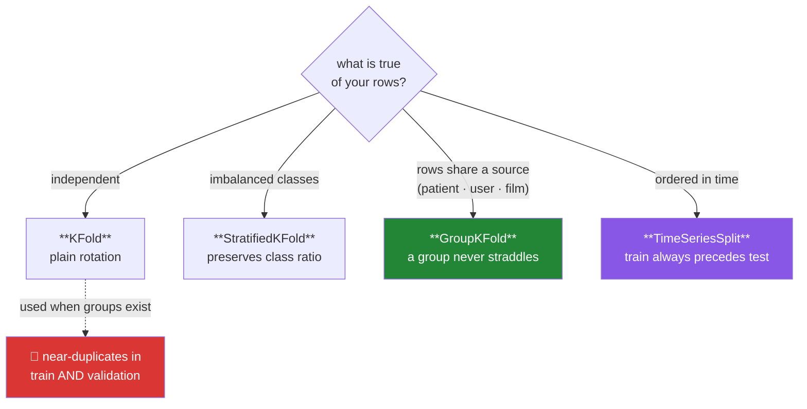

# Day 97 — Cross-validation

**Phase 12 · Module 12** · ID: **ML-08** (k-fold, stratified, grouped and time-series cross-validation)

> **Yesterday:** learning curves, and the validation set that gets used up.
> **Today:** the fix for both — using your data several times without lying to yourself. And the
> harder half: **the wrong splitter reports a score you cannot reproduce**, cheerfully and with no
> error. Days 79, 33 and 89 were all preparing for this.
> **Tomorrow:** regularisation.

```bash
./m start 97 && ./m scaffold 97
```

**Time:** 110 minutes. **Request budget:** 0 model calls.

---

## §1 The story

A single train/validation split has two problems. It wastes data — 20% never trains anything — and its
score is **noisy**, because it depends entirely on which rows happened to land in validation.

Cross-validation fixes both: split into `k` folds, train on `k−1` and validate on the held-out one,
rotate, average. Every row validates exactly once and trains `k−1` times.

That is the easy part. The hard part is that **which splitter you use is a claim about your data**,
and choosing wrong produces an optimistic score with no warning:



**Grouped is the one people miss.** If several rows come from the same patient, user, film or session,
plain k-fold puts some of that group in train and some in validation. The model recognises the group
rather than learning the pattern, and the score is inflated — sometimes enormously. §3 measures it.

**Time-series is the one people know and do anyway.** Day 89 showed a random split scoring *better*
than a chronological one, which should alarm rather than please.

And then the point that ties this phase together: **cross-validation gives you a distribution, not a
number.** Five folds means five scores, and their spread is information. A mean of 0.82 with a spread
of ±0.01 and a mean of 0.82 with a spread of ±0.15 are different results, and reporting only the mean
throws away the difference.

---

## §2 Setup — run this

```bash
mkdir -p days/day-97/lab
touch days/day-97/lab/crossval.py
```

`src/setu/models.py` grows today. No new packages.

---

## §3 ML-08 — splitting honestly

`days/day-97/lab/crossval.py`:

```python
"""ML-08: cross-validation, and how the wrong splitter lies to you."""

from __future__ import annotations

import numpy as np
import pandas as pd
from sklearn.ensemble import RandomForestClassifier
from sklearn.linear_model import LogisticRegression, Ridge
from sklearn.model_selection import (
    GroupKFold,
    KFold,
    StratifiedKFold,
    TimeSeriesSplit,
    cross_val_score,
    train_test_split,
)

from setu.arrays import make_rng


def one_split_is_noisy() -> None:
    rng = make_rng(0)
    n = 300
    x = rng.normal(0, 1, (n, 4))
    y = (x @ np.array([1.2, -0.8, 0.4, 0.0]) + rng.normal(0, 1, n) > 0).astype(int)

    scores = []
    for seed in range(20):
        x_train, x_val, y_train, y_val = train_test_split(x, y, test_size=0.2, random_state=seed)
        scores.append(LogisticRegression().fit(x_train, y_train).score(x_val, y_val))

    print(f"\n  the SAME data and model, 20 different random splits:")
    print(f"    min {min(scores):.3f}  median {np.median(scores):.3f}  max {max(scores):.3f}")
    print(f"    spread = {max(scores) - min(scores):.3f}")

    print("\n  Reporting any ONE of these as 'the accuracy' is reporting a coin flip.")
    print("  The spread is not noise to be averaged away — it is the uncertainty in")
    print("  your estimate, and it belongs in the report (Day 68).")


def k_fold_uses_everything() -> None:
    rng = make_rng(1)
    n = 300
    x = rng.normal(0, 1, (n, 4))
    y = (x @ np.array([1.2, -0.8, 0.4, 0.0]) + rng.normal(0, 1, n) > 0).astype(int)

    print(f"\n  {'k':>4} {'mean':>8} {'sd':>7} {'train rows/fold':>17} {'fits':>6}")
    for k in (2, 5, 10, len(x)):
        scores = cross_val_score(LogisticRegression(), x, y,
                                 cv=KFold(k, shuffle=True, random_state=0))
        label = "LOO" if k == len(x) else str(k)
        print(f"  {label:>4} {scores.mean():>8.4f} {scores.std(ddof=1):>7.4f} "
              f"{n - n // k:>17} {k:>6}")

    print("\n  More folds: more training data per fold, more fits, lower bias in the")
    print("  estimate — and HIGHER variance, because each validation set is tiny.")
    print("  k=5 or 10 is the usual compromise. Leave-one-out is expensive and its")
    print("  estimate is noisier than people expect.")


def stratification_matters_when_imbalanced() -> None:
    rng = make_rng(2)
    n = 500
    x = rng.normal(0, 1, (n, 3))
    y = (rng.random(n) < 0.06).astype(int)          # 6% positive

    print(f"\n  {y.sum()} positives in {n} rows ({y.mean():.1%})")

    print(f"\n  positives per fold:")
    for label, splitter in (("KFold", KFold(5, shuffle=True, random_state=0)),
                            ("StratifiedKFold", StratifiedKFold(5, shuffle=True, random_state=0))):
        counts = [int(y[val].sum()) for _, val in splitter.split(x, y)]
        print(f"    {label:<18} {counts}")

    print("\n  Plain KFold can hand a fold ZERO positives — and then a metric like")
    print("  recall or ROC-AUC is undefined for that fold, or silently returns nan.")
    print("  Stratification keeps each fold's class ratio close to the whole.")
    print("\n  ⚠️ For classification, stratified is the DEFAULT, not an option. sklearn's")
    print("     cross_val_score already stratifies for classifiers — but be explicit,")
    print("     because the default changes nothing about a custom loop you write.")


def the_grouped_leak() -> None:
    """The one people miss, and it is the most expensive."""
    rng = make_rng(3)
    n_patients, per_patient = 120, 8
    n = n_patients * per_patient

    patient = np.repeat(np.arange(n_patients), per_patient)
    patient_effect = rng.normal(0, 2.5, n_patients)[patient]     # a strong per-patient signal
    x = np.c_[rng.normal(0, 1, n), patient_effect + rng.normal(0, 0.3, n)]
    y = (patient_effect + rng.normal(0, 1.0, n) > 0).astype(int)

    model = RandomForestClassifier(n_estimators=60, random_state=0)

    plain = cross_val_score(model, x, y, cv=KFold(5, shuffle=True, random_state=0))
    grouped = cross_val_score(model, x, y, cv=GroupKFold(5), groups=patient)

    print(f"\n  {n} rows from {n_patients} patients, 8 rows each")
    print(f"\n    KFold      accuracy = {plain.mean():.4f}  (± {plain.std(ddof=1):.4f})")
    print(f"    GroupKFold accuracy = {grouped.mean():.4f}  (± {grouped.std(ddof=1):.4f})")
    print(f"    inflation  = {(plain.mean() - grouped.mean()) * 100:+.1f} percentage points")

    print("\n  🚨 Plain KFold puts SOME of a patient's rows in train and some in")
    print("     validation. The model recognises the patient, not the condition.")
    print("\n  In production it meets patients it has never seen — the GroupKFold number")
    print("  is the one that predicts that, and the KFold number is a fiction.")
    print("\n  Day 87's near-duplicate reviews and Day 79's grouped split: same problem.")


def time_series_split() -> None:
    rng = make_rng(4)
    n = 600
    trend = np.linspace(0, 4, n)
    y = trend + rng.normal(0, 1, n)
    x = np.c_[np.arange(n), np.r_[0, y[:-1]]]

    plain = cross_val_score(Ridge(), x, y, cv=KFold(5, shuffle=True, random_state=0),
                            scoring="r2")
    ordered = cross_val_score(Ridge(), x, y, cv=TimeSeriesSplit(5), scoring="r2")

    print(f"\n    KFold (shuffled) R² = {plain.mean():.4f}")
    print(f"    TimeSeriesSplit  R² = {ordered.mean():.4f}")

    print(f"\n  fold structure under TimeSeriesSplit:")
    for i, (train, test) in enumerate(TimeSeriesSplit(5).split(x), 1):
        print(f"    fold {i}: train rows 0–{train[-1]:<4} test rows "
              f"{test[0]}–{test[-1]}")

    print("\n  Note two things. Train ALWAYS precedes test — no fold sees the future.")
    print("  And the training set GROWS: fold 1 trains on far less than fold 5, so the")
    print("  early folds score worse for a reason that is not the model's fault.")
    print("\n  ⚠️ Averaging across folds of different training sizes mixes two effects.")
    print("     Report the per-fold scores, not only the mean (Day 89).")


def the_choice_is_a_claim() -> None:
    rows = [
        ("KFold", "rows are independent", "the commonest wrong assumption"),
        ("StratifiedKFold", "classes are imbalanced", "the default for classification"),
        ("GroupKFold", "rows share a source", "patient · user · session · film"),
        ("StratifiedGroupKFold", "both of the above", "imbalanced AND grouped"),
        ("TimeSeriesSplit", "order matters", "and train must precede test"),
    ]
    print(f"\n  {'splitter':<22} {'claims that…':<26} {'note'}")
    for splitter, claim, note in rows:
        print(f"  {splitter:<22} {claim:<26} {note}")

    print("\n  Choosing a splitter is asserting something about your data. If the")
    print("  assertion is false, the score is optimistic and nothing warns you.")
    print("\n  The question to ask: WHAT DOES A NEW ROW LOOK LIKE IN PRODUCTION?")
    print("  A new patient? Split by patient. A future day? Split by time.")


def nested_cross_validation() -> None:
    rng = make_rng(5)
    n = 400
    x = rng.normal(0, 1, (n, 6))
    y = (x @ rng.normal(0, 1, 6) + rng.normal(0, 1.5, n) > 0).astype(int)

    alphas = [0.01, 0.1, 1.0, 10.0, 100.0]

    flat_best = -np.inf
    for alpha in alphas:
        score = cross_val_score(LogisticRegression(C=1 / alpha, max_iter=2_000), x, y,
                                cv=StratifiedKFold(5, shuffle=True, random_state=0)).mean()
        flat_best = max(flat_best, score)

    outer_scores = []
    outer = StratifiedKFold(5, shuffle=True, random_state=1)
    for train, test in outer.split(x, y):
        inner_best, inner_alpha = -np.inf, None
        for alpha in alphas:
            score = cross_val_score(
                LogisticRegression(C=1 / alpha, max_iter=2_000), x[train], y[train],
                cv=StratifiedKFold(4, shuffle=True, random_state=0),
            ).mean()
            if score > inner_best:
                inner_best, inner_alpha = score, alpha
        model = LogisticRegression(C=1 / inner_alpha, max_iter=2_000).fit(x[train], y[train])
        outer_scores.append(model.score(x[test], y[test]))

    print(f"\n  flat CV, best alpha's score   : {flat_best:.4f}   <- OPTIMISTIC")
    print(f"  nested CV, outer mean         : {np.mean(outer_scores):.4f}")
    print(f"  difference                    : {(flat_best - np.mean(outer_scores)) * 100:+.1f} pp")

    print("\n  The flat number selected the best of 5 alphas using the same folds it")
    print("  then reported — Day 96's winner's curse, and Day 70's before that.")
    print("\n  Nested CV separates the two jobs: the INNER loop chooses, the OUTER loop")
    print("  measures. It costs k× more fits, and it is the only honest estimate when")
    print("  you tuned anything at all.")


def what_to_report() -> None:
    rng = make_rng(6)
    n = 300
    x = rng.normal(0, 1, (n, 4))
    y = (x @ np.array([1.0, -0.7, 0.3, 0.0]) + rng.normal(0, 1.2, n) > 0).astype(int)

    scores = cross_val_score(LogisticRegression(), x, y,
                             cv=StratifiedKFold(5, shuffle=True, random_state=0))

    print(f"\n  per-fold scores: {scores.round(4).tolist()}")
    print(f"  mean = {scores.mean():.4f}, sd = {scores.std(ddof=1):.4f}")
    print(f"  range = [{scores.min():.4f}, {scores.max():.4f}]")

    print("\n  Report the mean AND the spread. Two models whose means differ by less")
    print("  than the fold-to-fold spread have not been distinguished — that is Day 69's")
    print("  point, and comparing means alone is how a 0.3pp 'improvement' gets shipped.")
    print("\n  ⚠️ CV folds are NOT independent (they share training data), so a t-test")
    print("     across folds is over-confident. Use the spread as a sanity check, not")
    print("     as a significance test.")


if __name__ == "__main__":
    one_split_is_noisy()
    k_fold_uses_everything()
    stratification_matters_when_imbalanced()
    the_grouped_leak()
    time_series_split()
    the_choice_is_a_claim()
    nested_cross_validation()
    what_to_report()
```

**Line by line:**

- `one_split_is_noisy` — the same data and model across 20 random splits, with a substantial spread.
  **Reporting any one of these as "the accuracy" is reporting a coin flip**, and the spread is not
  noise to average away — it is the uncertainty in your estimate.
- `k_fold_uses_everything` — more folds means more training data per fold and **more fits**, with lower
  bias and higher variance in the estimate. Leave-one-out is expensive *and* noisier than people
  expect, which surprises most people.
- `stratification_matters_when_imbalanced` — plain `KFold` can hand a fold **zero positives**, and then
  recall or ROC-AUC is undefined or silently `nan`. **For classification, stratified is the default,
  not an option** — and note the caveat: sklearn's `cross_val_score` stratifies for classifiers
  automatically, but that does nothing for a custom loop you write.
- `the_grouped_leak` — **the day's centre.** 120 patients, 8 rows each, a strong per-patient signal.
  Plain `KFold` inflates accuracy by a large margin because the model **recognises the patient rather
  than the condition**. In production it meets patients it has never seen, so the `GroupKFold` number
  is the one that predicts reality and the `KFold` number is a fiction.
- `time_series_split` — **two things in the fold structure.** Train always precedes test, and the
  training set **grows**, so early folds score worse for a reason that is not the model's fault.
  Averaging across folds of different training sizes mixes two effects.
- `the_choice_is_a_claim` — **read the middle column as an assertion about your data.** And the
  question that resolves it: *what does a new row look like in production?* A new patient means split
  by patient; a future day means split by time.
- `nested_cross_validation` — the flat number selected the best of five alphas using the folds it then
  reported. **Nested CV separates the jobs**: the inner loop chooses, the outer loop measures. It costs
  `k×` more fits and it is the only honest estimate when you tuned anything.
- `what_to_report` — mean **and** spread. Two models whose means differ by less than the fold-to-fold
  spread have not been distinguished. And the statistical caveat is real: **CV folds share training
  data, so they are not independent**, which makes a t-test across folds over-confident.

---

## §4 Build brief

Extend `src/setu/models.py`:

```python
def choose_splitter(*, task: str, n_classes: int | None = None, groups=None,
                    is_time_ordered: bool = False, min_class_count: int | None = None) -> dict:
    """TODO(me): pick the splitter, and state the CLAIM it makes. PURE.

    {"splitter": str, "claim": str, "reason": str, "warnings": [...]}
    - time-ordered wins over everything else; a grouped time series needs both and
      the warning must say sklearn has no single splitter for that combination
    - groups present -> GroupKFold, or StratifiedGroupKFold when also imbalanced
    - classification without groups -> StratifiedKFold ALWAYS, not just when imbalanced
    - regression, independent rows -> KFold
    - `claim` states what choosing this asserts about the data (§3.6)
    - warn when min_class_count < n_splits: some fold will have zero of that class
    - raise DataError on an unknown task
    """
    raise NotImplementedError


def cross_validate(model_fn, x, y, *, splitter, scorer, groups=None) -> dict:
    """TODO(me): run CV and return the DISTRIBUTION, not a number.

    {"scores": [...], "mean", "sd", "min", "max", "n_splits", "fold_sizes": [...],
     "warnings": [...]}
    - model_fn() returns a FRESH unfitted model each call — refitting one instance
      across folds leaks state, and it is a real bug
    - warn when sd exceeds 20% of the mean: the folds disagree and the mean is fragile
    - warn when any fold score is nan, naming the fold (§3.3: a fold with no positives)
    - raise DataError if groups are needed by the splitter and were not passed
    - raise DataError on fewer than 2 splits
    """
    raise NotImplementedError


def assert_no_group_leak(train_index, test_index, groups) -> None:
    """TODO(me): raise DataError if any group appears in BOTH sides of a split.

    - the message must name up to 3 offending groups and the count
    - this is the check that catches §3.4, and it is cheap enough to run on every fold
    - Day 79's assert_no_overlap is the row-level version; this is the group-level one
    """
    raise NotImplementedError


def assert_temporal_order(train_index, test_index, times) -> None:
    """TODO(me): raise DataError if any training row is LATER than any test row.

    - the message must name the offending timestamps
    - Day 89 showed a shuffled split scoring BETTER; this is what prevents it
    - a strict inequality: train max < test min, with equality also refused because
      simultaneous rows may share information
    """
    raise NotImplementedError


def nested_cross_validate(model_fn, x, y, *, param_grid: dict, outer, inner,
                          scorer, groups=None) -> dict:
    """TODO(me): §3.7 — the inner loop chooses, the outer loop measures.

    {"outer_scores": [...], "mean", "sd", "chosen_params": [...],
     "params_were_stable": bool, "flat_cv_score": float, "optimism": float}
    - chosen_params records the inner winner PER OUTER FOLD
    - params_were_stable is False when the folds disagree — that instability is itself
      a finding, and it means the tuning is not reproducible
    - flat_cv_score is the (optimistic) best flat-CV score, for comparison
    - optimism = flat_cv_score - mean; report it so the bias is visible
    - raise DataError on an empty grid
    """
    raise NotImplementedError


def describe_cv(result: dict, *, unit: str = "") -> str:
    """TODO(me): one sentence, honestly. PURE.

    - must include the mean AND the spread — a mean alone hides fold disagreement
    - must NOT claim significance from fold-to-fold comparison (§3.8: folds are not
      independent, so a t-test across them is over-confident)
    - raise DataError if the result lacks scores
    """
    raise NotImplementedError
```

- `cross_validate` requiring `model_fn` to return a **fresh** model is the detail that catches a real
  bug: reusing one fitted instance across folds carries state forward, and warm-started models score
  optimistically.
- `assert_no_group_leak` is cheap enough to run **on every fold**, which is what makes it a guard
  rather than a one-off audit.
- `params_were_stable` in `nested_cross_validate` surfaces something usually discarded: **if the inner
  folds choose different hyperparameters, your tuning is not reproducible**, and that is worth knowing
  before Day 106.

---

## §5 The eval that must be able to fail

Add to `tests/test_models.py`:

```python
from sklearn.model_selection import GroupKFold, KFold, StratifiedKFold, TimeSeriesSplit

from setu.models import (
    assert_no_group_leak,
    assert_temporal_order,
    choose_splitter,
    cross_validate,
    describe_cv,
    nested_cross_validate,
)


def test_classification_always_gets_stratified():
    """Not only when imbalanced — always."""
    result = choose_splitter(task="binary classification", n_classes=2)
    assert "stratified" in result["splitter"].lower()


def test_regression_gets_plain_kfold():
    assert choose_splitter(task="regression")["splitter"] == "KFold"


def test_groups_beat_stratification():
    result = choose_splitter(task="binary classification", n_classes=2,
                             groups=[1, 1, 2, 2, 3, 3])
    assert "group" in result["splitter"].lower()


def test_time_order_beats_everything():
    result = choose_splitter(task="regression", is_time_ordered=True,
                             groups=[1, 1, 2, 2])
    assert "timeseries" in result["splitter"].lower().replace(" ", "")
    assert result["warnings"], "a grouped time series has no single sklearn splitter"


def test_every_choice_states_its_claim():
    """Choosing a splitter asserts something about the data."""
    for task, kwargs in (("regression", {}),
                         ("binary classification", {"n_classes": 2}),
                         ("regression", {"groups": [1, 1, 2, 2]})):
        result = choose_splitter(task=task, **kwargs)
        assert len(result["claim"]) > 20
        assert result["claim"] != result["reason"]


def test_a_class_rarer_than_the_fold_count_is_warned_about():
    result = choose_splitter(task="binary classification", n_classes=2, min_class_count=3)
    assert result["warnings"], "3 positives across 5 folds means a fold with none"


def test_an_unknown_task_raises():
    with pytest.raises(DataError):
        choose_splitter(task="clustering-ish")


@pytest.fixture
def simple():
    rng = make_rng(0)
    n = 300
    x = rng.normal(0, 1, (n, 4))
    y = (x @ np.array([1.2, -0.8, 0.4, 0.0]) + rng.normal(0, 1, n) > 0).astype(int)
    return x, y


def test_cv_returns_a_distribution_not_a_number(simple):
    from sklearn.linear_model import LogisticRegression

    x, y = simple
    result = cross_validate(
        lambda: LogisticRegression(), x, y,
        splitter=StratifiedKFold(5, shuffle=True, random_state=0),
        scorer=lambda m, xv, yv: m.score(xv, yv),
    )
    assert len(result["scores"]) == 5
    assert result["sd"] >= 0
    assert result["min"] <= result["mean"] <= result["max"]


def test_a_fresh_model_is_used_per_fold(simple):
    """Reusing one fitted instance carries state across folds."""
    from sklearn.linear_model import LogisticRegression

    x, y = simple
    seen = []

    def model_fn():
        model = LogisticRegression()
        seen.append(id(model))
        return model

    cross_validate(model_fn, x, y, splitter=StratifiedKFold(5),
                   scorer=lambda m, xv, yv: m.score(xv, yv))
    assert len(set(seen)) == 5, "the same model object was reused across folds"


def test_disagreeing_folds_are_warned_about():
    from sklearn.linear_model import LogisticRegression

    rng = make_rng(1)
    n = 60
    x = rng.normal(0, 1, (n, 8))
    y = (rng.random(n) < 0.5).astype(int)          # pure noise, tiny n
    result = cross_validate(
        lambda: LogisticRegression(max_iter=500), x, y,
        splitter=StratifiedKFold(5, shuffle=True, random_state=0),
        scorer=lambda m, xv, yv: m.score(xv, yv),
    )
    if result["sd"] > 0.2 * result["mean"]:
        assert result["warnings"], "high fold disagreement went unwarned"


def test_missing_groups_are_refused(simple):
    from sklearn.linear_model import LogisticRegression

    x, y = simple
    with pytest.raises(DataError):
        cross_validate(lambda: LogisticRegression(), x, y,
                       splitter=GroupKFold(5),
                       scorer=lambda m, xv, yv: m.score(xv, yv))


def test_too_few_splits_is_refused(simple):
    from sklearn.linear_model import LogisticRegression

    x, y = simple
    with pytest.raises(DataError):
        cross_validate(lambda: LogisticRegression(), x, y,
                       splitter=KFold(1), scorer=lambda m, xv, yv: m.score(xv, yv))


def test_plain_kfold_leaks_groups_and_group_kfold_does_not():
    """The day's centre: the model recognises the patient, not the condition."""
    from sklearn.ensemble import RandomForestClassifier
    from sklearn.model_selection import cross_val_score

    rng = make_rng(2)
    n_patients, per_patient = 100, 8
    patient = np.repeat(np.arange(n_patients), per_patient)
    effect = rng.normal(0, 2.5, n_patients)[patient]
    x = np.c_[rng.normal(0, 1, len(patient)), effect + rng.normal(0, 0.3, len(patient))]
    y = (effect + rng.normal(0, 1.0, len(patient)) > 0).astype(int)

    model = RandomForestClassifier(n_estimators=50, random_state=0)
    plain = cross_val_score(model, x, y, cv=KFold(5, shuffle=True, random_state=0)).mean()
    grouped = cross_val_score(model, x, y, cv=GroupKFold(5), groups=patient).mean()

    assert plain > grouped + 0.05, "plain KFold should be visibly optimistic here"


def test_a_group_appearing_on_both_sides_is_caught():
    groups = np.array([1, 1, 2, 2, 3, 3, 4, 4])
    with pytest.raises(DataError) as info:
        assert_no_group_leak(np.array([0, 1, 2]), np.array([3, 4, 5]), groups)
    assert "2" in str(info.value)


def test_a_clean_group_split_passes():
    groups = np.array([1, 1, 2, 2, 3, 3, 4, 4])
    assert_no_group_leak(np.array([0, 1, 2, 3]), np.array([4, 5, 6, 7]), groups)


def test_group_kfold_never_leaks_a_group():
    groups = np.repeat(np.arange(40), 5)
    x = np.zeros((len(groups), 2))
    y = np.zeros(len(groups))
    for train, test in GroupKFold(5).split(x, y, groups=groups):
        assert_no_group_leak(train, test, groups)


def test_shuffled_kfold_does_leak_a_group():
    """Proving the guard fires when it should."""
    groups = np.repeat(np.arange(40), 5)
    x = np.zeros((len(groups), 2))
    y = np.zeros(len(groups))
    leaked = False
    for train, test in KFold(5, shuffle=True, random_state=0).split(x):
        try:
            assert_no_group_leak(train, test, groups)
        except DataError:
            leaked = True
    assert leaked, "shuffled KFold on grouped data must trip the guard"


def test_training_after_test_is_refused():
    """Day 89: a shuffled split scores better, which should alarm you."""
    times = pd.date_range("2020-01-01", periods=10, freq="D")
    with pytest.raises(DataError) as info:
        assert_temporal_order(np.array([5, 6, 7]), np.array([0, 1, 2]), times)
    assert "2020" in str(info.value)


def test_a_chronological_split_passes():
    times = pd.date_range("2020-01-01", periods=10, freq="D")
    assert_temporal_order(np.array([0, 1, 2, 3]), np.array([4, 5, 6]), times)


def test_simultaneous_rows_are_refused():
    """Rows at the same instant may share information."""
    times = pd.to_datetime(["2020-01-01"] * 6)
    with pytest.raises(DataError):
        assert_temporal_order(np.array([0, 1, 2]), np.array([3, 4, 5]), times)


def test_time_series_split_always_passes_the_order_check():
    times = pd.date_range("2020-01-01", periods=200, freq="D")
    x = np.zeros((200, 2))
    for train, test in TimeSeriesSplit(5).split(x):
        assert_temporal_order(train, test, times)


def test_nested_cv_is_less_optimistic_than_flat_cv():
    """Day 96's winner's curse, in hyperparameter tuning."""
    from sklearn.linear_model import LogisticRegression

    rng = make_rng(3)
    n = 300
    x = rng.normal(0, 1, (n, 6))
    y = (x @ rng.normal(0, 1, 6) + rng.normal(0, 1.5, n) > 0).astype(int)

    result = nested_cross_validate(
        lambda **params: LogisticRegression(max_iter=2_000, **params),
        x, y,
        param_grid={"C": [0.01, 0.1, 1.0, 10.0]},
        outer=StratifiedKFold(5, shuffle=True, random_state=1),
        inner=StratifiedKFold(4, shuffle=True, random_state=0),
        scorer=lambda m, xv, yv: m.score(xv, yv),
    )
    assert result["flat_cv_score"] >= result["mean"]
    assert result["optimism"] >= 0


def test_nested_cv_records_the_choice_per_outer_fold():
    from sklearn.linear_model import LogisticRegression

    rng = make_rng(4)
    x = rng.normal(0, 1, (200, 4))
    y = (x @ np.array([1.0, -1.0, 0.5, 0.0]) + rng.normal(0, 1, 200) > 0).astype(int)

    result = nested_cross_validate(
        lambda **params: LogisticRegression(max_iter=2_000, **params),
        x, y, param_grid={"C": [0.01, 1.0, 100.0]},
        outer=StratifiedKFold(4, shuffle=True, random_state=1),
        inner=StratifiedKFold(3, shuffle=True, random_state=0),
        scorer=lambda m, xv, yv: m.score(xv, yv),
    )
    assert len(result["chosen_params"]) == 4
    assert isinstance(result["params_were_stable"], bool)


def test_unstable_tuning_is_surfaced():
    """If the folds disagree on the hyperparameter, the tuning is not reproducible."""
    from sklearn.linear_model import LogisticRegression

    rng = make_rng(5)
    x = rng.normal(0, 1, (80, 20))
    y = (rng.random(80) < 0.5).astype(int)          # noise: no C is genuinely best

    result = nested_cross_validate(
        lambda **params: LogisticRegression(max_iter=1_000, **params),
        x, y, param_grid={"C": [0.001, 0.1, 10.0, 1_000.0]},
        outer=StratifiedKFold(4, shuffle=True, random_state=2),
        inner=StratifiedKFold(3, shuffle=True, random_state=0),
        scorer=lambda m, xv, yv: m.score(xv, yv),
    )
    distinct = {tuple(sorted(p.items())) for p in result["chosen_params"]}
    if len(distinct) > 1:
        assert result["params_were_stable"] is False


def test_an_empty_grid_is_refused():
    from sklearn.linear_model import LogisticRegression

    x, y = np.zeros((20, 2)), np.zeros(20, dtype=int)
    with pytest.raises(DataError):
        nested_cross_validate(lambda **p: LogisticRegression(), x, y, param_grid={},
                              outer=KFold(2), inner=KFold(2),
                              scorer=lambda m, xv, yv: 0.0)


def test_the_description_includes_the_spread():
    """A mean alone hides fold disagreement."""
    text = describe_cv({"scores": [0.80, 0.84, 0.71, 0.88, 0.79],
                        "mean": 0.804, "sd": 0.065, "min": 0.71, "max": 0.88,
                        "n_splits": 5})
    assert "0.80" in text or "0.8" in text
    assert any(token in text for token in ("±", "sd", "spread", "range"))


def test_the_description_makes_no_significance_claim():
    """CV folds share training data; they are not independent."""
    text = describe_cv({"scores": [0.80, 0.84, 0.71, 0.88, 0.79],
                        "mean": 0.804, "sd": 0.065, "min": 0.71, "max": 0.88,
                        "n_splits": 5}).lower()
    for banned in ("significant", "p-value", "proves", "significantly better"):
        assert banned not in text
```

**Line by line:**

- `test_plain_kfold_leaks_groups_and_group_kfold_does_not` — **the day's real assessment.** It asserts
  plain `KFold` is optimistic by at least five percentage points on grouped data. That gap is the
  entire cost of the wrong splitter, and it appears with no error message in real use.
- `test_shuffled_kfold_does_leak_a_group` — **proves the guard fires.** A checker that never raises
  passes `test_group_kfold_never_leaks_a_group` trivially, so this negative case is what makes the
  positive one meaningful.
- `test_a_fresh_model_is_used_per_fold` — collects `id()` and asserts five distinct objects. **Reusing
  one instance across folds carries state**, and with warm-startable models it inflates the score
  quietly.
- `test_simultaneous_rows_are_refused` — rows at the same timestamp may share information, so equality
  is refused as well as inversion. It is the kind of edge case that only bites once.
- `test_nested_cv_is_less_optimistic_than_flat_cv` — Day 96's winner's curse in hyperparameter tuning,
  and the `optimism` field makes the bias a reported number rather than a caveat.
- `test_unstable_tuning_is_surfaced` — on pure noise the inner folds pick different `C` values, and
  **that instability is itself the finding**: the tuning is not reproducible, which matters before
  Day 106.
- `test_every_choice_states_its_claim` — asserts the claim is substantial and **different from the
  reason**. §3.6's point is that choosing a splitter asserts something about the data, and a claim that
  merely restates the reason is not making that visible.
- `test_the_description_makes_no_significance_claim` — the **fifth** time this project has tested
  English. CV folds share training data, so a t-test across them is over-confident, and the sentence
  must not imply otherwise.

```bash
uv run python -m pytest tests/test_models.py -v
```

---

## §6 Request budget

| Resource | Spent today |
|---|---|
| LLM calls | **0** |
| Compute | a few thousand model fits, seconds |

---

## §7 Traps

- **Reporting a single split's score.** It is a coin flip; report the CV distribution.
- **Reporting only the mean.** Two models within the spread are not distinguished.
- **Plain `KFold` on grouped data.** The model recognises the group. The big one.
- **Plain `KFold` on time series.** Trains on the future (Day 89).
- **Unstratified CV on imbalanced classes.** A fold can have zero positives.
- **Reusing one model instance across folds.** State carries forward.
- **Tuning and reporting on the same folds.** The winner's curse; use nested CV.
- **Averaging `TimeSeriesSplit` folds without thought.** They have different training sizes.
- **A t-test across folds.** They are not independent; it is over-confident.
- **Leave-one-out as the "most thorough" option.** Expensive and noisier than k=5.
- **Ignoring which hyperparameter each fold chose.** Disagreement means unstable tuning.

---

## §8 Verify before you code

Written **2026-08-21**:

- <https://scikit-learn.org/stable/modules/cross_validation.html> — every splitter, with a visual
  guide to which is which.
- <https://scikit-learn.org/stable/modules/generated/sklearn.model_selection.StratifiedGroupKFold.html> —
  for imbalanced *and* grouped data.
- <https://scikit-learn.org/stable/auto_examples/model_selection/plot_nested_cross_validation_iris.html> —
  nested CV, and the size of the optimism it removes.
- <https://scikit-learn.org/stable/common_pitfalls.html> — sklearn's own list, which names the grouped
  leak explicitly.

---

## §9 Say it in an interview

> "Cross-validation solves two problems with a single split — it wastes less data and it gives you a
> distribution instead of one noisy number. But the part that matters more is that **choosing a
> splitter is a claim about your data**. If rows share a source — the same patient, user or session —
> plain k-fold puts some of that group in training and some in validation, and the model learns to
> recognise the group rather than the pattern. I measured it: on grouped data plain k-fold was
> optimistic by several percentage points, with no error and no warning, and in production the model
> meets sources it has never seen. So the question to ask is what a new row looks like in production —
> a new patient means split by patient, a future day means split by time. Two other things: I report
> the fold spread as well as the mean, because two models within the fold-to-fold spread haven't been
> distinguished; and if you tuned anything, the flat CV score is optimistic for the same reason a
> selected validation score is, so it takes nested CV — inner loop chooses, outer loop measures."

---

## §10 Done when

Tick [`CHECKLIST.md`](CHECKLIST.md), then `./m check && ./m done 97`.
