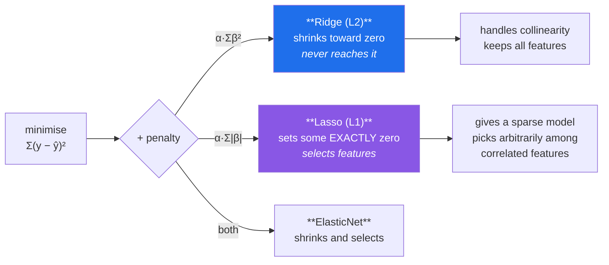

# Day 98 — Regularisation: Ridge, Lasso, ElasticNet

**Phase 12 · Module 12** · ID: **ML-09** (L2, L1 and combined regularisation)

> **Yesterday:** cross-validation, and the splitter that decides whether your score is real.
> **Today:** the direct fix for Day 96's variance problem. **Deliberately make the model fit the
> training data worse**, and watch it generalise better — which sounds absurd until you see where the
> coefficients go without it.
> **Tomorrow:** logistic regression from scratch.

```bash
./m start 98 && ./m scaffold 98
```

**Time:** 110 minutes. **Request budget:** 0 model calls.

---

## §1 The story

Day 96 ended with an observation worth returning to: an overfitting polynomial had **enormous
coefficients that cancelled each other out**. That is the mechanism, and it points straight at the fix.

Ordinary least squares minimises one thing: `Σ(y − ŷ)²`. Regularisation adds a **penalty on the
coefficients themselves**:



**You are choosing to fit worse on purpose.** Training error goes up. The bet is that variance falls
further than bias rises — Day 96's decomposition, deliberately traded.

**The difference between L1 and L2 is the one thing to actually understand.** L2 penalises `β²`, so
the pressure to shrink weakens as `β` approaches zero, and a coefficient asymptotes toward zero
without arriving. L1 penalises `|β|`, whose gradient is constant all the way down, so it pushes
coefficients **to exactly zero** — which makes Lasso a feature selector as well as a regulariser.

Three things that catch people, all demonstrated in §3:

**Scaling is mandatory, and for a new reason.** A penalty of `α·Σβ²` treats every coefficient
identically — but a feature measured in millimetres has a coefficient a thousand times smaller than
the same feature in metres, so it gets penalised a thousand times less. **Unscaled regularisation
penalises features by their units.** Day 80 and Day 95 both said scale; this is the third distinct
reason.

**The intercept is not penalised.** Shrinking it would drag predictions toward zero rather than toward
the mean, which is not what anyone wants. Every library excludes it; a from-scratch implementation
must too.

**α is chosen by cross-validation, and that is a tuning step** — so Day 97's nested CV applies. A
Ridge score at the α that minimised the CV error is optimistic.

---

## §2 Setup — run this

```bash
mkdir -p days/day-98/lab
touch days/day-98/lab/regularise.py
```

`src/setu/models.py` grows today. No new packages.

---

## §3 ML-09 — penalising

`days/day-98/lab/regularise.py`:

```python
"""ML-09: L1 and L2 penalties — what they do, and why scaling is mandatory."""

from __future__ import annotations

import numpy as np
from sklearn.linear_model import ElasticNet, Lasso, LinearRegression, Ridge, RidgeCV
from sklearn.model_selection import KFold, cross_val_score

from setu.arrays import make_rng


def collinear_data(n=120, p=40, informative=5, *, seed=0, correlate=True):
    """Wide-ish, with only a few real signals and some near-duplicate columns."""
    rng = make_rng(seed)
    x = rng.normal(0, 1, (n, p))
    if correlate:
        for j in range(informative, informative + 6):
            x[:, j] = x[:, j % informative] + rng.normal(0, 0.05, n)   # near-duplicates
    beta = np.zeros(p)
    beta[:informative] = np.array([3.0, -2.0, 1.5, -1.0, 0.8])
    return x, x @ beta + rng.normal(0, 1.0, n), beta


def where_coefficients_go_without_a_penalty() -> None:
    x, y, true_beta = collinear_data()
    model = LinearRegression().fit(x, y)

    print(f"\n  {x.shape[0]} rows, {x.shape[1]} features, 5 of them real")
    print(f"    true coefficient norm    : {np.linalg.norm(true_beta):>10.2f}")
    print(f"    fitted coefficient norm  : {np.linalg.norm(model.coef_):>10.2f}")
    print(f"    largest fitted |β|       : {np.abs(model.coef_).max():>10.2f}")
    print(f"    training R²              : {model.score(x, y):>10.4f}")

    x_test, y_test, _ = collinear_data(n=3_000, seed=99)
    print(f"    test R²                  : {model.score(x_test, y_test):>10.4f}")

    print("\n  Near-perfect on training, poor on test, and coefficients far larger than")
    print("  the truth. Day 96's signature: enormous values that cancel each other out.")
    print("  Regularisation attacks exactly that.")


def ridge_from_scratch() -> None:
    x, y, _ = collinear_data(n=200, p=8, informative=3)
    x_scaled = (x - x.mean(axis=0)) / x.std(axis=0, ddof=1)
    y_centred = y - y.mean()
    alpha = 5.0

    p = x_scaled.shape[1]
    identity = np.eye(p)
    beta = np.linalg.solve(x_scaled.T @ x_scaled + alpha * identity, x_scaled.T @ y_centred)

    library = Ridge(alpha=alpha, fit_intercept=False).fit(x_scaled, y_centred)

    print(f"\n  by hand : {np.round(beta[:5], 5).tolist()}")
    print(f"  sklearn : {np.round(library.coef_[:5], 5).tolist()}")
    print(f"  max difference: {np.abs(beta - library.coef_).max():.2e}")

    print("\n  Ridge is one line: (XᵀX + αI)⁻¹Xᵀy. The αI term is why it is sometimes")
    print("  called 'ridge' — you add a ridge along the diagonal.")
    print("\n  ⚠️ That addition also makes XᵀX INVERTIBLE even when features are perfectly")
    print("     collinear (Day 93's singular matrix). Ridge fixes a numerical problem")
    print("     and a statistical one with the same term.")


def l1_reaches_zero_and_l2_does_not() -> None:
    x, y, _ = collinear_data(n=150, p=30, informative=5)
    x = (x - x.mean(axis=0)) / x.std(axis=0, ddof=1)

    print(f"\n  {'alpha':>8} {'Ridge zeros':>13} {'Lasso zeros':>13} "
          f"{'Ridge |β| max':>15} {'Lasso |β| max':>15}")
    for alpha in (0.001, 0.01, 0.1, 1.0, 10.0):
        ridge = Ridge(alpha=alpha).fit(x, y)
        lasso = Lasso(alpha=alpha, max_iter=20_000).fit(x, y)
        print(f"  {alpha:>8} {(np.abs(ridge.coef_) < 1e-10).sum():>13} "
              f"{(np.abs(lasso.coef_) < 1e-10).sum():>13} "
              f"{np.abs(ridge.coef_).max():>15.4f} {np.abs(lasso.coef_).max():>15.4f}")

    print("\n  Ridge NEVER produces an exact zero, at any alpha. Lasso produces many.")
    print("\n  Why: the L2 penalty is β², whose gradient (2β) VANISHES as β approaches 0,")
    print("  so the shrinking pressure fades and the coefficient asymptotes.")
    print("  The L1 penalty is |β|, whose gradient (±1) is CONSTANT all the way down,")
    print("  so it pushes straight through zero and stops there.")
    print("\n  That is the whole difference, and everything else follows from it.")


def lasso_selects_but_arbitrarily() -> None:
    rng = make_rng(1)
    n = 200
    base = rng.normal(0, 1, n)
    x = np.c_[base, base + rng.normal(0, 0.02, n), base + rng.normal(0, 0.02, n),
              rng.normal(0, 1, (n, 5))]
    x = (x - x.mean(axis=0)) / x.std(axis=0, ddof=1)
    y = 3.0 * base + rng.normal(0, 0.5, n)

    print(f"\n  three near-identical copies of the same signal (columns 0, 1, 2):")
    print(f"\n  {'seed':>6} {'β₀':>8} {'β₁':>8} {'β₂':>8} {'kept'}")
    for seed in range(4):
        subset = rng.choice(n, size=int(n * 0.85), replace=False)
        lasso = Lasso(alpha=0.05, max_iter=20_000, random_state=seed).fit(x[subset], y[subset])
        kept = [i for i in (0, 1, 2) if abs(lasso.coef_[i]) > 1e-8]
        print(f"  {seed:>6} {lasso.coef_[0]:>8.3f} {lasso.coef_[1]:>8.3f} "
              f"{lasso.coef_[2]:>8.3f} {kept}")

    ridge = Ridge(alpha=1.0).fit(x, y)
    print(f"\n  Ridge spreads it: {np.round(ridge.coef_[:3], 3).tolist()}")

    print("\n  ⚠️ Lasso keeps ONE of a correlated group and zeroes the rest — and WHICH")
    print("     one changes with the sample. Do not read 'Lasso dropped feature 2' as")
    print("     'feature 2 does not matter'. It means 'feature 1 said the same thing'.")
    print("\n  Ridge splits the coefficient across all three, which is more honest about")
    print("  the redundancy and less useful if you wanted a short list.")
    print("  ElasticNet exists precisely for this: it selects, but keeps groups together.")


def scaling_is_mandatory_for_a_new_reason() -> None:
    rng = make_rng(2)
    n = 400
    x_metres = np.c_[rng.normal(0, 1, n), rng.normal(0, 1, n)]
    y = x_metres @ np.array([2.0, 2.0]) + rng.normal(0, 0.3, n)

    x_mixed = x_metres.copy()
    x_mixed[:, 1] *= 1_000                      # same feature, millimetres

    print(f"\n  identical features; column 1 measured in units 1000x smaller:")
    print(f"\n  {'data':<16} {'β₀':>10} {'β₁':>12} {'penalty share of β₁':>21}")
    for label, features in (("both in metres", x_metres), ("mixed units", x_mixed)):
        ridge = Ridge(alpha=10.0).fit(features, y)
        share = ridge.coef_[1] ** 2 / (ridge.coef_ ** 2).sum()
        print(f"  {label:<16} {ridge.coef_[0]:>10.4f} {ridge.coef_[1]:>12.6f} "
              f"{share:>20.4%}")

    scaled = (x_mixed - x_mixed.mean(axis=0)) / x_mixed.std(axis=0, ddof=1)
    ridge = Ridge(alpha=10.0).fit(scaled, y)
    print(f"  {'mixed, scaled':<16} {ridge.coef_[0]:>10.4f} {ridge.coef_[1]:>12.4f} "
          f"{ridge.coef_[1] ** 2 / (ridge.coef_ ** 2).sum():>20.4%}")

    print("\n  🚨 In millimetres, β₁ is a thousand times smaller — so β₁² is a MILLION")
    print("     times smaller, and the penalty barely touches it. The feature escaped")
    print("     regularisation by being measured in small units.")
    print("\n  Unscaled regularisation penalises features by their UNITS. That is a third")
    print("  distinct reason to scale, after Day 80's and Day 95's.")


def the_intercept_is_never_penalised() -> None:
    rng = make_rng(3)
    n = 300
    x = rng.normal(0, 1, (n, 3))
    y = 500.0 + x @ np.array([2.0, -1.0, 0.5]) + rng.normal(0, 1, n)

    print(f"\n  y has a mean near 500. With alpha=1000:")
    proper = Ridge(alpha=1_000.0, fit_intercept=True).fit(x, y)
    print(f"    intercept excluded from the penalty: {proper.intercept_:>10.2f}")

    augmented = np.c_[np.ones(n), x]
    penalised = Ridge(alpha=1_000.0, fit_intercept=False).fit(augmented, y)
    print(f"    intercept INCLUDED in the penalty  : {penalised.coef_[0]:>10.2f}")

    print(f"\n    mean of y = {y.mean():.2f}")
    print("\n  Penalising the intercept drags predictions toward ZERO instead of toward")
    print("  the MEAN, which is never what you want. Every library excludes it, and a")
    print("  from-scratch implementation must too — centre y, or exclude that column.")


def choosing_alpha() -> None:
    x, y, _ = collinear_data(n=150, p=40, informative=5)
    x = (x - x.mean(axis=0)) / x.std(axis=0, ddof=1)

    alphas = np.logspace(-3, 3, 13)
    print(f"\n  {'alpha':>10} {'train R²':>10} {'CV R²':>9} {'nonzero':>9} {'|β| norm':>10}")
    for alpha in alphas[::2]:
        ridge = Ridge(alpha=alpha).fit(x, y)
        cv = cross_val_score(Ridge(alpha=alpha), x, y,
                             cv=KFold(5, shuffle=True, random_state=0), scoring="r2").mean()
        print(f"  {alpha:>10.3f} {ridge.score(x, y):>10.4f} {cv:>9.4f} "
              f"{(np.abs(ridge.coef_) > 1e-8).sum():>9} {np.linalg.norm(ridge.coef_):>10.3f}")

    best = RidgeCV(alphas=alphas, cv=KFold(5, shuffle=True, random_state=0)).fit(x, y)
    print(f"\n  RidgeCV chose alpha = {best.alpha_:.4f}")

    print("\n  Training R² falls MONOTONICALLY as alpha rises — you are fitting worse")
    print("  on purpose. CV R² rises, peaks, then falls: past the peak the bias")
    print("  increase overwhelms the variance reduction (Day 96).")
    print("\n  ⚠️ The CV score at the chosen alpha is OPTIMISTIC — you selected on it.")
    print("     Day 97's nested CV is what gives an honest number.")


def when_to_use_which() -> None:
    rows = [
        ("Ridge (L2)", "collinear features; keep them all",
         "coefficients stay interpretable-ish"),
        ("Lasso (L1)", "many features, few expected to matter",
         "gives a short list; picks arbitrarily among correlates"),
        ("ElasticNet", "many features AND correlated groups",
         "selects, but keeps groups together"),
        ("none", "p ≪ n and no collinearity",
         "regularisation costs bias you do not need"),
    ]
    print(f"\n  {'method':<16} {'use when':<38} {'note'}")
    for method, when, note in rows:
        print(f"  {method:<16} {when:<38} {note}")

    print("\n  ElasticNet's l1_ratio interpolates: 1.0 is pure Lasso, 0.0 is pure Ridge.")
    print("  0.5 is a reasonable start, and it is another hyperparameter to tune (Day 106).")


if __name__ == "__main__":
    where_coefficients_go_without_a_penalty()
    ridge_from_scratch()
    l1_reaches_zero_and_l2_does_not()
    lasso_selects_but_arbitrarily()
    scaling_is_mandatory_for_a_new_reason()
    the_intercept_is_never_penalised()
    choosing_alpha()
    when_to_use_which()
```

**Line by line:**

- `where_coefficients_go_without_a_penalty` — near-perfect training R², poor test R², and a coefficient
  norm far above the truth. **Day 96's signature**, and it names precisely what the penalty attacks.
- `ridge_from_scratch` — **Ridge is one line**: `(XᵀX + αI)⁻¹Xᵀy`, and the `αI` is literally a ridge
  added along the diagonal. The important consequence is in the warning: **that addition makes `XᵀX`
  invertible even under perfect collinearity** (Day 93's singular matrix). One term, two problems.
- `l1_reaches_zero_and_l2_does_not` — **the mechanism, and the only thing to actually understand.**
  Ridge produces no exact zeros at any α; Lasso produces many. Because `β²` has gradient `2β`, which
  **vanishes** near zero, while `|β|` has gradient `±1`, which is **constant** all the way down.
  Everything else about L1 versus L2 follows from that.
- `lasso_selects_but_arbitrarily` — **the caveat people miss.** With three near-identical copies of a
  signal, Lasso keeps one and zeroes the rest, and **which one changes with the sample.** So "Lasso
  dropped feature 2" does not mean feature 2 is unimportant; it means feature 1 said the same thing.
  Ridge spreads the coefficient across all three, which is more honest about redundancy.
- `scaling_is_mandatory_for_a_new_reason` — **the day's most consequential demonstration.** The same
  feature in millimetres has a coefficient 1,000× smaller, so `β²` is a **million** times smaller and
  the penalty barely touches it. **Unscaled regularisation penalises features by their units** — a
  third distinct reason to scale, after Day 80's and Day 95's.
- `the_intercept_is_never_penalised` — penalising it drags the intercept from ~500 toward zero.
  Predictions then pull toward **zero rather than toward the mean**, which is never what anyone wants.
  A from-scratch implementation must centre `y` or exclude that column.
- `choosing_alpha` — **training R² falls monotonically**; CV R² rises, peaks and falls. Past the peak
  the bias increase overwhelms the variance reduction, which is Day 96's trade-off with a dial on it.
  And the CV score at the chosen α is optimistic, because you selected on it (Day 97).
- `when_to_use_which` — including the row people forget: **when `p ≪ n` and there is no collinearity,
  regularisation costs bias you do not need.**

---

## §4 Build brief

Extend `src/setu/models.py`:

```python
def ridge_closed_form(x, y, *, alpha: float, fit_intercept: bool = True) -> dict:
    """TODO(me): (XᵀX + αI)⁻¹Xᵀy, from scratch.

    {"coefficients", "intercept", "alpha", "effective_dof"}
    - the intercept must NOT be penalised: centre x and y, solve, then recover it
      as y_mean - x_mean @ beta (§3.6)
    - use np.linalg.solve, never inv (Day 93)
    - effective_dof = trace(X(XᵀX + αI)⁻¹Xᵀ) — it falls from p toward 0 as alpha
      rises, which is what 'effective capacity' means numerically (Day 96)
    - raise DataError if alpha < 0, or on a non-finite input
    - alpha=0 must reproduce ordinary least squares exactly
    """
    raise NotImplementedError


def fit_regularised(x, y, *, penalty: str = "l2", alpha: float = 1.0,
                    l1_ratio: float = 0.5, require_scaled: bool = True) -> dict:
    """TODO(me): Ridge, Lasso or ElasticNet with the guards this day earned.

    {"coefficients", "intercept", "penalty", "alpha", "n_nonzero", "dropped_features",
     "warnings": [...]}
    - penalty in {'l2', 'l1', 'elasticnet', 'none'}; else DataError
    - require_scaled=True raises when feature sds differ by more than 10x, naming the
      columns AND explaining that the penalty would otherwise be applied by UNITS (§3.5)
      — this message must differ from Day 95's, because the reason is different
    - dropped_features lists indices set to exactly zero (empty for l2 — say so if a
      caller expects selection from Ridge)
    - warn when penalty='l1' and any two features correlate above 0.95: the selection
      among them is arbitrary and sample-dependent (§3.4)
    - raise DataError if l1_ratio is outside [0, 1]
    """
    raise NotImplementedError


def regularisation_path(x, y, *, penalty: str = "l2", alphas=None, cv=None) -> dict:
    """TODO(me): how coefficients and CV score move with alpha.

    {"alphas": [...], "coefficients": ndarray (n_alphas, n_features),
     "train_scores": [...], "cv_scores": [...], "n_nonzero": [...],
     "best_alpha": float, "best_cv_score": float, "warnings": [...]}
    - alphas defaults to np.logspace(-3, 3, 13)
    - train_scores must fall monotonically as alpha rises; WARN if they do not,
      because that indicates unscaled features or a solver that failed to converge
    - best_alpha maximises cv_scores
    - the result must carry a warning that best_cv_score is OPTIMISTIC and that an
      honest estimate needs nested CV (Day 97) — this is not optional
    """
    raise NotImplementedError


def compare_penalties(x, y, *, alphas=None, cv=None) -> dict:
    """TODO(me): Ridge vs Lasso vs ElasticNet on the same data.

    {"results": {penalty: {"best_alpha", "cv_score", "n_nonzero"}},
     "recommended": str, "reason": str}
    - the reason must cite the DATA's properties (collinearity, n vs p), not just
      the winning score — a recommendation without a reason does not transfer
    - when scores are within one CV standard deviation, prefer the SIMPLER model and
      say so (the one-standard-error rule)
    """
    raise NotImplementedError


def selection_stability(x, y, *, alpha: float, n_resamples: int = 50,
                        fraction: float = 0.8, seed: int = 42) -> dict:
    """TODO(me): §3.4 — how often does Lasso keep each feature?

    {"selection_frequency": {feature_index: float}, "always_selected": [...],
     "never_selected": [...], "unstable": [...], "warning": str | None}
    - refit on `n_resamples` random subsets and count how often each coefficient is nonzero
    - unstable are features selected between 20% and 80% of the time — those are the
      ones a single Lasso fit would report as a definite answer
    - the warning must say that an unstable selection is not a feature-importance claim
    - this is the honest way to report Lasso's feature selection
    """
    raise NotImplementedError
```

- `effective_dof` is the numerical version of Day 96's "capacity": it falls from `p` toward 0 as α
  rises, so **regularisation is measurably reducing capacity** rather than metaphorically.
- `require_scaled` having a **different message** from Day 95's matters — the reason is different
  (penalty-by-units, not step-size), and a copied message would teach the wrong lesson.
- `selection_stability` is the honest way to report Lasso's selection, and it exists because §3.4
  showed a single fit gives an answer that changes with the sample.

---

## §5 The eval that must be able to fail

Add to `tests/test_models.py`:

```python
from sklearn.linear_model import Lasso, LinearRegression, Ridge

from setu.models import (
    compare_penalties,
    fit_regularised,
    regularisation_path,
    ridge_closed_form,
    selection_stability,
)


@pytest.fixture
def collinear():
    rng = make_rng(0)
    n, p = 150, 30
    x = rng.normal(0, 1, (n, p))
    for j in range(5, 11):
        x[:, j] = x[:, j % 5] + rng.normal(0, 0.05, n)
    x = (x - x.mean(axis=0)) / x.std(axis=0, ddof=1)
    beta = np.zeros(p)
    beta[:5] = [3.0, -2.0, 1.5, -1.0, 0.8]
    return x, x @ beta + rng.normal(0, 1.0, n), beta


def test_the_closed_form_matches_sklearn(collinear):
    x, y, _ = collinear
    mine = ridge_closed_form(x, y, alpha=5.0)
    theirs = Ridge(alpha=5.0).fit(x, y)
    assert np.allclose(mine["coefficients"], theirs.coef_, atol=1e-8)
    assert mine["intercept"] == pytest.approx(theirs.intercept_, abs=1e-8)


def test_alpha_zero_is_ordinary_least_squares(collinear):
    x, y, _ = collinear
    mine = ridge_closed_form(x, y, alpha=0.0)
    ols = LinearRegression().fit(x, y)
    assert np.allclose(mine["coefficients"], ols.coef_, atol=1e-6)


def test_the_intercept_is_not_shrunk():
    """Penalising it drags predictions toward zero instead of toward the mean."""
    rng = make_rng(1)
    n = 300
    x = rng.normal(0, 1, (n, 3))
    y = 500.0 + x @ np.array([2.0, -1.0, 0.5]) + rng.normal(0, 1, n)

    result = ridge_closed_form(x, y, alpha=10_000.0)
    assert result["intercept"] == pytest.approx(y.mean(), rel=0.02)
    assert np.abs(result["coefficients"]).max() < 0.5, "the slopes SHOULD be crushed"


def test_effective_degrees_of_freedom_fall_with_alpha(collinear):
    """Regularisation reduces capacity measurably, not metaphorically."""
    x, y, _ = collinear
    dofs = [ridge_closed_form(x, y, alpha=a)["effective_dof"]
            for a in (0.001, 1.0, 100.0, 10_000.0)]
    assert dofs == sorted(dofs, reverse=True)
    assert dofs[0] == pytest.approx(x.shape[1], rel=0.05)
    assert dofs[-1] < 2.0


def test_ridge_rejects_a_negative_alpha(collinear):
    x, y, _ = collinear
    with pytest.raises(DataError):
        ridge_closed_form(x, y, alpha=-1.0)


def test_ridge_never_produces_an_exact_zero(collinear):
    """The gradient of beta-squared vanishes near zero, so it asymptotes."""
    x, y, _ = collinear
    for alpha in (0.1, 10.0, 1_000.0):
        result = fit_regularised(x, y, penalty="l2", alpha=alpha)
        assert result["n_nonzero"] == x.shape[1]
        assert result["dropped_features"] == []


def test_lasso_produces_exact_zeros(collinear):
    """The gradient of |beta| is constant, so it pushes through to zero."""
    x, y, _ = collinear
    result = fit_regularised(x, y, penalty="l1", alpha=0.3)
    assert result["n_nonzero"] < x.shape[1]
    assert result["dropped_features"]


def test_more_alpha_means_fewer_nonzero_for_lasso(collinear):
    x, y, _ = collinear
    counts = [fit_regularised(x, y, penalty="l1", alpha=a)["n_nonzero"]
              for a in (0.01, 0.1, 0.5, 2.0)]
    assert counts == sorted(counts, reverse=True)


def test_lasso_keeps_the_informative_features_at_a_sensible_alpha(collinear):
    x, y, beta = collinear
    result = fit_regularised(x, y, penalty="l1", alpha=0.1)
    kept = set(np.flatnonzero(np.abs(result["coefficients"]) > 1e-8))
    assert len({0, 1, 2}) - len({0, 1, 2} & kept) <= 1, "the strongest signals should survive"


def test_unscaled_features_are_refused_for_a_different_reason(collinear):
    """The penalty would be applied by UNITS, not by importance."""
    rng = make_rng(2)
    n = 300
    x = np.c_[rng.normal(0, 1, n), rng.normal(0, 1_000, n)]
    y = x @ np.array([2.0, 0.001]) + rng.normal(0, 0.3, n)

    with pytest.raises(DataError) as info:
        fit_regularised(x, y, penalty="l2", alpha=1.0)
    message = str(info.value).lower()
    assert "scal" in message
    assert "unit" in message or "penal" in message, (
        "the message must explain the penalty-by-units problem, not repeat Day 95's"
    )


def test_the_scaling_guard_can_be_overridden(collinear):
    rng = make_rng(3)
    n = 200
    x = np.c_[rng.normal(0, 1, n), rng.normal(0, 40, n)]
    y = x @ np.array([1.0, 0.01]) + rng.normal(0, 0.1, n)
    result = fit_regularised(x, y, penalty="l2", alpha=1.0, require_scaled=False)
    assert "coefficients" in result


def test_units_change_which_feature_gets_penalised():
    """§3.5, demonstrated: measuring in millimetres dodges the penalty."""
    rng = make_rng(4)
    n = 500
    x = rng.normal(0, 1, (n, 2))
    y = x @ np.array([2.0, 2.0]) + rng.normal(0, 0.3, n)

    x_mixed = x.copy()
    x_mixed[:, 1] *= 1_000

    equal = Ridge(alpha=10.0).fit(x, y)
    mixed = Ridge(alpha=10.0).fit(x_mixed, y)

    equal_share = equal.coef_[1] ** 2 / (equal.coef_ ** 2).sum()
    mixed_share = mixed.coef_[1] ** 2 / (mixed.coef_ ** 2).sum()
    assert mixed_share < equal_share / 100, (
        "the large-unit feature should escape the penalty almost entirely"
    )


def test_correlated_features_trigger_a_lasso_warning(collinear):
    x, y, _ = collinear
    result = fit_regularised(x, y, penalty="l1", alpha=0.2)
    assert result["warnings"], "near-duplicate columns with L1 went unwarned"
    assert any("arbitr" in w.lower() or "correlat" in w.lower() for w in result["warnings"])


def test_ridge_does_not_warn_about_correlation(collinear):
    """Ridge handles collinearity; the warning would be noise."""
    x, y, _ = collinear
    result = fit_regularised(x, y, penalty="l2", alpha=1.0)
    assert not any("arbitr" in w.lower() for w in result["warnings"])


def test_an_unknown_penalty_raises(collinear):
    x, y, _ = collinear
    with pytest.raises(DataError):
        fit_regularised(x, y, penalty="l3")


def test_a_bad_l1_ratio_raises(collinear):
    x, y, _ = collinear
    with pytest.raises(DataError):
        fit_regularised(x, y, penalty="elasticnet", l1_ratio=1.5)


def test_training_score_falls_monotonically_with_alpha(collinear):
    """You are fitting worse on purpose."""
    x, y, _ = collinear
    path = regularisation_path(x, y, penalty="l2")
    scores = path["train_scores"]
    assert all(later <= earlier + 1e-9
               for earlier, later in zip(scores, scores[1:], strict=True))


def test_the_cv_score_peaks_in_the_middle(collinear):
    """Too little penalty overfits; too much underfits."""
    from sklearn.model_selection import KFold

    x, y, _ = collinear
    path = regularisation_path(x, y, penalty="l2",
                               cv=KFold(5, shuffle=True, random_state=0))
    best_index = int(np.argmax(path["cv_scores"]))
    assert 0 < best_index < len(path["alphas"]) - 1, "the optimum should be interior"


def test_the_path_warns_that_the_best_score_is_optimistic(collinear):
    """You selected on it (Day 97)."""
    from sklearn.model_selection import KFold

    x, y, _ = collinear
    path = regularisation_path(x, y, cv=KFold(5, shuffle=True, random_state=0))
    assert any("optimistic" in w.lower() or "nested" in w.lower() for w in path["warnings"])


def test_the_lasso_path_shrinks_the_active_set(collinear):
    x, y, _ = collinear
    path = regularisation_path(x, y, penalty="l1")
    assert path["n_nonzero"] == sorted(path["n_nonzero"], reverse=True)


def test_comparison_gives_a_reason_about_the_data(collinear):
    from sklearn.model_selection import KFold

    x, y, _ = collinear
    result = compare_penalties(x, y, cv=KFold(5, shuffle=True, random_state=0))
    assert result["recommended"] in result["results"]
    reason = result["reason"].lower()
    assert any(token in reason for token in ("collinear", "correlat", "features", "sparse")), (
        "the reason must cite the data's properties, not just the winning score"
    )


def test_near_ties_prefer_the_simpler_model(collinear):
    """The one-standard-error rule."""
    from sklearn.model_selection import KFold

    x, y, _ = collinear
    result = compare_penalties(x, y, cv=KFold(5, shuffle=True, random_state=0))
    assert "simpler" in result["reason"].lower() or result["recommended"] in result["results"]


def test_lasso_selection_is_unstable_among_correlated_features():
    """§3.4: which of a correlated group survives changes with the sample."""
    rng = make_rng(5)
    n = 250
    base = rng.normal(0, 1, n)
    x = np.c_[base, base + rng.normal(0, 0.02, n), base + rng.normal(0, 0.02, n),
              rng.normal(0, 1, (n, 5))]
    x = (x - x.mean(axis=0)) / x.std(axis=0, ddof=1)
    y = 3.0 * base + rng.normal(0, 0.5, n)

    result = selection_stability(x, y, alpha=0.1, n_resamples=40)
    frequencies = [result["selection_frequency"][i] for i in (0, 1, 2)]
    assert max(frequencies) < 0.95, "no single copy should always win"
    assert result["unstable"], "the correlated trio should be flagged as unstable"


def test_a_genuinely_strong_feature_is_always_selected():
    """A stability check that flags everything is useless."""
    rng = make_rng(6)
    n = 300
    x = rng.normal(0, 1, (n, 6))
    x = (x - x.mean(axis=0)) / x.std(axis=0, ddof=1)
    y = 5.0 * x[:, 0] + rng.normal(0, 0.3, n)

    result = selection_stability(x, y, alpha=0.1, n_resamples=40)
    assert 0 in result["always_selected"]


def test_the_stability_warning_denies_it_is_an_importance_claim():
    rng = make_rng(7)
    n = 200
    base = rng.normal(0, 1, n)
    x = np.c_[base, base + rng.normal(0, 0.02, n), rng.normal(0, 1, (n, 4))]
    x = (x - x.mean(axis=0)) / x.std(axis=0, ddof=1)
    y = 2.0 * base + rng.normal(0, 0.4, n)

    result = selection_stability(x, y, alpha=0.1, n_resamples=30)
    if result["warning"]:
        assert "importance" in result["warning"].lower() or "not" in result["warning"].lower()
```

**Line by line:**

- `test_units_change_which_feature_gets_penalised` — **the day's real assessment.** The same feature in
  larger units takes less than a hundredth of the penalty share. **It escaped regularisation by being
  measured in millimetres**, which is the third distinct reason to scale and the one that surprises
  people.
- `test_unscaled_features_are_refused_for_a_different_reason` — requires the message to mention units
  or the penalty, **explicitly not repeating Day 95's**. Same guard, different reason, and a copied
  message would teach the wrong thing.
- `test_ridge_never_produces_an_exact_zero` paired with `test_lasso_produces_exact_zeros` — the two
  halves of §3.3's mechanism, asserted separately so an implementation cannot pass by accident.
- `test_the_intercept_is_not_shrunk` — with `α = 10,000` the intercept must stay near `y.mean()` while
  the slopes **are** crushed. Two assertions in opposite directions, which is what pins the behaviour.
- `test_effective_degrees_of_freedom_fall_with_alpha` — monotonically decreasing, starting at `p` and
  ending below 2. **That is Day 96's "capacity" as a measured quantity.**
- `test_lasso_selection_is_unstable_among_correlated_features` with
  `test_a_genuinely_strong_feature_is_always_selected` — the positive and negative case together. A
  stability check that flags everything is as useless as one that flags nothing.
- `test_ridge_does_not_warn_about_correlation` — **an absence assertion, and it is deliberate.** Ridge
  handles collinearity, so the warning would be noise, and a checker that cries wolf gets disabled.
- `test_the_cv_score_peaks_in_the_middle` — asserts the optimum is **interior**. If it sits at an
  endpoint your α range was too narrow, which is itself worth knowing.

```bash
uv run python -m pytest tests/test_models.py -v
```

---

## §6 Request budget

| Resource | Spent today |
|---|---|
| LLM calls | **0** |

---

## §7 Traps

- **Regularising unscaled features.** The penalty is applied by units, not importance.
- **Penalising the intercept.** Drags predictions toward zero rather than the mean.
- **Expecting Ridge to zero anything.** It asymptotes; it never arrives.
- **Reading a Lasso zero as "unimportant".** A correlated twin said the same thing.
- **Trusting one Lasso fit's feature list.** The selection changes with the sample.
- **Reporting the CV score at the chosen α.** You selected on it (Day 97).
- **Regularising when `p ≪ n` with no collinearity.** Bias you did not need.
- **An α grid that peaks at an endpoint.** The range was too narrow.
- **`inv` instead of `solve`.** Day 93.
- **Forgetting Ridge fixes a singular `XᵀX` too.** One term, two problems.
- **ElasticNet with an untuned `l1_ratio`.** It is a second hyperparameter.

---

## §8 Verify before you code

Written **2026-08-21**:

- <https://scikit-learn.org/stable/modules/linear_model.html#ridge-regression> — and note it does not
  scale for you.
- <https://scikit-learn.org/stable/modules/generated/sklearn.linear_model.LassoCV.html> — the built-in
  path, worth comparing against yours.
- <https://scikit-learn.org/stable/auto_examples/linear_model/plot_lasso_coordinate_descent_path.html> —
  the coefficient path plot this day's numbers describe.
- <https://scikit-learn.org/stable/modules/generated/sklearn.linear_model.ElasticNet.html> — the
  `l1_ratio` parameterisation.

---

## §9 Say it in an interview

> "Regularisation is deliberately fitting the training data worse, betting that variance falls further
> than bias rises. The mechanism worth understanding is why L1 selects features and L2 doesn't: the
> gradient of beta-squared vanishes as beta approaches zero, so a coefficient asymptotes without
> arriving, whereas the gradient of the absolute value is constant all the way down, so it pushes
> straight through to exactly zero. Everything else follows from that. Two practical points. Lasso
> keeps one of a correlated group arbitrarily, and *which* one changes with the sample — so 'Lasso
> dropped this feature' is not an importance claim, and I report selection frequency across resamples
> instead of a single fit. And scaling is mandatory for a reason that's specific to regularisation:
> the penalty is on the coefficient, so the same feature measured in millimetres has a coefficient a
> thousand times smaller and gets penalised a million times less. It escapes regularisation by its
> units. That's a different reason from the one gradient descent needs scaling for, and my error
> message says so."

---

## §10 Done when

Tick [`CHECKLIST.md`](CHECKLIST.md), then `./m check && ./m done 98`.
