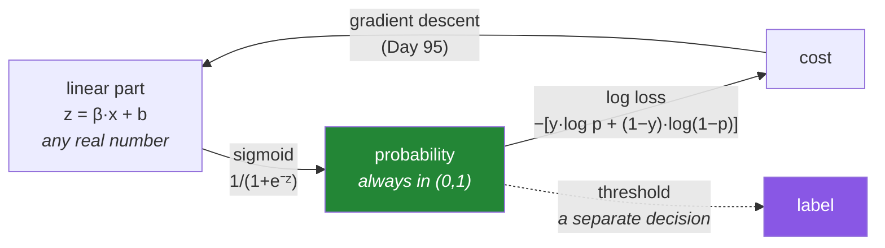

# Day 99 — Logistic regression, from scratch

**Phase 12 · Module 12** · ID: **ML-10** (logistic regression, sigmoid, log loss)

> **Yesterday:** regularisation, and the penalty that gets applied by units.
> **Today:** the first classifier — and the first model with **no closed form**, which is why Day 95
> existed. It also outputs **probabilities**, not labels, and that distinction is the whole of
> Days 100 and 101.
> **Tomorrow:** the confusion matrix, and picking a metric from the cost of the error.

```bash
./m start 99 && ./m scaffold 99
```

**Time:** 110 minutes. **Request budget:** 0 model calls.

---

## §1 The story

You have a binary target. Why not just run linear regression on it?

Try it and two things break. Predictions go **below 0 and above 1**, which cannot be probabilities.
And squared error is the wrong loss: being wrong by 0.6 on a probability is not four times worse than
being wrong by 0.3 in any sense that matters.

Logistic regression fixes both with two changes:



**The sigmoid** squashes any real number into `(0, 1)`. It never reaches either end, which matters:
the model can be very confident but never certain.

**Log loss** is the right cost, and it has a property squared error lacks: it punishes **confident
wrongness** without limit. Predicting 0.99 when the truth is 0 costs about 4.6; predicting 0.5 costs
0.69. That asymmetry is what makes the model calibrate rather than just rank.

Then the three things that make this day matter beyond "another model":

**There is no closed form.** Setting the derivative to zero gives an equation with no algebraic
solution, so you iterate. Day 95 built exactly the tool needed, and today is where it earns itself.

**The output is a probability, and the threshold is a separate decision.** `predict()` returning
labels at 0.5 is a convenience that hides a choice — and 0.5 is almost never the right threshold on
imbalanced data (Day 78). Days 100 and 101 are about that choice.

**The coefficients are log-odds**, not probabilities. `β = 0.7` means the *odds* multiply by `e^0.7 ≈ 2`
per unit — the same effect on probability is large in the middle and small at the extremes. Getting
this wrong is the most common misreading of a logistic model.

---

## §2 Setup — run this

```bash
mkdir -p days/day-99/lab
touch days/day-99/lab/logistic.py
```

`src/setu/models.py` grows today. No new packages.

---

## §3 ML-10 — classifying

`days/day-99/lab/logistic.py`:

```python
"""ML-10: logistic regression from scratch — sigmoid, log loss, and log-odds."""

from __future__ import annotations

import numpy as np
from sklearn.linear_model import LinearRegression, LogisticRegression

from setu.arrays import make_rng


def data(n=2_000, p=3, *, seed=0, separable=False):
    rng = make_rng(seed)
    x = rng.normal(0, 1, (n, p))
    beta = np.array([1.5, -1.0, 0.6][:p])
    z = 0.4 + x @ beta
    if separable:
        return x, (z > 0).astype(int), beta
    return x, (rng.random(n) < 1 / (1 + np.exp(-z))).astype(int), beta


def why_not_linear_regression() -> None:
    x, y, _ = data(n=800, p=1)
    linear = LinearRegression().fit(x, y)
    predicted = linear.predict(x)

    print(f"\n  linear regression on a 0/1 target:")
    print(f"    prediction range: [{predicted.min():.3f}, {predicted.max():.3f}]")
    print(f"    below 0: {(predicted < 0).sum()} rows   above 1: {(predicted > 1).sum()} rows")

    print("\n  Those are not probabilities. And the loss is wrong too: squared error says")
    print("  that being off by 0.6 is four times worse than being off by 0.3, which is")
    print("  not a claim anyone would defend about a probability.")


def the_sigmoid() -> None:
    z = np.array([-8.0, -4.0, -2.0, -1.0, 0.0, 1.0, 2.0, 4.0, 8.0])
    sigmoid = 1 / (1 + np.exp(-z))

    print(f"\n  {'z':>7} {'σ(z)':>9} {'odds':>10}")
    for value, probability in zip(z, sigmoid, strict=True):
        print(f"  {value:>7.1f} {probability:>9.5f} {probability / (1 - probability):>10.4f}")

    print(f"\n  σ(0) = 0.5 exactly. σ(z) + σ(−z) = 1, always.")
    print(f"  It NEVER reaches 0 or 1 — the model can be confident, never certain.")

    print(f"\n  the derivative has a convenient form: σ'(z) = σ(z)(1 − σ(z))")
    epsilon = 1e-6
    numeric = ((1 / (1 + np.exp(-(1.3 + epsilon)))) - (1 / (1 + np.exp(-(1.3 - epsilon))))) / (2 * epsilon)
    analytic = (1 / (1 + np.exp(-1.3))) * (1 - 1 / (1 + np.exp(-1.3)))
    print(f"    at z=1.3: analytic {analytic:.8f}, numerical {numeric:.8f}")
    print("  ^ that identity is why the gradient below is so simple.")


def numerically_stable_sigmoid() -> None:
    print(f"\n  the naive form overflows on large negative z:")
    for z in (-500.0, -800.0):
        try:
            with np.errstate(over="raise"):
                naive = 1 / (1 + np.exp(-z))
            print(f"    z={z}: {naive}")
        except FloatingPointError:
            print(f"    z={z}: 🚨 OverflowError in exp(-z)")

    def stable(z):
        z = np.asarray(z, dtype=float)
        out = np.empty_like(z)
        positive = z >= 0
        out[positive] = 1 / (1 + np.exp(-z[positive]))
        exp_z = np.exp(z[~positive])
        out[~positive] = exp_z / (1 + exp_z)
        return out

    print(f"\n  the stable form: {stable(np.array([-800.0, 0.0, 800.0]))}")
    print("  For z < 0 use e^z/(1+e^z) — mathematically identical, no overflow.")
    print("  ⚠️ scipy.special.expit does this for you. Write it once to know why it exists.")


def log_loss_punishes_confident_wrongness() -> None:
    print(f"\n  cost of predicting p when the truth is 1:")
    print(f"  {'p':>8} {'log loss':>10} {'squared error':>15}")
    for p in (0.99, 0.9, 0.7, 0.5, 0.3, 0.1, 0.01, 0.001):
        print(f"  {p:>8.3f} {-np.log(p):>10.4f} {(1 - p) ** 2:>15.4f}")

    print("\n  As p→0 the log loss goes to INFINITY; squared error tops out at 1.")
    print("  Confident and wrong is unboundedly bad, which is exactly right for a")
    print("  probability — and it is why log loss produces CALIBRATED outputs while")
    print("  squared error only produces a ranking.")

    print(f"\n  ⚠️ log(0) is −inf, so every implementation clips: p ∈ [1e-15, 1−1e-15].")
    print(f"     Without it one confident mistake makes the whole loss inf.")


def the_gradient_is_remarkably_simple() -> None:
    x, y, _ = data(n=500, p=2)
    beta, intercept = np.array([0.3, -0.2]), 0.1

    z = intercept + x @ beta
    p = 1 / (1 + np.exp(-z))
    residual = p - y

    grad_beta = (x.T @ residual) / len(x)
    grad_intercept = residual.mean()

    def loss(b, c):
        probability = np.clip(1 / (1 + np.exp(-(c + x @ b))), 1e-15, 1 - 1e-15)
        return -(y * np.log(probability) + (1 - y) * np.log(1 - probability)).mean()

    epsilon = 1e-6
    numeric = np.array([
        (loss(beta + epsilon * np.eye(2)[j], intercept)
         - loss(beta - epsilon * np.eye(2)[j], intercept)) / (2 * epsilon)
        for j in range(2)
    ])

    print(f"\n  analytic gradient  : {np.round(grad_beta, 8).tolist()}")
    print(f"  numerical gradient : {np.round(numeric, 8).tolist()}")
    print(f"  max difference: {np.abs(grad_beta - numeric).max():.2e}")

    print("\n  ∇L = Xᵀ(σ(Xβ) − y) / n")
    print("  ^ IDENTICAL in form to linear regression's gradient, with σ applied first.")
    print("  The sigmoid's derivative cancels against the log loss's — that cancellation")
    print("  is not luck, it is why this pairing is the standard one.")
    print("\n  Day 95's gradient_check is what confirms it. Always check.")


def fit_it() -> None:
    x, y, true_beta = data(n=4_000, p=3)
    n, p = x.shape
    beta, intercept = np.zeros(p), 0.0
    eta = 0.5

    print(f"\n  {'epoch':>6} {'log loss':>11} {'β₀':>8} {'β₁':>8} {'β₂':>8}")
    for epoch in range(2_001):
        z = intercept + x @ beta
        probability = np.clip(1 / (1 + np.exp(-z)), 1e-15, 1 - 1e-15)
        if epoch in (0, 1, 10, 100, 500, 2_000):
            loss = -(y * np.log(probability) + (1 - y) * np.log(1 - probability)).mean()
            print(f"  {epoch:>6} {loss:>11.6f} {beta[0]:>8.4f} {beta[1]:>8.4f} {beta[2]:>8.4f}")
        residual = probability - y
        beta -= eta * (x.T @ residual) / n
        intercept -= eta * residual.mean()

    library = LogisticRegression(penalty=None, max_iter=5_000).fit(x, y)
    print(f"\n  true       : {true_beta.round(4).tolist()}  intercept 0.4")
    print(f"  mine       : {beta.round(4).tolist()}  intercept {intercept:.4f}")
    print(f"  sklearn    : {library.coef_[0].round(4).tolist()}  "
          f"intercept {library.intercept_[0]:.4f}")

    print("\n  ⚠️ sklearn's LogisticRegression REGULARISES by default (C=1.0). Pass")
    print("     penalty=None to compare like with like — otherwise the coefficients")
    print("     differ and it looks like your implementation is wrong.")


def coefficients_are_log_odds() -> None:
    x, y, _ = data(n=6_000, p=2)
    model = LogisticRegression(penalty=None, max_iter=5_000).fit(x, y)
    beta = model.coef_[0]

    print(f"\n  β₀ = {beta[0]:.4f}   odds ratio e^β = {np.exp(beta[0]):.4f}")
    print(f"\n  'a one-unit increase in x₀ multiplies the ODDS by {np.exp(beta[0]):.2f}'")
    print(f"  NOT 'increases the probability by {beta[0]:.2f}'.")

    print(f"\n  the same coefficient's effect on PROBABILITY, at different baselines:")
    print(f"  {'baseline p':>12} {'new p':>9} {'change':>9}")
    for baseline in (0.01, 0.1, 0.5, 0.9, 0.99):
        odds = baseline / (1 - baseline) * np.exp(beta[0])
        new = odds / (1 + odds)
        print(f"  {baseline:>12.2f} {new:>9.4f} {new - baseline:>+9.4f}")

    print("\n  The SAME coefficient moves probability a lot in the middle and almost")
    print("  nothing at the extremes. That is why a logistic coefficient cannot be")
    print("  read as 'this many percentage points' — the answer depends on where you start.")


def separable_data_diverges() -> None:
    x, y, _ = data(n=300, p=2, separable=True)
    n = len(x)
    beta, intercept = np.zeros(2), 0.0

    print(f"\n  perfectly separable data, unregularised:")
    print(f"  {'epoch':>7} {'log loss':>12} {'|β|':>10}")
    for epoch in range(1, 20_001):
        probability = np.clip(1 / (1 + np.exp(-(intercept + x @ beta))), 1e-15, 1 - 1e-15)
        if epoch in (100, 1_000, 5_000, 20_000):
            loss = -(y * np.log(probability) + (1 - y) * np.log(1 - probability)).mean()
            print(f"  {epoch:>7} {loss:>12.8f} {np.linalg.norm(beta):>10.3f}")
        residual = probability - y
        beta -= 0.5 * (x.T @ residual) / n
        intercept -= 0.5 * residual.mean()

    print("\n  🚨 The loss keeps falling toward zero and the coefficients grow WITHOUT")
    print("     BOUND. There is no finite optimum: any scaling of a separating boundary")
    print("     fits better than the last.")
    print("\n  Regularisation (Day 98) fixes it — which is why sklearn regularises by")
    print("  default. And perfect separation on real data is usually a LEAK (Day 85):")
    print("  a feature that separates the classes exactly is probably the label in disguise.")


def the_threshold_is_a_separate_decision() -> None:
    rng = make_rng(4)
    n = 4_000
    x = rng.normal(0, 1, (n, 2))
    z = -2.5 + x @ np.array([1.5, -1.0])
    y = (rng.random(n) < 1 / (1 + np.exp(-z))).astype(int)

    model = LogisticRegression(max_iter=2_000).fit(x, y)
    probability = model.predict_proba(x)[:, 1]

    print(f"\n  {y.mean():.1%} positive — imbalanced (Day 78)")
    print(f"\n  {'threshold':>10} {'predicted +':>12} {'recall':>8} {'precision':>10}")
    for threshold in (0.5, 0.3, 0.2, 0.1, 0.05):
        predicted = probability >= threshold
        recall = (predicted & (y == 1)).sum() / max((y == 1).sum(), 1)
        precision = (predicted & (y == 1)).sum() / max(predicted.sum(), 1)
        print(f"  {threshold:>10.2f} {predicted.sum():>12} {recall:>8.3f} {precision:>10.3f}")

    print(f"\n  the DEFAULT 0.5 predicts positive for {(probability >= 0.5).sum()} of {n} rows")
    print("  ⚠️ `predict()` silently uses 0.5. On imbalanced data that is almost never")
    print("     the right choice, and it is a DECISION, not a property of the model.")
    print("\n  Keep the probabilities. Days 100 and 101 choose the threshold from the")
    print("  cost of each kind of error — which is the only principled way to do it.")


if __name__ == "__main__":
    why_not_linear_regression()
    the_sigmoid()
    numerically_stable_sigmoid()
    log_loss_punishes_confident_wrongness()
    the_gradient_is_remarkably_simple()
    fit_it()
    coefficients_are_log_odds()
    separable_data_diverges()
    the_threshold_is_a_separate_decision()
```

**Line by line:**

- `why_not_linear_regression` — predictions **outside `[0, 1]`**, and a loss that claims being off by
  0.6 is four times worse than 0.3. Both objections motivate a specific fix.
- `the_sigmoid` — `σ(0) = 0.5`, `σ(z) + σ(−z) = 1`, and it **never reaches 0 or 1**: the model can be
  confident but never certain. The derivative identity `σ'(z) = σ(z)(1 − σ(z))` is checked numerically,
  and it is why the gradient later is so simple.
- `numerically_stable_sigmoid` — the naive form **overflows** at large negative `z`. For `z < 0` use
  `e^z/(1+e^z)`, mathematically identical and stable. `scipy.special.expit` does this for you; writing
  it once is how you learn why it exists.
- `log_loss_punishes_confident_wrongness` — **as `p → 0` the loss goes to infinity; squared error tops
  out at 1.** Unbounded punishment for confident wrongness is what makes log loss produce *calibrated*
  probabilities rather than just a ranking. And the clipping note is practical: without it, one
  confident mistake makes the whole loss `inf`.
- `the_gradient_is_remarkably_simple` — `∇L = Xᵀ(σ(Xβ) − y)/n`, **identical in form to linear
  regression's** with the sigmoid applied first. The sigmoid's derivative cancels against the log
  loss's, and that cancellation is why this pairing is standard rather than a coincidence. Verified
  against a numerical gradient (Day 95).
- `fit_it` — gradient descent converging to sklearn's coefficients. **And the warning matters:**
  sklearn's `LogisticRegression` **regularises by default** (`C=1.0`), so comparing without
  `penalty=None` makes a correct implementation look wrong.
- `coefficients_are_log_odds` — **the most common misreading.** `β` multiplies the *odds* by `e^β`. The
  table shows the same coefficient moving probability a lot in the middle and almost nothing at the
  extremes, which is why "increases the probability by β" is never right.
- `separable_data_diverges` — with perfect separation the loss falls toward zero and **`|β|` grows
  without bound**, because any rescaling of a separating boundary fits better. Regularisation fixes it,
  which is why sklearn regularises by default. And the second sentence is the one to remember:
  **perfect separation on real data is usually a leak** (Day 85).
- `the_threshold_is_a_separate_decision` — **run this and read the recall column.** `predict()`
  silently uses 0.5, which on imbalanced data is almost never right. **Keep the probabilities**; Days
  100 and 101 choose the threshold from the cost of each error.

---

## §4 Build brief

Extend `src/setu/models.py`:

```python
@dataclass(frozen=True)
class LogisticFit:
    coefficients: np.ndarray
    intercept: float
    loss_history: list[float]
    converged: bool
    stop_reason: str
    n_epochs: int
    penalty: str
    alpha: float


def sigmoid(z):
    """TODO(me): numerically stable, elementwise. PURE.

    - for z >= 0 use 1/(1+exp(-z)); for z < 0 use exp(z)/(1+exp(z)) — §3.3
    - must return finite values for z = ±800 (the naive form overflows)
    - must satisfy sigmoid(z) + sigmoid(-z) == 1 to floating-point precision
    - accepts a scalar or an array
    """
    raise NotImplementedError


def log_loss(y_true, probability, *, clip: float = 1e-15) -> float:
    """TODO(me): mean −[y·log p + (1−y)·log(1−p)]. PURE.

    - clip probabilities into [clip, 1−clip]; without it one confident error is inf
    - raise DataError if y_true contains anything but 0 and 1, naming what it found
    - raise DataError on a length mismatch, naming both
    - raise DataError if any probability is outside [0, 1]
    """
    raise NotImplementedError


def fit_logistic(x, y, *, learning_rate: float = 0.5, epochs: int = 1_000,
                 penalty: str = "l2", alpha: float = 1.0, tolerance: float = 1e-9,
                 require_scaled: bool = True) -> LogisticFit:
    """TODO(me): gradient descent on the log loss. Reuse Day 95's machinery.

    - gradient is x.T @ (sigmoid(z) - y) / n, plus the penalty's derivative
    - the intercept is NEVER penalised (Day 98)
    - penalty in {'none', 'l2'}; 'none' must WARN when the data is separable,
      because the coefficients will diverge (§3.8)
    - require_scaled=True, with Day 95's reason (step size), not Day 98's
    - stop_reason and converged follow Day 95's contract exactly
    - raise DataError if y is not binary, naming the values found
    - raise DataError if either class has fewer than 2 examples
    """
    raise NotImplementedError


def predict_proba(fit: LogisticFit, x):
    """TODO(me): probabilities, NOT labels. Returns an ndarray in (0, 1).

    There is deliberately no `predict()` in this module: returning labels would
    hide the threshold choice, and that choice belongs to Days 100 and 101.
    Document that decision here.
    """
    raise NotImplementedError


def odds_ratio(fit: LogisticFit, *, feature_names: list[str] | None = None) -> dict:
    """TODO(me): coefficients as odds ratios, with the correct interpretation attached.

    {"coefficients": {...}, "odds_ratios": {...}, "interpretation": {...}}
    - odds ratio is exp(beta)
    - each interpretation must say 'multiplies the ODDS by' and must NOT phrase the
      effect as a change in probability or in percentage points (§3.7)
    - include a note that the probability effect depends on the baseline
    """
    raise NotImplementedError


def probability_change(*, baseline: float, coefficient: float) -> dict:
    """TODO(me): what one unit of a feature does to the probability, from a baseline. PURE.

    {"baseline", "new_probability", "absolute_change", "odds_ratio"}
    - convert baseline to odds, multiply by exp(coefficient), convert back
    - raise DataError unless baseline is strictly inside (0, 1)
    - this exists so a report can state a probability effect CORRECTLY, by naming
      the baseline it applies at
    """
    raise NotImplementedError


def detect_separation(x, y) -> dict:
    """TODO(me): is the data perfectly separable? (§3.8)

    {"separable": bool, "perfect_features": [...], "warning": str | None}
    - a single feature that perfectly orders the classes is the common case; also
      fit an unpenalised model briefly and check whether |beta| is exploding
    - the warning must say BOTH things: the fit will not converge without a penalty,
      AND perfect separation on real data is usually a leak (Day 85)
    """
    raise NotImplementedError
```

- **There is deliberately no `predict()`.** Returning labels hides the threshold choice, and this
  project makes that choice explicit in Days 100 and 101. It is the same instinct as Day 33's
  `causal_rolling` having no `center=` parameter: the dangerous default is simply unavailable.
- `odds_ratio`'s interpretation strings **banning probability phrasing** is §3.7 encoded — that
  misreading is the most common error in reporting a logistic model.
- `detect_separation` warning about **both** the numerical problem and the leak is deliberate: the
  numerical fix (regularise) is easy and would let you sail past the real issue.

---

## §5 The eval that must be able to fail

Add to `tests/test_models.py`:

```python
from sklearn.linear_model import LogisticRegression

from setu.models import (
    LogisticFit,
    detect_separation,
    fit_logistic,
    log_loss,
    odds_ratio,
    predict_proba,
    probability_change,
    sigmoid,
)


@pytest.fixture
def binary():
    rng = make_rng(0)
    n = 3_000
    x = rng.normal(0, 1, (n, 3))
    beta = np.array([1.5, -1.0, 0.6])
    z = 0.4 + x @ beta
    return x, (rng.random(n) < 1 / (1 + np.exp(-z))).astype(int), beta


def test_the_sigmoid_is_stable_at_extremes():
    """The naive form overflows at large negative z."""
    values = sigmoid(np.array([-800.0, -100.0, 0.0, 100.0, 800.0]))
    assert np.all(np.isfinite(values))
    assert values[0] == pytest.approx(0.0, abs=1e-300)
    assert values[-1] == pytest.approx(1.0)


def test_the_sigmoid_is_symmetric():
    z = np.array([-3.0, -0.5, 0.0, 0.5, 3.0])
    assert np.allclose(sigmoid(z) + sigmoid(-z), 1.0, atol=1e-12)


def test_the_sigmoid_is_a_half_at_zero():
    assert sigmoid(0.0) == pytest.approx(0.5)


def test_the_sigmoid_matches_scipy():
    from scipy.special import expit

    z = np.linspace(-20, 20, 101)
    assert np.allclose(sigmoid(z), expit(z), atol=1e-12)


def test_log_loss_matches_sklearn():
    from sklearn.metrics import log_loss as sklearn_log_loss

    rng = make_rng(1)
    y = (rng.random(500) < 0.5).astype(int)
    p = rng.uniform(0.05, 0.95, 500)
    assert log_loss(y, p) == pytest.approx(sklearn_log_loss(y, p), rel=1e-9)


def test_log_loss_punishes_confident_wrongness_without_limit():
    """Squared error tops out at 1; log loss does not."""
    confident = log_loss([1], [0.001])
    hedged = log_loss([1], [0.5])
    assert confident > hedged * 8


def test_a_perfect_prediction_costs_almost_nothing():
    assert log_loss([1, 0], [1 - 1e-12, 1e-12]) < 1e-9


def test_clipping_prevents_an_infinite_loss():
    """One confident mistake must not make the whole loss inf."""
    value = log_loss([1, 0, 1], [0.0, 1.0, 0.9])
    assert np.isfinite(value)


def test_log_loss_rejects_a_non_binary_target():
    with pytest.raises(DataError) as info:
        log_loss([0, 1, 2], [0.1, 0.5, 0.9])
    assert "2" in str(info.value)


def test_log_loss_rejects_probabilities_outside_the_unit_interval():
    with pytest.raises(DataError):
        log_loss([0, 1], [0.5, 1.5])


def test_log_loss_rejects_a_length_mismatch():
    with pytest.raises(DataError) as info:
        log_loss([0, 1, 1], [0.5, 0.5])
    assert "3" in str(info.value) and "2" in str(info.value)


def test_it_matches_sklearn_when_both_are_unregularised(binary):
    """sklearn regularises by DEFAULT — compare like with like."""
    x, y, _ = binary
    mine = fit_logistic(x, y, penalty="none", learning_rate=0.5, epochs=8_000)
    theirs = LogisticRegression(penalty=None, max_iter=5_000).fit(x, y)
    assert np.allclose(mine.coefficients, theirs.coef_[0], atol=0.05)
    assert mine.intercept == pytest.approx(theirs.intercept_[0], abs=0.05)


def test_it_recovers_the_generating_coefficients(binary):
    x, y, beta = binary
    fit = fit_logistic(x, y, penalty="none", learning_rate=0.5, epochs=8_000)
    assert np.allclose(fit.coefficients, beta, atol=0.15)


def test_the_gradient_is_correct(binary):
    """Verified numerically, as Day 95 requires."""
    from setu.models import gradient_check

    x, y, _ = binary
    x, y = x[:400], y[:400]

    def loss(beta):
        return log_loss(y, sigmoid(x @ beta))

    def gradient(beta):
        return x.T @ (sigmoid(x @ beta) - y) / len(x)

    result = gradient_check(loss, gradient, np.array([0.3, -0.2, 0.1]))
    assert result["passes"] is True


def test_the_loss_decreases(binary):
    x, y, _ = binary
    history = fit_logistic(x, y, learning_rate=0.3, epochs=200).loss_history
    assert history[-1] < history[0] / 2


def test_probabilities_stay_inside_the_unit_interval(binary):
    x, y, _ = binary
    probability = predict_proba(fit_logistic(x, y, epochs=500), x)
    assert probability.min() > 0.0
    assert probability.max() < 1.0


def test_there_is_no_predict_method():
    """Returning labels would hide the threshold choice (Days 100, 101)."""
    import setu.models as models

    assert not hasattr(models, "predict_label"), "labels hide a decision"
    source = __import__("inspect").getsource(predict_proba)
    assert "threshold" in source.lower() or "0.5" not in source


def test_a_non_binary_target_is_refused(binary):
    x, _, _ = binary
    y = np.array([0, 1, 2] * (len(x) // 3))[:len(x)]
    with pytest.raises(DataError) as info:
        fit_logistic(x, y)
    assert "2" in str(info.value)


def test_a_single_class_is_refused(binary):
    x, _, _ = binary
    with pytest.raises(DataError):
        fit_logistic(x, np.ones(len(x), dtype=int))


def test_unscaled_features_are_refused_with_day_95s_reason():
    rng = make_rng(2)
    n = 800
    x = np.c_[rng.normal(0, 1, n), rng.normal(0, 900, n)]
    y = (rng.random(n) < sigmoid(x @ np.array([1.0, 0.001]))).astype(int)

    with pytest.raises(DataError) as info:
        fit_logistic(x, y)
    assert "scal" in str(info.value).lower()


def test_the_intercept_is_not_penalised():
    """Day 98's rule, still true for logistic."""
    rng = make_rng(3)
    n = 3_000
    x = rng.normal(0, 1, (n, 2))
    z = -3.0 + x @ np.array([1.0, -1.0])
    y = (rng.random(n) < sigmoid(z)).astype(int)

    fit = fit_logistic(x, y, penalty="l2", alpha=500.0, epochs=3_000, learning_rate=0.5)
    assert np.abs(fit.coefficients).max() < 0.3, "the slopes SHOULD be crushed"
    assert fit.intercept < -1.0, "the intercept must survive to encode the base rate"


def test_separable_data_is_detected():
    """No finite optimum exists; the coefficients diverge."""
    rng = make_rng(4)
    x = rng.normal(0, 1, (300, 2))
    y = (x @ np.array([1.5, -1.0]) > 0).astype(int)

    result = detect_separation(x, y)
    assert result["separable"] is True
    assert result["warning"]


def test_the_separation_warning_mentions_both_problems():
    """The numerical fix would let you sail past the leak."""
    rng = make_rng(5)
    x = rng.normal(0, 1, (300, 2))
    y = (x @ np.array([1.5, -1.0]) > 0).astype(int)

    warning = detect_separation(x, y)["warning"].lower()
    assert "converge" in warning or "diverge" in warning or "penalty" in warning
    assert "leak" in warning or "label" in warning


def test_non_separable_data_is_not_flagged(binary):
    """A detector that always fires is useless."""
    x, y, _ = binary
    assert detect_separation(x, y)["separable"] is False


def test_an_unpenalised_fit_on_separable_data_warns():
    rng = make_rng(6)
    x = rng.normal(0, 1, (300, 2))
    y = (x @ np.array([1.5, -1.0]) > 0).astype(int)

    fit = fit_logistic(x, y, penalty="none", epochs=200, learning_rate=0.5)
    assert fit.stop_reason in {"max_iterations", "tolerance", "diverged"}
    assert np.linalg.norm(fit.coefficients) > 1.0


def test_regularisation_bounds_the_coefficients_on_separable_data():
    rng = make_rng(7)
    x = rng.normal(0, 1, (300, 2))
    y = (x @ np.array([1.5, -1.0]) > 0).astype(int)

    unpenalised = fit_logistic(x, y, penalty="none", epochs=4_000, learning_rate=0.5)
    penalised = fit_logistic(x, y, penalty="l2", alpha=1.0, epochs=4_000, learning_rate=0.5)
    assert np.linalg.norm(penalised.coefficients) < np.linalg.norm(unpenalised.coefficients)


def test_odds_ratios_are_exponentiated_coefficients(binary):
    x, y, _ = binary
    fit = fit_logistic(x, y, penalty="none", epochs=3_000)
    result = odds_ratio(fit, feature_names=["a", "b", "c"])
    assert result["odds_ratios"]["a"] == pytest.approx(np.exp(fit.coefficients[0]), rel=1e-9)


def test_the_interpretation_says_odds_not_probability(binary):
    """The most common misreading of a logistic model."""
    x, y, _ = binary
    result = odds_ratio(fit_logistic(x, y, penalty="none", epochs=2_000),
                        feature_names=["a", "b", "c"])
    for text in result["interpretation"].values():
        lowered = text.lower()
        assert "odds" in lowered
        assert "percentage point" not in lowered
        assert "increases the probability by" not in lowered


def test_the_same_coefficient_moves_probability_differently_by_baseline():
    """Which is exactly why you cannot state it as a fixed change."""
    middle = probability_change(baseline=0.5, coefficient=0.7)
    extreme = probability_change(baseline=0.99, coefficient=0.7)
    assert abs(middle["absolute_change"]) > abs(extreme["absolute_change"]) * 5


def test_probability_change_is_consistent_with_the_odds_ratio():
    result = probability_change(baseline=0.2, coefficient=1.0)
    baseline_odds = 0.2 / 0.8
    expected = baseline_odds * np.e
    assert result["new_probability"] == pytest.approx(expected / (1 + expected))


def test_probability_change_refuses_a_degenerate_baseline():
    for baseline in (0.0, 1.0, -0.1, 1.5):
        with pytest.raises(DataError):
            probability_change(baseline=baseline, coefficient=0.5)
```

**Line by line:**

- `test_the_interpretation_says_odds_not_probability` — **the day's real assessment**, and it is the
  sixth time this project tests English. `β` multiplies the odds; phrasing it as a probability change
  is the most common misreading of a logistic model, and the strings are checked so it cannot happen.
- `test_the_same_coefficient_moves_probability_differently_by_baseline` — the demonstration behind that
  ban. The same `β = 0.7` moves probability more than five times as much at 0.5 as at 0.99, so **there
  is no single "effect on probability" to quote.**
- `test_the_sigmoid_is_stable_at_extremes` — `σ(−800)` must be finite. The naive form raises an
  overflow, and this is why the branched implementation exists.
- `test_it_matches_sklearn_when_both_are_unregularised` — **`penalty=None` on both sides.** Without it a
  correct implementation looks broken, and that confusion costs people an afternoon.
- `test_the_intercept_is_not_penalised` — two assertions in opposite directions at `α = 500`: the
  slopes must be crushed **and** the intercept must survive to encode the base rate. Day 98's rule,
  still true here.
- `test_separable_data_is_detected` with `test_non_separable_data_is_not_flagged` — positive and
  negative. A separation detector that always fires is useless.
- `test_the_separation_warning_mentions_both_problems` — the numerical issue **and** the leak. Fixing
  only the numerics (add a penalty) would let you sail straight past a feature that is the label in
  disguise.
- `test_there_is_no_predict_method` — asserts an **absence**. Returning labels at 0.5 hides a decision
  that Days 100 and 101 exist to make explicitly, and this is the same instinct as Day 33's missing
  `center=` parameter.
- `test_clipping_prevents_an_infinite_loss` — one confident mistake must not make the whole batch's
  loss `inf`, which would make the gradient useless.

```bash
uv run python -m pytest tests/test_models.py -v
```

---

## §6 Request budget

| Resource | Spent today |
|---|---|
| LLM calls | **0** |

---

## §7 Traps

- **Linear regression on a binary target.** Predictions escape `[0, 1]`.
- **The naive sigmoid.** Overflows at large negative `z`.
- **Unclipped log loss.** One confident error makes it `inf`.
- **Comparing with sklearn's default.** It regularises; pass `penalty=None`.
- **Reading `β` as a probability change.** It is log-odds.
- **Quoting a single "effect on probability".** It depends on the baseline.
- **Unregularised fitting on separable data.** Coefficients diverge; no finite optimum.
- **Treating perfect separation as good news.** It is usually a leak (Day 85).
- **`predict()` at 0.5 on imbalanced data.** A hidden decision (Day 78).
- **Penalising the intercept.** It encodes the base rate (Day 98).
- **Unscaled features.** Day 95's reason: the step size cannot suit both.
- **Trusting a hand-derived gradient.** Check it (Day 95).

---

## §8 Verify before you code

Written **2026-08-21**:

- <https://scikit-learn.org/stable/modules/generated/sklearn.linear_model.LogisticRegression.html> —
  confirm the default `penalty` and `C` for your pinned version.
- <https://docs.scipy.org/doc/scipy/reference/generated/scipy.special.expit.html> — the stable sigmoid.
- <https://scikit-learn.org/stable/modules/generated/sklearn.metrics.log_loss.html> — its `eps`
  handling.
- <https://scikit-learn.org/stable/modules/linear_model.html#logistic-regression> — the solvers, and
  which support which penalties.

---

## §9 Say it in an interview

> "Logistic regression is a linear model passed through a sigmoid and trained on log loss, and both
> pieces are doing specific work. The sigmoid guarantees the output is a probability. Log loss
> punishes confident wrongness without limit — predicting 0.001 when the truth is 1 costs about seven,
> while squared error tops out at one — and that unbounded penalty is what makes the outputs
> *calibrated* rather than just correctly ranked. It's also the first model with no closed form, which
> is what gradient descent was for; the gradient turns out to be exactly linear regression's, with the
> sigmoid applied first, because the sigmoid's derivative cancels against the log loss's. Two things I
> guard. The coefficients are log-odds, so a coefficient multiplies the *odds* by e-to-the-beta — the
> effect on probability depends entirely on the baseline, large in the middle and negligible at the
> extremes, so there's no single percentage-point answer. And my module has no `predict` method at
> all: returning labels means silently thresholding at 0.5, which on imbalanced data is almost never
> right, and that choice belongs in the open."

---

## §10 Done when

Tick [`CHECKLIST.md`](CHECKLIST.md), then `./m check && ./m done 99`.
