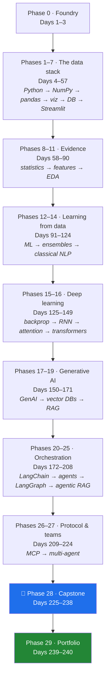
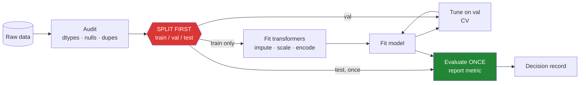
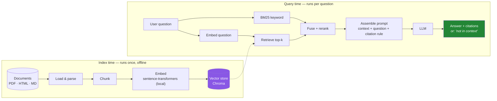
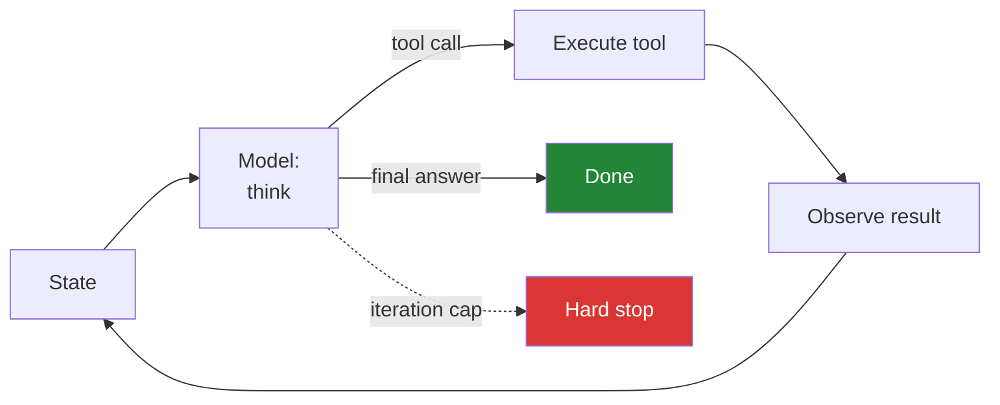
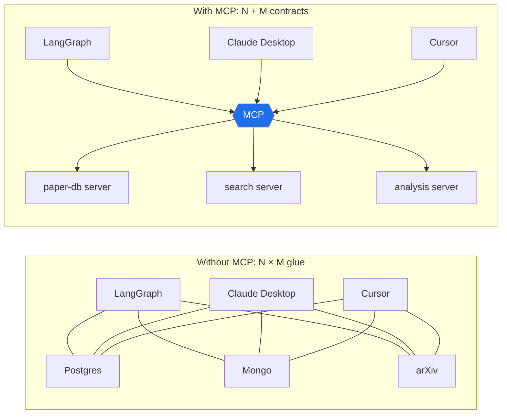
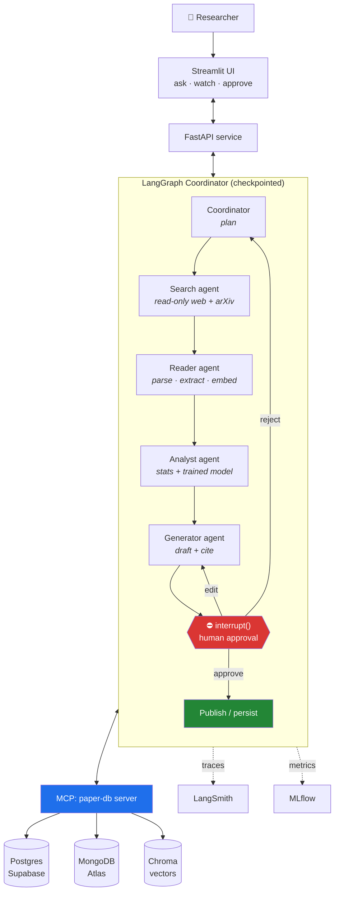

# 🌉 MASTER PLAN v2.2.0 — Project **Setu**
## Data Science → Machine Learning → Deep Learning → Generative AI → **Agentic AI**, built one day at a time

> **Scope note.** This plan is **self-contained**: 27 modules plus an end-to-end projects section,
> all defined here. Nothing has been imported from `00_MASTER_PLAN_AGENT_STACKS.md`.
> Where that plan and this one touch the same ground (LangChain, LangGraph, MCP), this plan takes a
> **LangGraph-centred, RAG-first** line — not the four-framework bake-off.
>
> **Stack validated against live PyPI on 2026-08-21.** Every version in Part 2 was read from
> `pypi.org/pypi/<pkg>/json` on that date, not from memory. Re-verify on your Day 1, then freeze
> (Principle 4). Companion files: `docs/PINS_DS.md` · `docs/CURRICULUM_INDEX_DS.md` ·
> `docs/CAPSTONE_SETU.md`.

---

## Part 0 — 🎯 What this plan is

**Goal:** in **240 days (30 phases, 0–29)** go from "I can write a `for` loop" to
"I have shipped an autonomous multi-agent research system that a stranger can run from my README" —
covering the full arc this plan lays out: Python → data handling → statistics → machine learning →
deep learning → NLP → generative AI → vector search → RAG → LangChain → LangGraph → MCP → multi-agent.

240 days at roughly 1.5–2 focused hours each is **10–12 months at five days a week** — the duration this plan is
built around.

**Capstone: Project Setu** *(setu = bridge)* — a **multi-agent research desk**. You point it at a
question; a Coordinator plans, a Search agent gathers, a Reader agent parses papers, an Analyst agent
runs real statistics and ML over the extracted data, a Generator agent drafts the report, and a human
approves before anything is written or published. Full spec: `docs/CAPSTONE_SETU.md`.

It is deliberately the *last* thing you build, and it deliberately uses **every** phase:


**The one-sentence thesis of the whole plan:** every layer you add is the same move — *you take
something the machine was guessing at and give it a better source of truth.*

- **Statistics** gives the guess an **error bar**.
- **Machine learning** gives it a **fitted function** instead of a hand-written rule.
- **Deep learning** gives it a **learned representation** instead of a hand-made feature.
- **RAG** gives it **your documents** instead of its training memory.
- **Agents** give it **tools and a loop** instead of a single shot.
- **MCP** gives those tools a **contract** instead of glue code.

Say that sentence in an interview and you have described the whole field in fifteen seconds.

---

## Part 1 — 📜 Operating principles

These are non-negotiable. They are what turns a 27-module curriculum into a portfolio.

| # | Principle |
|---|-----------|
| 1 | **Build daily.** Every day produces runnable code committed to `setu/`. Watching a video is not a completed day. |
| 2 | **From scratch before library.** Gradient descent by hand before `LinearRegression`. Cosine similarity by hand before Chroma. A chunker by hand before `RecursiveCharacterTextSplitter`. The library is then a convenience, never magic. |
| 3 | **One concept, one day, one demo.** If you cannot demo the day in five minutes, it was over-scoped — split it. |
| 4 | **Pin everything.** Exact versions in `pyproject.toml`; a committed `uv.lock`; `random_state=` on every estimator; `model=` typed out on every LLM call. Nothing floats, including randomness. |
| 5 | **Zero budget.** $0, no card on file, ever. Free tiers only (Part 2.1). On $0 the currency is **rate limits and RAM**, not dollars — every lab declares its budget up front. |
| 6 | **The notebook is a scratchpad, not the deliverable.** Every notebook that produces something worth keeping graduates into `src/setu/` as a tested function the same day. Notebooks are not committed as the artifact. |
| 7 | **Evals before features.** A behaviour is not done until a test can go red when it regresses — a pytest for code, a held-out metric for a model, a rubric for an agent. |
| 8 | **Leakage is the enemy.** The split comes *before* the scaler, the imputer, the encoder, and the feature selector. Every ML day names where the leak would have been. |
| 9 | **Data has provenance.** Every dataset in the repo has a `SOURCE.md`: where it came from, its licence, when it was pulled, and what you are allowed to do with it. No mystery CSVs. |
| 10 | **Interview-ready artifacts.** Every phase ends with a written decision record (ADR) you could defend to a hiring panel. |
| 11 | **Blast radius first.** Before any tool or agent gets write access, name what it can destroy and shrink that. Read-only by default. |
| 12 | **Humans gate writes.** No agent performs an external side effect — post, email, commit, spend — without a human checkpoint, until the graduated-autonomy review on Day 236. |
| 13 | **Weekly freshness check.** Every Friday: release notes for every pin, plus the MCP spec page. Findings become an addendum, never an ad-hoc code change. |
| 14 | **If reality changes, the plan is amended first.** Ecosystem shift → versioned addendum → then code. This file exists because that habit works. |
| 15 | **Never train on the test set, never demo on the training set.** Said twice on purpose. It is the single most common way a portfolio project dies in an interview. |
| 16 | **Depth over density.** A day is taught as a *hub plus one document per subtopic* (Part 11), never as one long page. If a subtopic cannot be read on its own, understood without scrolling past a different subtopic, and explained back out loud, it has not been split finely enough. A wall of text is not depth — it is depth's disguise. |
| 17 | **A day is a unit of subject, not a unit of time.** No lesson carries a time estimate, a "should take 90 minutes", or a pace. A topic is finished when it is understood — it may take one sitting or five. Nothing is ever trimmed to fit a clock, and the day number is an index into the subject, not a promise about hours. |
| 18 | **Assume no prior knowledge, finish at production.** Every subtopic opens where a reader who has never met the idea can stand, defines its jargon on first use, and does not stop at the toy example: it ends with how the idea is actually used in a production system, what a senior engineer does differently, and what breaks at scale. Strong basics and advanced technique are the same document, in that order. |
| 19 | **Teach the primary source.** Where an idea came from one dated document — a paper, a specification, a standard — that document is named, identified, linked **and taught in its own part**. A paper is an idea, and Principle 16 gives every idea its own document: the world before it, what it claimed, its mechanism, what did not survive contact with production, and what a real system does with it now. Every part declares `paper:` in its frontmatter, or `none`; silence is never an answer, because silence cannot be told from nobody having checked. A library's docstring says what the call does; the paper says which of its defaults were measured and which were arbitrary. |

---

## Part 2 — 📌 Stack pins (read from live PyPI on **2026-08-21**)

> These are the versions that were actually current on PyPI the day this plan was written.
> **They are a starting point, not gospel.** Day 1's job is to re-run the check and freeze.

| Layer | Package | Version @ 2026-08-21 | Why this, and what to watch |
|---|---|---|---|
| Language | **Python** | **3.12** | The safe intersection. `numpy` 2.5 needs ≥3.12; `tensorflow` 2.21 and `langgraph` 1.2 cap at 3.13. 3.12 is inside every window. |
| Env / packaging | `uv` | latest | One tool for venv + install + lock + run. `uv add pkg==x.y.z` writes the pin *and* the lockfile. |
| Numerics | `numpy` | **2.5.2** | NumPy 2.x line. `np.float_`, `np.int0` and friends are gone; `copy=False` semantics changed. |
| Dataframes | `pandas` | **3.0.5** | ⚠️ **Major.** Copy-on-Write is the only mode; strings infer to a PyArrow-backed `str` dtype, not `object`; datetimes default to microseconds; `pd.col()` exists. See §2.2. |
| Scientific | `scipy` · `statsmodels` | **1.18.0** · **0.14.6** | `scipy.stats` for hypothesis tests; `statsmodels` for OLS summaries and the p-values ML libraries refuse to give you. |
| Plotting | `matplotlib` · `seaborn` · `plotly` | **3.11.1** · **0.13.2** · **6.9.0** | Matplotlib for control, Seaborn for statistical defaults, Plotly for the interactive Streamlit layer. |
| Classic ML | `scikit-learn` | **1.9.0** | `set_output(transform="pandas")`, `HistGradientBoosting*`, `TunedThresholdClassifierCV`. Everything routes through `Pipeline` — no exceptions (Principle 8). |
| Imbalance | `imbalanced-learn` | **0.14.2** | SMOTE and friends — *inside* the pipeline, *after* the split. |
| Boosting | `xgboost` · `lightgbm` · `catboost` | **3.4.1** · **4.7.0** · **1.2.10** | XGBoost 3.x is this plan's named library. LightGBM/CatBoost are the honest comparison. |
| Explainability | `shap` | **0.52.0** | Global + local attribution. Feeds the ADR on Day 114. |
| Tuning | `optuna` | **4.9.0** | Replaces grid search once grids get expensive. |
| Classical NLP | `nltk` · `spacy` · `gensim` | **3.10.3** · **3.8.15** · **4.4.0** | NLTK for the teaching primitives this plan needs; spaCy for POS/NER that is actually fast; gensim for Word2Vec. ⚠️ gensim is the most fragile pin here against NumPy 2.x — verify import on Day 1. |
| Deep learning | `torch` · `tensorflow` · `keras` | **2.13.0** · **2.21.0** · **3.15.1** | This plan teaches **both** Keras and PyTorch. Plan: **Keras 3 first** (it reads like the maths), **PyTorch second** (it is what the ecosystem ships). Keras 3 is multi-backend — pin the backend explicitly. |
| Transformers | `transformers` · `tokenizers` · `datasets` | **5.15.1** · **0.23.1** · **5.0.1** | ⚠️ **Major (v5).** Do not trust a v4-era tutorial's API shapes; verify against live docs before every DL lesson from Day 138. |
| Embeddings | `sentence-transformers` | **6.0.0** | **Local, keyless, free.** Every embedding in this plan is computed on your machine. The RAG phase costs $0 by construction. |
| Vector stores | `chromadb` · `faiss-cpu` · `qdrant-client` · `lancedb` · `pinecone` | **1.5.9** · **1.15.0** · **1.19.0** · **0.37.1** · **9.1.0** | Chroma = default local. FAISS = the from-scratch comparison (Principle 2). Qdrant/LanceDB = local alternatives. Pinecone = 🅿️ free-tier awareness only. |
| SQL | `sqlalchemy` · `psycopg` · `supabase` | **2.0.52** · **3.3.4** · **2.31.0** | `psycopg` **3**, not `psycopg2`. Supabase free tier is this plan's Postgres host. |
| NoSQL | `pymongo` | **4.17.0** | MongoDB Atlas free tier (M0). Atlas Vector Search is the Module-18 integration. |
| Apps | `streamlit` | **1.62.0** | Dashboards, widgets, `st.session_state`, fragments. The demo surface for every phase. |
| API | `fastapi` · `uvicorn` · `pydantic` | **0.141.1** · **0.52.4** · **2.13.4** | Capstone backend. Pydantic **v2** — `model_validate`, not `parse_obj`. |
| LLM orchestration | `langchain` · `langchain-core` | **1.3.16** · **1.6.0** | LangChain **1.x**: `create_agent`, middleware, standard content blocks. `AgentExecutor` is deprecated and is never used in this plan. |
| Graphs | `langgraph` | **1.2.11** | `StateGraph`, checkpointers, `interrupt()`, time travel. `langgraph.prebuilt` is deprecated → use `langchain.agents`. |
| Splitting / tracing | `langchain-text-splitters` · `langsmith` | **1.1.2** · **0.11.1** | LangSmith free Developer tier — watch the monthly trace quota. |
| Providers | `langchain-google-genai` · `langchain-groq` · `langchain-openai` | **4.3.5** · **1.1.3** · **1.6.0** | The three free doors. `langchain-openai` is pointed at OpenRouter's base URL — not at OpenAI. |
| Raw clients | `google-genai` · `groq` · `openai` | **2.19.0** · **1.6.0** · **3.3.1** | Principle 2: you call these naked before you call LangChain. |
| Protocol | `mcp` | **2.0.0** | ⚠️ **Major.** Python SDK 2.x against the current MCP spec revision. Verify the spec revision on the spec page on Day 209 *before* writing a server. |
| Eval | `ragas` · `rank-bm25` | **0.4.3** · **0.2.2** | RAG metrics; BM25 as the hybrid-search half. |
| Tracking | `mlflow` | **3.15.1** | Experiment tracking from Phase 12 onward. Local file backend = $0. |
| Quality | `ruff` · `pytest` | **0.16.4** · **9.1.1** | `ruff check` + `ruff format` + `pytest`. `./m check` must stay green. |
| Notebooks | `jupyterlab` · `ipykernel` | **4.6.3** · **7.3.0** | Scratchpad only (Principle 6). |
| Extras | `duckdb` · `polars` · `tiktoken` · `httpx` · `beautifulsoup4` · `playwright` | **1.5.5** · **1.43.2** · **0.14.0** · **0.28.1** · **4.15.0** · **1.62.0** | DuckDB for local SQL on files; Polars as the honest pandas comparison; the last three for the capstone's Search/Reader agents. |

### 2.1 Zero-budget resource matrix

| Role | Service (env var) | Free reality to design around |
|---|---|---|
| **LLM workhorse** | Gemini AI Studio — `GEMINI_API_KEY` | Free Flash-class line. Tens of RPM, hundreds–low-thousands RPD. ⚠️ Free-tier prompts may be used for training — **fixtures and public data only, never private data.** |
| **Fast/cheap loop** | Groq — `GROQ_API_KEY` | Open models on LPU hardware. Very fast, generous RPD, tight tokens-per-minute. Ideal for many small calls, wrong for huge prompts. |
| **Second opinion / judge** | OpenRouter — `OPENROUTER_API_KEY` | Rotating `:free` roster. Low RPD. Every `:free` model id is **perishable** — treat as best-effort. |
| **Offline fallback** | Local Ollama — no key | No key, no limit, lower quality. The "provider outage" branch. |
| **Embeddings** | Local `sentence-transformers` | No API. Ever. |
| **Postgres** | Supabase free project | Pauses when idle — a `wake_db()` retry is part of the Day-42 lab, not a bug. |
| **Document DB** | MongoDB Atlas M0 | 512 MB. Enough for every ticket/paper fixture in this plan. |
| **Vector DB** | Chroma / FAISS, local on disk | $0 by construction. Pinecone stays 🅿️. |
| **Tracing** | LangSmith Developer tier | Monthly trace cap — sample traces in loops, don't firehose. |
| **CI** | GitHub Actions free minutes | Every model call in CI is mocked. CI never spends a live quota. |
| **Hosting** | Streamlit Community Cloud · local Docker | AWS EC2 free tier is 🅿️ optional, never required. |

**Standing rules:** every model call goes through one shared router built on Day 172 (Gemini → Groq →
OpenRouter → Ollama, 429-aware backoff). Eval judges always run on a *different* provider than the model
under test. Every lab prints its request count.

### 2.2 ⚠️ Three breaking changes this plan teaches head-on

Most material you will find online was written against an older stack. These three would silently ruin a beginner's month,
so they get first-class treatment rather than a footnote:

1. **pandas 3.0 (shipped 2026-01-21).** Copy-on-Write is the *only* mode — chained assignment
   (`df["a"][mask] = x`) no longer modifies `df`; it modifies a discarded copy. Strings infer to a
   PyArrow-backed `str` dtype, so `df.dtypes == "object"` no longer finds your text columns.
   Datetimes default to microsecond resolution. **Day 26 opens with this**, and every later pandas
   day uses `.loc` assignment only.
2. **NumPy 2.x.** The removed aliases (`np.float_`, `np.object_` usage patterns, `np.in1d`) appear
   in essentially every tutorial older than 2024. Day 20 teaches the 2.x names first so you never
   learn the dead ones.
3. **transformers v5.** Major-version API. Every Phase-16 lesson ends with a "verify before you code"
   link to the live docs page, and no code block is copied from memory.

---

## Part 3 — 🗂️ The curricula and the ID scheme

Every teachable unit has an ID. IDs are defined by the module topics in Part 4.
IDs live in the matrices (Part 4) and map to days (Part 5). `docs/CURRICULUM_INDEX_DS.md` holds the
generated day ↔ ID cross-table.

| Curriculum | Prefix | Modules | Count |
|---|---|---|---|
| A — Python engineering | `PY-` | M1, M2 | 24 |
| B — Data handling | `NP-` `PD-` `VIZ-` `DB-` `APP-` | M3, M4, M5, M6, M7 | 42 |
| C — Statistics | `ST-` | M8, M9 | 22 |
| D — Data preparation | `FE-` `EDA-` | M10, M11 | 16 |
| E — Machine learning | `ML-` | M12, M13 | 30 |
| F — Classical NLP | `NLP-` | M14 | 12 |
| G — Deep learning | `DL-` | M15, M16 | 30 |
| H — Generative AI | `GEN-` `VDB-` `RAG-` | M17, M18, M19, M25 | 32 |
| I — Orchestration | `LC-` `AGT-` `LG-` | M20, M21, M22, M23, M24 | 34 |
| J — Protocol & multi-agent | `MCP-` `MAS-` | M26, M27 | 20 |
| K — Capstone | `CAP-` | Projects section | 14 |
| | | **Total** | **276** |

**Legend:** 🛠️ = hands-on lab · 🅿️ = concept/awareness only · 🔁 = revisited later in a new frame.

---

## Part 4 — 📚 The matrices

### Curriculum A — Python engineering (`PY-01 … PY-24`) *(Modules 1–2)*

| ID | Topic | Simple explanation + Setu example | Days |
|---|---|---|---|
| PY-01 🛠️ | Python vs other languages; objects: numbers, booleans, strings | Everything is an object with a type and methods. *Example: `type(3)`, `type("3")`, and why `"3" + 3` is a `TypeError` and not a guess.* | 4 |
| PY-02 🛠️ | Container objects & mutability | Some objects can be changed in place; some cannot. *Example: the classic mutable-default-argument bug, reproduced then fixed.* | 4 |
| PY-03 🛠️ | Operators: arithmetic, bitwise, comparison, assignment; precedence | *Example: `is` vs `==` on two equal lists — the interview question that catches everyone.* | 5 |
| PY-04 🛠️ | Conditionals: `if` / `elif` / `else`; truthiness | *Example: `if df:` raises; `if len(df):` does not. Why.* | 5 |
| PY-05 🛠️ | Loops, `break`, `continue`, `range` | *Example: a retry loop with a hard iteration cap — the shape every agent loop later reuses.* | 6 |
| PY-06 🛠️ | String basics, methods, split/join, f-string formatting | *Example: normalising 500 messy paper titles with one chained expression.* | 7 |
| PY-07 🛠️ | Lists & tuples | *Example: why a coordinate is a tuple and a to-do list is a list.* | 8 |
| PY-08 🛠️ | Sets & dictionaries; dict view objects | *Example: de-duplicating 10 000 arXiv IDs in O(n) instead of O(n²) — timed, both ways.* | 8 |
| PY-09 🛠️ | List & dict comprehensions | *Example: the same transform written as a loop and a comprehension; read both aloud.* | 9 |
| PY-10 🛠️ | Functions, parameters, `*args` / `**kwargs`, scope | *Example: your first `src/setu/` module — a tested `clean_title()`.* | 10 |
| PY-11 🛠️ | Iterators & generator functions | *Example: streaming a 2 GB log line-by-line without loading it.* | 11 |
| PY-12 🛠️ | Lambda, `map`, functional style | *Example: where a lambda helps and where it hurts readability.* | 11 |
| PY-13 🛠️ | OOP: classes, attributes, methods | *Example: `Paper` — the object the capstone's Reader agent will pass around.* | 12 |
| PY-14 🛠️ | Inheritance & polymorphism | *Example: `BaseLoader` → `PDFLoader`, `HTMLLoader`.* | 13 |
| PY-15 🛠️ | Encapsulation & abstraction; `abc` | *Example: an ABC that refuses to instantiate until `.load()` is implemented.* | 13 |
| PY-16 🛠️ | Decorators | *Example: `@timed` and `@retry(3)` — reused in every later phase.* | 14 |
| PY-17 🛠️ | `classmethod`, `staticmethod`, `property` | *Example: `Paper.from_arxiv_id()` as an alternative constructor.* | 15 |
| PY-18 🛠️ | Magic / dunder methods | *Example: `__repr__`, `__eq__`, `__len__` on `Paper` — and why `__repr__` saves debugging hours.* | 15 |
| PY-19 🛠️ | File handling: read/write, buffering, `pathlib` | *Example: writing a 50k-line JSONL without a memory spike.* | 16 |
| PY-20 🛠️ | Context managers (`with`, `__enter__`/`__exit__`) | *Example: a context manager that guarantees the DB connection closes on exception.* | 16 |
| PY-21 🛠️ | Modules, packages, imports, `__init__.py` | *Example: the `src/setu/` layout the whole plan writes into.* | 17 |
| PY-22 🛠️ | Exceptions: `try`/`except`/`else`/`finally`; custom exceptions | *Example: `class RateLimited(Exception)` — the one every provider call raises later.* | 18 |
| PY-23 🛠️ | Typing, dataclasses & Pydantic v2 basics | *Example: `TriageResult` as a Pydantic model — the contract reused from Day 172 to Day 240.* | 19 |
| PY-24 🛠️ | Concurrency: threads, processes, `asyncio` | *Example: 20 HTTP fetches — sequential vs `asyncio.gather`, timed. Why threads help I/O and not maths.* | 19 |

### Curriculum B — Data handling (`NP-` `PD-` `VIZ-` `DB-` `APP-`) *(Modules 3–7)*

| ID | Topic | Simple explanation + Setu example | Days |
|---|---|---|---|
| NP-01 🛠️ | `ndarray`, dtypes, attributes | One block of memory + a shape. *Example: a Python list of 1M floats vs an `ndarray` — memory and time, measured.* | 20 |
| NP-02 🛠️ | Array creation from data and ranges | `array`, `zeros`, `arange`, `linspace`, `random.default_rng` (seeded — Principle 4). | 20 |
| NP-03 🛠️ | Indexing, slicing, boolean & fancy indexing | *Example: a slice is a **view** — write to it and the parent changes.* | 21 |
| NP-04 🛠️ | Broadcasting | The rule that makes "add a vector to a matrix" legal. *Example: mean-centring 60 000 rows with no loop.* | 22 |
| NP-05 🛠️ | Array manipulation: reshape, stack, split, transpose | *Example: reshaping a flat image buffer to `(28, 28)` — the MNIST move on Day 130.* | 22 |
| NP-06 🛠️ | Arithmetic & universal functions | *Example: `np.where` as vectorised `if`.* | 23 |
| NP-07 🛠️ | Statistical, sorting, searching, counting functions | *Example: `argsort` to get top-k similar vectors — the retrieval primitive, 130 days early.* | 23 |
| NP-08 🛠️ | Binary & string functions | *Example: `np.packbits` for a compact boolean mask.* | 24 |
| NP-09 🛠️ | Matrix ops & linear algebra basics | *Example: `A @ B` by hand vs `np.matmul` — the operation every neural layer is.* | 24 |
| NP-10 🛠️ | Copy vs view | *Example: the bug where `.ravel()` mutated the original and `.flatten()` did not.* | 25 |
| PD-01 🛠️ | **pandas 3.0 first**: Series, DataFrame, CoW, `str` dtype | *Example: the chained-assignment trap, reproduced live, then fixed with `.loc`.* ⚠️ Part 2.2 | 26 |
| PD-02 🛠️ | Reading and writing: CSV, JSON, Parquet, SQL | *Example: `dtype=` and `parse_dates=` at read time beat five `astype` calls later.* | 27 |
| PD-03 🛠️ | Indexing & selection: `loc`, `iloc`, boolean masks | *Example: `SettingWithCopy` is gone — what replaced the warning.* | 28 |
| PD-04 🛠️ | Reindexing & alignment | *Example: two series with different indexes added — the NaNs are the lesson.* | 28 |
| PD-05 🛠️ | Iteration (and why you shouldn't) | *Example: `iterrows` vs vectorised, timed on 1M rows.* | 29 |
| PD-06 🛠️ | Sorting, ranking, `nlargest` | | 29 |
| PD-07 🛠️ | Missing data: `NA`, `fillna`, `dropna`, `interpolate` | *Example: why the median goes in the pipeline, not the dataframe (Principle 8).* 🔁 FE-01 | 30 |
| PD-08 🛠️ | `groupby` / split-apply-combine; `agg`, `transform` | *Example: mean citations per year per field, in one expression.* | 31 |
| PD-09 🛠️ | Merge, join, concat | *Example: an inner join that silently dropped 40% of rows — how you caught it.* | 32 |
| PD-10 🛠️ | Reshaping: pivot, melt, stack/unstack | *Example: wide survey → tidy long, and back.* | 32 |
| PD-11 🛠️ | Text data with `.str` accessor | *Example: PyArrow-backed string ops on 1M titles.* | 33 |
| PD-12 🛠️ | Date/time, `Timedelta`, resampling | *Example: microsecond default resolution (pandas 3.0) and where it bites.* | 33 |
| PD-13 🛠️ | Categorical dtype | *Example: 8 GB → 300 MB on one column.* | 34 |
| PD-14 🛠️ | Descriptive statistics & built-in plotting | *Example: `df.describe()` read as a data-quality report, not a formality.* | 34 |
| PD-15 🅿️ | Where pandas stops: Polars & DuckDB | Honest comparison; one benchmark; a written recommendation. | 35 |
| VIZ-01 🛠️ | Matplotlib: figure, axes, the object API | *Example: never `plt.plot` again — always `fig, ax = plt.subplots()`.* | 36 |
| VIZ-02 🛠️ | Customising: labels, ticks, legends, annotation, saving | *Example: a chart that is readable printed in greyscale.* | 37 |
| VIZ-03 🛠️ | Chart-type selection | *Example: why the bar chart lied and the box plot did not.* | 37 |
| VIZ-04 🛠️ | Seaborn: statistical plots, `hue`/`col` faceting | | 38 |
| VIZ-05 🛠️ | Distributions: histogram, KDE, box, violin | 🔁 ST-04 | 39 |
| VIZ-06 🛠️ | Relationships: scatter, `pairplot`, `heatmap`, correlation matrix | *Example: the correlation heatmap that found the leak on Day 84.* | 39 |
| VIZ-07 🛠️ | Styling, palettes, colour-blind-safe defaults | | 40 |
| VIZ-08 🛠️ | Plotly for interactive charts | *Example: the same chart, static vs interactive — when the interactivity earns its weight.* | 41 |
| DB-01 🛠️ | Relational thinking: tables, keys, normalisation | *Example: the papers/authors many-to-many the capstone needs.* | 42 |
| DB-02 🛠️ | Supabase project + Postgres connection from Python | *Example: `psycopg` 3 with a connection pool and a wake-from-idle retry.* | 42 |
| DB-03 🛠️ | `SELECT`, `WHERE`, `ORDER BY`, `LIMIT`, `GROUP BY`, `HAVING` | | 43 |
| DB-04 🛠️ | Primary & foreign keys, constraints | *Example: a FK that refused a bad insert — the bug that never reached prod.* | 44 |
| DB-05 🛠️ | Joins (inner/left/right/full) and unions | *Example: the same question answered in SQL and in pandas — compare.* | 45 |
| DB-06 🛠️ | Subqueries, CTEs, window functions | *Example: "rank papers within field by citations" in one window function.* | 46 |
| DB-07 🛠️ | Python ↔ Postgres: parameterised queries, SQLAlchemy Core | *Example: f-string SQL vs parameters — the injection demo you run once and never forget.* | 47 |
| DB-08 🛠️ | MongoDB Atlas: databases, collections, documents | *Example: when a document beats a row.* | 48 |
| DB-09 🛠️ | CRUD: insert, find, query operators, sort, projection | | 49 |
| DB-10 🛠️ | Update, delete, drop; indexes | *Example: the same query, 4 s → 6 ms, after one index.* | 50 |
| DB-11 🛠️ | Aggregation pipeline | *Example: `$match` → `$group` → `$sort`, and its `groupby` twin.* | 50 |
| DB-12 🛠️ | SQL vs NoSQL: a written decision record | ADR-004. *Setu uses both, on purpose — argue why.* | 51 |
| APP-01 🛠️ | Streamlit basics: script model, rerun-on-interaction | *Example: why your counter resets, and what that teaches about the execution model.* | 52 |
| APP-02 🛠️ | Widgets: input, select, slider, file upload, forms | | 53 |
| APP-03 🛠️ | Layout: columns, tabs, sidebar, containers, fragments | | 53 |
| APP-04 🛠️ | `st.session_state` | *Example: a multi-step wizard that survives reruns.* | 54 |
| APP-05 🛠️ | Caching: `@st.cache_data` vs `@st.cache_resource` | *Example: 12 s → 40 ms; and the stale-cache bug it introduced.* | 55 |
| APP-06 🛠️ | Charts & dataframes in Streamlit | | 55 |
| APP-07 🛠️ | Async, generators, `st.write_stream` | *Example: the streaming shape that Phase 24 reuses for token streaming.* | 56 |
| APP-08 🛠️ | Deploy to Streamlit Community Cloud; secrets management | **Phase-7 gate artifact.** | 57 |

### Curriculum C — Statistics (`ST-01 … ST-22`) *(Modules 8–9)*

| ID | Topic | Simple explanation + Setu example | Days |
|---|---|---|---|
| ST-01 🛠️ | Descriptive vs inferential; population vs sample | *Example: the same number as a fact and as an estimate.* | 58 |
| ST-02 🛠️ | Data types & levels of measurement | Nominal/ordinal/interval/ratio → decides which test is legal. | 58 |
| ST-03 🛠️ | Central tendency: mean, median, mode | *Example: one billionaire in a salary column.* | 59 |
| ST-04 🛠️ | Dispersion: range, variance, standard deviation, IQR | *Example: why `ddof=1`, computed both ways.* | 60 |
| ST-05 🛠️ | Skewness & kurtosis | *Example: the log transform that fixed a model on Day 96.* | 61 |
| ST-06 🛠️ | Covariance & correlation (Pearson, Spearman) | *Example: Anscombe's quartet — four identical `r`, four different truths.* | 62 |
| ST-07 🛠️ | Sets, random variables, expectation | | 63 |
| ST-08 🛠️ | Probability basics; conditional probability | *Example: the base-rate fallacy in a disease test.* | 63 |
| ST-09 🛠️ | PMF, PDF, CDF | *Example: reading a probability off a CDF plot.* | 64 |
| ST-10 🛠️ | Bernoulli & Binomial | | 65 |
| ST-11 🛠️ | Poisson & Uniform | *Example: papers-per-day arrivals as Poisson.* | 65 |
| ST-12 🛠️ | Normal distribution; empirical rule; real-world examples | | 66 |
| ST-13 🛠️ | Z-statistic, standardisation | 🔁 FE-05 | 66 |
| ST-14 🛠️ | Central Limit Theorem | *Example: simulate it — 10 000 sample means from a wildly skewed population.* | 67 |
| ST-15 🛠️ | Point estimation, standard error, confidence intervals | *Example: bootstrap CI written by hand before `scipy.stats.bootstrap`.* | 68 |
| ST-16 🛠️ | Hypothesis testing: H₀/H₁, the mechanism | | 69 |
| ST-17 🛠️ | p-values, significance, Type I/II error, power | *Example: what a p-value is **not** — five wrong sentences, corrected.* | 70 |
| ST-18 🛠️ | t-tests (one-sample, two-sample, paired) & ANOVA | | 71 |
| ST-19 🛠️ | Bayes' theorem & Bayesian updating | *Example: prior → evidence → posterior on a spam classifier.* 🔁 ML-13 | 72 |
| ST-20 🛠️ | Chi-square: distribution, goodness-of-fit, independence | *Example: run it in Python; check the expected-count assumption first.* | 73 |
| ST-21 🛠️ | Multiple comparisons & p-hacking | *Example: 20 tests at α=0.05 — watch a false positive appear.* | 74 |
| ST-22 🛠️ | A statistical report you would defend | **Phase-9 gate artifact.** ADR-005. | 75 |

### Curriculum D — Data preparation (`FE-` `EDA-`) *(Modules 10–11)*

| ID | Topic | Simple explanation + Setu example | Days |
|---|---|---|---|
| FE-01 🛠️ | Missing data: MCAR/MAR/MNAR; imputation strategies | *Example: `SimpleImputer` **inside** the pipeline (Principle 8).* | 76 |
| FE-02 🛠️ | Outlier detection: IQR, z-score, isolation forest | *Example: the outlier that was the most valuable customer.* | 77 |
| FE-03 🛠️ | Imbalanced data: resampling, SMOTE, class weights, threshold moving | *Example: 99% accuracy on a 1% positive rate — the useless model.* | 78 |
| FE-04 🛠️ | The split, first: train/val/test, stratification, grouped splits | *Example: leakage via a duplicated row across the split.* | 79 |
| FE-05 🛠️ | Scaling: standardisation, min-max, robust | | 80 |
| FE-06 🛠️ | Encoding: one-hot, ordinal, target encoding, high cardinality | *Example: target encoding leaks unless it is cross-fitted — demonstrated.* | 81 |
| FE-07 🛠️ | Feature construction: interactions, binning, date parts, log/Box-Cox | | 82 |
| FE-08 🛠️ | Feature selection: filter, wrapper (forward/backward), embedded | | 83 |
| FE-09 🛠️ | `ColumnTransformer` + `Pipeline` as the only legal shape | **Phase-10 gate artifact.** | 83 |
| EDA-01 🛠️ | The EDA loop: question → plot → hypothesis → check | | 84 |
| EDA-02 🛠️ | Data-quality audit: dtypes, duplicates, ranges, cardinality, nulls | *Example: an automated `audit(df)` in `src/setu/`.* | 84 |
| EDA-03 🛠️ | Univariate & bivariate exploration | | 85 |
| EDA-04 🛠️ | Multivariate: correlation structure, PCA for looking | | 86 |
| EDA-05 🛠️ | **Case study:** sentiment of movie reviews | Text EDA — length, vocabulary, class balance. | 87 |
| EDA-06 🛠️ | **Case study:** wine quality & type | Tabular EDA — a real multiclass with an ordinal target. | 88 |
| EDA-07 🛠️ | **Case study:** stock / commodity price exploration | Time-series EDA — stationarity, autocorrelation, and **why naive forecasting from this is a trap.** | 89 |
| EDA-08 🛠️ | An EDA report that changes a decision | **Phase-11 gate artifact.** ADR-006. | 90 |

### Curriculum E — Machine learning (`ML-01 … ML-30`) *(Modules 12–13)*

| ID | Topic | Simple explanation + Setu example | Days |
|---|---|---|---|
| ML-01 🅿️ | AI vs ML vs DL vs Data Science | The vocabulary map, once, so interviews are painless. | 91 |
| ML-02 🛠️ | Supervised / unsupervised / semi-supervised / reinforcement | *Example: the same dataset framed four ways.* | 91 |
| ML-03 🛠️ | Simple linear regression **from scratch** | Normal equation in NumPy, then `sklearn` — same coefficients. Principle 2. | 92 |
| ML-04 🛠️ | Multiple linear regression; assumptions; multicollinearity/VIF | | 93 |
| ML-05 🛠️ | Regression metrics: MSE, MAE, RMSE, R², adjusted R² | *Example: R² = 0.98 on a model that is useless — why.* | 94 |
| ML-06 🛠️ | Gradient descent **from scratch** | Batch, stochastic, mini-batch; learning-rate plots. The engine of Phase 15. 🔁 DL-05 | 95 |
| ML-07 🛠️ | Bias–variance; under/overfitting; learning curves | | 96 |
| ML-08 🛠️ | Cross-validation: k-fold, stratified, grouped, time-series | | 97 |
| ML-09 🛠️ | Regularisation: Ridge, Lasso, ElasticNet | *Example: watch Lasso zero a coefficient as α rises.* | 98 |
| ML-10 🛠️ | Logistic regression: sigmoid, log-loss, decision boundary | From scratch, then sklearn. | 99 |
| ML-11 🛠️ | Classification metrics: confusion matrix, accuracy, precision, recall, F1/Fβ | *Example: pick the metric **from the cost of each error**, not from habit.* | 100 |
| ML-12 🛠️ | ROC-AUC, PR-AUC, calibration, threshold tuning | *Example: why PR-AUC beats ROC-AUC at 1% positives.* | 101 |
| ML-13 🛠️ | Naive Bayes | *Example: spam classification — ST-19 made concrete.* | 102 |
| ML-14 🛠️ | KNN classifier & regressor | *Example: the curse of dimensionality, measured. Also: this **is** vector search.* 🔁 VDB-02 | 103 |
| ML-15 🛠️ | SVM: margins, the kernel trick, `C` and `gamma` | | 104 |
| ML-16 🛠️ | Decision trees: entropy, Gini, pruning | *Example: plot the tree and read the rules aloud.* | 105 |
| ML-17 🛠️ | Hyperparameter search: grid, random, Optuna | | 106 |
| ML-18 🛠️ | Ensembles: why averaging works; bias/variance view | | 107 |
| ML-19 🛠️ | Bagging & Random Forest (classifier + regressor) | | 108 |
| ML-20 🛠️ | Out-of-bag evaluation; feature importance (and its lies) | *Example: permutation importance vs impurity importance disagreeing.* | 109 |
| ML-21 🛠️ | Boosting intuition: AdaBoost → Gradient Boosting | Residual fitting, by hand on a toy set. | 110 |
| ML-22 🛠️ | Gradient Boosting classifier & regressor | | 111 |
| ML-23 🛠️ | XGBoost: implementation, early stopping, key hyperparameters | | 112 |
| ML-24 🛠️ | LightGBM & CatBoost — the honest comparison | Same data, three libraries, one table. | 113 |
| ML-25 🛠️ | Model explainability with SHAP | ADR-007: *what this model actually keys on.* | 114 |
| ML-26 🛠️ | Clustering intuition; distance metrics | | 115 |
| ML-27 🛠️ | K-Means; choosing k (elbow, silhouette); K-Means++ | From scratch, then sklearn. | 115 |
| ML-28 🅿️ | Hierarchical & DBSCAN — when K-Means is wrong | | 115 |
| ML-29 🛠️ | Experiment tracking with MLflow | Every run from here on is logged: params, metrics, artifacts. | 116 |
| ML-30 🛠️ | **Project:** Network Intrusion Detection System | Full pipeline, imbalanced, tuned, tracked, tested. **Phase-13 gate artifact.** | 116 |

### Curriculum F — Classical NLP (`NLP-01 … NLP-12`) *(Module 14)*

| ID | Topic | Simple explanation + Setu example | Days |
|---|---|---|---|
| NLP-01 🅿️ | What NLP is; use cases; the roadmap | | 117 |
| NLP-02 🛠️ | Text normalisation & tokenisation | *Example: three tokenisers disagreeing on `"don't"`.* | 117 |
| NLP-03 🛠️ | Stemming vs lemmatisation | *Example: `"better"` → `"better"` (stem) vs `"good"` (lemma).* | 118 |
| NLP-04 🛠️ | Stopwords — and when removing them destroys meaning | *Example: `"to be or not to be"` after stopword removal.* | 118 |
| NLP-05 🛠️ | POS tagging with NLTK and spaCy | | 119 |
| NLP-06 🛠️ | Named Entity Recognition | *Example: pulling author and institution names out of abstracts — the capstone's Reader agent, v0.* | 120 |
| NLP-07 🛠️ | One-hot encoding & Bag of Words | | 121 |
| NLP-08 🛠️ | N-grams | *Example: `"not good"` is only visible to a bigram.* | 121 |
| NLP-09 🛠️ | TF-IDF: intuition, maths, implementation | From scratch, then `TfidfVectorizer` — identical vectors. | 122 |
| NLP-10 🛠️ | Word vectors & the distributional hypothesis | *Example: cosine similarity by hand. This is the whole idea behind Phase 18.* | 123 |
| NLP-11 🛠️ | Word2Vec (CBOW & skip-gram) with gensim | *Example: the king−man+woman demo, run honestly — including where it fails.* | 123 |
| NLP-12 🛠️ | **Project:** end-to-end text classifier (TF-IDF → linear model) | The baseline every Phase-16 model must beat. **Phase-14 gate artifact.** | 124 |

### Curriculum G — Deep learning (`DL-01 … DL-30`) *(Modules 15–16)*

| ID | Topic | Simple explanation + Setu example | Days |
|---|---|---|---|
| DL-01 🅿️ | What changed: data, compute, architectures | Why now and not in 1995. | 125 |
| DL-02 🛠️ | The perceptron, by hand | | 125 |
| DL-03 🛠️ | ANN forward propagation | Matrix multiply + bias + nonlinearity. *That is the whole layer.* 🔁 NP-09 | 126 |
| DL-04 🛠️ | The chain rule & backpropagation, derived on a 2-layer net | Pen and paper, then NumPy, then autograd — three passes, same numbers. | 127 |
| DL-05 🛠️ | Training loop from scratch in NumPy | 🔁 ML-06 | 128 |
| DL-06 🛠️ | Activation functions: sigmoid, tanh, ReLU, LeakyReLU, GELU | *Example: plot each and its derivative; find the dead zone.* | 129 |
| DL-07 🛠️ | Vanishing & exploding gradients | *Example: reproduce vanishing in a deep sigmoid net, then fix it.* | 129 |
| DL-08 🛠️ | Loss functions: MSE, MAE, BCE, categorical cross-entropy | | 130 |
| DL-09 🛠️ | Optimisers: SGD → Momentum → RMSProp → Adam → AdamW | *Example: same net, five optimisers, one loss plot.* | 131 |
| DL-10 🛠️ | Weight initialisation: Xavier/Glorot, He | *Example: train the same net from zeros. Watch it fail.* | 132 |
| DL-11 🛠️ | Dropout | | 133 |
| DL-12 🛠️ | Batch normalisation & layer normalisation | | 133 |
| DL-13 🛠️ | Keras 3: `Sequential`, functional API, `compile`/`fit`, callbacks | Backend pinned explicitly. | 134 |
| DL-14 🛠️ | PyTorch: tensors, autograd, `nn.Module`, the explicit training loop | *Example: the same MLP in both frameworks side by side.* | 135 |
| DL-15 🛠️ | `Dataset` / `DataLoader`, batching, GPU-vs-CPU reality on your machine | | 136 |
| DL-16 🛠️ | Visualising architecture & training: TensorBoard, curves, confusion | **Phase-15 gate artifact.** | 137 |
| DL-17 🛠️ | Sequence data & why MLPs fail on it | | 138 |
| DL-18 🛠️ | RNNs: the recurrence, unrolling, BPTT | | 138 |
| DL-19 🛠️ | LSTM: the three gates and the cell state | *Example: draw the gates before you code them.* | 139 |
| DL-20 🛠️ | GRU and the efficiency trade-off | | 140 |
| DL-21 🛠️ | Bidirectional & stacked recurrent layers | | 140 |
| DL-22 🛠️ | Seq2seq: encoder–decoder, the bottleneck problem | | 141 |
| DL-23 🛠️ | Attention: the intuition, then the maths | *Example: plot an attention matrix for a translation pair.* | 142 |
| DL-24 🛠️ | Self-attention & multi-head attention, from scratch | Q, K, V in ~40 lines of NumPy. **The most important day in this phase.** | 143 |
| DL-25 🛠️ | Positional encoding | *Example: shuffle the tokens; watch the model stop caring.* | 144 |
| DL-26 🛠️ | The transformer block; encoder-only vs decoder-only vs enc-dec | | 145 |
| DL-27 🛠️ | BERT: masked LM, `[CLS]`, fine-tuning for classification | ⚠️ verify against `transformers` v5 docs. | 146 |
| DL-28 🛠️ | GPT-family: causal LM, autoregressive generation, sampling params | *Example: temperature/top-p swept on one prompt.* | 147 |
| DL-29 🛠️ | Tokenisation for LLMs: BPE, WordPiece, `tiktoken` | *Example: why "strawberry" has three r's and the model cannot count them.* | 148 |
| DL-30 🛠️ | **Projects:** text summarisation · machine translation · question answering | Three tasks, one fine-tuning workflow. **Phase-16 gate artifact.** | 149 |

### Curriculum H — Generative AI, vector search & RAG (`GEN-` `VDB-` `RAG-`) *(Modules 17, 18, 19, 25)*

| ID | Topic | Simple explanation + Setu example | Days |
|---|---|---|---|
| GEN-01 🅿️ | What generative AI is; why it matters | | 150 |
| GEN-02 🛠️ | Generative vs discriminative, concretely | *Example: `p(y\|x)` vs `p(x,y)` on one toy dataset.* | 150 |
| GEN-03 🛠️ | How generative models work: next-token prediction end to end | *Example: sample from a tiny char-level model you trained on Day 147.* | 151 |
| GEN-04 🅿️ | The landscape: LLMs, diffusion, multimodal; capabilities and limits | | 152 |
| GEN-05 🛠️ | Prompting as interface design; system vs user; structured output | *Example: force JSON, validate with Pydantic, retry on failure.* 🔁 PY-23 | 153 |
| GEN-06 🛠️ | Hallucination, grounding, and the honest limits | **The argument for RAG, made properly.** | 153 |
| GEN-07 🅿️ | The end-to-end GenAI project lifecycle | Data → prompt → eval → guardrail → deploy → monitor. ADR-008. | 154 |
| VDB-01 🛠️ | Embeddings: text → vectors, locally with `sentence-transformers` | Keyless, free, on your machine. | 155 |
| VDB-02 🛠️ | Similarity search: cosine, dot, Euclidean — **from scratch** | *Example: brute-force top-k in NumPy. This is KNN again.* 🔁 ML-14 | 155 |
| VDB-03 🛠️ | Why a vector DB: indexing (HNSW, IVF), and the recall/latency trade | | 156 |
| VDB-04 🛠️ | Vector DB vs SQL vs NoSQL — a comparison table you can defend | | 156 |
| VDB-05 🛠️ | Storage & index types: in-memory, on-disk, cloud | | 157 |
| VDB-06 🛠️ | **Chroma** — the local default: collections, metadata, filtering | | 158 |
| VDB-07 🛠️ | **FAISS** — the raw index; flat vs IVF vs HNSW, benchmarked | | 159 |
| VDB-08 🛠️ | **Qdrant** and **LanceDB** — payload filtering, on-disk lakehouse style | | 160 |
| VDB-09 🅿️ | **Pinecone** — the managed option; what it buys, what it locks | Free-tier literacy only. | 160 |
| VDB-10 🛠️ | Vector search inside MongoDB Atlas | *Example: one database for documents **and** their embeddings.* 🔁 DB-08 | 161 |
| VDB-11 🛠️ | Choosing a store: ADR-009 for Setu | **Phase-18 gate artifact.** | 161 |
| RAG-01 🛠️ | The RAG pipeline, drawn then built | load → split → embed → store → retrieve → rerank → generate → cite. | 162 |
| RAG-02 🛠️ | **Naked RAG**: 60 lines, no framework | Principle 2. Everything after this is convenience. | 162 |
| RAG-03 🛠️ | Loading & parsing: PDF, HTML, Markdown, tables | *Example: the PDF whose two columns interleaved into nonsense.* | 163 |
| RAG-04 🛠️ | Chunking strategies: fixed, recursive, semantic, structural | *Example: three strategies, same corpus, measured retrieval hit-rate.* | 164 |
| RAG-05 🛠️ | Embedding choices; chunk-size ↔ model-context interaction | | 165 |
| RAG-06 🛠️ | Retrieval: top-k, MMR, metadata filters, self-query | | 166 |
| RAG-07 🛠️ | **Hybrid search**: BM25 + dense, and reciprocal rank fusion | | 167 |
| RAG-08 🛠️ | Reranking (cross-encoder) | *Example: recall@10 → precision@3.* | 167 |
| RAG-09 🛠️ | Prompt assembly, citation, and refusing to answer | *Example: "not in the provided context" as a **success**.* | 168 |
| RAG-10 🛠️ | RAG evaluation with Ragas: faithfulness, relevance, context precision/recall | **A RAG system without an eval set is a demo, not a system.** | 169 |
| RAG-11 🛠️ | Memory in RAG: conversational rewriting, history-aware retrieval | | 170 |
| RAG-12 🛠️ | Multimodal RAG: images + tables alongside text | | 170 |
| RAG-13 🛠️ | **Project:** RAG Q&A system with CI | Eval gate in GitHub Actions. **Phase-19 gate artifact.** | 171 |
| RAG-14 🛠️ | Adaptive RAG: route by query type | Phase 25 — after LangGraph. | 202 |
| RAG-15 🛠️ | Adaptive RAG, run fully locally | | 203 |
| RAG-16 🛠️ | Agentic RAG: retrieval as a **tool** an agent may choose | *Example: the agent decides not to retrieve — and is right.* | 204 |
| RAG-17 🛠️ | C-RAG (corrective/contextual): grade retrieved docs, re-query on fail | | 205 |
| RAG-18 🛠️ | Self-RAG: reflection tokens, self-critique loops | | 206 |
| RAG-19 🛠️ | Self-RAG on a vector DB, deployed locally | | 207 |
| RAG-20 🛠️ | Bake-off: naive vs adaptive vs C-RAG vs Self-RAG on one eval set | ADR-012. **Phase-25 gate artifact.** | 208 |

### Curriculum I — Orchestration (`LC-` `AGT-` `LG-`) *(Modules 20–24)*

| ID | Topic | Simple explanation + Setu example | Days |
|---|---|---|---|
| LC-01 🛠️ | LangChain 1.x mental model: `langchain-core` vs `langchain` vs providers | What died in 1.0 and why. `AgentExecutor` is never used here. | 172 |
| LC-02 🛠️ | Chat models & `init_chat_model`; the free-provider router | *Example: Gemini → Groq → OpenRouter → Ollama with 429 backoff. Built once, used for 68 days.* | 172 |
| LC-03 🛠️ | Messages & standard content blocks | | 173 |
| LC-04 🛠️ | Prompt templates & few-shot | | 173 |
| LC-05 🛠️ | LCEL & `Runnable`: `invoke`, `batch`, `stream`, `|` composition | | 174 |
| LC-06 🛠️ | Structured output & `with_structured_output` | *Example: `PaperSummary` — the schema the capstone passes between agents.* 🔁 PY-23 | 175 |
| LC-07 🛠️ | Tools: `@tool`, schemas, runtime injection | | 176 |
| LC-08 🛠️ | Toolkits & data connectors | | 176 |
| LC-09 🛠️ | Document loaders, splitters & vector-store integrations | Phase 19's pipeline, now framework-native. 🔁 RAG-03/04 | 177 |
| LC-10 🛠️ | Memory & message-history management | | 178 |
| LC-11 🛠️ | `create_agent` — the blessed loop | *Example: the Researcher agent, v1.* | 179 |
| LC-12 🛠️ | Middleware: before/after-model hooks, summarisation, PII scrubbing | | 179 |
| LC-13 🛠️ | Synthetic data generation for eval sets | *Example: generate 100 Q/A pairs from your corpus to grade RAG against.* | 180 |
| LC-14 🛠️ | LangSmith: tracing, datasets, experiments | Free tier; sample, don't firehose. | 181 |
| LC-15 🅿️ | LangServe / deployment surface | Literacy; the capstone ships FastAPI. | 181 |
| AGT-01 🅿️ | What an AI agent is: the think → act → observe loop | *Example: your Day-5 retry loop, with a model in it.* 🔁 PY-05 | 182 |
| AGT-02 🅿️ | Agentic AI vs traditional rule-based agents | | 182 |
| AGT-03 🅿️ | Agentic AI vs Generative AI — the distinction interviewers probe | One paragraph, said aloud, no notes. | 183 |
| AGT-04 🅿️ | Multi-agent systems & collaboration topologies | Supervisor · pipeline · peer handoff · hierarchical. 🔁 MAS-01 | 183 |
| AGT-05 🅿️ | The framework landscape and where LangGraph sits | | 184 |
| AGT-06 🛠️ | **Blast-radius design** for Setu: the permission table | Principles 11 & 12. ADR-010. **Phase-21 gate artifact.** | 184 |
| LG-01 🛠️ | Graph thinking: state, nodes, edges | *Example: intake → analyse → route, drawn before it is coded.* | 185 |
| LG-02 🛠️ | Your first `StateGraph`: compile, invoke, visualise | LangGraph Studio overview. | 186 |
| LG-03 🛠️ | Chains as graphs; sequential composition | | 187 |
| LG-04 🛠️ | Routers & conditional edges | | 188 |
| LG-05 🛠️ | Agents in LangGraph; the ReAct loop as a graph | | 189 |
| LG-06 🛠️ | Agents with memory | | 190 |
| LG-07 🛠️ | Local dev server, `langgraph dev`, and execution basics | **Phase-22 gate artifact.** | 191 |
| LG-08 🛠️ | State schemas: `TypedDict`, Pydantic state, annotations | | 192 |
| LG-09 🛠️ | Reducers: how updates merge (`add_messages`, custom) | *Example: `messages` appends; `severity` replaces.* | 193 |
| LG-10 🛠️ | Multiple schemas: input, output, and private state | | 194 |
| LG-11 🛠️ | Checkpointers & threads: persistence as a runtime property | SQLite → Postgres swap. | 195 |
| LG-12 🛠️ | Trimming & filtering messages; context budgeting | *Example: summarise-on-overflow before the window closes.* **Phase-23 gate artifact.** | 196 |
| LG-13 🛠️ | Streaming modes: values, updates, messages | 🔁 APP-07 | 197 |
| LG-14 🛠️ | Breakpoints: static and dynamic | | 198 |
| LG-15 🛠️ | `interrupt()` — human-in-the-loop as a durable pause | *Example: approval survives a server restart while the human thinks.* | 199 |
| LG-16 🛠️ | Editing state with human input; approve / edit / reject | | 200 |
| LG-17 🛠️ | Time travel: rewind, fork, replay with a fixed prompt | *Example: replay yesterday's bad answer against today's prompt.* | 201 |
| LG-18 🛠️ | Subgraphs & the Streamlit review UI over an interrupted graph | **Phase-24 gate artifact.** | 201 |

### Curriculum J — Protocol & multi-agent (`MCP-` `MAS-`) *(Modules 26–27)*

| ID | Topic | Simple explanation + Setu example | Days |
|---|---|---|---|
| MCP-01 🛠️ | Why MCP: the N×M problem | See the diagram in Part 6. | 209 |
| MCP-02 🛠️ | Core components & architecture: host, client, server, transport | ⚠️ Verify the current spec revision on the spec page **before** coding. | 209 |
| MCP-03 🛠️ | The three primitives: tools, resources, prompts | | 210 |
| MCP-04 🛠️ | Data flow & the request lifecycle | | 210 |
| MCP-05 🛠️ | **Build Setu's first MCP server** (`paper-db`) with the Python SDK | stdio for dev, HTTP for real. The server every later day reuses. | 211 |
| MCP-06 🛠️ | Integrating with Claude Desktop and Cursor IDE | *Example: your own server answering questions inside someone else's app.* | 212 |
| MCP-07 🛠️ | Consuming MCP servers from LangChain / LangGraph | The payoff lab. | 213 |
| MCP-08 🛠️ | Open MCP repositories (Smithery.ai) and the Docker MCP catalog | | 214 |
| MCP-09 🛠️ | Security review of third-party servers | Pin versions, read every tool schema, allowlist. Principle 11. | 214 |
| MCP-10 🛠️ | Auth & secrets for MCP servers | | 215 |
| MCP-11 🛠️ | Exposing a whole Setu agent as an MCP server (agent-as-tool) | | 215 |
| MCP-12 🛠️ | MCP freshness drill; ADR-011 | **Phase-26 gate artifact.** | 215 |
| MAS-01 🛠️ | Multi-agent architecture: designing roles that do not overlap | Coordinator · Search · Reader · Analyst · Generator. | 216 |
| MAS-02 🛠️ | Agent contracts: what each agent may read, call, and write | The permission table from AGT-06, enforced in code. | 216 |
| MAS-03 🛠️ | Shared state & inter-agent communication | *Example: agents pass typed objects, never free text.* | 217 |
| MAS-04 🛠️ | Memory across agents: thread vs long-term vs entity | | 218 |
| MAS-05 🛠️ | Prompt engineering for multi-turn collaboration | | 219 |
| MAS-06 🛠️ | Human feedback checkpoints inside a multi-agent graph | 🔁 LG-15 | 219 |
| MAS-07 🛠️ | Tooling: arXiv API, web search, PDF parsing | Rate limits and politeness headers included. | 220 |
| MAS-08 🛠️ | Wiring the LangGraph-structured multi-agent workflow | | 221 |
| MAS-09 🛠️ | Adding RAG as the shared knowledge layer | 🔁 RAG-16 | 222 |
| MAS-10 🛠️ | Failure modes: loops, deadlock, cost runaway, contradiction | *Example: an agent pair that argued forever — and the cap that stopped it.* | 223 |
| MAS-11 🛠️ | FastAPI backend for the multi-agent system | | 224 |
| MAS-12 🛠️ | Streamlit UI: logs, graph view, report output | | 224 |

### Curriculum K — Capstone (`CAP-01 … CAP-14`) *(Projects section)*

Full spec in `docs/CAPSTONE_SETU.md`. Summary matrix:

| ID | Topic | Days |
|---|---|---|
| CAP-01 🛠️ | Architecture & ADR-013: the whole system on one page | 225 |
| CAP-02 🛠️ | Data layer: Postgres schema + Mongo collections + Chroma index | 226 |
| CAP-03 🛠️ | Ingestion: the **End-to-End Review Scraper** project, generalised | 227 |
| CAP-04 🛠️ | MCP `paper-db` server, hardened | 228 |
| CAP-05 🛠️ | Search & Reader agents | 229 |
| CAP-06 🛠️ | Analyst agent: real statistics + a real trained model in the loop | 230 |
| CAP-07 🛠️ | Generator agent + citation discipline | 231 |
| CAP-08 🛠️ | Coordinator graph, durable checkpoints, interrupts | 232 |
| CAP-09 🛠️ | Eval suite: unit + retrieval + trajectory + outcome | 233 |
| CAP-10 🛠️ | FastAPI service + Streamlit review UI | 234 |
| CAP-11 🛠️ | CI/CD with GitHub Actions: lint, test, eval gate | 235 |
| CAP-12 🛠️ | Docker Compose; AWS EC2 deployment 🅿️ optional | 236 |
| CAP-13 🛠️ | Graduated autonomy review; observability & cost dashboard | 237 |
| CAP-14 🛠️ | End-to-end demo on 20 unseen questions | 238 |

---

## Part 5 — 🗓️ The 240 days (30 phases, 0–29)

> **Phase _N_ = Module _N_ of this plan**, for N = 1…27. Phase 0 is the foundry;
> Phases 28–29 are the capstone and the portfolio. Every phase gate includes the standing
> freshness check (Principle 13).

| Phase | Days | Module | Theme | Gate |
|---|---|---|---|---|
| **0** | 1–3 | — | **Foundry** | Repo + pins frozen + `./m check` green + three free keys answering |
| **1** | 4–11 | M1 | Python foundations | 10-function `src/setu/textutils.py`, fully tested |
| **2** | 12–19 | M2 | Advanced Python | `Paper` class hierarchy + custom exceptions + async fetcher, tested |
| **3** | 20–25 | M3 | NumPy | Vectorised stats module beating a loop by ≥50× |
| **4** | 26–35 | M4 | Pandas (3.0) | A clean, typed, joined dataset + `audit()` — no chained assignment anywhere |
| **5** | 36–41 | M5 | Visualisation | 8-chart figure pack, greyscale-legible, colour-blind-safe |
| **6** | 42–51 | M6 | SQL & NoSQL | Same question answered in Postgres, Mongo, and pandas — ADR-004 |
| **7** | 52–57 | M7 | Streamlit | Deployed dashboard on Community Cloud |
| **8** | 58–68 | M8 | Statistics foundations | Simulated CLT + bootstrap CI written from scratch |
| **9** | 69–75 | M9 | Inferential statistics | A defensible statistical report — ADR-005 |
| **10** | 76–83 | M10 | Feature engineering | A leak-proof `ColumnTransformer` pipeline |
| **11** | 84–90 | M11 | EDA | Three case studies + an EDA report that changes a decision — ADR-006 |
| **12** | 91–106 | M12 | ML fundamentals | Regression + classification from scratch **and** with sklearn, matching |
| **13** | 107–116 | M13 | Ensembles & clustering | Network-Intrusion-Detection project, MLflow-tracked — ADR-007 |
| **14** | 117–124 | M14 | Classical NLP | TF-IDF text classifier — the baseline Phase 16 must beat |
| **15** | 125–137 | M15 | Deep learning foundations | Backprop derived by hand, matched by autograd to 6 decimal places |
| **16** | 138–149 | M16 | Sequence models & transformers | Self-attention from scratch + summarisation/translation/QA |
| **17** | 150–154 | M17 | Generative AI foundations | Grounding vs hallucination write-up — ADR-008 |
| **18** | 155–161 | M18 | Vector databases | Four stores benchmarked, one chosen — ADR-009 |
| **19** | 162–171 | M19 | RAG | RAG Q&A system with a Ragas eval gate in CI |
| **20** | 172–181 | M20 | LangChain | The free-provider router + `create_agent` Researcher, traced |
| **21** | 182–184 | M21 | Agentic AI concepts | Setu's permission table — ADR-010 |
| **22** | 185–191 | M22 | LangGraph fundamentals | A running graph with a router and an agent node |
| **23** | 192–196 | M23 | State & memory | Multi-schema state + checkpointed threads + context trimming |
| **24** | 197–201 | M24 | HITL & UX | Kill the process mid-run; resume it; time-travel a bad answer |
| **25** | 202–208 | M25 | Agentic RAG | Four RAG architectures scored on one eval set — ADR-012 |
| **26** | 209–215 | M26 | MCP | `paper-db` server consumed from LangGraph **and** Claude Desktop — ADR-011 |
| **27** | 216–224 | M27 | Multi-agent systems | Five-agent research workflow, HITL-gated, behind FastAPI + Streamlit |
| **28** | 225–238 | Projects | **🏁 Capstone: Project Setu** | End-to-end on 20 unseen questions; eval suite green; zero unapproved writes in the log |
| **29** | 239–240 | — | Portfolio & handoff | A stranger runs Setu from the README in under 15 minutes |

### Phase-gate flow



---

## Part 6 — 🖼️ The five diagrams to redraw from memory

If you can redraw these five on a whiteboard without notes, you can pass the technical screen for
any job this plan targets. Each is taught on the day noted.

### 6.1 The supervised ML lifecycle — *taught Day 79, redrawn every ML day*



> The red box is Principle 8. Everything to its right saw only training data. The green box runs
> **once**, at the end. If you fit a scaler before the split, every number you report is a lie.

### 6.2 The RAG pipeline — *taught Day 162*



### 6.3 The agent loop — *taught Day 182*



> The red box is Principle 3 applied to runtime: **every loop gets a cap.** An agent without an
> iteration cap is a bill without a limit — and on free tiers, a burned daily quota.

### 6.4 Why MCP: N×M → N+M — *taught Day 209*



### 6.5 Project Setu — the capstone architecture *(taught Day 225; full spec in `CAPSTONE_SETU.md`)*



> **Read the red box.** Only one node in the entire system can cause an external side effect, and it
> sits behind a durable human interrupt. That is Principles 11 and 12 as *architecture*, not as policy.

---

## Part 7 — 🔁 The deliberate repetition map

The same handful of ideas are built repeatedly, in escalating frames. Repetition across contexts is
what turns syntax into judgement — and it is why the plan feels easy in Phase 20 despite the topic
being hard.

| Recurring idea | First built | Returns as | And again as |
|---|---|---|---|
| **Similarity between two vectors** | NP-07 `argsort` (Day 23) | ML-14 KNN (Day 103) · NLP-10 cosine (Day 123) | VDB-02 brute-force search (Day 155) → VDB-06 Chroma (Day 158) |
| **A capped loop** | PY-05 retry (Day 6) | ML-06 gradient descent (Day 95) | AGT-01 agent loop (Day 182) · MAS-10 runaway caps (Day 223) |
| **A typed contract** | PY-23 Pydantic (Day 19) | LC-06 structured output (Day 175) | MCP-03 tool schema (Day 210) · MAS-03 inter-agent messages (Day 217) |
| **Split before you fit** | FE-04 (Day 79) | ML-08 cross-validation (Day 97) | RAG-10 held-out eval set (Day 169) · CAP-09 (Day 233) |
| **Human approves the write** | DB-10 destructive ops (Day 50) | LG-15 `interrupt()` (Day 199) | MAS-06 (Day 219) · CAP-08 (Day 232) |
| **From scratch, then library** | ML-03 regression (Day 92) | DL-24 self-attention (Day 143) | RAG-02 naked RAG (Day 162) |
| **Chunking a big thing to fit a budget** | PY-11 generators (Day 11) | LG-12 context trimming (Day 196) | RAG-04 chunking strategies (Day 164) |

---

## Part 8 — 🚫 Checked and deliberately excluded

Decisions, not blind spots. Each has a reason.

| Topic | Why it stays out |
|---|---|
| Pre-training an LLM from scratch | Needs compute this plan does not have ($0). DL-24/28 give the architecture; that is the transferable part. |
| Full MLOps platforms (Kubeflow, SageMaker pipelines, feature stores) | MLflow + GitHub Actions + Docker cover the *concepts*. Platform-specific ops is its own discipline. |
| Diffusion models & image generation | GEN-04 gives awareness. This plan's generative depth is textual. |
| Reinforcement learning beyond the vocabulary | ML-02 names it. RLHF appears as context in DL-28, not as a lab. |
| Big data engineering (Spark, Kafka, Airflow, dbt) | Out of scope here. DuckDB + Parquet cover "bigger than RAM" honestly at this scale. |
| Advanced computer vision (CNNs, detection, segmentation) | This plan's deep-learning arc is sequence- and language-shaped. CNNs are named in DL-01 context only. |
| Paid managed vector DBs as the default | VDB-09 gives Pinecone literacy. Principle 5 makes local the default. |
| A2A, AP2, and agent-payment protocols | Out of scope here. MCP is the interop story. |
| Voice / realtime agents | Out of scope here. Setu is a text-channel system. |

---

## Part 9 — 🎯 One honest note

Finishing 240 days makes you **demonstrably employable as a data scientist or a GenAI/agent engineer**:
you will have derived backpropagation by hand, built four RAG architectures and scored them against
each other, shipped a multi-agent system behind a human approval gate, and written thirteen decision
records you can defend cold.

It does not make you an expert, because in a field where pandas made a breaking major release in
January and the transformers library went to v5 this year, "expert" is not a finish line — it is the
**habit** this plan installs: the Friday freshness check, the release-notes discipline, the
*amend-the-plan-first* rule. Keep running it after Day 240.

---

## Part 10 — ✅ Kickoff checklist (do these on Day 1)

- [ ] Re-verify every version in Part 2 against PyPI **today**, then freeze in `pyproject.toml` + `uv.lock`.
- [ ] Confirm Python 3.12 and that `numpy`, `pandas`, `torch`, `tensorflow`, `gensim` all import together in one environment. If `gensim` fights NumPy 2.x, log it as an addendum before working around it (Principle 14).
- [ ] Create `docs/CHANGELOG_PLAN_DS.md` with entry `v1.0.0 — initial DS/GenAI plan`.
- [ ] Generate `docs/TRACEABILITY_DS.md` from Part 4 ↔ Part 5.
- [ ] Get the three free keys (Gemini, Groq, OpenRouter) and record **today's live** rate limits in `docs/RATE_BUDGET_DS.md`.
- [ ] Create the Supabase project and the MongoDB Atlas M0 cluster now — both take a while to provision, and Phase 6 is 40 days away.
- [ ] Read Part 2.2 twice. Those three breaking changes will otherwise cost you a week each.
- [ ] Schedule the Friday freshness check as a recurring calendar block.

*Amendment protocol: ecosystem change → new `NN_MASTER_PLAN_DS_ADDENDUM_*.md` → merge IDs into this
file → bump version → log it. Never patch code around a plan that has gone stale.*

---

## Part 11 — 📐 The depth contract (doc architecture, v2.2.0)

> **Why this part exists.** v1.0.0 taught each day as a single `LESSON.md`. By Phase 15 those files
> were 40 000 characters long and a whole subject — deriving backpropagation — sat under one `##`
> heading. That is not depth; it is density wearing depth's coat. A reader cannot revisit one idea
> without re-reading four, and cannot tell whether a subtopic was covered thinly or not at all.
>
> v2.0.0 replaces that format. A day is now **one hub plus one document per subtopic**, every
> document written from zero prior knowledge and carried through to how the idea is used in
> production. This part states exactly what "covered properly" means, so it can be reviewed and
> partly machine-checked. It is Principles 16, 17, 18 and 19, made concrete.
>
> **v2.2.0 adds the paper part.** Everything after Phase 12 of this plan — embeddings,
> transformers, adapters, retrieval, agent loops — is somebody's named result with a date on it, and
> a reader who has met only the library call cannot tell a measured default from an arbitrary one.
> Every part now declares `paper:`, and every primary source a day leans on is taught in **a part
> document of its own**, to the same depth as any other subject — never summarised in a box inside
> the part that happens to use it.

### 11.1 The three commitments

Everything below follows from four sentences.

**One idea per document.** A subtopic that cannot be read alone, understood without scrolling past a
different subtopic, and explained back out loud is not one subtopic — it is several, badly stacked.

**No clocks.** Nothing in these documents carries a time estimate, a "this should take 90 minutes",
or a suggested pace. A topic takes as long as it takes; the reader may spend one sitting or five on
a single part. **Content is never trimmed to fit a schedule**, and a day is never declared finished
because a duration elapsed. The day number is an index into the subject, nothing more.

**Zero to production, in one document.** Each part starts where a reader who has never heard of the
idea can stand, and ends where a working professional stands: how the idea appears in a real system,
what a senior engineer does differently from the tutorial version, what fails at scale, and what a
reviewer or interviewer will probe. Strong fundamentals and advanced technique are not separate
tracks — they are the beginning and the end of the same page.

**Every idea has an address, and a source is an idea.** Where a subtopic rests on one dated
document, that document is named, identified, linked — and taught in a part of its own, because a
paper is a subject, not a footnote. Where a subtopic rests on no such document, the part says so out
loud — `paper: none` — so that "there is no paper" and "nobody looked" can never be confused.

### 11.2 The folder shape

Every day, without exception, is a folder of this shape:

```
days/day-NN-<slug>/
├── LESSON.md              # the hub — orientation, story, part map, build brief, eval, budget
├── CHECKLIST.md           # the definition of done; ./m done NN refuses to commit until ticked
├── parts/                 # the teaching, one document per subtopic
│   ├── 01-<slug>/         # section 1 — one folder per section, labelled with its subject
│   │   ├── 1.1-<slug>.md
│   │   └── 1.2-<slug>.md
│   ├── 02-<slug>/         # section 2
│   │   ├── 2.1-<slug>.md
│   │   └── 2.2-<slug>.md
│   └── 03-<slug>/
│       └── 3.1-<slug>.md
└── lab/                   # created by ./m scaffold NN; the learner's own code
```

Written out for a real day:

```
days/day-01-pins/
├── LESSON.md
├── CHECKLIST.md
└── parts/
    ├── 01-versions/       # what a version number is
    ├── 02-pypi-index/     # reading the truth from the package index
    ├── 03-freezing/       # writing that truth into pyproject.toml and the lock
    └── 04-drift/          # noticing when it decays
```

`parts/` is mandatory. A day with no `parts/` directory is, by definition, not written.

**Every folder name carries its subject** (v2.1.0). A day folder is `day-NN-<slug>`; a section
folder is `NN-<slug>` — the zero-padded section number, a hyphen, then one to three kebab-case
words naming what the section covers. The slug says what is *inside*: `01-versions`,
`02-pypi-index`, `03-freezing`. It is never a restatement of the position — `01-section-one` and
`01-part-a` are both bugs. This exists so that `ls days/` and `ls days/day-NN-<slug>/parts/` are
each a table of contents; under bare `01/`, `02/`, `03/` a reader has to open a file to find out
what section 2 was about, and after two hundred days nobody remembers.

**Every part lives inside its section's folder**, never loose in `parts/`. The folder's number and
the number before the dot in the filename must agree — `parts/02-pypi-index/2.3-<slug>.md` is
correct, `parts/02-pypi-index/3.1-<slug>.md` is a bug the depth check rejects. The reason for the
folders is navigation: a day with twenty-two parts is a wall of filenames without them, and a
section is exactly the unit a reader wants to open at once.

**The number is the handle, the slug is free text.** `./m`, `scripts/depth_check.py` and
`scripts/tracker.py` all locate a day by globbing `days/day-NN-*`, never by rebuilding its name, so
a slug can be corrected later without touching a tool. Renaming a folder does mean fixing the links
that point into it — the depth check's dead-link pass is what catches a missed one.

### 11.3 The numbering rule — what `1.1` and `2.3` mean

Part numbers are **`<section>.<subtopic>`**, both scoped to the day.

- The **section** number groups subtopics that share one mental model. A section is usually one
  curriculum ID, one stage of a pipeline, or one phase of a derivation.
- The **subtopic** number is the reading order inside that section. It starts at `1`, never `0`.

The hub's part map declares what each section *is*. A typical lab day:

| Section | Means | Example subtopics |
|---|---|---|
| **1.x** | the first ID of the day | `1.1` what it is · `1.2` how it behaves · `1.3` where it bites |
| **2.x** | the second ID of the day | `2.1` … `2.2` … |
| **3.x** | the synthesis — the two IDs meeting | `3.1` the trap only visible when both are true |

A derivation day (`DL-04`, backpropagation) instead uses sections as *stages*: `1.x` the forward
pass, `2.x` the chain rule on one weight, `3.x` the general case, `4.x` the gradient check. A
data-handling day uses them as *pipeline order*. **The grouping must be stated in the hub;** an
unexplained numbering is a bug in the doc.

Paths are `parts/<NN>-<section-slug>/<section>.<subtopic>-<kebab-slug>.md`, where `<NN>` is the
section number zero-padded to two digits. Both slugs answer "what is in here", never "where does
this sit": `parts/02-the-split/2.3-why-the-split-comes-first.md`, never
`parts/02/2.3-part-three.md`.

The three slugs work at different scales, and that is the point of having all three:

| Slug | Scope | Example |
|---|---|---|
| the **day** slug | the day's subject, one to three words | `day-01-pins` |
| the **section** slug | the mental model those subtopics share | `parts/02-pypi-index/` |
| the **part** slug | the single idea one document teaches | `2.2-yanked-and-prerelease.md` |

**Links between parts are relative.** Inside one section a sibling is just its filename
(`1.2-<slug>.md`); across sections it goes up one level (`../01-<slug>/1.5-<slug>.md`); the hub is
`../../LESSON.md`; another day is `../../../day-NN-<slug>/parts/NN-<slug>/<file>.md`. Every
`prev`/`next` in the frontmatter uses the same form.

### 11.4 What a part document must contain

Every file in `parts/` carries all ten of these, in this order. Sections 2–10 are the reader's path
from "never heard of it" to "could defend this in a design review".

| # | Section | The rule |
|---|---|---|
| 1 | **frontmatter** | `day`, `part`, `title`, `ids`, `level`, `kind`, `paper`, `prerequisites`, `prev`, `next`. Machine-read; the reader ignores it. `kind` is `concept` (a part that teaches an idea) or `paper` (a part that teaches a primary source). `paper` is either `none` or a list of the identifiers this subtopic rests on (Principle 19) — there is no default and no omitting it. **No duration field of any kind** (Principle 17). |
| 2 | **One-line answer** | The subtopic's claim in a single sentence, before anything else. A reader who reads only this line has learned something true. |
| 3 | **The story** | A concrete scene before any abstraction: a person, a machine, a failure, a decision. Storytelling is not decoration here — it is the hook the definition hangs on, and it comes **first**, in plain words, with no jargon at all. |
| 4 | **The idea in plain language** | The concept itself, assuming the reader has never met it (Principle 18). Every term is defined the first time it appears, **including terms from earlier days** — link the part that introduced them rather than assuming recall. No code. |
| 5 | **Why Setu needs it** | The concrete downstream day that breaks without this. "You will meet this again on Day 162, where the retriever's scores are cosine similarities" is the shape. Never "this is important". |
| 6 | **The mechanism** | How it actually works: the runnable code, the derivation with every algebraic step shown, or the diagram. Nothing skipped as "obvious". Mermaid whenever the concept is spatial, sequential, or a state machine. |
| 7 | **Line by line** | Every non-obvious token of every code block, explained — and *why it is that line and not another*. Written as a `**Line by line:**` list **immediately after each code block**, so a reader never scrolls to find the explanation of what they are looking at. Blocks that show error output or a bare check command are exempt. An unexplained line is a bug in the doc. |
| 8 | **When it breaks** | The **real** error text, reproduced verbatim. What the traceback says, what it actually means, and the smallest fix. This is what the reader meets at 11pm — not the happy path. |
| 9 | **In production** | Where this idea shows up in a real system, and what changes there: the version a professional writes instead of the teaching version, what degrades at scale or under concurrency, the failure mode that only appears with real data, the review comment a senior engineer would leave, and the question an interviewer asks to find out whether you have actually used it. **This section is what makes the document professional rather than introductory, and it is not optional.** |
| 10 | **Check yourself** | One command the reader can run right now, plus one question they must answer out loud without scrolling up. |

#### The paper part (v2.2.0) — a source is a subject, not a footnote

Most of what this plan teaches after Phase 12 is not folklore that accumulated — it is one named
document with a date on it. A transformer is *"Attention Is All You Need"* (2017). A low-rank adapter
is *"LoRA: Low-Rank Adaptation of Large Language Models"* (2021). A tool-using agent loop is
*"ReAct: Synergizing Reasoning and Acting in Language Models"* (2022). A reader who has met only the
library call knows the API. A reader who has met the document knows which of that API's defaults were
measured, which were arbitrary, and which the authors already knew would fail — which is exactly what
is being probed when an interviewer asks why attention divides by the square root of the key
dimension.

A three-sentence summary in a box cannot carry that, and the one-idea test says so: a paper is its own
idea, so it gets its own document. **Where a day leans on a primary source, that source is taught in a
part of its own** — same folder, same numbering, same standard of depth as the parts around it, listed
in the hub's §2 map like any other part. The parts that use the idea link to it; they do not summarise
it.

**Every part declares `paper:` and `kind:`, and neither has a default.**

```yaml
kind: concept                                    # this part teaches an idea
paper: none                                      # ...and that idea rests on no primary source

kind: concept                                    # this part teaches an idea
paper: ["arXiv:1706.03762"]                      # ...that came from one, taught in this day's paper part

kind: paper                                      # this part teaches the source itself
paper: ["arXiv:1706.03762"]                      # ...this one
```

**Line by line:**

- `kind:` — `concept` or `paper`, nothing else. It is what tells `depth_check.py` which set of
  required sections to hold the document to, and it is why a paper part can demand two sections a
  concept part does not have.
- `paper: none` — the literal, unquoted. It means *checked, and there is no primary source*, and it is
  what most parts before Phase 12 carry: `for` loops, `.env` files and virtual environments rest on no
  paper. It is a real answer; an absent key is not.
- `paper: ["arXiv:1706.03762"]` on a `concept` part — this part *uses* an idea the day teaches
  elsewhere. The day must contain a `kind: paper` part declaring that same identifier, or the depth
  check fails: a citation with nowhere to go is the thing this amendment exists to prevent.
- `paper: [...]` on a `kind: paper` part — the source or sources this document teaches. It may carry
  more than one identifier only when they are one work: a standard and the survey that explains it, a
  paper and the erratum that corrects it. Two unrelated sources are two parts.
- The list holds **identifiers, not titles** — an arXiv id, a DOI, an RFC, a PEP or a standard's
  annex number. Identifiers are stable, unique and greppable: `grep -rl "1706.03762" days/` finds
  every part that leans on that paper, which a title full of smart quotes would not.

**Where the paper part sits.** In the section whose mental model the source produced, immediately
after the part that introduces the idea — so the reading order is *what it is* → *where it came from*
→ *how it works*, and the mechanism arrives already carrying its motivation. When a day leans on
several sources, or when the whole day is the paper, they get a section folder of their own named for
what is in it (`parts/05-the-specs/`, `parts/04-the-sources/`), which is also the shape a day
retrofitted with sources takes, since appending a section renumbers nothing.

**A paper part carries thirteen sections, in this order** — the ten of any part, plus three:

| # | Section | The rule |
|---|---|---|
| 1 | **frontmatter** | As above, with `kind: paper` and a non-empty `paper:` list. |
| 2 | **One-line answer** | What this document established, in one sentence, in the plan's own words. |
| 3 | **The citation** | Title in quotes, year of the version being cited, the permanent identifier, the canonical URL **fetched on the day of writing**, and **what to actually read**: "Figure 2 and Section 3.2", never "read the paper". |
| 4 | **The story** | The world before the document: the problem people had, what they were doing instead, what it cost them. A scene, no jargon — the same rule as any part. |
| 5 | **The idea in plain language** | The claim itself, with no mathematics and no code, assuming the reader has never met it (Principle 18). Not the abstract, rewritten. |
| 6 | **Why Setu needs it** | The parts of this day, and the concrete downstream day, that rest on it. Link them. |
| 7 | **The mechanism** | The method as the document defines it: the derivation with every step shown, or the smallest runnable code that reproduces its core claim. This is where a paper part earns its place over a link. |
| 8 | **Line by line** | Every non-obvious token, immediately after each code block, as anywhere else. |
| 9 | **The demo** | One small **end-to-end project that implements the paper's contribution and nothing else**: a named folder, every file listed in full with no elisions, one command that runs it, and its **real** output pasted verbatim. It must be small enough to read in one sitting and complete enough to run unmodified. It closes with one sentence naming what it deliberately leaves out — the parts a production implementation has that are *not* the paper's idea — because a demo that quietly grows a cache, a config file and a CLI has stopped demonstrating the paper. |
| 10 | **When it breaks** | The **real** error text a reader meets when they implement it: the shape mismatch, the overflow, the `nan` at step 300, verbatim. |
| 11 | **What did not survive** | The part of the document that production reversed: the hyperparameter everyone quietly ignores, the ablation later work overturned, the claim that only holds at the paper's scale, the baseline now known to be weak. A paper is a dated document, not scripture, and saying so is what separates teaching a source from reciting it. |
| 12 | **In production** | What a real system does with this idea today: which library implements it, what it renamed, what it changed, and the interview question that finds out whether you have read the source or only the README. |
| 13 | **Check yourself** | One command to run now, one question to answer out loud. |

**The demo is the section that stops a paper part being a book report.** A reader can nod along to a
mechanism; they cannot nod along to a program that either runs or does not. The rule is *one feature,
end to end*: if the paper contributes a scaled dot-product attention block, the demo is a script that
embeds four tokens and prints an attention matrix — not a transformer, not a training loop, not a
tokeniser. If the paper contributes a version-precedence algorithm, the demo sorts the specification's
own example list and asserts the order. Three files is a good size; more than five means the demo has
acquired a feature the paper did not contribute.

Three rules keep demos honest:

- **Nothing elided.** Every file appears in full. A demo with a `# ... rest of the parser ...` in it
  cannot be run, and a demo that cannot be run proves nothing.
- **Real output only.** The output block is pasted from an actual run, on the day of writing, like
  every error string in this format. Invented output is the same defect as an invented error message.
- **It states its own omissions.** One closing sentence: what a production implementation would add,
  and why that addition is not part of the paper's claim. This is what keeps the demo minimal and
  what makes the *In production* section land.

**Citations name no people.** A work is cited by title, year, identifier and URL — never by author,
never by "et al.", never by lab or research group. This plan credits no individuals anywhere, and a
citation is not an exception: the identifier is what makes a source findable, and it is unambiguous
without a name.

**Not every primary source is a peer-reviewed paper, and the field is still `paper:`.** A
specification (PEP 440, RFC 9110), a standard (IEEE 754, Unicode Annex #15) or a canonical
implementation note (CPython's `listsort.txt`) is a primary source and gets a paper part like any
other. The test is not "was it refereed" but **"is there one dated document that decided this, which
the reader could open?"** — which is why Day 1 has a part on PEP 440 and Day 8 has one on the
timsort note.

**A paper part still teaches from zero.** It is not a reading list, a summary or an annotated
bibliography. If the only way to understand it is to go and read the source first, it is not written
— see 11.8, of which "summary in place of explanation" is the failure mode that stalks this format
hardest.

Three further rules that have no section of their own:

- **The one-idea test.** If a part document needs the word "also" to introduce its second half, it
  is two parts. Split it.
- **The standalone test.** A part must be readable cold. If it depends on an earlier idea, name that
  part and link it — never assume the reader remembers Day 3 on Day 130.
- **The no-shortcut test.** If an explanation contains "for now, just accept that", either explain it
  or move it to its own part and link forward. A deferred explanation must have an address.

### 11.5 What the hub (`LESSON.md`) must contain

The hub is **orientation and assembly, never the teaching itself**. It carries no `Line by line:`
walkthrough — that lives in the parts. Required, in order:

1. **frontmatter** — `day`, `phase`, `phase_name`, `title`, `ids`, `principles`, `kind`,
   `plan_version`, `parts` (the count), `generated`, `status`, `lab_scaffolded`, `commit`.
2. **yesterday / today / tomorrow** — one line each, as a blockquote. No time estimate.
3. **§1 The story** — the day's whole idea as a scene and an analogy, in plain language, before any
   code and before any jargon.
4. **§2 The map** — a table of every part: number, linked title, what it answers, and its `level`
   (foundation → working → production). This is the table of contents and the reading order, and it
   states what each *section* number means for this day. **No minutes column, ever.**
5. **§3 Setup — run this** — every `mkdir`, `touch`, `uv add <pkg>==<exact>` the day needs, pinned.
6. **§4 Build brief** — the files to create, with `TODO(me)` markers left unsolved (Principle 6).
7. **§5 The eval that must be able to fail** — the pytest that is RED before the TODOs are done
   (Principle 7).
8. **§6 Request budget** — model calls, network, cost (Principle 5). `0` is an answer; state it.
9. **§7 Traps** — the mistakes that eat an evening.
10. **§8 Verify before you code** — live documentation URLs, actually fetched on the day of writing.
11. **§9 Say it in an interview** — one paragraph, spoken voice.
12. **§10 Done when** — pointer to `CHECKLIST.md`. Defined by understanding and green checks, never
    by elapsed time.

### 11.6 The `level` field — how a day climbs

Every part declares one `level`, and a well-built day climbs through them in order:

| `level` | The reader at the end of this part |
|---|---|
| `foundation` | Knows what the thing *is* and could define it to someone else without using the word itself. |
| `working` | Can use it correctly on their own data, and recognises its error messages on sight. |
| `production` | Knows what changes when it runs in a real system — scale, concurrency, cost, failure, review — and can defend the choice. |

A day that is all `foundation` is a tutorial. A day that opens at `production` has skipped the
reader. Most days run `foundation → working → production`; a single part may itself climb, which is
exactly what §9 *In production* is for.

### 11.7 How finely to split

Split by **idea boundaries, never by length or by pace**. A part is finished when its one idea is
fully explained — including its production face — and not before.

| Day kind | Split by |
|---|---|
| `setup` | one tool, one file, or one command per part |
| `lab` (1 ID) | mechanism → behaviour → edge case → failure mode → production use |
| `lab` (2 IDs) | one section per ID, plus a synthesis section where they meet |
| `concept` | one claim per part, each with its evidence |
| `gate` | one acceptance criterion per part |
| `project` | one component per part, in build order |

There is deliberately **no target part count and no target length**. If a subject needs four parts it
gets four; if it needs twenty-two it gets twenty-two, and the day simply spans more sittings
(Principle 17). The only wrong answers are a part that carries two ideas and a part that stops
before production.

### 11.8 What "in depth" is not

The failure modes v2.0.0 exists to prevent, stated so they can be caught in review:

- **Splitting without deepening.** Cutting one 40 000-character page into six 6 000-character pages
  changes nothing. Each part must gain the story, the mechanism, the failure text, the production
  face and the check it never had.
- **Summary in place of explanation.** "This line configures the optimizer" is a caption. "`lr=0.01`
  because at `0.1` this loss surface oscillates — try it and watch" is an explanation.
- **Stopping at the toy example.** A part that shows the idea working on ten rows and never says what
  happens at ten million has taught half the subject. §9 is where the other half lives.
- **Assuming the previous day.** Each part names its prerequisite and links it. 240 days is long
  enough that Day 3 is genuinely forgotten by Day 130.
- **Code without failure.** Every mechanism has a matching "when it breaks" with the *actual* error
  string, because that string is what the reader will meet at 11pm.
- **Trimming to fit.** Cutting an explanation because the day "is getting long" is the one edit this
  format forbids outright (Principle 17). Split it into another part instead.
- **Solved reps.** `TODO(me)` stays `TODO(me)` (Principle 6). Depth is in the explanation, never in
  doing the learner's exercise for them.

### 11.9 Enforcement

`scripts/depth_check.py`, run as `./m depth [NN]`, is the machine-readable half of this contract. It
fails on: a missing `parts/` directory, a day folder that is not `day-NN-<slug>`, a part document
loose in `parts/` instead of inside a section folder, a section folder that is not `NN-<slug>`, a
part whose section folder disagrees with the number in its filename, a filename that does not
match
`<section>.<subtopic>-<slug>.md`, a gap in the numbering, any of the required sections missing
or out of order, a code block with no `Line by line:` following it, a `level` outside the three
allowed values, **any time estimate anywhere in a day folder**, a hub that carries teaching, or a
`parts` frontmatter count that disagrees with the directory.

Since v2.2.0 it also fails on: a missing `kind:` or `paper:` key, a `kind` outside `concept` and
`paper`, a `kind: paper` part that declares `paper: none`, a paper part missing one of its thirteen
sections (including the runnable demo) or carrying them out of order, and — the check this amendment
exists for — **a part that cites an identifier the day has no paper part for**. What it cannot check is whether the citation is
the right one, or whether the account of it is honest.

What it cannot check is whether an explanation is any good. That is what §11.8 is for, and it is
reviewed by reading. `docs/TRACKER.md` reports the part count of every written day, so a thin day is
visible from the progress table alone.

### 11.10 Amendment record

| Version | Change |
|---|---|
| v1.0.0 | 240 days, 30 phases, 276 IDs. One `LESSON.md` per day. |
| **v2.0.0** | **Doc architecture only. No day, ID, phase, gate, pin or principle 1–15 changed.** Adds Principles 16–18, this Part 11, `parts/<NN>/`-based days, the ten-section part contract with a mandatory *In production* section, the `level` ladder, the removal of every time estimate, `scripts/depth_check.py` and `./m depth`. The v1.0.0 lessons were removed rather than converted: every day is rewritten from the plan, from Day 0 forward. |
| **v2.1.0** | **Folder naming only. No day, ID, phase, gate, pin, principle or required section changed.** Day folders become `day-NN-<slug>` and section folders `NN-<slug>`, so `days/` and `parts/` read as tables of contents rather than columns of numbers. The tools locate a day by globbing its number, so the slug stays free text. |
| **v2.2.0** | **Sources become subjects. No day, ID, phase, gate, pin or principle 1–18 changed.** Adds Principle 19; two required frontmatter keys on every part, `kind` (`concept`/`paper`) and `paper` (`none` or a list of identifiers, never omitted); and the **paper part** — a document that teaches a primary source to the same depth as any other subject, with thirteen required sections (the ten, plus *The citation*, a runnable one-feature *demo project*, and *What did not survive*). Citations are by title and identifier, never by author. Specifications, standards and canonical implementation notes count as primary sources. A concept part may cite only an identifier its day has a paper part for; `depth_check.py` enforces that link. |
