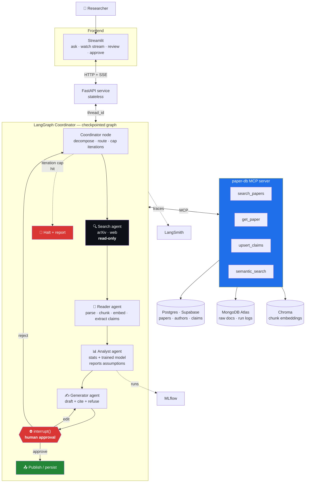
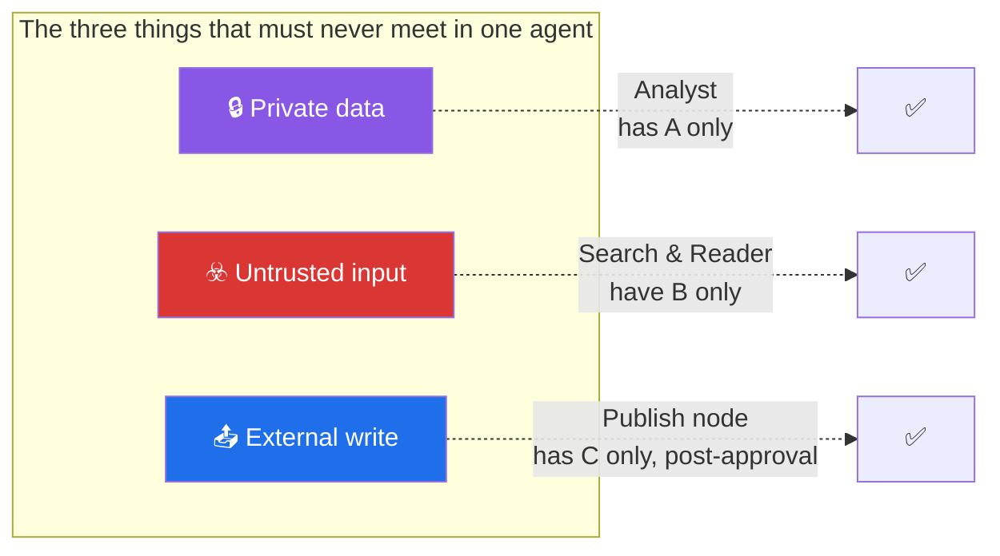
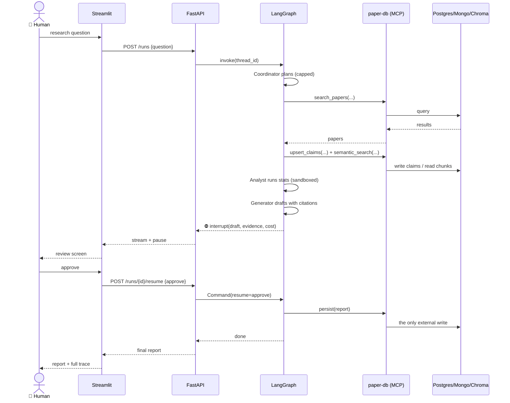
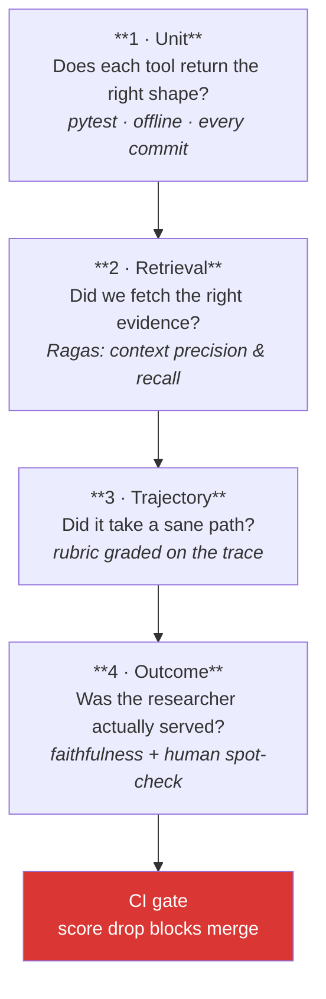

# 🏁 Capstone — **Project Setu**
## A multi-agent research desk that a human still approves

> *Setu* means **bridge**. The system bridges a question and a defensible answer, and it bridges
> every phase of this plan: the pandas you learned on Day 26 cleans the data the Analyst agent uses
> on Day 230, and the interrupt you learned on Day 199 is what stops the Generator from publishing
> on Day 232.

**Lineage.** The capstone is the plan's **Module 27** (multi-agent research
automation) with the **Projects section** folded in: the review-scraper becomes the ingestion layer,
the RAG Q&A system becomes the knowledge layer, and the ML project becomes the Analyst agent's brain.

---

## 1 · What it does

You give Setu a research question — *"has retrieval-augmented generation actually reduced
hallucination rates in published benchmarks since 2024, and by how much?"*

Setu then:

1. **Plans** — the Coordinator decomposes the question into sub-questions and a search strategy.
2. **Searches** — the Search agent queries arXiv and the web. Read-only. Always.
3. **Reads** — the Reader agent fetches, parses, chunks, embeds, and extracts structured claims
   (`{paper_id, claim, metric, value, n, source_span}`) into Postgres + Chroma.
4. **Analyses** — the Analyst agent runs *real statistics* over the extracted numbers: descriptive
   summary, a confidence interval, a hypothesis test where one is legal, and a trained model where
   the data supports one. It reports assumptions and refuses when they fail.
5. **Generates** — the Generator agent drafts a report where **every claim carries a citation to a
   retrieved span**, and says "not supported by retrieved sources" when that is the truth.
6. **Stops** — the graph hits a durable `interrupt()`. A human sees the draft, the trace, the
   retrieved evidence, and the cost. Approve → publish. Edit → back to Generator. Reject → replan.

Nothing leaves the system without step 6.

---

## 2 · Architecture

### Why it is shaped like this

| Choice | Reason | Taught on |
|---|---|---|
| LangGraph owns the loop | The plan needs durable interrupts and time travel. Those are runtime properties of a checkpointed graph, not features you bolt on. | Days 185–201 |
| Every data source behind MCP | One contract, four consumers (the graph, Claude Desktop, Cursor, and your tests). Swapping Chroma for Qdrant becomes a server change, not a graph change. | Days 209–215 |
| Stateless FastAPI, stateful graph | The API can scale to N replicas because all state lives in the checkpointer, keyed by `thread_id`. | Day 234 |
| One write node, behind one gate | Principle 12. If a reviewer asks "what could this thing do to my systems?", the answer is a single node they can read. | Day 232 |
| Local embeddings | Principle 5. The entire retrieval layer costs $0 and runs offline. | Day 155 |

---

## 3 · The permission table (ADR-010, enforced in code on Day 216)

This is the artifact interviewers respond to most. It proves no single agent holds *private data +
untrusted input + external write* at once.

| Agent | Reads | May call | May write | Untrusted input? |
|---|---|---|---|---|
| **Coordinator** | graph state only | routing decisions, no tools | graph state | no |
| **Search** | query string | `web_search`, `arxiv_search` | nothing | **yes** — results are data, never instructions |
| **Reader** | URLs from Search | `fetch`, `parse_pdf`, `embed` | Chroma + Mongo (own namespace) | **yes** — document bodies |
| **Analyst** | Postgres claims, Chroma chunks | `run_stats`, `fit_model` (sandboxed, no network) | MLflow runs only | no — reads only structured, already-extracted values |
| **Generator** | Analyst output + retrieved spans | none | draft object in state | no |
| **Publish node** | approved draft | `persist`, `post` | **the only external write in the system** | no — runs only after `interrupt()` returns approve |

> **The interview line:** *"No agent in that system holds private data, untrusted input, and write
> access at the same time. Search reads the open web and can't write. The Analyst touches our data
> but never sees a raw document body. The only external write is a single node behind a durable
> human interrupt. I can show you the table and the test that fails if someone widens a permission."*

---

## 4 · The day plan (Days 225–238)

| Day | ID | Deliverable | Done when |
|---|---|---|---|
| 225 | CAP-01 | **ADR-013** + the architecture diagram above, redrawn by you | You can defend every arrow without notes |
| 226 | CAP-02 | Postgres schema (papers, authors, claims), Mongo collections, Chroma collection | Migrations run clean from empty; a seed script loads 50 fixture papers |
| 227 | CAP-03 | Ingestion pipeline — the review-scraper generalised to arXiv | 500 documents ingested, deduplicated, with `SOURCE.md` provenance (Principle 9) |
| 228 | CAP-04 | `paper-db` MCP server, hardened: input validation, read-only defaults, rate limits | Server passes its own tool-schema tests; a malformed call returns an error, not a stack trace |
| 229 | CAP-05 | Search + Reader agents | 10 real questions → ≥8 return relevant, parseable sources |
| 230 | CAP-06 | Analyst agent: descriptive stats, a bootstrap CI, one legal hypothesis test, one trained model | It **refuses** on a fixture where the test assumptions fail — and that refusal is a passing test |
| 231 | CAP-07 | Generator agent + citation discipline | Zero uncited factual claims on the 20-question set; "not supported" appears where it should |
| 232 | CAP-08 | Coordinator graph, SQLite→Postgres checkpointer, `interrupt()` before publish | Kill the process mid-run, restart, resume from the checkpoint — on camera |
| 233 | CAP-09 | Eval suite: unit · retrieval (Ragas) · trajectory (rubric) · outcome | Every layer has at least one test that goes **red** when you break it on purpose |
| 234 | CAP-10 | FastAPI service + Streamlit review UI with streaming and approve/edit/reject | Two browser tabs, two threads, no state bleed |
| 235 | CAP-11 | GitHub Actions: ruff → pytest → eval gate | A PR that drops retrieval precision below threshold **fails to merge**. Model calls in CI are mocked |
| 236 | CAP-12 | `docker compose up` brings the whole system up locally; EC2 is 🅿️ optional | A fresh clone runs green with one command |
| 237 | CAP-13 | Graduated-autonomy review; cost/observability dashboard | You can answer "what did today cost, in requests, per provider?" |
| 238 | CAP-14 | **End-to-end demo on 20 unseen questions** | Eval suite green · zero unapproved external writes in the log · demo runs in one take |

---

## 5 · The end-to-end request, drawn

Note what the diagram makes obvious: **the graph is paused, not polling.** The process could be
restarted between the interrupt and the resume and nothing would be lost — that is what
"checkpointed" buys, and it is the single most persuasive thing to demo.

---

## 6 · Evaluation — four layers

A capstone without an eval suite is a demo. This is the difference.

| Layer | Example assertion | Fails when |
|---|---|---|
| Unit | `search_papers("")` raises `ValidationError`, not a 500 | someone loosens the schema |
| Retrieval | context recall ≥ 0.80 on the 40-question golden set | a chunking change loses evidence |
| Trajectory | *"the run never called `persist` before an approve"* | a permission is widened |
| Outcome | faithfulness ≥ 0.85; no uncited factual claim | the prompt drifts toward fluency over grounding |

**Rule:** every model call in CI is **mocked**. CI never spends a free-tier quota (Principle 5), and
a flaky provider must never turn a green PR red.

---

## 7 · Definition of done (Day 238)

- [ ] `git clone` → `docker compose up` → a stranger asks a question and gets a cited report, in under 15 minutes
- [ ] 20 unseen questions run end to end; the eval suite is green on all four layers
- [ ] The run log shows **zero** external writes that were not preceded by a human approval
- [ ] Kill-and-resume demonstrated live from a checkpoint
- [ ] The permission table is enforced by a test that goes red if an agent gains a capability
- [ ] `docs/adr/ADR-013.md` written, and re-read cold a day later with your reviewer hat on
- [ ] Total spend across all 240 days: **$0**

---

## 8 · What to say about it in an interview

> "Setu is a five-agent research system on a LangGraph spine. The interesting part isn't that it
> works — it's that it's *stoppable*. Every external write sits behind a durable interrupt, so the
> process can be killed while a human is thinking and resume from the checkpoint. Every data source
> is behind one MCP server, which meant I could point Claude Desktop at the same tools my graph uses
> and debug retrieval interactively. And there are four layers of eval wired into CI — unit,
> retrieval, trajectory, outcome — so a prompt change that makes the output prettier but less
> grounded fails the merge. It cost nothing to build; the budget was rate limits, not dollars, and
> the fallback router across three free providers is a resilience pattern I'd keep even with a card
> on file."
